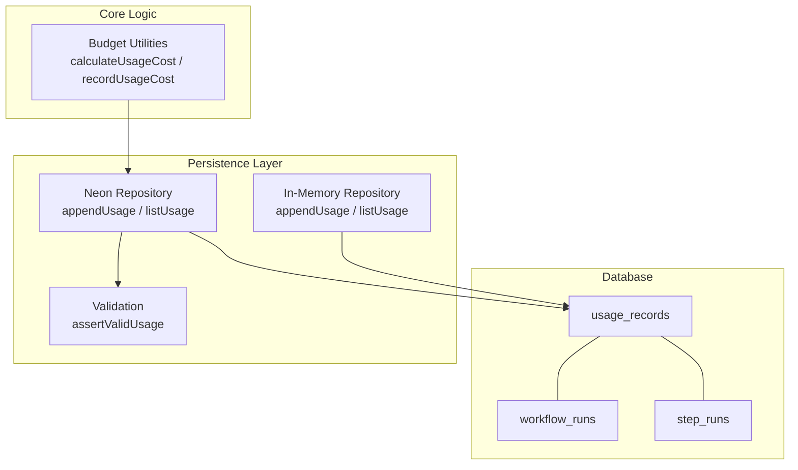
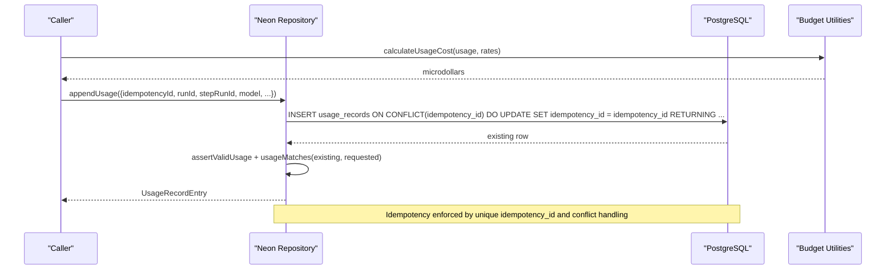
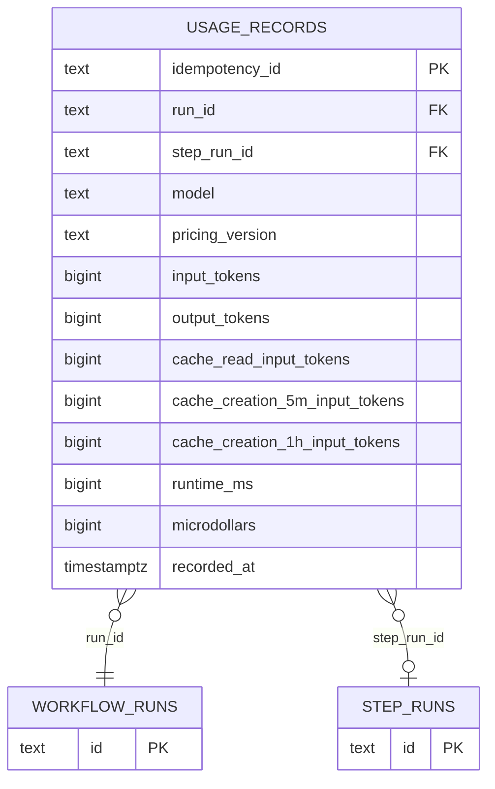
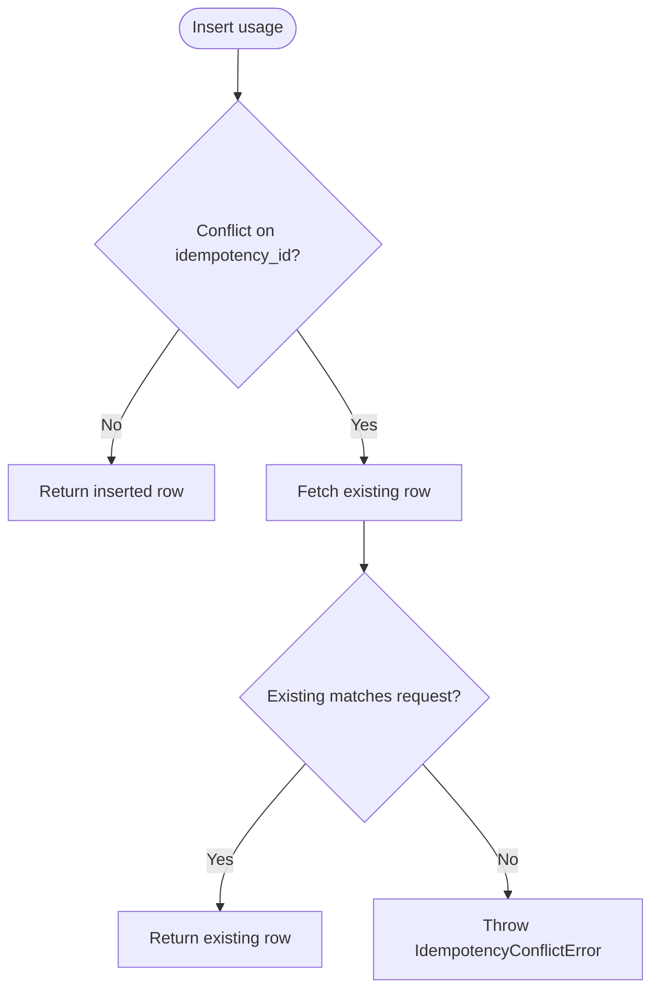
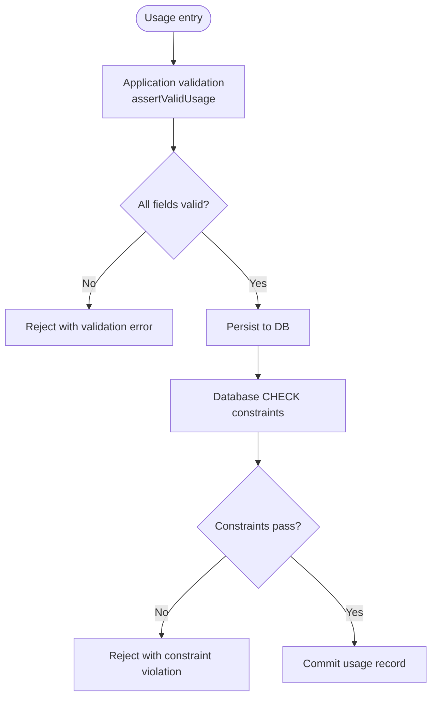
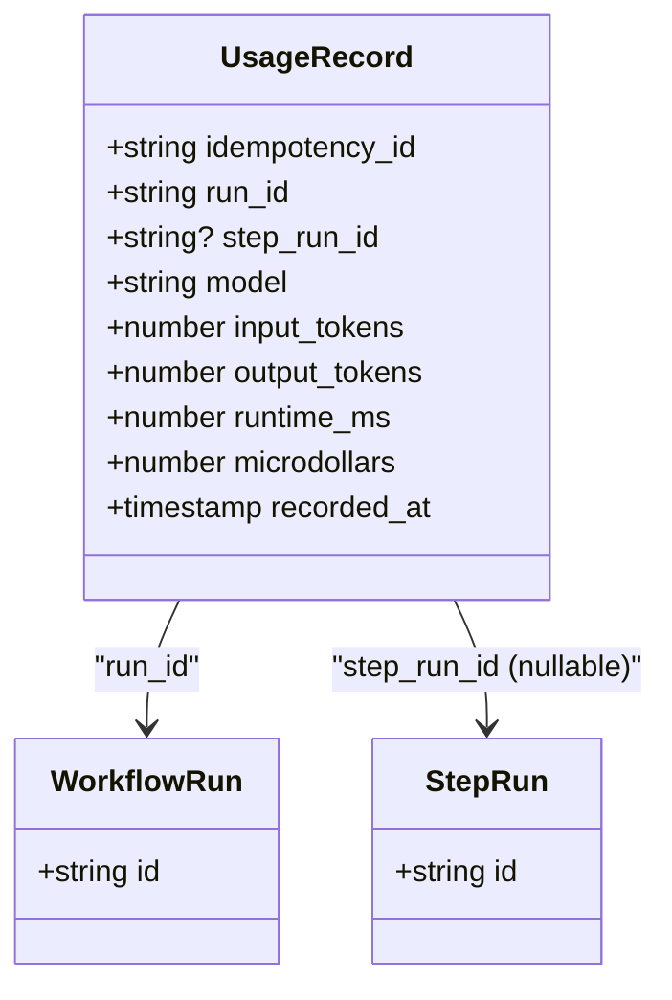
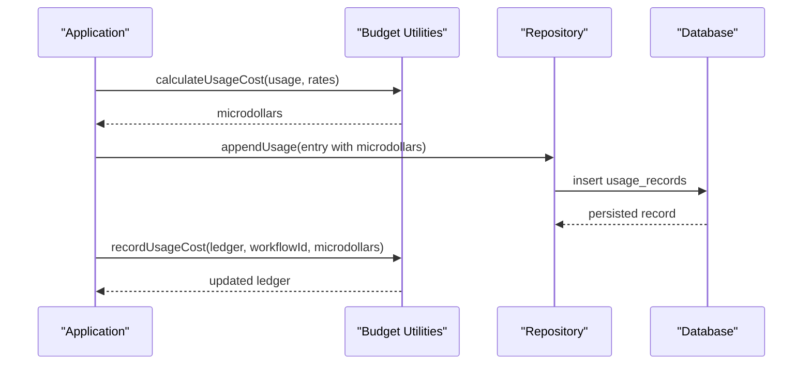
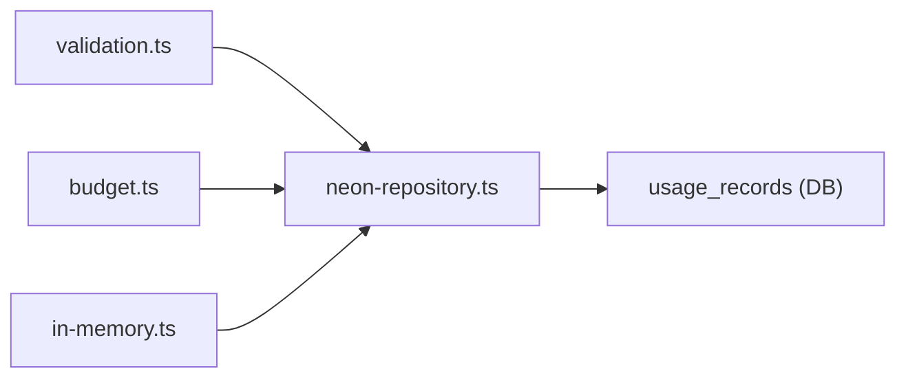

# Usage Tracking

<cite>
**Referenced Files in This Document**
- [0016_complete_usage_pricing.sql](file://drizzle/0016_complete_usage_pricing.sql)
- [neon-repository.ts](file://packages/adapters/src/persistence/neon-repository.ts)
- [validation.ts](file://packages/adapters/src/persistence/validation.ts)
- [persistence.ts](file://packages/core/src/persistence.ts)
- [budget.ts](file://packages/core/src/budget.ts)
- [in-memory.ts](file://packages/adapters/src/persistence/in-memory.ts)
- [0018_snapshot.json](file://drizzle/meta/0018_snapshot.json)
</cite>

## Table of Contents
1. [Introduction](#introduction)
2. [Project Structure](#project-structure)
3. [Core Components](#core-components)
4. [Architecture Overview](#architecture-overview)
5. [Detailed Component Analysis](#detailed-component-analysis)
6. [Dependency Analysis](#dependency-analysis)
7. [Performance Considerations](#performance-considerations)
8. [Troubleshooting Guide](#troubleshooting-guide)
9. [Conclusion](#conclusion)
10. [Appendices](#appendices)

## Introduction
This document explains the usage tracking data model centered on the usage_records table and its role in recording, validating, and attributing model usage to workflow runs and step runs. It details fields such as idempotency_id, run_id, step_run_id, model, input_tokens, output_tokens, runtime_ms, microdollars, and recorded_at timestamps. It also documents the idempotency mechanism that prevents duplicate usage recording, the constraints ensuring non-negative values for tokens, runtime, and costs, and provides examples for usage aggregation, cost analysis, and budget monitoring.

## Project Structure
Usage tracking spans database migrations, persistence repositories, validation logic, and in-memory implementations:
- Database schema and constraints are defined via Drizzle migrations and snapshots.
- The Neon repository implements idempotent insertion and listing of usage records.
- Validation enforces non-negative safe integer ranges before persistence.
- In-memory persistence mirrors behavior for tests and local scenarios.
- Budget utilities compute and aggregate microdollars for daily and per-workflow accounting.

**Diagram sources**
- [neon-repository.ts:1596-1671](file://packages/adapters/src/persistence/neon-repository.ts#L1596-L1671)
- [validation.ts:40-57](file://packages/adapters/src/persistence/validation.ts#L40-L57)
- [in-memory.ts:1435-1475](file://packages/adapters/src/persistence/in-memory.ts#L1435-L1475)
- [budget.ts:60-127](file://packages/core/src/budget.ts#L60-L127)
- [0018_snapshot.json:2098-2177](file://drizzle/meta/0018_snapshot.json#L2098-L2177)

**Section sources**
- [neon-repository.ts:1596-1671](file://packages/adapters/src/persistence/neon-repository.ts#L1596-L1671)
- [validation.ts:40-57](file://packages/adapters/src/persistence/validation.ts#L40-L57)
- [in-memory.ts:1435-1475](file://packages/adapters/src/persistence/in-memory.ts#L1435-L1475)
- [budget.ts:60-127](file://packages/core/src/budget.ts#L60-L127)
- [0018_snapshot.json:2098-2177](file://drizzle/meta/0018_snapshot.json#L2098-L2177)

## Core Components
- usage_records table stores each usage event with an idempotency key, links to workflow and step runs, model identity, token counts, runtime, cost, and timestamp.
- Idempotency is enforced by a primary key on idempotency_id and an upsert strategy that rejects conflicting updates.
- Constraints ensure all numeric metrics are non-negative and within safe integer bounds.
- Foreign keys connect usage to workflow_runs (cascade delete) and step_runs (set null on delete).
- Repositories provide append/list operations with pagination and ordering by recorded_at and idempotency_id.
- Budget utilities compute microdollars from usage quantities and rates, and maintain daily and per-workflow spending ledgers.

**Section sources**
- [0018_snapshot.json:2098-2177](file://drizzle/meta/0018_snapshot.json#L2098-L2177)
- [neon-repository.ts:1596-1671](file://packages/adapters/src/persistence/neon-repository.ts#L1596-L1671)
- [validation.ts:40-57](file://packages/adapters/src/persistence/validation.ts#L40-L57)
- [budget.ts:60-127](file://packages/core/src/budget.ts#L60-L127)

## Architecture Overview
The usage tracking flow ensures idempotent, validated, and attributed recording of model usage events.

**Diagram sources**
- [neon-repository.ts:1596-1643](file://packages/adapters/src/persistence/neon-repository.ts#L1596-L1643)
- [budget.ts:60-127](file://packages/core/src/budget.ts#L60-L127)

## Detailed Component Analysis

### Data Model: usage_records
- idempotency_id: Primary key; unique identifier used to prevent duplicate recordings.
- run_id: Foreign key to workflow_runs; enables attribution at the workflow level.
- step_run_id: Optional foreign key to step_runs; enables attribution at the step level.
- model: Identifier of the model used for the usage event.
- pricing_version: Versioned pricing policy applied when computing or interpreting costs.
- input_tokens: Non-negative safe integer representing input token count.
- output_tokens: Non-negative safe integer representing output token count.
- cache_read_input_tokens: Non-negative safe integer for cache read tokens.
- cache_creation_5m_input_tokens: Non-negative safe integer for 5-minute cache creation tokens.
- cache_creation_1h_input_tokens: Non-negative safe integer for 1-hour cache creation tokens.
- runtime_ms: Non-negative safe integer representing runtime duration in milliseconds.
- microdollars: Non-negative safe integer representing cost in millionths of a dollar.
- recorded_at: Timestamp with time zone indicating when the usage was recorded.

Constraints and relationships:
- All numeric fields have non-negative checks and safe integer upper bounds.
- Foreign keys:
  - run_id references workflow_runs with cascade delete.
  - step_run_id references step_runs with set null on delete.
- Indexes optimize queries by run_id, recorded_at, and idempotency_id.

**Diagram sources**
- [0018_snapshot.json:2098-2177](file://drizzle/meta/0018_snapshot.json#L2098-L2177)

**Section sources**
- [0018_snapshot.json:2098-2177](file://drizzle/meta/0018_snapshot.json#L2098-L2177)

### Idempotency Mechanism
- Insert uses ON CONFLICT on idempotency_id to perform an upsert that effectively no-ops on duplicates while returning the stored row.
- After retrieval, the repository compares the stored usage with the requested usage; if they differ, it throws an idempotency conflict error.
- This guarantees that identical usage requests are safely deduplicated and that mismatched retries fail fast.

**Diagram sources**
- [neon-repository.ts:1596-1643](file://packages/adapters/src/persistence/neon-repository.ts#L1596-L1643)

**Section sources**
- [neon-repository.ts:1596-1643](file://packages/adapters/src/persistence/neon-repository.ts#L1596-L1643)

### Validation and Constraints
- Application-level validation asserts non-negative safe integers for all numeric usage fields before persistence.
- Database-level CHECK constraints enforce the same rules at the storage layer, protecting against invalid data even outside application paths.
- Additional columns introduced by migration add cache-related token fields and their constraints.

**Diagram sources**
- [validation.ts:40-57](file://packages/adapters/src/persistence/validation.ts#L40-L57)
- [0016_complete_usage_pricing.sql:1-11](file://drizzle/0016_complete_usage_pricing.sql#L1-L11)
- [0018_snapshot.json:2121-2177](file://drizzle/meta/0018_snapshot.json#L2121-L2177)

**Section sources**
- [validation.ts:40-57](file://packages/adapters/src/persistence/validation.ts#L40-L57)
- [0016_complete_usage_pricing.sql:1-11](file://drizzle/0016_complete_usage_pricing.sql#L1-L11)
- [0018_snapshot.json:2121-2177](file://drizzle/meta/0018_snapshot.json#L2121-L2177)

### Relationships to Workflow Runs and Step Runs
- run_id ties each usage record to a specific workflow run, enabling cost attribution at the workflow level.
- step_run_id optionally ties usage to a particular step run, enabling fine-grained attribution and debugging.
- Deletion semantics:
  - Deleting a workflow run cascades to associated usage records.
  - Deleting a step run sets step_run_id to null in usage records, preserving usage attribution to the workflow.

**Diagram sources**
- [0018_snapshot.json:2098-2117](file://drizzle/meta/0018_snapshot.json#L2098-L2117)

**Section sources**
- [0018_snapshot.json:2098-2117](file://drizzle/meta/0018_snapshot.json#L2098-L2117)

### Usage Aggregation, Cost Analysis, and Budget Monitoring
- Cost calculation:
  - Use model rates to convert token counts and runtime into microdollars, including optional cache-related token categories.
- Ledgering:
  - Maintain a daily ledger tracking total spent microdollars and per-workflow spending.
  - Record usage cost increments to both daily and workflow-specific totals.
- Query patterns:
  - List usage by run_id with pagination ordered by recorded_at and idempotency_id.
  - Aggregate sums across fields like input_tokens, output_tokens, runtime_ms, and microdollars for reporting.

Examples:
- Usage aggregation: Sum input_tokens and output_tokens grouped by model for a given run_id to understand token consumption patterns.
- Cost analysis: Sum microdollars grouped by model or by day to analyze cost drivers and trends.
- Budget monitoring: Track dailySpentMicrodollars and workflowSpentMicrodollars in the ledger to enforce budgets and alert on thresholds.

**Diagram sources**
- [budget.ts:60-127](file://packages/core/src/budget.ts#L60-L127)
- [budget.ts:166-197](file://packages/core/src/budget.ts#L166-L197)
- [neon-repository.ts:1596-1643](file://packages/adapters/src/persistence/neon-repository.ts#L1596-L1643)

**Section sources**
- [budget.ts:60-127](file://packages/core/src/budget.ts#L60-L127)
- [budget.ts:166-197](file://packages/core/src/budget.ts#L166-L197)
- [neon-repository.ts:1646-1671](file://packages/adapters/src/persistence/neon-repository.ts#L1646-L1671)

## Dependency Analysis
- The Neon repository depends on validation and database constraints to ensure data integrity.
- Budget utilities depend on usage quantities and model rates to compute microdollars.
- The in-memory repository mirrors persistence behavior for testing and local execution.

**Diagram sources**
- [validation.ts:40-57](file://packages/adapters/src/persistence/validation.ts#L40-L57)
- [budget.ts:60-127](file://packages/core/src/budget.ts#L60-L127)
- [neon-repository.ts:1596-1671](file://packages/adapters/src/persistence/neon-repository.ts#L1596-L1671)
- [in-memory.ts:1435-1475](file://packages/adapters/src/persistence/in-memory.ts#L1435-L1475)

**Section sources**
- [validation.ts:40-57](file://packages/adapters/src/persistence/validation.ts#L40-L57)
- [budget.ts:60-127](file://packages/core/src/budget.ts#L60-L127)
- [neon-repository.ts:1596-1671](file://packages/adapters/src/persistence/neon-repository.ts#L1596-L1671)
- [in-memory.ts:1435-1475](file://packages/adapters/src/persistence/in-memory.ts#L1435-L1475)

## Performance Considerations
- Indexes on run_id, recorded_at, and idempotency_id support efficient listing and idempotency checks.
- Using microdollars as integers avoids floating-point precision issues and simplifies aggregation.
- Pagination by recorded_at and idempotency_id reduces memory footprint for large result sets.
- Cache-related token fields enable more granular cost attribution without changing core query patterns.

[No sources needed since this section provides general guidance]

## Troubleshooting Guide
Common issues and resolutions:
- Duplicate usage attempts:
  - If the same idempotency_id is submitted with different values, an idempotency conflict error is thrown. Ensure consistent usage payloads across retries.
- Constraint violations:
  - Negative or unsafe integer values will be rejected by both application validation and database constraints. Verify inputs before persisting.
- Missing relationships:
  - Ensure run_id exists in workflow_runs; deletion of workflow_runs cascades to usage_records. For step_run_id, deletion sets the field to null.

**Section sources**
- [neon-repository.ts:1596-1643](file://packages/adapters/src/persistence/neon-repository.ts#L1596-L1643)
- [validation.ts:40-57](file://packages/adapters/src/persistence/validation.ts#L40-L57)
- [0018_snapshot.json:2098-2177](file://drizzle/meta/0018_snapshot.json#L2098-L2177)

## Conclusion
The usage tracking system provides robust, idempotent recording of model usage with strong validation and clear attribution to workflow and step runs. Constraints ensure data integrity, while budget utilities enable accurate cost analysis and monitoring. The design supports scalable querying and aggregation for operational insights and financial controls.

[No sources needed since this section summarizes without analyzing specific files]

## Appendices

### Field Reference Summary
- idempotency_id: Unique key preventing duplicate recordings.
- run_id: Links usage to a workflow run for cost attribution.
- step_run_id: Optional link to a step run for fine-grained attribution.
- model: Identifies the model used.
- pricing_version: Versioned pricing policy for interpretation and computation.
- input_tokens: Non-negative safe integer for input tokens.
- output_tokens: Non-negative safe integer for output tokens.
- cache_read_input_tokens: Non-negative safe integer for cache reads.
- cache_creation_5m_input_tokens: Non-negative safe integer for 5-minute cache creation.
- cache_creation_1h_input_tokens: Non-negative safe integer for 1-hour cache creation.
- runtime_ms: Non-negative safe integer for runtime duration.
- microdollars: Non-negative safe integer for cost.
- recorded_at: Timestamp with time zone.

**Section sources**
- [persistence.ts:406-420](file://packages/core/src/persistence.ts#L406-L420)
- [0018_snapshot.json:2050-2177](file://drizzle/meta/0018_snapshot.json#L2050-L2177)