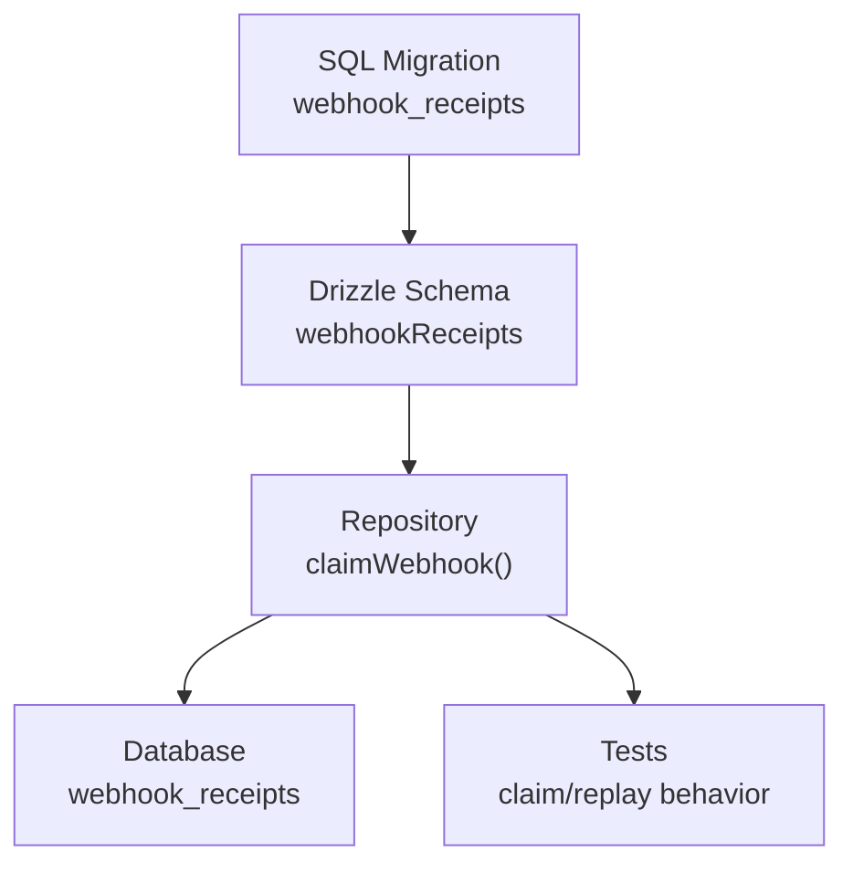
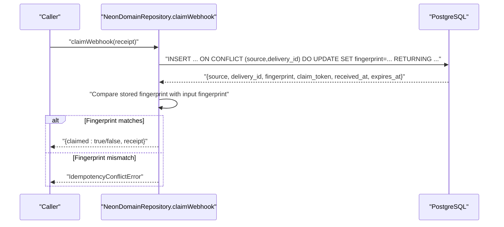
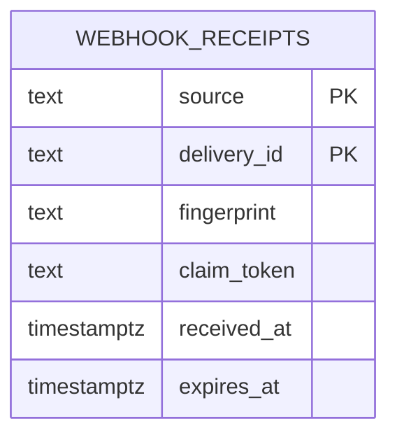
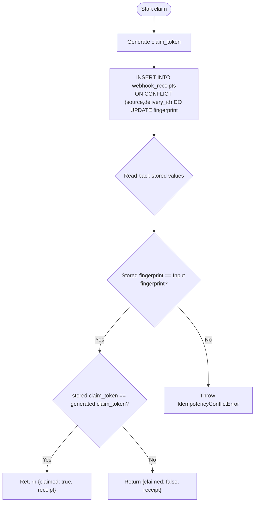
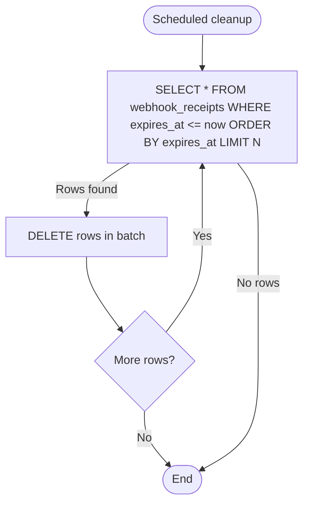
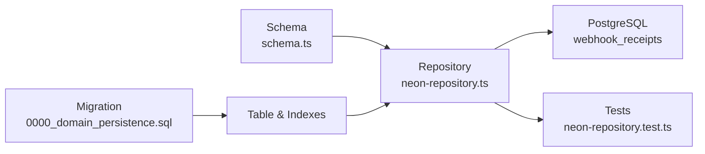

# Webhook Receipts

<cite>
**Referenced Files in This Document**
- [0000_domain_persistence.sql](file://drizzle/0000_domain_persistence.sql)
- [0002_harden_persistence_parity.sql](file://drizzle/0002_harden_persistence_parity.sql)
- [schema.ts](file://packages/adapters/src/persistence/schema.ts)
- [neon-repository.ts](file://packages/adapters/src/persistence/neon-repository.ts)
- [neon-repository.test.ts](file://packages/adapters/src/persistence/neon-repository.test.ts)
</cite>

## Table of Contents
1. Introduction
2. Project Structure
3. Core Components
4. Architecture Overview
5. Detailed Component Analysis
6. Dependency Analysis
7. Performance Considerations
8. Troubleshooting Guide
9. Conclusion

## Introduction
This document describes the webhook receipts data model and its role in ensuring reliable, idempotent webhook processing. It focuses on the webhook_receipts table, including fields such as source, delivery_id, fingerprint, received_at, expires_at, and claim_token. It explains how the composite primary key enables deduplication, how expiry timestamps support cleanup, and how the repository implements a single-statement claim operation that supports both first-time claims and replay detection.

## Project Structure
The webhook receipts feature spans database migrations, schema definitions, and repository logic:
- Database schema and indexes are defined in SQL migrations and Drizzle schema files.
- The repository layer performs atomic claim operations using raw SQL with conflict handling.
- Tests validate behavior for claiming and replaying webhooks.

**Diagram sources**
- [0000_domain_persistence.sql:164-214](file://drizzle/0000_domain_persistence.sql#L164-L214)
- [schema.ts:644-658](file://packages/adapters/src/persistence/schema.ts#L644-L658)
- [neon-repository.ts:1673-1697](file://packages/adapters/src/persistence/neon-repository.ts#L1673-L1697)
- [neon-repository.test.ts:664-694](file://packages/adapters/src/persistence/neon-repository.test.ts#L664-L694)

**Section sources**
- [0000_domain_persistence.sql:164-214](file://drizzle/0000_domain_persistence.sql#L164-L214)
- [schema.ts:644-658](file://packages/adapters/src/persistence/schema.ts#L644-L658)

## Core Components
- webhook_receipts table: Stores one row per unique (source, delivery_id) to guarantee idempotency.
- Fields:
  - source: Identifier of the webhook provider or system.
  - delivery_id: Unique identifier for a specific delivery event from the source.
  - fingerprint: Content hash used to detect mismatched replays.
  - claim_token: Opaque token generated per claim attempt; indicates whether this call claimed the receipt.
  - received_at: Timestamp when the webhook was first observed.
  - expires_at: Timestamp after which the receipt is eligible for cleanup.
- Composite primary key: (source, delivery_id) ensures exactly one row per delivery.
- Index: expires_at supports efficient cleanup of expired receipts.

Key responsibilities:
- Deduplication: Prevent duplicate processing by enforcing uniqueness on (source, delivery_id).
- Idempotency validation: Compare stored fingerprint with incoming fingerprint to reject mismatched replays.
- Expiry-based cleanup: Use expires_at to schedule deletion of old receipts.

**Section sources**
- [0000_domain_persistence.sql:164-171](file://drizzle/0000_domain_persistence.sql#L164-L171)
- [0000_domain_persistence.sql:214-214](file://drizzle/0000_domain_persistence.sql#L214-L214)
- [0002_harden_persistence_parity.sql:1-4](file://drizzle/0002_harden_persistence_parity.sql#L1-L4)
- [schema.ts:644-658](file://packages/adapters/src/persistence/schema.ts#L644-L658)

## Architecture Overview
The claim flow uses a single atomic SQL statement with upsert semantics to:
- Insert a new receipt if none exists for (source, delivery_id).
- On conflict, update only the fingerprint to re-validate content identity.
- Return the stored claim_token and receipt metadata so callers can determine if they claimed it or are replaying.

**Diagram sources**
- [neon-repository.ts:1673-1697](file://packages/adapters/src/persistence/neon-repository.ts#L1673-L1697)

**Section sources**
- [neon-repository.ts:1673-1697](file://packages/adapters/src/persistence/neon-repository.ts#L1673-L1697)

## Detailed Component Analysis

### Data Model: webhook_receipts
- Primary key: (source, delivery_id) enforces one row per delivery.
- Columns:
  - source: text, not null
  - delivery_id: text, not null
  - fingerprint: text, not null
  - claim_token: text, not null (added later via migration)
  - received_at: timestamp with time zone, not null
  - expires_at: timestamp with time zone, not null
- Indexes:
  - btree index on expires_at for efficient cleanup queries.

**Diagram sources**
- [0000_domain_persistence.sql:164-171](file://drizzle/0000_domain_persistence.sql#L164-L171)
- [0000_domain_persistence.sql:214-214](file://drizzle/0000_domain_persistence.sql#L214-L214)
- [0002_harden_persistence_parity.sql:1-4](file://drizzle/0002_harden_persistence_parity.sql#L1-L4)
- [schema.ts:644-658](file://packages/adapters/src/persistence/schema.ts#L644-L658)

**Section sources**
- [0000_domain_persistence.sql:164-171](file://drizzle/0000_domain_persistence.sql#L164-L171)
- [0000_domain_persistence.sql:214-214](file://drizzle/0000_domain_persistence.sql#L214-L214)
- [0002_harden_persistence_parity.sql:1-4](file://drizzle/0002_harden_persistence_parity.sql#L1-L4)
- [schema.ts:644-658](file://packages/adapters/src/persistence/schema.ts#L644-L658)

### Claim Workflow and Idempotency
- Atomic upsert: INSERT with ON CONFLICT (source, delivery_id) updates fingerprint only.
- Fingerprint check: If stored fingerprint differs from input, an idempotency conflict error is raised.
- Claim token: Each attempt generates a unique claim_token; comparing returned claim_token with the generated one indicates whether this call actually claimed the receipt.

**Diagram sources**
- [neon-repository.ts:1673-1697](file://packages/adapters/src/persistence/neon-repository.ts#L1673-L1697)

**Section sources**
- [neon-repository.ts:1673-1697](file://packages/adapters/src/persistence/neon-repository.ts#L1673-L1697)

### Cleanup Strategy Using Expiry
- Index: An index on expires_at enables efficient selection of expired rows.
- Typical process:
  - Periodically select rows where expires_at <= now.
  - Delete them in batches to avoid long-running transactions.
  - Optionally use a lease or job coordinator to prevent concurrent cleanup jobs from interfering.

[No sources needed since this diagram shows conceptual workflow, not actual code structure]

### Examples

- Creating a webhook receipt (first claim):
  - Call claimWebhook with a new (source, delivery_id).
  - The upsert inserts a new row and returns claimed: true.
  - See test scenario for expected behavior and SQL shape.

- Duplicate detection:
  - Calling claimWebhook again with the same (source, delivery_id) triggers the conflict branch.
  - The fingerprint is updated to match the input; if it matches, the caller receives claimed: false (replay).
  - If fingerprints differ, an idempotency conflict error is thrown.

- Scheduled cleanup:
  - Use the expires_at index to find and delete expired receipts in batches.
  - Ensure the cleanup runs within time budgets and avoids locking hot paths.

**Section sources**
- [neon-repository.test.ts:664-694](file://packages/adapters/src/persistence/neon-repository.test.ts#L664-L694)
- [neon-repository.ts:1673-1697](file://packages/adapters/src/persistence/neon-repository.ts#L1673-L1697)
- [0000_domain_persistence.sql:214-214](file://drizzle/0000_domain_persistence.sql#L214-L214)

## Dependency Analysis
- Migrations define the table and indexes; schema.ts mirrors these definitions for type safety.
- The repository depends on the database schema and executes raw SQL for precise control over upsert behavior.
- Tests assert the exact SQL pattern and outcomes for claim and replay scenarios.

**Diagram sources**
- [0000_domain_persistence.sql:164-214](file://drizzle/0000_domain_persistence.sql#L164-L214)
- [schema.ts:644-658](file://packages/adapters/src/persistence/schema.ts#L644-L658)
- [neon-repository.ts:1673-1697](file://packages/adapters/src/persistence/neon-repository.ts#L1673-L1697)
- [neon-repository.test.ts:664-694](file://packages/adapters/src/persistence/neon-repository.test.ts#L664-L694)

**Section sources**
- [0000_domain_persistence.sql:164-214](file://drizzle/0000_domain_persistence.sql#L164-L214)
- [schema.ts:644-658](file://packages/adapters/src/persistence/schema.ts#L644-L658)
- [neon-repository.ts:1673-1697](file://packages/adapters/src/persistence/neon-repository.ts#L1673-L1697)
- [neon-repository.test.ts:664-694](file://packages/adapters/src/persistence/neon-repository.test.ts#L664-L694)

## Performance Considerations
- Composite primary key on (source, delivery_id) provides O(1) lookups for deduplication.
- Index on expires_at enables fast selection of expired rows for cleanup.
- Single-statement upsert reduces contention and network round-trips during high-throughput webhook ingestion.
- Batch deletes based on expires_at should be sized to balance throughput and lock duration.

[No sources needed since this section provides general guidance]

## Troubleshooting Guide
- Idempotency conflict:
  - Symptom: Error indicating a mismatch between stored and incoming fingerprint.
  - Cause: Receiving a different payload for the same (source, delivery_id).
  - Action: Investigate upstream sender or payload generation; ensure consistent fingerprint computation.

- Replay vs claim:
  - If claimed is false, the receipt already existed and matched the fingerprint; do not reprocess.
  - If claimed is true, proceed with processing.

- Cleanup not removing rows:
  - Verify expires_at is set correctly at creation time.
  - Confirm the cleanup query uses the expires_at index and runs frequently enough.

**Section sources**
- [neon-repository.ts:1673-1697](file://packages/adapters/src/persistence/neon-repository.ts#L1673-L1697)
- [0000_domain_persistence.sql:214-214](file://drizzle/0000_domain_persistence.sql#L214-L214)

## Conclusion
The webhook_receipts table provides a robust foundation for reliable webhook processing through:
- Exact-once semantics via a composite primary key on (source, delivery_id).
- Payload integrity checks using fingerprint comparison.
- Efficient cleanup driven by expires_at and a dedicated index.
The repository’s single-statement claim operation combines insertion, conflict handling, and validation into one atomic step, enabling scalable and safe webhook handling.