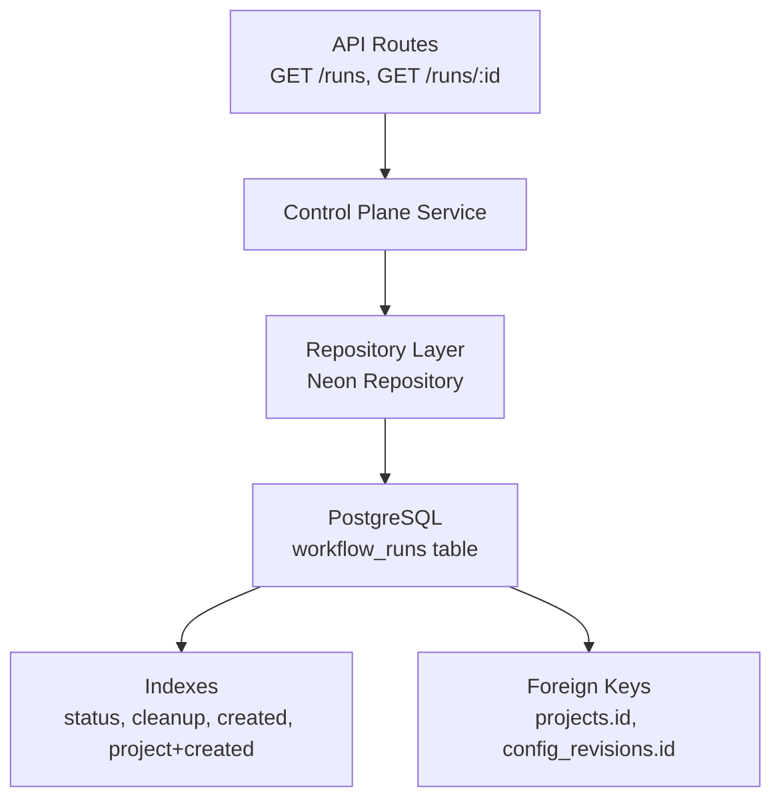
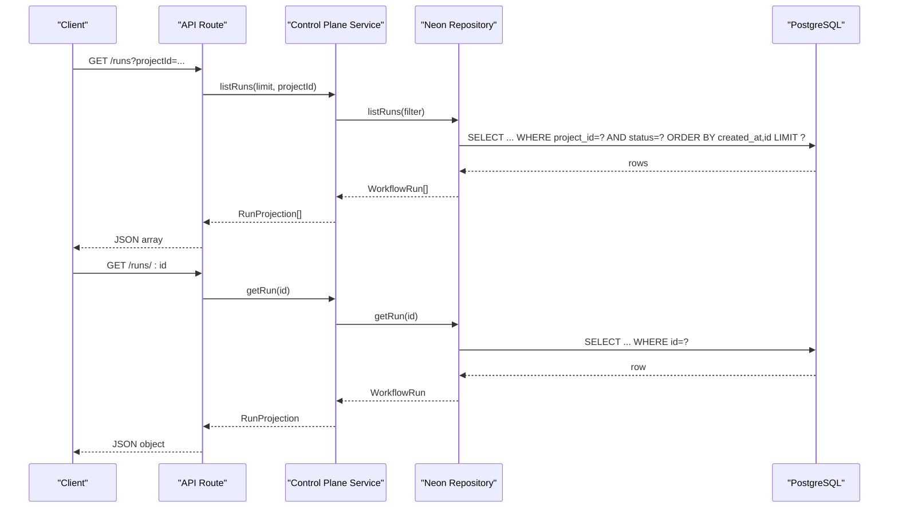
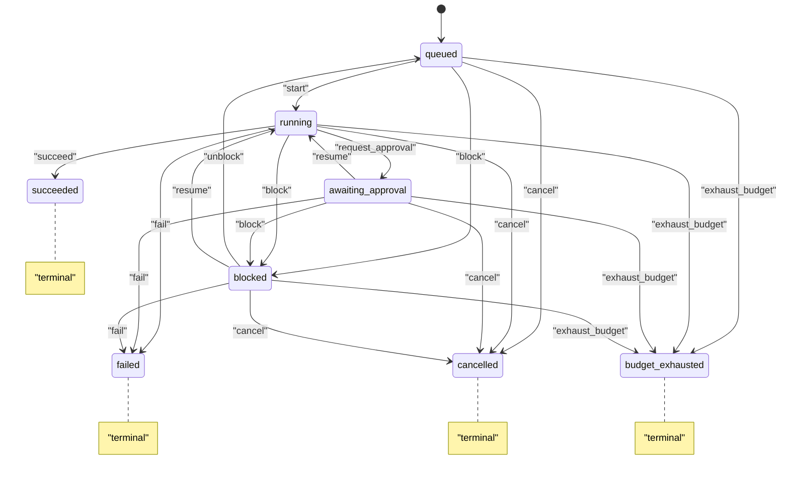
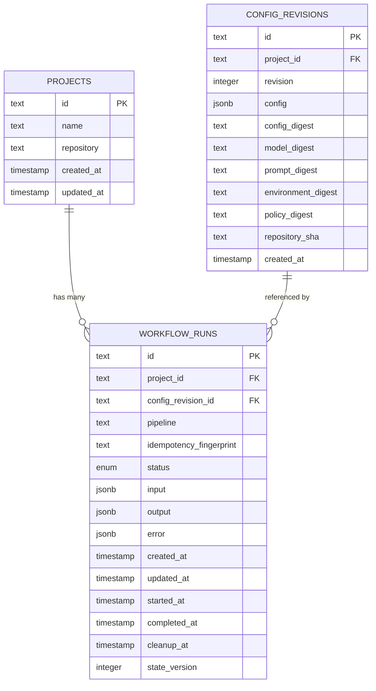

# Workflow Runs

<cite>
**Referenced Files in This Document**
- [0000_domain_persistence.sql](file://drizzle/0000_domain_persistence.sql)
- [schema.ts](file://packages/adapters/src/persistence/schema.ts)
- [lifecycle.ts](file://packages/core/src/lifecycle.ts)
- [neon-repository.ts](file://packages/adapters/src/persistence/neon-repository.ts)
- [route.ts](file://apps/control-plane/app/api/runs/route.ts)
- [route.ts](file://apps/control-plane/app/api/runs/[id]/route.ts)
- [components.ts](file://apps/control-plane/src/ui/components.ts)
</cite>

## Table of Contents
1. [Introduction](#introduction)
2. [Project Structure](#project-structure)
3. [Core Components](#core-components)
4. [Architecture Overview](#architecture-overview)
5. [Detailed Component Analysis](#detailed-component-analysis)
6. [Dependency Analysis](#dependency-analysis)
7. [Performance Considerations](#performance-considerations)
8. [Troubleshooting Guide](#troubleshooting-guide)
9. [Conclusion](#conclusion)
10. [Appendices](#appendices)

## Introduction
This document describes the data model and lifecycle for workflow runs in Agent OS Passerine. It focuses on the workflow_runs table, its fields, relationships to projects and config_revisions, the run_status enum and transitions, indexing strategy, and practical query patterns for listing active workflows, filtering by project, and retrieving history.

## Project Structure
The workflow run model is defined in both SQL migrations and Drizzle schema definitions. The repository layer implements persistence operations (list, update, transition), while API routes expose endpoints to list and fetch runs. UI components map status values to user-facing labels.

**Diagram sources**
- [route.ts:13-29](file://apps/control-plane/app/api/runs/route.ts#L13-L29)
- [route.ts:9-24](file://apps/control-plane/app/api/runs/[id]/route.ts#L9-L24)
- [neon-repository.ts:666-702](file://packages/adapters/src/persistence/neon-repository.ts#L666-L702)
- [schema.ts:134-180](file://packages/adapters/src/persistence/schema.ts#L134-L180)
- [0000_domain_persistence.sql:173-216](file://drizzle/0000_domain_persistence.sql#L173-L216)

**Section sources**
- [route.ts:13-29](file://apps/control-plane/app/api/runs/route.ts#L13-L29)
- [route.ts:9-24](file://apps/control-plane/app/api/runs/[id]/route.ts#L9-L24)
- [schema.ts:134-180](file://packages/adapters/src/persistence/schema.ts#L134-L180)
- [0000_domain_persistence.sql:173-216](file://drizzle/0000_domain_persistence.sql#L173-L216)

## Core Components
- workflow_runs table: stores each workflow run’s identity, project linkage, configuration reference, pipeline name, status, input/output/error payloads, lifecycle timestamps, and a state version for optimistic concurrency.
- run_status enum: defines allowed statuses for runs.
- Foreign keys: link runs to projects and config_revisions.
- Indexes: optimize queries by status, project, creation time, and cleanup scheduling.
- Repository methods: list runs with filters, count runs, update fields, and atomic status transitions.

**Section sources**
- [schema.ts:134-180](file://packages/adapters/src/persistence/schema.ts#L134-L180)
- [0000_domain_persistence.sql:173-216](file://drizzle/0000_domain_persistence.sql#L173-L216)
- [neon-repository.ts:666-702](file://packages/adapters/src/persistence/neon-repository.ts#L666-L702)
- [neon-repository.ts:704-742](file://packages/adapters/src/persistence/neon-repository.ts#L704-L742)
- [neon-repository.ts:744-770](file://packages/adapters/src/persistence/neon-repository.ts#L744-L770)

## Architecture Overview
Workflow runs are persisted in PostgreSQL and accessed via typed repository methods. The API exposes read-only endpoints to list runs (optionally filtered by project) and retrieve a single run by ID. Status transitions are performed atomically with expected status checks and an incrementing state_version to prevent concurrent updates from overwriting each other.

**Diagram sources**
- [route.ts:13-29](file://apps/control-plane/app/api/runs/route.ts#L13-L29)
- [route.ts:9-24](file://apps/control-plane/app/api/runs/[id]/route.ts#L9-L24)
- [neon-repository.ts:666-702](file://packages/adapters/src/persistence/neon-repository.ts#L666-L702)

## Detailed Component Analysis

### Data Model: workflow_runs
- Primary key: id (text)
- project_id: text, not null; foreign key to projects.id with cascade delete
- config_revision_id: text, nullable; foreign key to config_revisions.id with restrict delete
- pipeline: text, not null
- idempotency_fingerprint: text, nullable
- status: run_status enum, not null
- input: jsonb, nullable
- output: jsonb, nullable
- error: jsonb, nullable
- created_at: timestamp with time zone, not null
- updated_at: timestamp with time zone, not null
- started_at: timestamp with time zone, nullable
- completed_at: timestamp with time zone, nullable
- cleanup_at: timestamp with time zone, nullable
- state_version: integer, not null, default 0

Relationships:
- projects: one-to-many (a project has many runs)
- config_revisions: one-to-many (a revision can be referenced by many runs)

Indexing strategy:
- Composite index on (project_id, status, created_at, id) for efficient project-scoped listing and pagination
- Partial index on cleanup_at where cleanup_at is not null for cleanup jobs
- Index on created_at, id for time-based ordering and pagination
- Composite index on (project_id, created_at, id) for project-scoped chronological listing
- Composite index on (status, created_at, id) for global status-based listing

These indexes support:
- Filtering by project and status
- Time-based pagination using created_at and id
- Cleanup scans targeting only rows scheduled for cleanup

**Section sources**
- [schema.ts:134-180](file://packages/adapters/src/persistence/schema.ts#L134-L180)
- [0000_domain_persistence.sql:173-216](file://drizzle/0000_domain_persistence.sql#L173-L216)

### Enum: run_status
Allowed values:
- pending
- running
- waiting
- succeeded
- failed
- cancelled

UI mapping confirms these labels are used in the interface.

**Section sources**
- [schema.ts:46-53](file://packages/adapters/src/persistence/schema.ts#L46-L53)
- [components.ts:3-10](file://apps/control-plane/src/ui/components.ts#L3-L10)

### Lifecycle and Transitions
The system enforces a strict state machine for runs. While the database stores run_status, the internal lifecycle includes additional states such as queued, awaiting_approval, blocked, and budget_exhausted. Valid transitions are enforced by the lifecycle reducer, which rejects illegal moves and prevents transitions out of terminal states.

Key behaviors:
- Terminal states cannot transition further
- Duplicate events are ignored idempotently
- Events include start, request_approval, resume, block, unblock, succeed, fail, cancel, exhaust_budget

Practical implications:
- Only legal transitions should be applied when updating status
- Use atomic transitions that check expected current statuses before applying updates
- Maintain state_version increments to avoid race conditions during concurrent updates

**Diagram sources**
- [lifecycle.ts:35-76](file://packages/core/src/lifecycle.ts#L35-L76)

**Section sources**
- [lifecycle.ts:35-76](file://packages/core/src/lifecycle.ts#L35-L76)
- [lifecycle.ts:86-107](file://packages/core/src/lifecycle.ts#L86-L107)

### Persistence Operations
Listing runs:
- Supports optional filters by project_id and status
- Supports time-based pagination using created_at and id
- Enforces ascending order for cursor-based pagination; descending order does not support cursors
- Limits results to a bounded page size

Updating runs:
- Updates specified fields and increments state_version
- Normalizes optional JSONB fields

Atomic transitions:
- Applies updates only if current status is within an allowed set
- Optionally validates state_version for optimistic concurrency control
- Returns updated run or undefined if precondition fails

Counting runs:
- Counts runs matching optional project_id and status filters

**Section sources**
- [neon-repository.ts:666-702](file://packages/adapters/src/persistence/neon-repository.ts#L666-L702)
- [neon-repository.ts:704-742](file://packages/adapters/src/persistence/neon-repository.ts#L704-L742)
- [neon-repository.ts:744-770](file://packages/adapters/src/persistence/neon-repository.ts#L744-L770)

### API Endpoints
- GET /runs: lists recent runs, supports optional projectId filter, returns a bounded array of run projections
- GET /runs/:id: retrieves a single run by id

Authentication is required for both endpoints.

**Section sources**
- [route.ts:13-29](file://apps/control-plane/app/api/runs/route.ts#L13-L29)
- [route.ts:9-24](file://apps/control-plane/app/api/runs/[id]/route.ts#L9-L24)

## Dependency Analysis
The workflow_runs table participates in multiple relationships:
- Owned by projects (cascade delete)
- References config_revisions (restrict delete)
- Referenced by step_runs, artifacts, approvals, domain_events, external_sessions, goal_criteria, goal_progress, inbox_messages, usage_records (cascade delete)

**Diagram sources**
- [0000_domain_persistence.sql:121-127](file://drizzle/0000_domain_persistence.sql#L121-L127)
- [0000_domain_persistence.sql:32-46](file://drizzle/0000_domain_persistence.sql#L32-L46)
- [0000_domain_persistence.sql:173-216](file://drizzle/0000_domain_persistence.sql#L173-L216)
- [schema.ts:89-132](file://packages/adapters/src/persistence/schema.ts#L89-L132)
- [schema.ts:134-180](file://packages/adapters/src/persistence/schema.ts#L134-L180)

**Section sources**
- [0000_domain_persistence.sql:173-216](file://drizzle/0000_domain_persistence.sql#L173-L216)
- [schema.ts:89-132](file://packages/adapters/src/persistence/schema.ts#L89-L132)
- [schema.ts:134-180](file://packages/adapters/src/persistence/schema.ts#L134-L180)

## Performance Considerations
- Use project-scoped queries leveraging the composite index on (project_id, status, created_at, id) for fast filtering and pagination
- For global status-based listings, use the index on (status, created_at, id)
- For cleanup tasks, rely on the partial index on cleanup_at where cleanup_at is not null
- Prefer ascending order with cursor-based pagination to leverage indexes efficiently; descending order disables cursor support
- Keep result sets bounded to avoid large scans
- Use atomic transitions with expected statuses and state_version to minimize retries and conflicts

[No sources needed since this section provides general guidance]

## Troubleshooting Guide
Common issues and resolutions:
- Illegal transitions: Ensure updates respect the lifecycle state machine; do not attempt to move from terminal states
- Concurrent updates: Use atomic transitions with expected statuses and validate state_version to prevent lost updates
- Pagination errors: Descending order does not support cursors; switch to ascending order or adjust client logic
- Missing data: Verify foreign key constraints; deleting a project cascades deletes to dependent tables

Operational tips:
- Validate status changes against allowed transitions before issuing updates
- Inspect cleanup_at to ensure scheduled cleanup rows are properly indexed and scanned
- When debugging run history, query by project_id and created_at with appropriate limits and ordering

**Section sources**
- [lifecycle.ts:86-107](file://packages/core/src/lifecycle.ts#L86-L107)
- [neon-repository.ts:666-702](file://packages/adapters/src/persistence/neon-repository.ts#L666-L702)
- [neon-repository.ts:744-770](file://packages/adapters/src/persistence/neon-repository.ts#L744-L770)

## Conclusion
The workflow_runs table provides a robust foundation for tracking workflow executions across projects and configurations. Its design emphasizes clear lifecycle semantics, strong referential integrity, and performance-oriented indexing. By adhering to the defined transitions and using the provided repository methods and API endpoints, applications can reliably manage workflow run lifecycles and retrieve actionable insights.

[No sources needed since this section summarizes without analyzing specific files]

## Appendices

### Query Examples
- Active workflows per project:
  - Filter by project_id and exclude terminal statuses (e.g., succeeded, failed, cancelled)
  - Order by created_at ascending with a limit for pagination
- Filter by project:
  - Use project_id filter in list runs endpoint or repository method
- Retrieve workflow history:
  - List runs for a project ordered by created_at with pagination
  - Optionally filter by status to view specific phases

[No sources needed since this section provides general guidance]