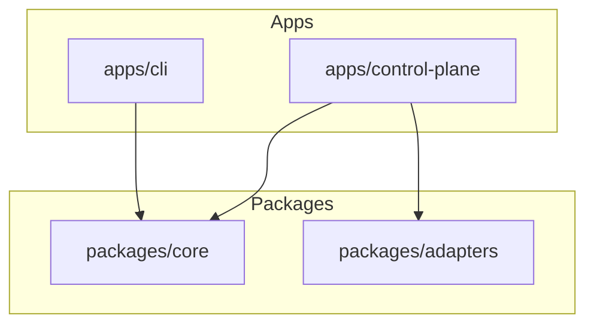
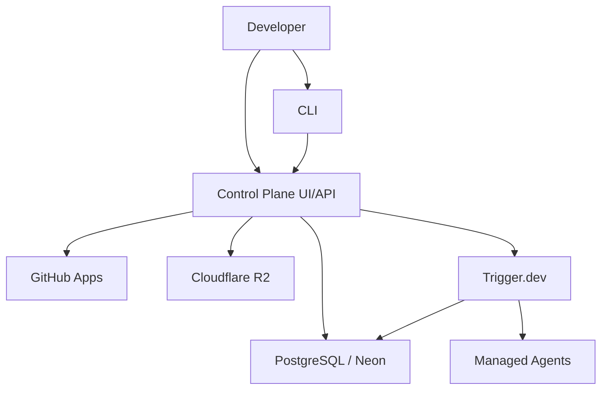
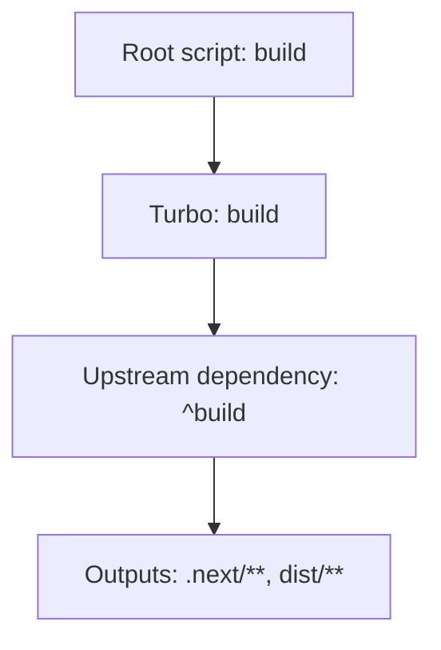
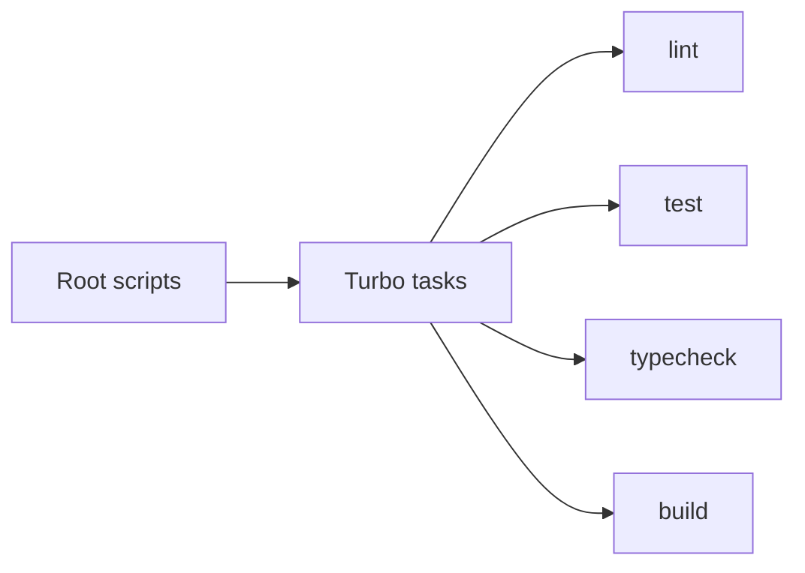
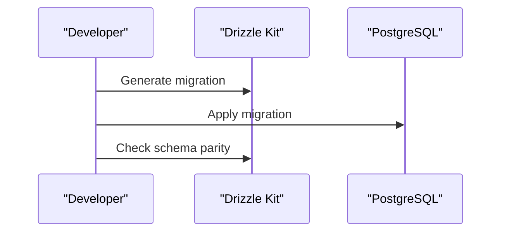
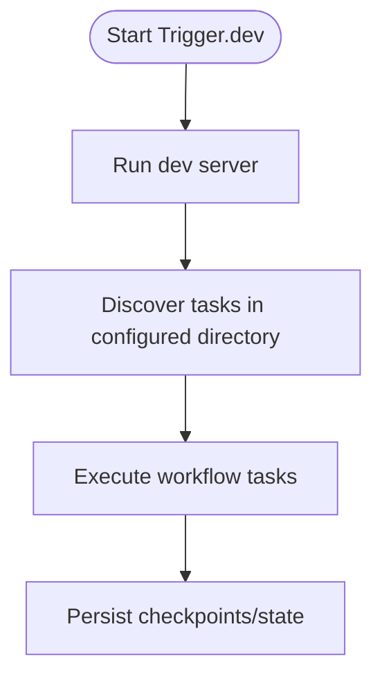
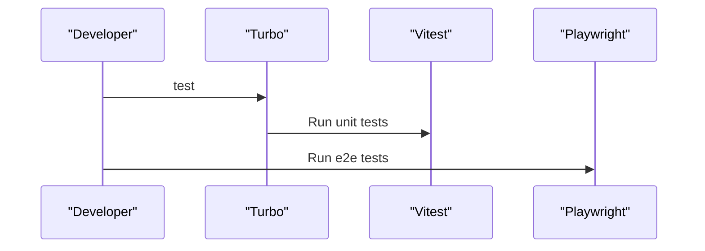
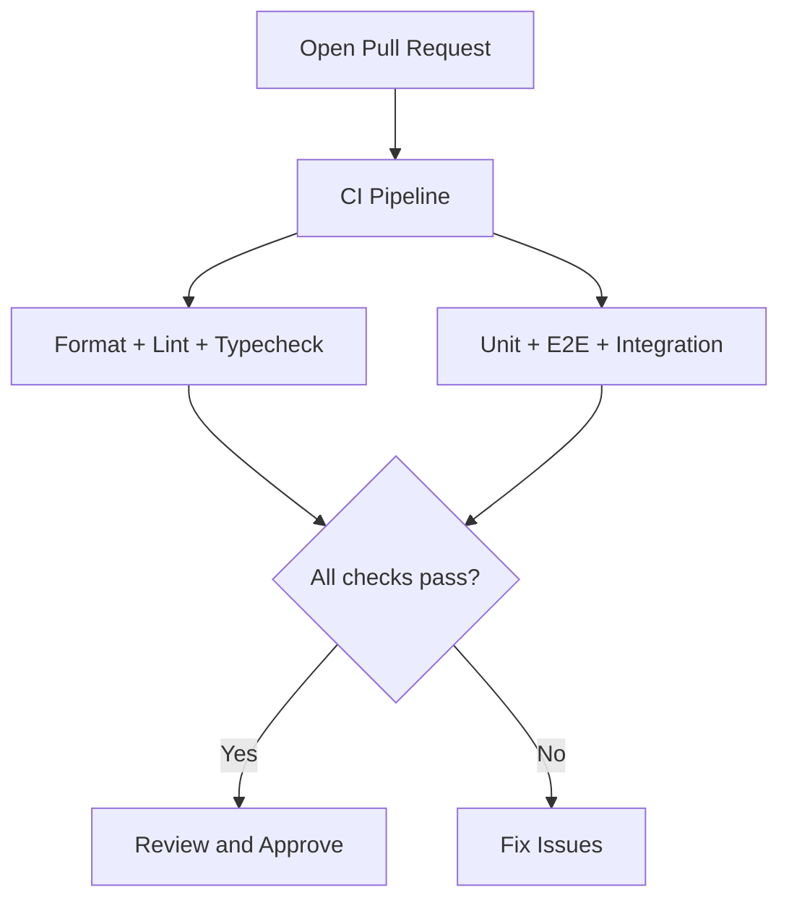
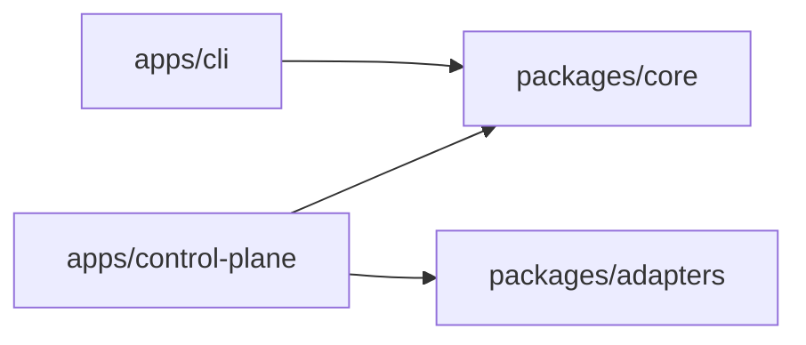

# Development Guide

<cite>
**Referenced Files in This Document**
- [package.json](file://package.json)
- [turbo.json](file://turbo.json)
- [pnpm-workspace.yaml](file://pnpm-workspace.yaml)
- [README.md](file://README.md)
- [drizzle.config.ts](file://drizzle.config.ts)
- [trigger.config.ts](file://trigger.config.ts)
- [apps/control-plane/package.json](file://apps/control-plane/package.json)
- [apps/cli/package.json](file://apps/cli/package.json)
- [.github/workflows/ci.yml](file://.github/workflows/ci.yml)
- [tsconfig.base.json](file://tsconfig.base.json)
- [apps/control-plane/tsconfig.json](file://apps/control-plane/tsconfig.json)
</cite>

## Table of Contents
1. [Introduction](#introduction)
2. [Project Structure](#project-structure)
3. [Core Components](#core-components)
4. [Architecture Overview](#architecture-overview)
5. [Detailed Component Analysis](#detailed-component-analysis)
6. [Dependency Analysis](#dependency-analysis)
7. [Performance Considerations](#performance-considerations)
8. [Troubleshooting Guide](#troubleshooting-guide)
9. [Conclusion](#conclusion)
10. [Appendices](#appendices)

## Introduction
This guide explains how to set up a local development environment, understand the monorepo organization, build and run services, write and test code, manage database migrations, develop workflow tasks, and contribute changes via pull requests for Agent OS Passerine. It focuses on Turborepo orchestration, pnpm workspace management, Next.js control plane, CLI tooling, Trigger.dev workflows, and PostgreSQL-backed persistence.

## Project Structure
Agent OS Passerine is a pnpm monorepo with two apps and two shared packages:
- Apps:
  - Control Plane (Next.js web app and API routes)
  - CLI (command-line interface)
- Packages:
  - Core (domain models, contracts, and shared logic)
  - Adapters (persistence, GitHub integration, artifact storage, managed agents, Trigger.dev workflows)

Workspace membership is declared in the workspace configuration, and Turborejo orchestrates build, lint, test, and typecheck tasks across packages.

**Diagram sources**
- [pnpm-workspace.yaml:1-3](file://pnpm-workspace.yaml#L1-L3)
- [apps/control-plane/package.json:13-16](file://apps/control-plane/package.json#L13-L16)
- [apps/cli/package.json:15-16](file://apps/cli/package.json#L15-L16)

**Section sources**
- [pnpm-workspace.yaml:1-12](file://pnpm-workspace.yaml#L1-L12)
- [turbo.json:1-19](file://turbo.json#L1-L19)
- [apps/control-plane/package.json:1-23](file://apps/control-plane/package.json#L1-L23)
- [apps/cli/package.json:1-19](file://apps/cli/package.json#L1-L19)

## Core Components
- Control Plane (Next.js): Provides UI pages and API routes for managing projects, runs, approvals, inbox, setup, and internal reconciliation endpoints. Depends on core and adapters.
- CLI: Publishes an executable named agentos that builds and runs the CLI entrypoint; depends on core.
- Core: Domain abstractions, workflow definitions, policies, and contracts used by both apps and adapters.
- Adapters: Implement persistence (PostgreSQL/Neon), GitHub integration, artifact storage (R2/MCP/in-memory), managed agents, and Trigger.dev workflow tasks.

Key scripts at the repository root enable building, testing, linting, typechecking, and running the CLI or control plane.

**Section sources**
- [package.json:10-23](file://package.json#L10-L23)
- [apps/control-plane/package.json:5-11](file://apps/control-plane/package.json#L5-L11)
- [apps/cli/package.json:9-13](file://apps/cli/package.json#L9-L13)

## Architecture Overview
The system combines a local-first development experience with optional cloud integrations:
- Local mode: In-memory providers and a simple login bypass allow quick iteration without external accounts.
- Full stack: PostgreSQL (Neon), Trigger.dev for durable workflows, R2 for artifacts, model keys, and GitHub Apps for read-only access and draft PR publishing.

[No sources needed since this diagram shows conceptual workflow, not actual code structure]

## Detailed Component Analysis

### Development Environment Setup
- Prerequisites: Node.js 24+ and pnpm 11.12.0.
- Install dependencies using the frozen lockfile.
- Initialize the project with the CLI command provided by the repository scripts.
- Run tests to validate the environment.
- Start the control plane locally on a chosen port.
- Configure environment variables in a local file and symlink it into the Next.js app directory. Use localhost “Get In” bypass for local authentication without GitHub OAuth. Optional seed data can be enabled via environment and POST endpoint.

For full-stack features, configure PostgreSQL (Neon), Trigger.dev, R2, model keys, GitHub Apps, and Trigger secrets as documented in the environment example. Verify credentials using smoke scripts under the adapters package.

**Section sources**
- [README.md:8-58](file://README.md#L8-L58)
- [package.json:10-23](file://package.json#L10-L23)

### Build System and Monorepo Organization
- pnpm workspaces define which directories are packages.
- Turborejo defines task pipelines:
  - build depends on upstream builds and emits Next.js and dist outputs.
  - lint, test, and typecheck depend on upstream tasks.
- Root scripts wrap Turbo commands for convenience.

**Diagram sources**
- [turbo.json:3-16](file://turbo.json#L3-L16)
- [package.json:10-23](file://package.json#L10-L23)

**Section sources**
- [turbo.json:1-19](file://turbo.json#L1-L19)
- [pnpm-workspace.yaml:1-12](file://pnpm-workspace.yaml#L1-L12)
- [package.json:10-23](file://package.json#L10-L23)

### Coding Standards and Tooling
- TypeScript strictness and module settings are centralized in the base config and extended by apps.
- Linting uses ESLint configured at the root and invoked via Turbo.
- Formatting uses Prettier with a check script at the root.
- Type checking is executed per package via Turbo.

**Diagram sources**
- [turbo.json:3-16](file://turbo.json#L3-L16)
- [package.json:10-23](file://package.json#L10-L23)

**Section sources**
- [tsconfig.base.json:1-24](file://tsconfig.base.json#L1-L24)
- [apps/control-plane/tsconfig.json:1-18](file://apps/control-plane/tsconfig.json#L1-L18)
- [package.json:10-23](file://package.json#L10-L23)

### Database Migration Process
- Drizzle Kit is configured for PostgreSQL with schema location and output directory.
- Root scripts provide generate, migrate, and check commands.
- CI includes a persistence-integration job that spins up a Postgres service and runs integration tests against it.

**Diagram sources**
- [drizzle.config.ts:1-13](file://drizzle.config.ts#L1-L13)
- [package.json:10-23](file://package.json#L10-L23)
- [.github/workflows/ci.yml:32-62](file://.github/workflows/ci.yml#L32-L62)

**Section sources**
- [drizzle.config.ts:1-13](file://drizzle.config.ts#L1-L13)
- [package.json:10-23](file://package.json#L10-L23)
- [.github/workflows/ci.yml:32-62](file://.github/workflows/ci.yml#L32-L62)

### Workflow Task Development (Trigger.dev)
- Trigger.dev configuration points to a specific project reference, runtime version, max duration, and task directory.
- Root scripts provide dev and deploy commands for Trigger.dev.
- The adapters package contains workflow-related modules under a trigger directory.

**Diagram sources**
- [trigger.config.ts:1-19](file://trigger.config.ts#L1-L19)
- [package.json:10-23](file://package.json#L10-L23)

**Section sources**
- [trigger.config.ts:1-19](file://trigger.config.ts#L1-L19)
- [package.json:10-23](file://package.json#L10-L23)

### Testing Procedures
- Unit and component tests run via Vitest within each package.
- End-to-end tests use Playwright and are triggered from the root script.
- Integration tests target a real Postgres instance in CI and can be run locally with the appropriate environment variable.

**Diagram sources**
- [turbo.json:3-16](file://turbo.json#L3-L16)
- [package.json:10-23](file://package.json#L10-L23)
- [.github/workflows/ci.yml:11-31](file://.github/workflows/ci.yml#L11-L31)

**Section sources**
- [turbo.json:3-16](file://turbo.json#L3-L16)
- [package.json:10-23](file://package.json#L10-L23)
- [.github/workflows/ci.yml:11-31](file://.github/workflows/ci.yml#L11-L31)

### Local Development Workflow
- Install dependencies with the frozen lockfile.
- Initialize the project using the CLI command.
- Run tests to validate setup.
- Start the control plane locally on a specified port.
- Configure environment variables and symlink them into the Next.js app directory.
- Use the local login bypass to authenticate without GitHub OAuth.
- Optionally seed demo data via environment and API endpoint.

**Section sources**
- [README.md:8-35](file://README.md#L8-L35)
- [package.json:10-23](file://package.json#L10-L23)

### Debugging Guidelines
- Use the control plane’s development server to inspect logs and interact with API routes.
- For workflow debugging, start the Trigger.dev development server to observe task execution and state transitions.
- For database issues, ensure migrations are applied and verify connectivity using the configured URL.

[No sources needed since this section provides general guidance]

### Code Contributions and Pull Request Process
- Ensure all quality checks pass: formatting, linting, typechecking, tests, and e2e tests.
- CI enforces these checks on pull requests and pushes to main.
- Include relevant tests for new functionality and update documentation when necessary.

**Diagram sources**
- [.github/workflows/ci.yml:1-31](file://.github/workflows/ci.yml#L1-L31)

**Section sources**
- [.github/workflows/ci.yml:1-31](file://.github/workflows/ci.yml#L1-L31)

### Deployment Procedures for Development Environments
- Trigger.dev workflows can be deployed using the root script.
- For local development, run the Trigger.dev development server to register and execute tasks.
- Ensure environment variables for the project reference and secrets are set appropriately.

**Section sources**
- [package.json:10-23](file://package.json#L10-L23)
- [trigger.config.ts:1-19](file://trigger.config.ts#L1-L19)

## Dependency Analysis
The control plane depends on both core and adapters, while the CLI depends on core. Turborepo ensures consistent ordering of tasks across the monorepo.

**Diagram sources**
- [apps/control-plane/package.json:13-16](file://apps/control-plane/package.json#L13-L16)
- [apps/cli/package.json:15-16](file://apps/cli/package.json#L15-L16)

**Section sources**
- [apps/control-plane/package.json:13-16](file://apps/control-plane/package.json#L13-L16)
- [apps/cli/package.json:15-16](file://apps/cli/package.json#L15-L16)

## Performance Considerations
- Prefer incremental builds and caching enabled by Turborejo and pnpm.
- Keep tests fast by isolating unit tests and using in-memory implementations where appropriate.
- Avoid unnecessary rebuilds by structuring dependencies so only affected packages re-run tasks.
- Use targeted scripts to run tests or linting for specific packages during development.

[No sources needed since this section provides general guidance]

## Troubleshooting Guide
- If the control plane cannot start, verify environment variables and the symlinked .env.local path.
- If database operations fail, confirm migrations have been applied and the database URL is correct.
- If Trigger.dev tasks do not run, ensure the development server is started and the project reference is valid.
- If e2e tests fail, ensure Playwright browsers are installed as part of the pipeline or locally.

**Section sources**
- [README.md:21-35](file://README.md#L21-L35)
- [drizzle.config.ts:1-13](file://drizzle.config.ts#L1-L13)
- [trigger.config.ts:1-19](file://trigger.config.ts#L1-L19)
- [.github/workflows/ci.yml:25-31](file://.github/workflows/ci.yml#L25-L31)

## Conclusion
This guide outlined the monorepo structure, development setup, build and test workflows, database migrations, workflow task development, and contribution standards for Agent OS Passerine. By following these practices, contributors can efficiently iterate locally, maintain high code quality, and integrate safely with CI.

## Appendices

### Quick Commands Reference
- Install dependencies: use the root install script with frozen lockfile.
- Build: use the root build script to invoke Turborejo.
- Lint: use the root lint script.
- Test: use the root test script for unit tests and the e2e script for end-to-end tests.
- Typecheck: use the root typecheck script.
- CLI: use the root agentos script to build and run the CLI.
- Control plane: start the Next.js development server with the filter script.
- Migrations: generate, apply, and check migrations using the drizzle-kit scripts.
- Trigger.dev: run dev and deploy using the root scripts.

**Section sources**
- [package.json:10-23](file://package.json#L10-L23)