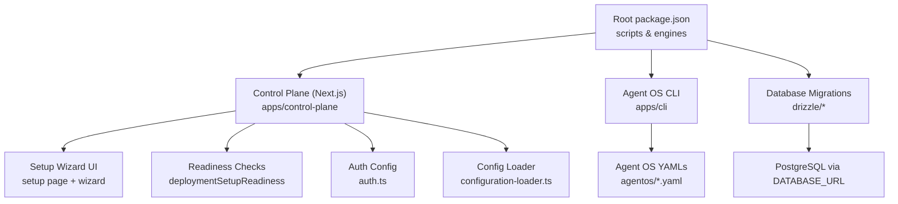
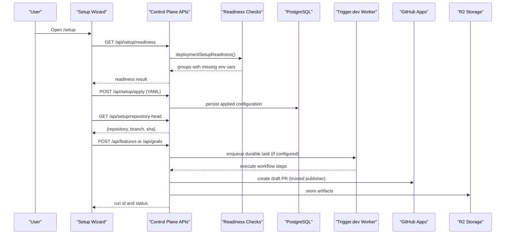
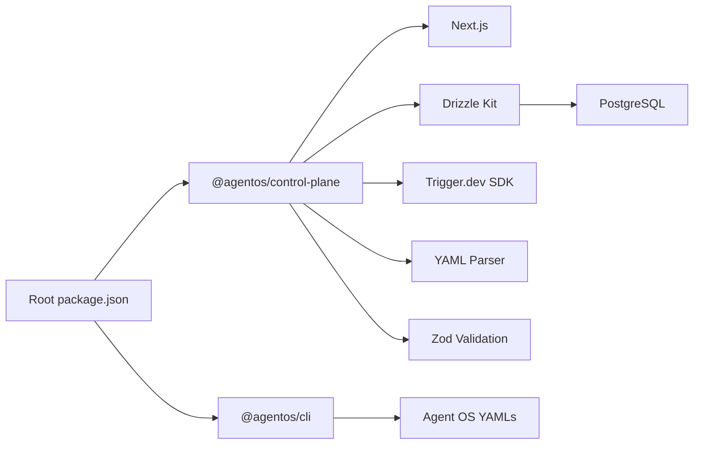

# Getting Started

<cite>
**Referenced Files in This Document**
- [README.md](file://README.md)
- [package.json](file://package.json)
- [apps/control-plane/package.json](file://apps/control-plane/package.json)
- [drizzle.config.ts](file://drizzle.config.ts)
- [agentos/README.md](file://agentos/README.md)
- [agentos/agent-os.yaml](file://agentos/agent-os.yaml)
- [agentos/passerine.yaml](file://agentos/passerine.yaml)
- [apps/control-plane/app/setup/page.tsx](file://apps/control-plane/app/setup/page.tsx)
- [apps/control-plane/src/ui/setup-wizard.tsx](file://apps/control-plane/src/ui/setup-wizard.tsx)
- [apps/control-plane/src/application/setup-readiness.ts](file://apps/control-plane/src/application/setup-readiness.ts)
- [apps/control-plane/src/auth/auth.ts](file://apps/control-plane/src/auth/auth.ts)
- [apps/control-plane/src/config/configuration-loader.ts](file://apps/control-plane/src/config/configuration-loader.ts)
- [packages/adapters/src/persistence/database-config.test.ts](file://packages/adapters/src/persistence/database-config.test.ts)
</cite>

## Table of Contents
1. Introduction
2. Project Structure
3. Core Components
4. Architecture Overview
5. Detailed Component Analysis
6. Dependency Analysis
7. Performance Considerations
8. Troubleshooting Guide
9. Conclusion
10. Appendices

## Introduction
Agent OS Passerine is a single-operator, GitHub-focused semi-autonomous build system that turns feature requests into reviewed artifacts and draft pull requests while keeping approvals, budgets, credentials, and publication authority outside model sessions. It supports:
- Local development with no cloud accounts
- Full stack deployments with PostgreSQL, Trigger.dev, R2, and GitHub Apps
- Local experiment projects that run agent sessions in the Managed Agents sandbox without publishing to GitHub

This guide walks you through installation, environment configuration, setup scenarios, and your first run.

## Project Structure
At a high level:
- Root workspace scripts manage builds, tests, migrations, and Trigger.dev tasks
- The control plane is a Next.js app exposing API routes and a setup wizard UI
- Agent OS configuration files define models, agents, environments, pipelines, policies, budgets, goals, and runtime provider
- Drizzle manages database schema and migrations for PostgreSQL

**Diagram sources**
- [package.json:1-42](file://package.json#L1-L42)
- [apps/control-plane/package.json:1-23](file://apps/control-plane/package.json#L1-L23)
- [drizzle.config.ts:1-13](file://drizzle.config.ts#L1-L13)
- [apps/control-plane/app/setup/page.tsx:1-10](file://apps/control-plane/app/setup/page.tsx#L1-L10)
- [apps/control-plane/src/ui/setup-wizard.tsx:1-120](file://apps/control-plane/src/ui/setup-wizard.tsx#L1-L120)
- [apps/control-plane/src/application/setup-readiness.ts:82-125](file://apps/control-plane/src/application/setup-readiness.ts#L82-L125)
- [apps/control-plane/src/auth/auth.ts:135-179](file://apps/control-plane/src/auth/auth.ts#L135-L179)
- [apps/control-plane/src/config/configuration-loader.ts:1-82](file://apps/control-plane/src/config/configuration-loader.ts#L1-L82)
- [agentos/agent-os.yaml:1-61](file://agentos/agent-os.yaml#L1-L61)
- [agentos/passerine.yaml:1-252](file://agentos/passerine.yaml#L1-L252)

**Section sources**
- [README.md:8-58](file://README.md#L8-L58)
- [package.json:1-42](file://package.json#L1-L42)
- [apps/control-plane/package.json:1-23](file://apps/control-plane/package.json#L1-L23)
- [drizzle.config.ts:1-13](file://drizzle.config.ts#L1-L13)

## Core Components
- Control Plane (Next.js): Provides API routes, authentication, setup wizard, configuration loading, and readiness checks.
- Agent OS Configuration: YAML files under agentos/ define project, models, agents, environments, pipelines, policies, budgets, goals, and runtime.
- Database: PostgreSQL-backed persistence via Drizzle; migrations live under drizzle/.
- CLI: Initializes configurations and validates/applies them safely.

Key responsibilities:
- Setup wizard guides environment readiness, applying configuration, resolving repository head, and starting runs.
- Readiness checks validate required environment variables for database, dispatch, models, storage, and GitHub apps.
- Auth config provides safe defaults on localhost and enforces required values in production.
- Configuration loader reads and validates agent-os YAML, enforcing production constraints.

**Section sources**
- [apps/control-plane/src/ui/setup-wizard.tsx:125-158](file://apps/control-plane/src/ui/setup-wizard.tsx#L125-L158)
- [apps/control-plane/src/application/setup-readiness.ts:82-125](file://apps/control-plane/src/application/setup-readiness.ts#L82-L125)
- [apps/control-plane/src/auth/auth.ts:135-179](file://apps/control-plane/src/auth/auth.ts#L135-L179)
- [apps/control-plane/src/config/configuration-loader.ts:34-82](file://apps/control-plane/src/config/configuration-loader.ts#L34-L82)
- [agentos/agent-os.yaml:1-61](file://agentos/agent-os.yaml#L1-L61)
- [agentos/passerine.yaml:1-252](file://agentos/passerine.yaml#L1-L252)

## Architecture Overview
The setup flow connects user actions in the UI to backend services and external integrations.

**Diagram sources**
- [apps/control-plane/src/ui/setup-wizard.tsx:201-212](file://apps/control-plane/src/ui/setup-wizard.tsx#L201-L212)
- [apps/control-plane/src/ui/setup-wizard.tsx:387-424](file://apps/control-plane/src/ui/setup-wizard.tsx#L387-L424)
- [apps/control-plane/src/ui/setup-wizard.tsx:426-445](file://apps/control-plane/src/ui/setup-wizard.tsx#L426-L445)
- [apps/control-plane/src/ui/setup-wizard.tsx:486-534](file://apps/control-plane/src/ui/setup-wizard.tsx#L486-L534)
- [apps/control-plane/src/application/setup-readiness.ts:82-125](file://apps/control-plane/src/application/setup-readiness.ts#L82-L125)

## Detailed Component Analysis

### Installation and Environment Setup
- Prerequisites: Node.js 24+ and pnpm 11.12.0 are required by the workspace.
- Install dependencies and initialize Agent OS configuration.
- Start the control plane locally on a chosen port.
- Create a local environment file and symlink it into the Next.js app directory.
- For full stack, set up PostgreSQL, Trigger.dev, R2, model keys, GitHub Apps, and Trigger secret key.

Steps:
1. Install dependencies and initialize configuration.
2. Run tests to verify baseline.
3. Start the control plane dev server.
4. Create .env.local at the repo root with only needed values and symlink into apps/control-plane/.env.local.
5. Open the login page and use the local bypass when running locally.

For full stack:
- Configure DATABASE_URL and AGENTOS_REPOSITORY=neon, then run database migrations.
- Start Trigger.dev worker locally or deploy it.
- Set model keys (Anthropic, optional Kimi), trust-anchor secrets, two GitHub Apps bound to one repository, and TRIGGER_SECRET_KEY.
- Verify credentials using provided smoke scripts.

Local experiment projects:
- Set AGENTOS_LOCAL_WORKSPACES_ROOT to enable local experiments.
- Use the setup wizard to choose “Local experiment” and create a local repository.

**Section sources**
- [README.md:8-58](file://README.md#L8-L58)
- [package.json:1-42](file://package.json#L1-L42)
- [drizzle.config.ts:1-13](file://drizzle.config.ts#L1-L13)

### Environment Variables and Configuration
- Local no-cloud: minimal variables for public URL, session secret, repository backend, and CLI token.
- Full stack: additional variables for database, dispatch, models, storage, GitHub Apps, and Trigger.dev.
- Production requires an explicit configuration path for safety.

Key environment variables:
- AGENTOS_PUBLIC_URL: Public base URL for the control plane.
- AGENTOS_SESSION_SECRET: Secret used to sign sessions.
- AGENTOS_REPOSITORY: Backend type (memory for local, neon for Postgres).
- AGENTOS_CLI_TOKEN: Token for CLI access; also used as AGENTOS_API_TOKEN.
- DATABASE_URL: PostgreSQL connection string.
- TRIGGER_SECRET_KEY and TRIGGER_PROJECT_REF: Enable durable dispatch and identify the Trigger.dev project.
- ANTHROPIC_API_KEY (and optionally KIMI_API_KEY/KIMI_BASE_URL): Model access for Managed Agents.
- AGENTOS_CONFIG_PATH: Required in production to point to authoritative configuration.

Configuration loader behavior:
- In production, AGENTOS_CONFIG_PATH must be set; otherwise initialization fails.
- Defaults to agentos/example.yaml in development unless overridden.

**Section sources**
- [README.md:21-48](file://README.md#L21-L48)
- [apps/control-plane/src/config/configuration-loader.ts:34-52](file://apps/control-plane/src/config/configuration-loader.ts#L34-L52)
- [apps/control-plane/src/application/setup-readiness.ts:82-125](file://apps/control-plane/src/application/setup-readiness.ts#L82-L125)

### GitHub Apps and Authentication
- Local development uses a built-in bypass so you can log in without configuring GitHub OAuth.
- Production requires GitHub OAuth client ID, client secret, and allowed login.
- The auth module provides safe zero-config defaults on localhost and enforces required values in production.

Setup guidance:
- On localhost, open the login page and use the “Get In” bypass.
- For production, configure GitHub OAuth and restrict allowed logins to operators.

**Section sources**
- [README.md:21-35](file://README.md#L21-L35)
- [apps/control-plane/src/auth/auth.ts:135-179](file://apps/control-plane/src/auth/auth.ts#L135-L179)

### Service Integrations
- Database: PostgreSQL via DATABASE_URL; Drizzle handles schema and migrations.
- Dispatch: Trigger.dev worker enqueues and executes workflows; readiness indicates when configured but cannot detect running workers.
- Storage: R2 for artifacts (part of full stack).
- Models: Anthropic (required for Managed Agents); optional Kimi integration.
- GitHub Apps: Two apps (read-only reader and draft-PR publisher) bound to one repository.

Verification:
- Use provided smoke scripts to verify credentials for R2, Kimi, and managed agents.

**Section sources**
- [README.md:37-58](file://README.md#L37-L58)
- [apps/control-plane/src/application/setup-readiness.ts:82-125](file://apps/control-plane/src/application/setup-readiness.ts#L82-L125)
- [drizzle.config.ts:1-13](file://drizzle.config.ts#L1-L13)

### Local No-Cloud Setup
- Minimal environment variables for local development.
- Use memory repository and local bypass for authentication.
- Optionally seed demo data for exploration.

Steps:
1. Initialize Agent OS configuration.
2. Create .env.local with minimal values and symlink into the app.
3. Start the control plane and open the login page.
4. Use the local bypass to proceed.

**Section sources**
- [README.md:12-35](file://README.md#L12-L35)
- [apps/control-plane/src/auth/auth.ts:135-179](file://apps/control-plane/src/auth/auth.ts#L135-L179)

### Full Stack with PostgreSQL and External Services
- Configure PostgreSQL and run migrations.
- Set AGENTOS_REPOSITORY=neon and provide DATABASE_URL.
- Start Trigger.dev worker locally or deploy it.
- Provide model keys, R2 credentials, GitHub Apps, and TRIGGER_SECRET_KEY.
- Validate readiness via the setup wizard.

Migrations:
- Use the provided scripts to generate and apply migrations against your PostgreSQL instance.

**Section sources**
- [README.md:37-58](file://README.md#L37-L58)
- [drizzle.config.ts:1-13](file://drizzle.config.ts#L1-L13)
- [package.json:10-23](file://package.json#L10-L23)

### Local Experiment Projects
- Enable local workspaces by setting AGENTOS_LOCAL_WORKSPACES_ROOT.
- Choose “Local experiment” in the setup wizard to create a local repository.
- Runs produce branches like agentos/<run> instead of draft PRs.
- Agent sessions still execute in the Managed Agents sandbox and artifacts are stored in R2.

Wizard support:
- The setup wizard includes templates and helpers to create local repositories and pre-fill example projects.

**Section sources**
- [README.md:50-54](file://README.md#L50-L54)
- [apps/control-plane/src/ui/setup-wizard.tsx:666-749](file://apps/control-plane/src/ui/setup-wizard.tsx#L666-L749)

### Quick Start: First Run
- Apply configuration from the setup wizard.
- Resolve the repository head to pin the commit.
- Start a feature or goal run.

Workflow:
1. Open /setup and check environment readiness.
2. Edit and apply the project configuration YAML.
3. Resolve the current repository head.
4. Start a run (feature or goal) and observe progress in the UI.

**Section sources**
- [apps/control-plane/src/ui/setup-wizard.tsx:387-534](file://apps/control-plane/src/ui/setup-wizard.tsx#L387-L534)

### Navigating the Web Interface
- Login via the local bypass on localhost or GitHub OAuth in production.
- Use the setup wizard to manage projects and runs.
- Monitor readiness, apply configurations, resolve heads, and start runs.
- View runs and inbox for approvals and messages.

**Section sources**
- [apps/control-plane/app/setup/page.tsx:1-10](file://apps/control-plane/app/setup/page.tsx#L1-L10)
- [apps/control-plane/src/ui/setup-wizard.tsx:125-158](file://apps/control-plane/src/ui/setup-wizard.tsx#L125-L158)

## Dependency Analysis
Core runtime dependencies and their roles:
- Next.js powers the control plane UI and API routes.
- Drizzle manages PostgreSQL schema and migrations.
- Trigger.dev enables durable workflow dispatch and execution.
- Agent OS YAMLs define the operational model for agents and pipelines.

**Diagram sources**
- [package.json:1-42](file://package.json#L1-L42)
- [apps/control-plane/package.json:1-23](file://apps/control-plane/package.json#L1-L23)
- [drizzle.config.ts:1-13](file://drizzle.config.ts#L1-L13)
- [agentos/agent-os.yaml:1-61](file://agentos/agent-os.yaml#L1-L61)
- [agentos/passerine.yaml:1-252](file://agentos/passerine.yaml#L1-L252)

**Section sources**
- [package.json:1-42](file://package.json#L1-L42)
- [apps/control-plane/package.json:1-23](file://apps/control-plane/package.json#L1-L23)
- [drizzle.config.ts:1-13](file://drizzle.config.ts#L1-L13)

## Performance Considerations
- Keep concurrency and budget settings conservative during initial deployments to avoid resource exhaustion.
- Ensure the Trigger.dev worker is running to process queued tasks promptly; readiness checks do not confirm worker liveness.
- Use local experiments to iterate quickly without network overhead.
- Validate model providers and storage credentials early to reduce retry loops.

[No sources needed since this section provides general guidance]

## Troubleshooting Guide
Common issues and resolutions:
- Missing DATABASE_URL: Ensure PostgreSQL is configured and migrations are applied.
- Non-PostgreSQL or malformed DATABASE_URL: Provide a valid PostgreSQL URL.
- Missing TRIGGER_SECRET_KEY or project reference: Configure Trigger.dev and ensure the worker is running.
- Missing model keys: Set ANTHROPIC_API_KEY (and optional KIMI keys) for Managed Agents.
- GitHub OAuth not configured: On localhost, use the local bypass; in production, configure client ID, secret, and allowed login.
- Production configuration path missing: Set AGENTOS_CONFIG_PATH to point to the authoritative YAML.

Validation hints:
- Use the setup wizard’s readiness checks to identify missing variables and get actionable hints.
- Re-run readiness after updating environment variables and restarting the control plane.

**Section sources**
- [apps/control-plane/src/application/setup-readiness.ts:82-125](file://apps/control-plane/src/application/setup-readiness.ts#L82-L125)
- [packages/adapters/src/persistence/database-config.test.ts:1-34](file://packages/adapters/src/persistence/database-config.test.ts#L1-L34)
- [apps/control-plane/src/auth/auth.ts:135-179](file://apps/control-plane/src/auth/auth.ts#L135-L179)
- [apps/control-plane/src/config/configuration-loader.ts:34-52](file://apps/control-plane/src/config/configuration-loader.ts#L34-L52)

## Conclusion
You can start Agent OS Passerine quickly with a local no-cloud setup, then scale to a full stack with PostgreSQL, Trigger.dev, R2, and GitHub Apps. Use the setup wizard to validate readiness, apply configuration, resolve repository heads, and launch runs. For local experiments, leverage the wizard to create isolated repositories and iterate safely. Always verify environment variables and service integrations using the readiness checks and provided smoke scripts.

[No sources needed since this section summarizes without analyzing specific files]

## Appendices

### Appendix A: Agent OS Configuration Examples
- Example starter configuration defines a basic project, model, agent, pipeline, policies, budgets, goals, and runtime provider.
- Passerine example demonstrates a multi-step feature pipeline with specification, planning, implementation, review, and verification steps.

Use these files as baselines and customize per project needs.

**Section sources**
- [agentos/agent-os.yaml:1-61](file://agentos/agent-os.yaml#L1-L61)
- [agentos/passerine.yaml:1-252](file://agentos/passerine.yaml#L1-L252)

### Appendix B: CLI Commands
- Initialize configuration, validate, plan, and apply changes with idempotency keys.
- Remote commands require AGENTOS_URL and AGENTOS_API_TOKEN or corresponding flags.
- Use JSON output for automation-friendly responses.

**Section sources**
- [agentos/README.md:1-38](file://agentos/README.md#L1-L38)