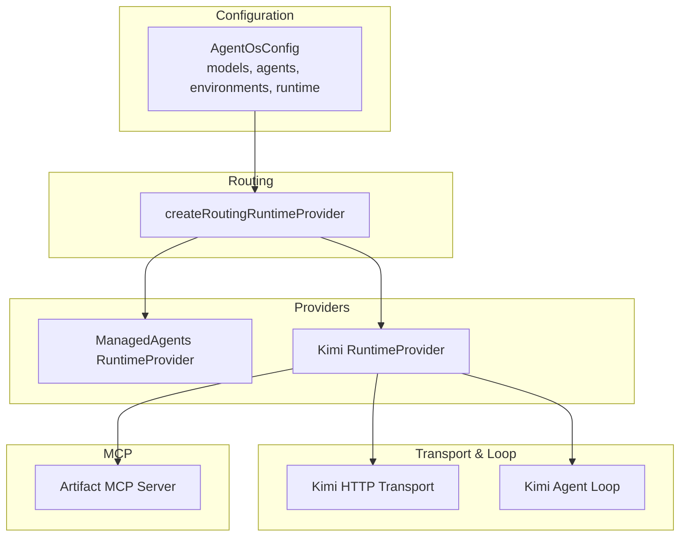
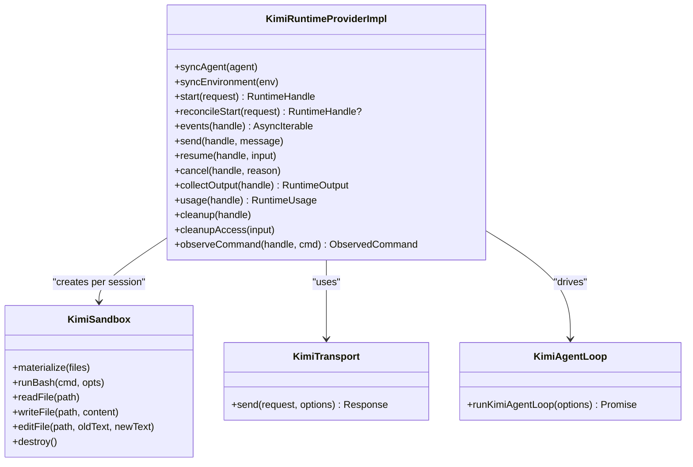
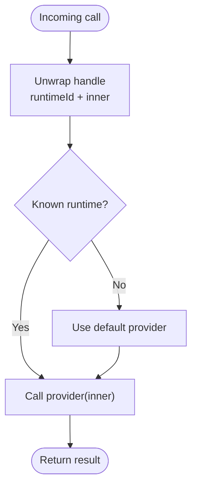
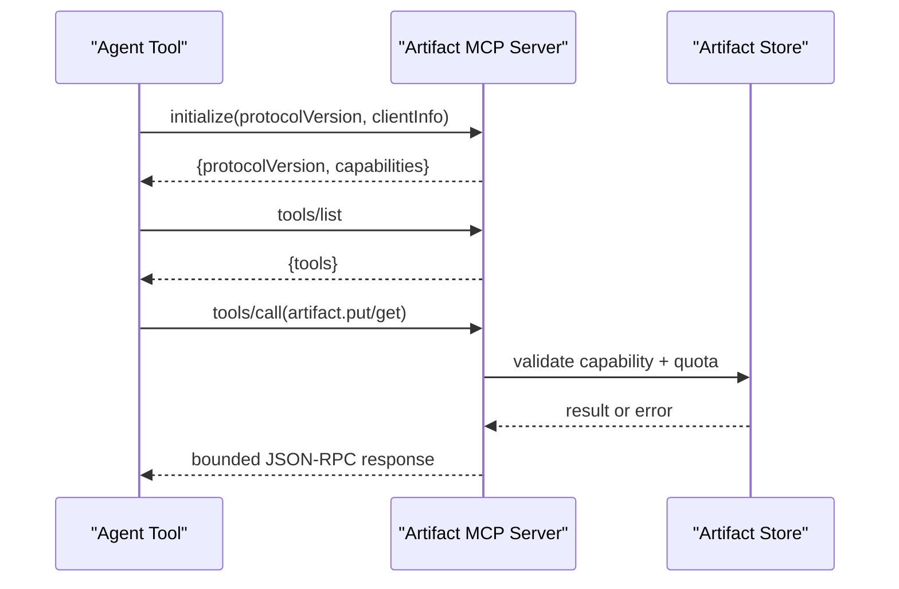
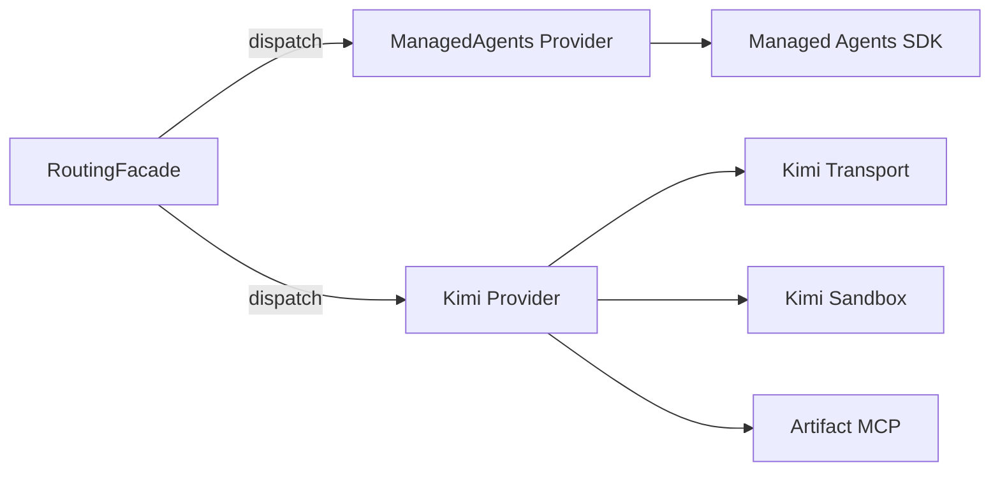

# AI Model Providers

<cite>
**Referenced Files in This Document**
- [provider.ts](file://packages/adapters/src/kimi/provider.ts)
- [loop.ts](file://packages/adapters/src/kimi/loop.ts)
- [transport.ts](file://packages/adapters/src/kimi/transport.ts)
- [from-env.ts](file://packages/adapters/src/kimi/from-env.ts)
- [routing.ts](file://packages/adapters/src/runtime/routing.ts)
- [provider.ts](file://packages/adapters/src/managed-agents/provider.ts)
- [mcp.ts](file://packages/adapters/src/artifacts/mcp.ts)
- [config.ts](file://packages/core/src/config.ts)
- [example.yaml](file://agentos/example.yaml)
- [kimi-runtime.md](file://docs/architecture/kimi-runtime.md)
- [2026-08-17-kimi-runtime-design.md](file://docs/superpowers/specs/2026-08-17-kimi-runtime-design.md)
- [workflow.ts](file://packages/adapters/src/trigger/workflow.ts)
</cite>

## Table of Contents
1. Introduction
2. Project Structure
3. Core Components
4. Architecture Overview
5. Detailed Component Analysis
6. Dependency Analysis
7. Performance Considerations
8. Troubleshooting Guide
9. Conclusion

## Introduction
This document explains how the system integrates multiple AI model providers (Anthropic Managed Agents and Moonshot Kimi), how to configure provider-specific settings and API keys, how model selection works via configuration, and how an abstraction layer lets you switch providers without changing application code. It also covers MCP server integration for extending AI capabilities with custom tools and contexts, rate limiting and fallback behavior, and troubleshooting authentication, rate limits, and model availability issues.

## Project Structure
The repository implements a multi-provider runtime through:
- A core configuration schema that defines model profiles, agents, environments, and routing rules.
- Provider implementations for Anthropic Managed Agents and Moonshot Kimi.
- A routing facade that dispatches sessions to the correct provider based on agent/model profile routing.
- An MCP server implementation for artifact storage and capability-based access control.
- Production composition utilities that wire environment variables into providers.



**Diagram sources**
- [routing.ts:51-177](file://packages/adapters/src/runtime/routing.ts#L51-L177)
- [provider.ts:273-306](file://packages/adapters/src/kimi/provider.ts#L273-L306)
- [provider.ts:114-141](file://packages/adapters/src/managed-agents/provider.ts#L114-L141)
- [transport.ts:73-118](file://packages/adapters/src/kimi/transport.ts#L73-L118)
- [loop.ts:45-88](file://packages/adapters/src/kimi/loop.ts#L45-L88)
- [mcp.ts:616-761](file://packages/adapters/src/artifacts/mcp.ts#L616-L761)

**Section sources**
- [config.ts:39-148](file://packages/core/src/config.ts#L39-L148)
- [routing.ts:51-177](file://packages/adapters/src/runtime/routing.ts#L51-L177)
- [example.yaml:5-72](file://agentos/example.yaml#L5-L72)

## Core Components
- Configuration and routing:
  - Model profiles define provider and model identifiers and pricing fields.
  - Agents reference a model profile and optional environment/tools/MCPs.
  - Environments declare runtime type, networking, packages, and variables.
  - Runtime routing maps model-profile providers to runtime identifiers; default provider is used when no mapping applies.
- Providers:
  - Managed Agents provider orchestrates remote sessions, events streaming, resources, budgets, and reconciliation.
  - Kimi provider runs a local agent loop against an Anthropic-compatible Messages endpoint, executes sandboxed tools, and integrates with Artifact MCP.
- Routing facade:
  - Wraps multiple providers behind a single RuntimeProvider interface.
  - Prefixes handles with owning runtime id to ensure affinity for later operations.
  - Partitions cleanupAccess by ownership to avoid cross-provider resource confusion.
- MCP server:
  - Implements JSON-RPC over HTTP with capability-based authorization, quota enforcement, and bounded responses.

**Section sources**
- [config.ts:39-148](file://packages/core/src/config.ts#L39-L148)
- [routing.ts:51-177](file://packages/adapters/src/runtime/routing.ts#L51-L177)
- [provider.ts:273-306](file://packages/adapters/src/kimi/provider.ts#L273-L306)
- [provider.ts:114-141](file://packages/adapters/src/managed-agents/provider.ts#L114-L141)
- [mcp.ts:616-761](file://packages/adapters/src/artifacts/mcp.ts#L616-L761)

## Architecture Overview
The system abstracts provider differences behind a common RuntimeProvider port. Application code calls start/events/send/cancel/collectOutput/usage/cleanup on the routed provider, which forwards to the correct underlying provider based on agent/model routing.

```mermaid
sequenceDiagram
participant App as "Application"
participant Router as "RoutingFacade"
participant Kimi as "Kimi Provider"
participant Loop as "Kimi Agent Loop"
participant Trans as "Kimi Transport"
participant API as "Moonshot Anthropic-Compatible API"
App->>Router : start(agentId, input, timeoutMs)
Router->>Kimi : start(request)
Kimi->>Loop : runKimiAgentLoop(...)
Loop->>Trans : send({model, messages, tools, maxTokens})
Trans->>API : POST /v1/messages (x-api-key, anthropic-version)
API-->>Trans : {content, usage}
Trans-->>Loop : normalized response
Loop-->>Kimi : tool_use or submit_result
Kimi-->>Router : handle
Router-->>App : handle
```

**Diagram sources**
- [routing.ts:190-195](file://packages/adapters/src/runtime/routing.ts#L190-L195)
- [provider.ts:308-500](file://packages/adapters/src/kimi/provider.ts#L308-L500)
- [loop.ts:45-88](file://packages/adapters/src/kimi/loop.ts#L45-L88)
- [transport.ts:83-118](file://packages/adapters/src/kimi/transport.ts#L83-L118)

## Detailed Component Analysis

### Kimi Provider (Self-hosted runtime)
- Purpose: Run agent roles on Moonshot Kimi models using an Anthropic-compatible Messages API while executing tools in a per-session local sandbox.
- Key responsibilities:
  - Session lifecycle: start, reconcileStart, events, send/resume, cancel, collectOutput, usage, cleanup.
  - Tool execution: bash, read, write, edit, submit_result, artifact_put/get (when configured).
  - Integration with Artifact MCP for immutable artifacts via capability tokens.
  - Usage accumulation per turn and safe termination under cancellation/timeouts.
- Configuration:
  - Requires apiKey and ownershipSecret; optional baseUrl overrides default endpoint.
  - Optional artifactMcp configuration enables artifact tools; requires credential resolution.
  - Environment variable loading treats blank/absent KIMI_API_KEY as not configured (fail-closed).
- Rate limiting and retries:
  - Transport retries once on 429/5xx after a fixed delay; other failures throw transport errors.
- Fallback behavior:
  - Composition fails closed if routing selects kimi but KIMI_API_KEY is absent; no silent fallback to another provider.



**Diagram sources**
- [provider.ts:273-688](file://packages/adapters/src/kimi/provider.ts#L273-L688)
- [loop.ts:45-175](file://packages/adapters/src/kimi/loop.ts#L45-L175)
- [transport.ts:73-118](file://packages/adapters/src/kimi/transport.ts#L73-L118)

**Section sources**
- [provider.ts:308-500](file://packages/adapters/src/kimi/provider.ts#L308-L500)
- [provider.ts:701-800](file://packages/adapters/src/kimi/provider.ts#L701-L800)
- [loop.ts:45-175](file://packages/adapters/src/kimi/loop.ts#L45-L175)
- [transport.ts:73-176](file://packages/adapters/src/kimi/transport.ts#L73-L176)
- [from-env.ts:11-19](file://packages/adapters/src/kimi/from-env.ts#L11-L19)
- [kimi-runtime.md:1-32](file://docs/architecture/kimi-runtime.md#L1-L32)
- [2026-08-17-kimi-runtime-design.md:1-39](file://docs/superpowers/specs/2026-08-17-kimi-runtime-design.md#L1-L39)

### Managed Agents Provider (Anthropic)
- Purpose: Orchestrate remote sessions on the managed platform with strict limits, event streaming, resource management, and budget controls.
- Key responsibilities:
  - Sync agents/environments and reconcile state.
  - Start sessions with resources, credentials/vaults, deadlines, and budgets.
  - Stream/list events with bounded output and reconnect limits.
  - Send user/tool results and confirmations; cancel/interrupt sessions.
  - Collect outputs and manage uploaded files and vault credentials.
- Security and policy:
  - Validates built-in web egress and unrestricted networking policies.
  - Uses ownership capabilities and metadata to assert session ownership.

**Section sources**
- [provider.ts:114-141](file://packages/adapters/src/managed-agents/provider.ts#L114-L141)
- [provider.ts:226-360](file://packages/adapters/src/managed-agents/provider.ts#L226-L360)
- [provider.ts:464-553](file://packages/adapters/src/managed-agents/provider.ts#L464-L553)
- [provider.ts:633-710](file://packages/adapters/src/managed-agents/provider.ts#L633-L710)
- [provider.ts:787-800](file://packages/adapters/src/managed-agents/provider.ts#L787-L800)

### Routing Facade
- Purpose: Provide a single RuntimeProvider that fans out to multiple providers based on agent/model routing and preserves handle affinity.
- Behavior:
  - Records which runtime each agent was synced to.
  - Prefixes handles with owning runtime id so later calls route correctly.
  - Falls back to default provider for bare handles and during reconciliation.
  - Partitions cleanupAccess by owner to avoid cross-provider resource mishandling.



**Diagram sources**
- [routing.ts:118-151](file://packages/adapters/src/runtime/routing.ts#L118-L151)
- [routing.ts:190-242](file://packages/adapters/src/runtime/routing.ts#L190-L242)
- [routing.ts:244-279](file://packages/adapters/src/runtime/routing.ts#L244-L279)

**Section sources**
- [routing.ts:51-177](file://packages/adapters/src/runtime/routing.ts#L51-L177)
- [routing.ts:190-295](file://packages/adapters/src/runtime/routing.ts#L190-L295)

### MCP Server Integration (Artifact MCP)
- Purpose: Expose a secure, capability-scoped MCP server for artifact storage and retrieval, enabling agents to store and fetch immutable artifacts.
- Features:
  - JSON-RPC over HTTP with protocol version negotiation.
  - Bearer capability token validation and origin checks.
  - Quota enforcement and bounded request/response sizes.
  - Tools list and tool call handling with error normalization.



**Diagram sources**
- [mcp.ts:616-761](file://packages/adapters/src/artifacts/mcp.ts#L616-L761)

**Section sources**
- [mcp.ts:616-761](file://packages/adapters/src/artifacts/mcp.ts#L616-L761)

### Configuration and Model Selection
- Model profiles define provider and model identifiers and pricing fields.
- Agents select a model profile; environments define runtime and networking constraints.
- Runtime routing maps model-profile providers to runtime identifiers; default provider is used when no mapping applies.
- Example configuration shows how to enable Kimi routing alongside the default managed provider.

```mermaid
flowchart TD
Cfg["AgentOsConfig"] --> Models["models.{name}: {provider, model, pricing}"]
Cfg --> Agents["agents.{name}: {model, tools, mcps, ...}"]
Cfg --> Env["environments.{name}: {runtime, networking, ...}"]
Cfg --> Runtime["runtime: {provider, routing}"]
Agents --> Models
Runtime --> |route(model.provider)| RuntimeId["runtime id"]
```

**Diagram sources**
- [config.ts:39-148](file://packages/core/src/config.ts#L39-L148)
- [example.yaml:5-72](file://agentos/example.yaml#L5-L72)

**Section sources**
- [config.ts:39-148](file://packages/core/src/config.ts#L39-L148)
- [example.yaml:5-72](file://agentos/example.yaml#L5-L72)

## Dependency Analysis
- The routing facade depends on registered providers and a default provider; it enforces known runtime ids and handle affinity.
- Kimi provider depends on:
  - Transport to post to the Anthropic-compatible endpoint with required headers.
  - Sandbox for safe tool execution.
  - Artifact MCP for immutable artifact operations.
- Managed Agents provider depends on:
  - Remote SDK for sessions, events, files, and vaults.
  - Policy checks for web egress and networking.
- Workflow-level transient error classification supports retryable status codes and timeouts.



**Diagram sources**
- [routing.ts:51-177](file://packages/adapters/src/runtime/routing.ts#L51-L177)
- [provider.ts:273-306](file://packages/adapters/src/kimi/provider.ts#L273-L306)
- [transport.ts:73-118](file://packages/adapters/src/kimi/transport.ts#L73-L118)
- [provider.ts:114-141](file://packages/adapters/src/managed-agents/provider.ts#L114-L141)

**Section sources**
- [routing.ts:51-177](file://packages/adapters/src/runtime/routing.ts#L51-L177)
- [workflow.ts:434-487](file://packages/adapters/src/trigger/workflow.ts#L434-L487)

## Performance Considerations
- Kimi transport retries once on 429/5xx with a fixed delay to mitigate transient network/server issues.
- Kimi agent loop uses a generous per-turn token budget and a maximum number of turns to prevent runaway loops.
- Managed Agents events streaming enforces duration and reconnect limits to bound resource usage.
- Artifact MCP enforces request/response size caps and quota consumption to protect storage and bandwidth.
- Use timeouts at the start request level to cap long-running sessions and release resources promptly.

[No sources needed since this section provides general guidance]

## Troubleshooting Guide

### Authentication Issues
- Kimi provider:
  - Ensure KIMI_API_KEY is present and non-blank; blank values are treated as not configured.
  - Verify x-api-key header is set by the transport and that the base URL points to the intended endpoint.
- Managed Agents:
  - Confirm sessions were created with proper credentials/vaults and that ownership capabilities match stored metadata.
- Artifact MCP:
  - Validate bearer capability token and allowed origins; invalid capability returns explicit error codes.

**Section sources**
- [from-env.ts:11-19](file://packages/adapters/src/kimi/from-env.ts#L11-L19)
- [transport.ts:83-118](file://packages/adapters/src/kimi/transport.ts#L83-L118)
- [mcp.ts:616-761](file://packages/adapters/src/artifacts/mcp.ts#L616-L761)

### Rate Limits and Availability
- Kimi transport:
  - Retries once on 429/5xx; repeated failures indicate sustained rate limiting or service degradation.
- Managed Agents:
  - Event collection and streaming enforce limits; exceeding limits throws limit errors.
- Workflow classification:
  - Classifies transient errors (timeouts, 429/502/503/504) for retry logic.

**Section sources**
- [transport.ts:145-176](file://packages/adapters/src/kimi/transport.ts#L145-L176)
- [provider.ts:633-710](file://packages/adapters/src/managed-agents/provider.ts#L633-L710)
- [workflow.ts:434-487](file://packages/adapters/src/trigger/workflow.ts#L434-L487)

### Model Availability and Routing
- If routing selects kimi but KIMI_API_KEY is absent, composition fails closed; do not expect automatic fallback.
- Ensure runtime.routing maps model-profile provider to a registered runtime id; unknown mappings cause routing errors.
- For managed-only runs, handles remain bare; only introduce routing when a non-default runtime is needed.

**Section sources**
- [2026-08-17-kimi-runtime-design.md:107-122](file://docs/superpowers/specs/2026-08-17-kimi-runtime-design.md#L107-L122)
- [routing.ts:51-177](file://packages/adapters/src/runtime/routing.ts#L51-L177)
- [kimi-runtime.md:156-179](file://docs/architecture/kimi-runtime.md#L156-L179)

### Tool Execution and Artifacts
- Kimi tools execute in a sandbox; ensure paths are within allowed directories and commands respect timeouts.
- Artifact tools require artifactMcp configuration and a valid credentialRef; otherwise they return an error indicating tools are not configured.
- Artifact MCP responses are bounded; oversized responses are sanitized to meet configured limits.

**Section sources**
- [provider.ts:701-800](file://packages/adapters/src/kimi/provider.ts#L701-L800)
- [mcp.ts:616-761](file://packages/adapters/src/artifacts/mcp.ts#L616-L761)

## Conclusion
The system provides a robust abstraction over multiple AI providers through a unified RuntimeProvider interface, configurable routing, and strong security boundaries. Kimi offers a self-hosted path with local sandboxing and MCP-backed artifacts, while Managed Agents provide a fully hosted experience with strict limits and streaming. Proper configuration of model profiles, routing, and environment variables ensures reliable operation, while built-in retries, quotas, and bounded responses help maintain stability under load.