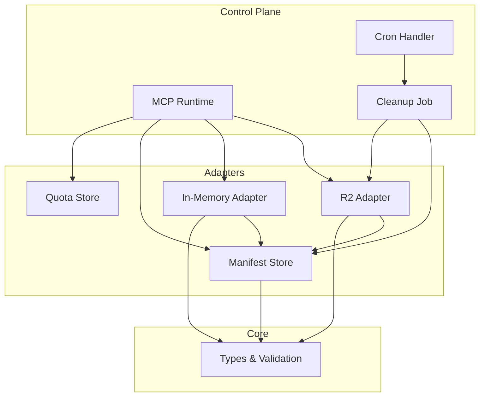
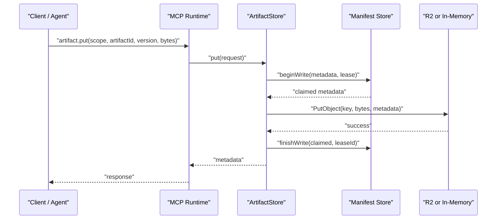
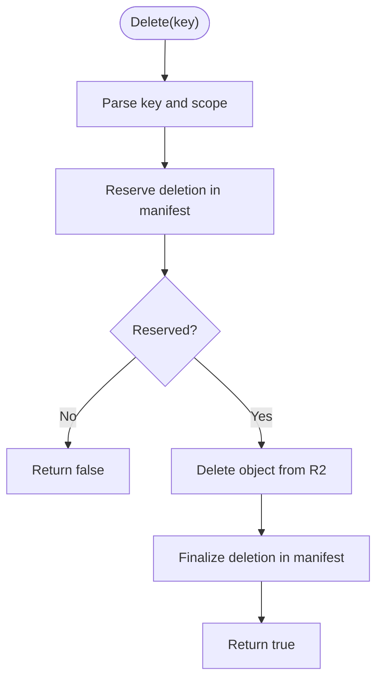
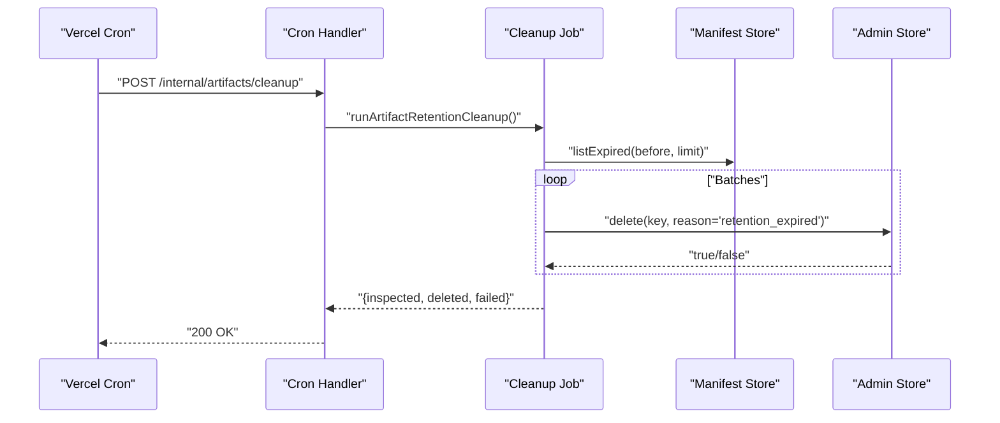
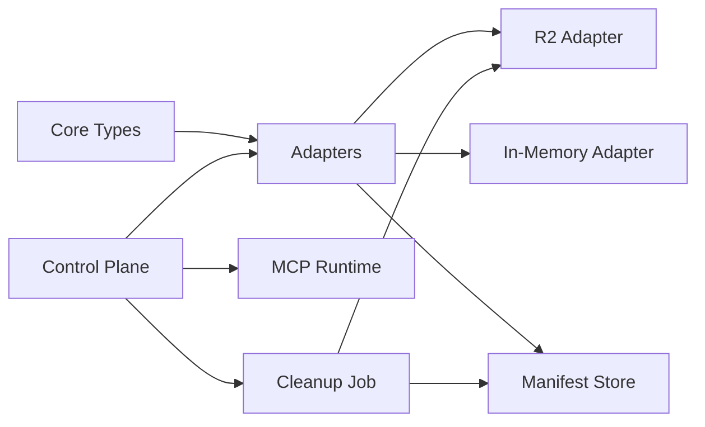

# Artifact Storage

<cite>
**Referenced Files in This Document**
- [artifact-storage.md](file://docs/architecture/artifact-storage.md)
- [r2.ts](file://packages/adapters/src/artifacts/r2.ts)
- [in-memory.ts](file://packages/adapters/src/artifacts/in-memory.ts)
- [manifest.ts](file://packages/adapters/src/artifacts/manifest.ts)
- [index.ts](file://packages/adapters/src/artifacts/index.ts)
- [artifact-store-contract.ts](file://packages/adapters/src/artifacts/artifact-store-contract.ts)
- [artifact-cleanup-runtime.ts](file://apps/control-plane/src/application/artifact-cleanup-runtime.ts)
- [artifact-cleanup.ts](file://apps/control-plane/src/application/artifact-cleanup.ts)
- [artifact-cleanup-cron.ts](file://apps/control-plane/src/http/artifact-cleanup-cron.ts)
- [artifact-mcp-runtime.ts](file://apps/control-plane/src/application/artifact-mcp-runtime.ts)
- [artifacts.ts](file://packages/core/src/artifacts.ts)
</cite>

## Table of Contents
1. [Introduction](#introduction)
2. [Project Structure](#project-structure)
3. [Core Components](#core-components)
4. [Architecture Overview](#architecture-overview)
5. [Detailed Component Analysis](#detailed-component-analysis)
6. [Dependency Analysis](#dependency-analysis)
7. [Performance Considerations](#performance-considerations)
8. [Troubleshooting Guide](#troubleshooting-guide)
9. [Conclusion](#conclusion)
10. [Appendices](#appendices)

## Introduction
This document explains the artifact storage integration that supports Cloudflare R2 and an in-memory local backend. It covers configuration, upload/download flows, lifecycle management with automatic cleanup, versioning, metadata, access control, setup instructions, performance tips, migration strategies, and troubleshooting for connectivity, quotas, and retention policies.

The system enforces content-addressed storage with a Postgres-backed manifest as the authoritative logical version store. R2 object names are immutable and content-addressed; integrity is verified by SHA-256 on read and write paths. Access is scoped to project/run/step boundaries, and administrative deletion is separated from normal reads/writes.

**Section sources**
- [artifact-storage.md:1-42](file://docs/architecture/artifact-storage.md#L1-L42)

## Project Structure
Artifact storage spans three layers:
- Adapters: concrete backends (R2 and in-memory), manifest persistence, MCP handler, quota, and cursor utilities.
- Control plane: runtime wiring for MCP endpoints, cleanup jobs, and cron handlers.
- Core: shared types and validation used by adapters and control plane.

**Diagram sources**
- [artifact-mcp-runtime.ts:1-63](file://apps/control-plane/src/application/artifact-mcp-runtime.ts#L1-L63)
- [artifact-cleanup.ts:1-118](file://apps/control-plane/src/application/artifact-cleanup.ts#L1-L118)
- [artifact-cleanup-cron.ts:1-35](file://apps/control-plane/src/http/artifact-cleanup-cron.ts#L1-L35)
- [r2.ts:1-659](file://packages/adapters/src/artifacts/r2.ts#L1-L659)
- [in-memory.ts:1-219](file://packages/adapters/src/artifacts/in-memory.ts#L1-L219)
- [manifest.ts:1-606](file://packages/adapters/src/artifacts/manifest.ts#L1-L606)
- [artifacts.ts:53-103](file://packages/core/src/artifacts.ts#L53-L103)

**Section sources**
- [index.ts:1-33](file://packages/adapters/src/artifacts/index.ts#L1-L33)
- [artifact-mcp-runtime.ts:1-63](file://apps/control-plane/src/application/artifact-mcp-runtime.ts#L1-L63)
- [artifact-cleanup.ts:1-118](file://apps/control-plane/src/application/artifact-cleanup.ts#L1-L118)
- [artifact-cleanup-cron.ts:1-35](file://apps/control-plane/src/http/artifact-cleanup-cron.ts#L1-L35)

## Core Components
- ArtifactStore: get, put, list operations with scope enforcement and size limits.
- ArtifactAdminStore: delete operation with audit and reservation semantics.
- ArtifactManifestStore: durable logical versioning, leases, listing, expiration queries, and deletion reservation/finalization.
- Backends:
  - R2 adapter: S3-compatible client configured for Cloudflare R2 with jurisdiction-aware endpoint selection and retry/timeout behavior.
  - In-memory adapter: process-scoped storage for development/testing with identical semantics.
- MCP runtime: exposes artifact.get, artifact.put, artifact.list via short-lived HMAC capabilities with per-call quotas enforced in Postgres.
- Cleanup: periodic job that deletes expired artifacts using admin store and manifest queries, bounded by time budgets and leases.

**Section sources**
- [artifacts.ts:53-103](file://packages/core/src/artifacts.ts#L53-L103)
- [r2.ts:51-75](file://packages/adapters/src/artifacts/r2.ts#L51-L75)
- [in-memory.ts:29-34](file://packages/adapters/src/artifacts/in-memory.ts#L29-L34)
- [manifest.ts:180-400](file://packages/adapters/src/artifacts/manifest.ts#L180-L400)
- [artifact-mcp-runtime.ts:1-63](file://apps/control-plane/src/application/artifact-mcp-runtime.ts#L1-L63)
- [artifact-cleanup.ts:9-118](file://apps/control-plane/src/application/artifact-cleanup.ts#L9-L118)

## Architecture Overview
The system separates concerns across storage, manifest, and access control:
- Writes acquire a short-lived write lease in the manifest before persisting bytes to the backend.
- Reads verify object integrity against stored metadata and enforce scope and size limits.
- Deletes reserve a deletion in the manifest first, then remove the object, and finally finalize the deletion record.
- MCP requests are authorized via HMAC capabilities and limited by quotas.

**Diagram sources**
- [r2.ts:508-558](file://packages/adapters/src/artifacts/r2.ts#L508-L558)
- [in-memory.ts:74-118](file://packages/adapters/src/artifacts/in-memory.ts#L74-L118)
- [manifest.ts:206-252](file://packages/adapters/src/artifacts/manifest.ts#L206-L252)

**Section sources**
- [artifact-storage.md:1-42](file://docs/architecture/artifact-storage.md#L1-L42)
- [r2.ts:372-658](file://packages/adapters/src/artifacts/r2.ts#L372-L658)
- [in-memory.ts:61-218](file://packages/adapters/src/artifacts/in-memory.ts#L61-L218)
- [manifest.ts:180-400](file://packages/adapters/src/artifacts/manifest.ts#L180-L400)

## Detailed Component Analysis

### R2 Backend
- Configuration options include account ID, bucket, credentials, optional jurisdiction, timeouts, retries, max bytes, and a required manifest store.
- Endpoint derivation rejects custom endpoints and validates account/bucket formats.
- Read path verifies content length and SHA-256 digest against metadata; missing objects return undefined; transient errors are retried with exponential backoff.
- Write path uses a write lease to avoid conflicts and ensures idempotent replay of identical content.
- Admin delete reserves deletion in the manifest, performs the actual delete, and finalizes the audit record.

**Diagram sources**
- [r2.ts:616-656](file://packages/adapters/src/artifacts/r2.ts#L616-L656)
- [manifest.ts:333-398](file://packages/adapters/src/artifacts/manifest.ts#L333-L398)

**Section sources**
- [r2.ts:51-75](file://packages/adapters/src/artifacts/r2.ts#L51-L75)
- [r2.ts:86-97](file://packages/adapters/src/artifacts/r2.ts#L86-L97)
- [r2.ts:129-170](file://packages/adapters/src/artifacts/r2.ts#L129-L170)
- [r2.ts:188-226](file://packages/adapters/src/artifacts/r2.ts#L188-L226)
- [r2.ts:290-361](file://packages/adapters/src/artifacts/r2.ts#L290-L361)
- [r2.ts:372-658](file://packages/adapters/src/artifacts/r2.ts#L372-L658)

### In-Memory Backend
- Provides the same interface as R2 but stores bytes in-process.
- Uses an in-memory manifest store unless one is provided externally.
- Enforces scope checks, size limits, and integrity verification on reads.
- Deletion follows the same reservation/finalization pattern.

**Section sources**
- [in-memory.ts:29-34](file://packages/adapters/src/artifacts/in-memory.ts#L29-L34)
- [in-memory.ts:61-218](file://packages/adapters/src/artifacts/in-memory.ts#L61-L218)
- [manifest.ts:402-539](file://packages/adapters/src/artifacts/manifest.ts#L402-L539)

### Manifest Store
- Durable logical versioning with write leases to prevent concurrent conflicting writes.
- Validates timestamps and metadata, maps records to/from metadata, and supports pagination with logical keys.
- Supports listing expired artifacts for cleanup and two-phase deletion with audit.

**Section sources**
- [manifest.ts:180-400](file://packages/adapters/src/artifacts/manifest.ts#L180-L400)
- [manifest.ts:548-606](file://packages/adapters/src/artifacts/manifest.ts#L548-L606)

### MCP Runtime and Access Control
- Exposes artifact.get, artifact.put, artifact.list through a stateless HTTP endpoint.
- Requires short-lived HMAC capabilities bound to purpose, audience, method, scope, byte limits, call limits, expiry, and nonce.
- Per-capability quotas are enforced atomically in Postgres across serverless cold starts.
- Allowed origins and capability keys are validated at startup.

**Section sources**
- [artifact-storage.md:1-42](file://docs/architecture/artifact-storage.md#L1-L42)
- [artifact-mcp-runtime.ts:1-63](file://apps/control-plane/src/application/artifact-mcp-runtime.ts#L1-L63)

### Lifecycle Management and Cleanup
- A cron endpoint triggers cleanup with secret-based authentication.
- The cleanup job claims a lease, pages through expired artifacts, and deletes them in bounded concurrency groups while renewing the lease within time budgets.
- Retention policy defines page limit, lease duration, time budget, and safety margin.

**Diagram sources**
- [artifact-cleanup-cron.ts:1-35](file://apps/control-plane/src/http/artifact-cleanup-cron.ts#L1-L35)
- [artifact-cleanup.ts:35-118](file://apps/control-plane/src/application/artifact-cleanup.ts#L35-L118)
- [manifest.ts:548-606](file://packages/adapters/src/artifacts/manifest.ts#L548-L606)

**Section sources**
- [artifact-cleanup-cron.ts:1-35](file://apps/control-plane/src/http/artifact-cleanup-cron.ts#L1-L35)
- [artifact-cleanup.ts:9-118](file://apps/control-plane/src/application/artifact-cleanup.ts#L9-L118)
- [artifact-cleanup-runtime.ts:1-60](file://apps/control-plane/src/application/artifact-cleanup-runtime.ts#L1-L60)

## Dependency Analysis
- Adapters depend on core types for validation and contracts.
- R2 adapter depends on AWS SDK S3 client configured for R2 endpoints and checksum settings.
- Both adapters depend on a manifest store implementation (domain-backed or in-memory).
- Control plane composes MCP runtime, cleanup job, and cron handler around these adapters.

**Diagram sources**
- [artifacts.ts:53-103](file://packages/core/src/artifacts.ts#L53-L103)
- [r2.ts:1-35](file://packages/adapters/src/artifacts/r2.ts#L1-L35)
- [in-memory.ts:1-23](file://packages/adapters/src/artifacts/in-memory.ts#L1-L23)
- [manifest.ts:1-24](file://packages/adapters/src/artifacts/manifest.ts#L1-L24)
- [artifact-mcp-runtime.ts:1-14](file://apps/control-plane/src/application/artifact-mcp-runtime.ts#L1-L14)
- [artifact-cleanup.ts:1-8](file://apps/control-plane/src/application/artifact-cleanup.ts#L1-L8)

**Section sources**
- [index.ts:1-33](file://packages/adapters/src/artifacts/index.ts#L1-L33)
- [artifact-mcp-runtime.ts:1-14](file://apps/control-plane/src/application/artifact-mcp-runtime.ts#L1-L14)
- [artifact-cleanup.ts:1-8](file://apps/control-plane/src/application/artifact-cleanup.ts#L1-L8)

## Performance Considerations
- R2 read path enforces a timeout and maximum byte limit to prevent resource exhaustion.
- Transient network errors are retried with exponential backoff; non-transient errors fail fast.
- Listing uses cursors to paginate deterministically within scopes and prefixes.
- Cleanup runs in bounded concurrency groups with lease renewal and time budgets to avoid long-running tasks.
- MCP surface caps artifact sizes and request/response sizes to protect service stability.

[No sources needed since this section provides general guidance]

## Troubleshooting Guide

### Connectivity Issues
- Validate R2 accountId and bucket format; custom endpoints are rejected.
- Ensure credentials are correct and separate for agent vs admin roles.
- Check jurisdiction setting if using non-default regions.
- Inspect transient error handling and retry attempts.

**Section sources**
- [r2.ts:86-97](file://packages/adapters/src/artifacts/r2.ts#L86-L97)
- [r2.ts:129-170](file://packages/adapters/src/artifacts/r2.ts#L129-L170)
- [artifact-cleanup-runtime.ts:28-60](file://apps/control-plane/src/application/artifact-cleanup-runtime.ts#L28-L60)

### Quota Management
- MCP capabilities require valid JSON configuration and allowed origins.
- Per-capability quotas are enforced atomically in Postgres; misconfiguration can cause failures.
- Capability keys must be present and within allowed count and size limits.

**Section sources**
- [artifact-mcp-runtime.ts:18-63](file://apps/control-plane/src/application/artifact-mcp-runtime.ts#L18-L63)
- [artifact-storage.md:1-42](file://docs/architecture/artifact-storage.md#L1-L42)

### Data Retention Policies
- Cleanup job respects page limits, lease durations, and time budgets.
- Expired artifacts are listed and deleted with reasons recorded in the manifest.
- Legacy rows without the expected discriminator are excluded from scans.

**Section sources**
- [artifact-cleanup.ts:9-118](file://apps/control-plane/src/application/artifact-cleanup.ts#L9-L118)
- [manifest.ts:548-606](file://packages/adapters/src/artifacts/manifest.ts#L548-L606)
- [artifact-storage.md:1-42](file://docs/architecture/artifact-storage.md#L1-L42)

## Conclusion
The artifact storage system provides robust, content-addressed storage with strong consistency guarantees via a Postgres-backed manifest and secure, scoped access through MCP. R2 and in-memory backends share the same contract, enabling easy testing and migration. Lifecycle management ensures timely cleanup with bounded execution and auditability. Proper configuration of credentials, jurisdictions, and quotas is essential for reliable operation.

[No sources needed since this section summarizes without analyzing specific files]

## Appendices

### Setup Instructions

#### Cloudflare R2
- Required environment variables:
  - Account ID, bucket name, access key IDs, and secret access keys for both agent and admin roles.
  - Optional jurisdiction for regional endpoints.
- Create R2 stores using the provided factory functions and supply a manifest store implementation.
- Configure MCP runtime with capability keys and allowed origins.

**Section sources**
- [artifact-cleanup-runtime.ts:28-60](file://apps/control-plane/src/application/artifact-cleanup-runtime.ts#L28-L60)
- [artifact-mcp-runtime.ts:18-63](file://apps/control-plane/src/application/artifact-mcp-runtime.ts#L18-L63)
- [r2.ts:51-75](file://packages/adapters/src/artifacts/r2.ts#L51-L75)

#### Local (In-Memory) Backend
- Use the in-memory factory for development and tests.
- Optionally provide an external manifest store for persistence across restarts.
- Same interfaces apply for get, put, list, and admin delete.

**Section sources**
- [in-memory.ts:29-34](file://packages/adapters/src/artifacts/in-memory.ts#L29-L34)
- [in-memory.ts:61-218](file://packages/adapters/src/artifacts/in-memory.ts#L61-L218)

### Migration Strategies
- Switch backends by replacing the store implementation while keeping the same contract.
- Ensure manifest store remains consistent during migration to avoid inconsistencies.
- Validate data integrity by relying on SHA-256 digests and metadata checks.

**Section sources**
- [artifact-store-contract.ts:30-210](file://packages/adapters/src/artifacts/artifact-store-contract.ts#L30-L210)
- [r2.ts:372-658](file://packages/adapters/src/artifacts/r2.ts#L372-L658)
- [in-memory.ts:61-218](file://packages/adapters/src/artifacts/in-memory.ts#L61-L218)