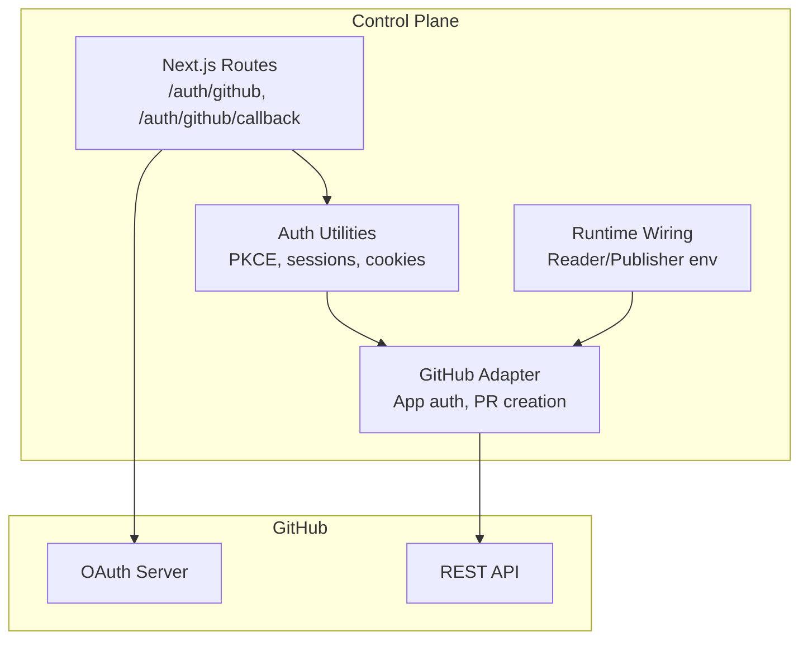
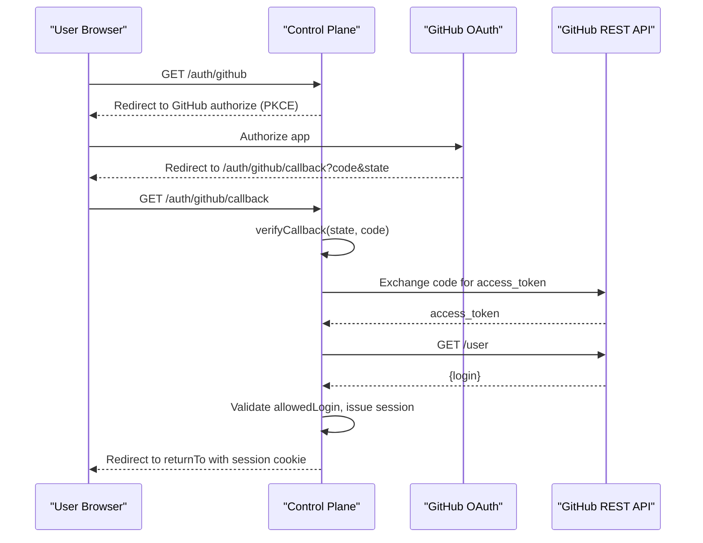
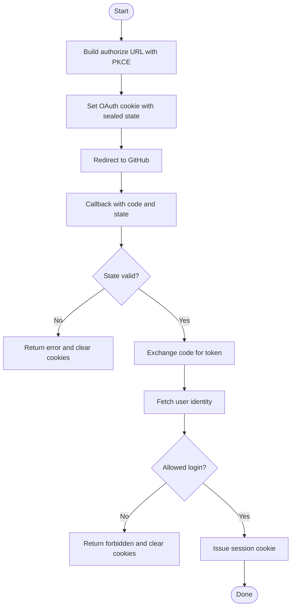
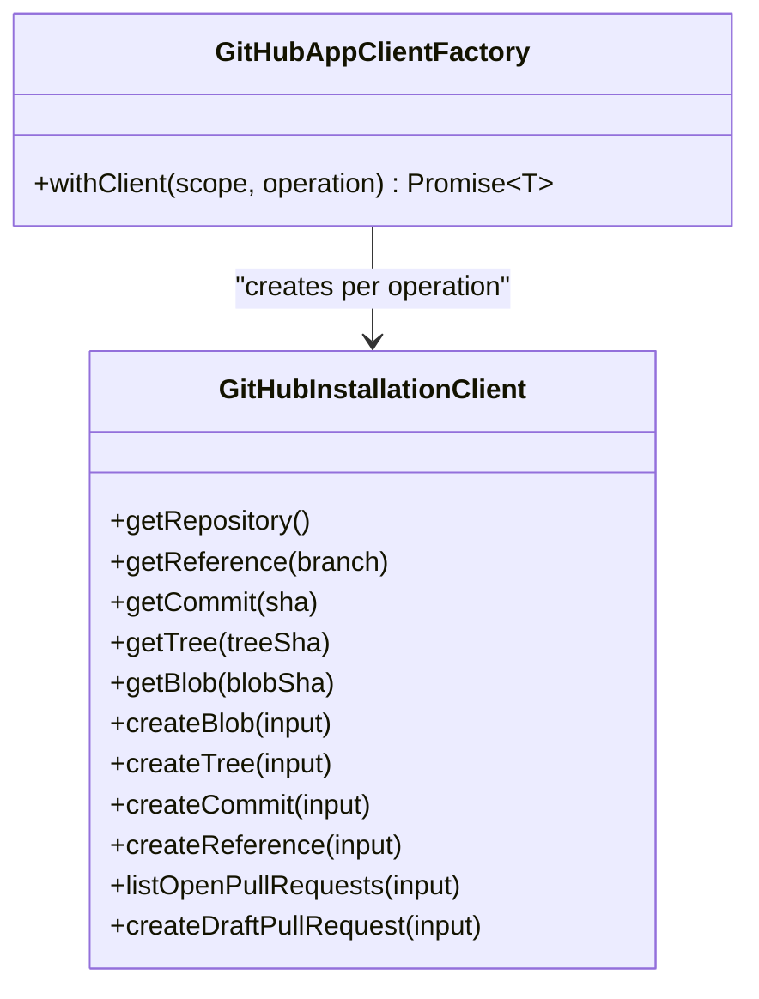
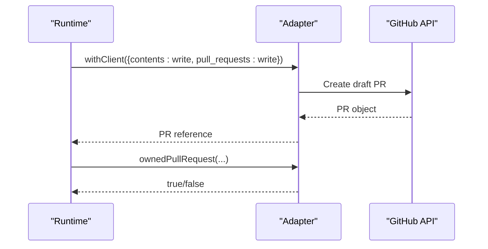
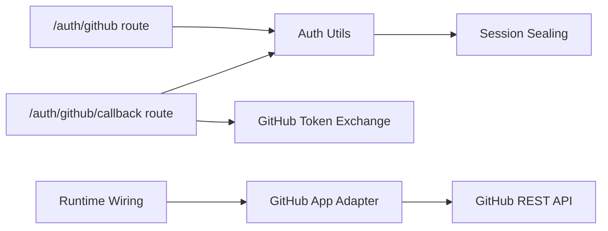

# GitHub Integration

<cite>
**Referenced Files in This Document**
- [route.ts](file://apps/control-plane/app/auth/github/route.ts)
- [callback route.ts](file://apps/control-plane/app/auth/github/callback/route.ts)
- [github.ts](file://apps/control-plane/src/auth/github.ts)
- [auth.ts](file://apps/control-plane/src/auth/auth.ts)
- [runtime.ts](file://apps/control-plane/src/application/runtime.ts)
- [github-app.ts](file://packages/adapters/src/github/github-app.ts)
- [publisher.ts](file://packages/adapters/src/github/publisher.ts)
- [agent-os.yaml](file://agentos/agent-os.yaml)
- [passerine.yaml](file://agentos/passerine.yaml)
</cite>

## Table of Contents
1. [Introduction](#introduction)
2. [Project Structure](#project-structure)
3. [Core Components](#core-components)
4. [Architecture Overview](#architecture-overview)
5. [Detailed Component Analysis](#detailed-component-analysis)
6. [Dependency Analysis](#dependency-analysis)
7. [Performance Considerations](#performance-considerations)
8. [Troubleshooting Guide](#troubleshooting-guide)
9. [Conclusion](#conclusion)
10. [Appendices](#appendices)

## Introduction
This document explains how Agent OS Passerine integrates with GitHub for two primary purposes:
- User authentication via GitHub OAuth to access the control plane UI and APIs.
- Automated repository operations using a GitHub App, including reading repository state and creating draft pull requests as part of automated workflows.

It covers configuration, environment variables, the OAuth flow (including PKCE), identity verification, GitHub App permissions, repository allowlisting, and operational considerations such as rate limiting and webhook delivery expectations.

## Project Structure
The GitHub integration spans several layers:
- Next.js routes handle user-facing OAuth flows.
- Auth utilities implement secure cookie handling, PKCE, session sealing, and callback verification.
- The GitHub adapter provides a hardened client for GitHub App installation tokens and repository operations.
- Runtime wiring configures trusted readers and publishers based on environment variables.
- Example project configurations demonstrate repository bindings and pipeline definitions.

**Diagram sources**
- [route.ts:12-26](file://apps/control-plane/app/auth/github/route.ts#L12-L26)
- [callback route.ts:25-55](file://apps/control-plane/app/auth/github/callback/route.ts#L25-L55)
- [auth.ts:239-315](file://apps/control-plane/src/auth/auth.ts#L239-L315)
- [github.ts:4-53](file://apps/control-plane/src/auth/github.ts#L4-L53)
- [github-app.ts:193-410](file://packages/adapters/src/github/github-app.ts#L193-L410)
- [runtime.ts:118-149](file://apps/control-plane/src/application/runtime.ts#L118-L149)

**Section sources**
- [route.ts:12-26](file://apps/control-plane/app/auth/github/route.ts#L12-L26)
- [callback route.ts:25-55](file://apps/control-plane/app/auth/github/callback/route.ts#L25-L55)
- [auth.ts:239-315](file://apps/control-plane/src/auth/auth.ts#L239-L315)
- [github.ts:4-53](file://apps/control-plane/src/auth/github.ts#L4-L53)
- [github-app.ts:193-410](file://packages/adapters/src/github/github-app.ts#L193-L410)
- [runtime.ts:118-149](file://apps/control-plane/src/application/runtime.ts#L118-L149)

## Core Components
- OAuth entry and callback routes:
  - Entry redirects users to GitHub with a PKCE challenge and sets a short-lived OAuth cookie.
  - Callback verifies state, exchanges code for an access token, retrieves user identity, validates allowed login, and issues a session cookie.
- Auth utilities:
  - Build authorization URLs with PKCE S256.
  - Seal/unseal state and sessions using AES-GCM with a per-deployment secret.
  - Enforce strict return-to URL sanitization and safe equality checks.
- GitHub App adapter:
  - Authenticates as a GitHub App installation with scoped permissions.
  - Provides read-only and write clients for repository operations, including listing and creating draft pull requests.
  - Validates responses and enforces timeouts and response size limits.
- Runtime configuration:
  - Requires separate reader and publisher GitHub Apps with distinct private keys and repository allowlists.
  - Ensures reader and publisher scopes are correctly paired and validated.

**Section sources**
- [route.ts:12-26](file://apps/control-plane/app/auth/github/route.ts#L12-L26)
- [callback route.ts:25-55](file://apps/control-plane/app/auth/github/callback/route.ts#L25-L55)
- [auth.ts:14-21](file://apps/control-plane/src/auth/auth.ts#L14-L21)
- [auth.ts:239-315](file://apps/control-plane/src/auth/auth.ts#L239-L315)
- [github.ts:4-53](file://apps/control-plane/src/auth/github.ts#L4-L53)
- [github-app.ts:96-144](file://packages/adapters/src/github/github-app.ts#L96-L144)
- [github-app.ts:193-410](file://packages/adapters/src/github/github-app.ts#L193-L410)
- [runtime.ts:118-149](file://apps/control-plane/src/application/runtime.ts#L118-L149)

## Architecture Overview
The system separates user authentication from automation:
- Users authenticate via GitHub OAuth to access the control plane.
- Automation uses a GitHub App with installation tokens scoped to specific repositories and permissions.

**Diagram sources**
- [route.ts:12-26](file://apps/control-plane/app/auth/github/route.ts#L12-L26)
- [callback route.ts:25-55](file://apps/control-plane/app/auth/github/callback/route.ts#L25-L55)
- [auth.ts:239-315](file://apps/control-plane/src/auth/auth.ts#L239-L315)
- [github.ts:4-53](file://apps/control-plane/src/auth/github.ts#L4-L53)

## Detailed Component Analysis

### OAuth Authentication Flow
- Authorization request:
  - Generates state and PKCE verifier, builds GitHub authorize URL with redirect_uri and scope read:user, and stores sealed state in a secure cookie.
- Callback verification:
  - Validates state and code, exchanges code for token, fetches user identity, ensures login matches allowed value, and issues a session cookie.

**Diagram sources**
- [auth.ts:239-315](file://apps/control-plane/src/auth/auth.ts#L239-L315)
- [callback route.ts:25-55](file://apps/control-plane/app/auth/github/callback/route.ts#L25-L55)
- [route.ts:12-26](file://apps/control-plane/app/auth/github/route.ts#L12-L26)

**Section sources**
- [auth.ts:239-315](file://apps/control-plane/src/auth/auth.ts#L239-L315)
- [callback route.ts:25-55](file://apps/control-plane/app/auth/github/callback/route.ts#L25-L55)
- [route.ts:12-26](file://apps/control-plane/app/auth/github/route.ts#L12-L26)

### GitHub App Client and Repository Operations
- Installation authentication:
  - Uses GitHub App credentials to obtain installation tokens with explicit permissions (read or write).
  - Verifies token type, expiration, repository selection, and permission levels.
- Repository client:
  - Provides methods to get repository metadata, references, commits, trees, blobs, create blobs/trees/commits/refs, list open pull requests, and create draft pull requests.
  - Enforces timeouts, bounded response sizes, and strict parsing.

**Diagram sources**
- [github-app.ts:193-410](file://packages/adapters/src/github/github-app.ts#L193-L410)
- [github-app.ts:413-480](file://packages/adapters/src/github/github-app.ts#L413-L480)

**Section sources**
- [github-app.ts:96-144](file://packages/adapters/src/github/github-app.ts#L96-L144)
- [github-app.ts:193-410](file://packages/adapters/src/github/github-app.ts#L193-L410)
- [github-app.ts:413-480](file://packages/adapters/src/github/github-app.ts#L413-L480)

### Automated Pull Request Creation Workflow
- Draft PR creation:
  - The adapter creates draft pull requests with strict validation of head/base refs and repository IDs.
- Ownership checks:
  - Helpers validate that created PRs match expected attributes (branch, base, SHA, title/body markers) to ensure automation integrity.

**Diagram sources**
- [github-app.ts:394-408](file://packages/adapters/src/github/github-app.ts#L394-L408)
- [publisher.ts:270-296](file://packages/adapters/src/github/publisher.ts#L270-L296)

**Section sources**
- [github-app.ts:394-408](file://packages/adapters/src/github/github-app.ts#L394-L408)
- [publisher.ts:270-296](file://packages/adapters/src/github/publisher.ts#L270-L296)

### Environment Configuration and Setup
- OAuth environment variables:
  - AGENTOS_PUBLIC_URL: Must be absolute HTTP(S); HTTPS required in production.
  - AGENTOS_SESSION_SECRET: Required except local development bypass; minimum length enforced.
  - GITHUB_CLIENT_ID, GITHUB_CLIENT_SECRET: Required except local development bypass.
  - GITHUB_ALLOWED_LOGIN: Required except local development bypass; used to restrict who can log in.
  - Optional AGENTOS_CLI_TOKEN for CLI usage.
- GitHub App runtime variables:
  - GITHUB_APP_ID and GITHUB_READER_APP_ID: Separate apps for write and read operations.
  - GITHUB_SELECTED_REPOSITORIES_JSON and GITHUB_READER_SELECTED_REPOSITORIES_JSON: Allowlists for repository binding.
  - GITHUB_READER_APP_PRIVATE_KEY: Private key for the read-only app.
- Example project files:
  - agent-os.yaml and passerine.yaml show repository defaults, default branches, and pipeline steps.

**Section sources**
- [auth.ts:73-157](file://apps/control-plane/src/auth/auth.ts#L73-L157)
- [runtime.ts:118-149](file://apps/control-plane/src/application/runtime.ts#L118-L149)
- [agent-os.yaml:1-61](file://agentos/agent-os.yaml#L1-L61)
- [passerine.yaml:1-252](file://agentos/passerine.yaml#L1-L252)

## Dependency Analysis
- OAuth routes depend on auth utilities for PKCE, cookie management, and session issuance.
- Auth callback depends on GitHub token exchange and identity lookup.
- Runtime wiring depends on GitHub App credentials and repository allowlists to construct trusted readers and publishers.
- Adapter depends on Octokit’s app authentication and performs strict validation of tokens and responses.

**Diagram sources**
- [route.ts:12-26](file://apps/control-plane/app/auth/github/route.ts#L12-L26)
- [callback route.ts:25-55](file://apps/control-plane/app/auth/github/callback/route.ts#L25-L55)
- [auth.ts:239-315](file://apps/control-plane/src/auth/auth.ts#L239-L315)
- [github.ts:4-53](file://apps/control-plane/src/auth/github.ts#L4-L53)
- [runtime.ts:118-149](file://apps/control-plane/src/application/runtime.ts#L118-L149)
- [github-app.ts:193-410](file://packages/adapters/src/github/github-app.ts#L193-L410)

**Section sources**
- [route.ts:12-26](file://apps/control-plane/app/auth/github/route.ts#L12-L26)
- [callback route.ts:25-55](file://apps/control-plane/app/auth/github/callback/route.ts#L25-L55)
- [auth.ts:239-315](file://apps/control-plane/src/auth/auth.ts#L239-L315)
- [github.ts:4-53](file://apps/control-plane/src/auth/github.ts#L4-L53)
- [runtime.ts:118-149](file://apps/control-plane/src/application/runtime.ts#L118-L149)
- [github-app.ts:193-410](file://packages/adapters/src/github/github-app.ts#L193-L410)

## Performance Considerations
- Network timeouts:
  - Adapter enforces a per-request timeout to avoid hanging calls to GitHub.
- Response size limits:
  - Adapter bounds response payloads to prevent memory exhaustion.
- Rate limiting:
  - GitHub imposes rate limits on both OAuth and REST API endpoints. Implement retries with backoff where appropriate and monitor usage.
- Cookie lifetimes:
  - OAuth state is short-lived; sessions have a fixed TTL to limit exposure.

[No sources needed since this section provides general guidance]

## Troubleshooting Guide
Common issues and resolutions:
- OAuth failures:
  - Missing or invalid state/code: Ensure redirect_uri matches configured values and that the OAuth cookie is present and not expired.
  - Login not allowed: Verify GITHUB_ALLOWED_LOGIN matches the authenticating user.
  - Errors during token exchange or identity lookup: Check network connectivity and GitHub status; review error codes returned by GitHub.
- GitHub App authentication:
  - Invalid or expired installation token: Confirm GITHUB_APP_ID and GITHUB_READER_APP_ID point to correct apps and that private keys are valid PEM format.
  - Permission mismatch: Ensure requested permissions (contents, pull_requests) match what the app has been granted on the target repository.
  - Repository selection: Verify selected repositories lists include the intended repositories and that reader/publisher pairings are valid.
- Webhook delivery:
  - This codebase does not implement webhook handlers for pull request or issue events. If webhooks are added later, ensure endpoint signatures are verified and payloads are validated before processing.
- Local development:
  - On localhost, OAuth client ID/secret and allowed login can use defaults; ensure AGENTOS_PUBLIC_URL points to your local server and that cookies are accepted.

**Section sources**
- [auth.ts:239-315](file://apps/control-plane/src/auth/auth.ts#L239-L315)
- [github.ts:4-53](file://apps/control-plane/src/auth/github.ts#L4-L53)
- [github-app.ts:96-144](file://packages/adapters/src/github/github-app.ts#L96-L144)
- [runtime.ts:118-149](file://apps/control-plane/src/application/runtime.ts#L118-L149)

## Conclusion
Agent OS Passerine implements a secure, minimal GitHub integration:
- OAuth with PKCE and strict session handling for user access.
- A hardened GitHub App client for automated repository operations, including draft PR creation.
- Clear separation between user authentication and automation via distinct environments and permissions.
Proper configuration of environment variables, repository allowlists, and GitHub App permissions is essential for reliable operation. Monitoring rate limits and validating inputs will help maintain robustness.

[No sources needed since this section summarizes without analyzing specific files]

## Appendices

### Environment Variables Reference
- OAuth:
  - AGENTOS_PUBLIC_URL: Absolute HTTP(S) URL for the control plane.
  - AGENTOS_SESSION_SECRET: Strong secret for session sealing.
  - GITHUB_CLIENT_ID, GITHUB_CLIENT_SECRET: OAuth app credentials.
  - GITHUB_ALLOWED_LOGIN: Single allowed GitHub login for access.
  - AGENTOS_CLI_TOKEN: Optional CLI token.
- GitHub App:
  - GITHUB_APP_ID, GITHUB_READER_APP_ID: Separate apps for write and read.
  - GITHUB_SELECTED_REPOSITORIES_JSON, GITHUB_READER_SELECTED_REPOSITORIES_JSON: JSON arrays of repository identifiers.
  - GITHUB_READER_APP_PRIVATE_KEY: PEM private key for the read-only app.

**Section sources**
- [auth.ts:73-157](file://apps/control-plane/src/auth/auth.ts#L73-L157)
- [runtime.ts:118-149](file://apps/control-plane/src/application/runtime.ts#L118-L149)

### Example Project Configurations
- agent-os.yaml: Demonstrates project name, default branch, model settings, agents, pipelines, policies, budgets, goals, and runtime provider.
- passerine.yaml: Demonstrates repository binding, default branch, multi-agent pipeline steps, and environment/networking settings.

**Section sources**
- [agent-os.yaml:1-61](file://agentos/agent-os.yaml#L1-L61)
- [passerine.yaml:1-252](file://agentos/passerine.yaml#L1-L252)