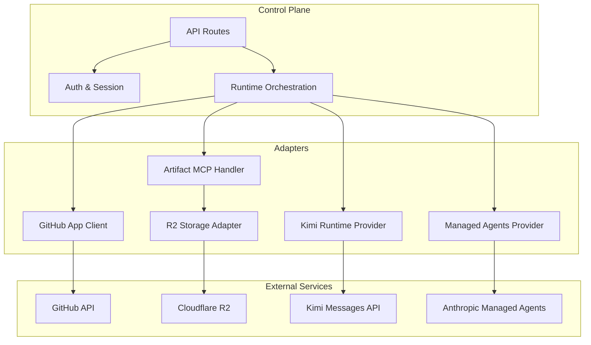
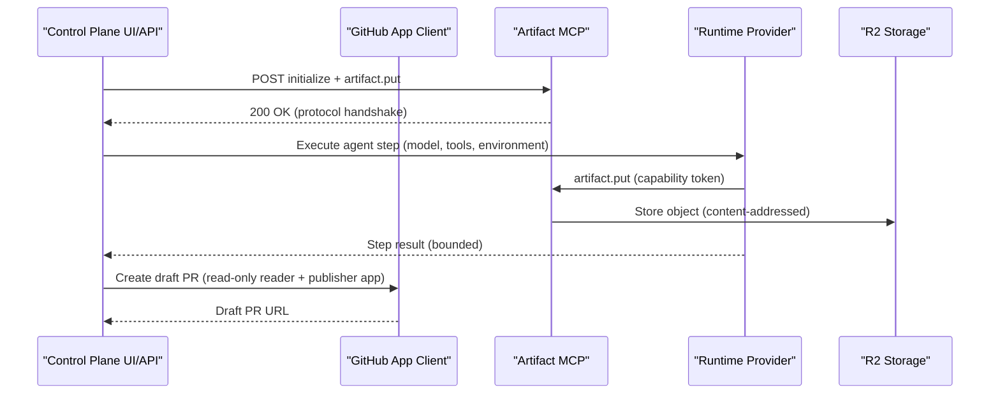
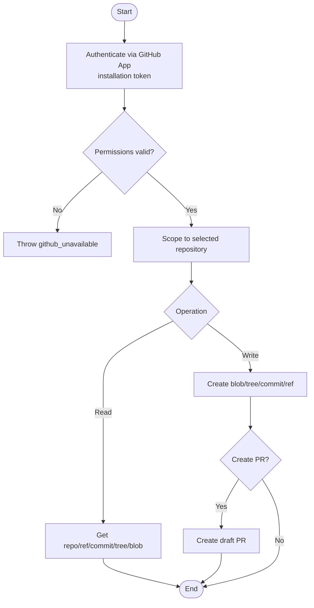
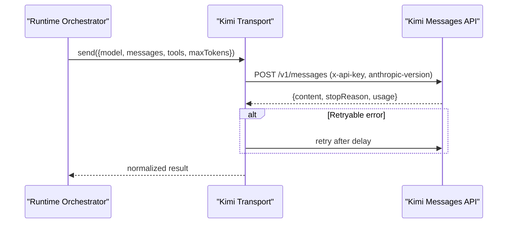
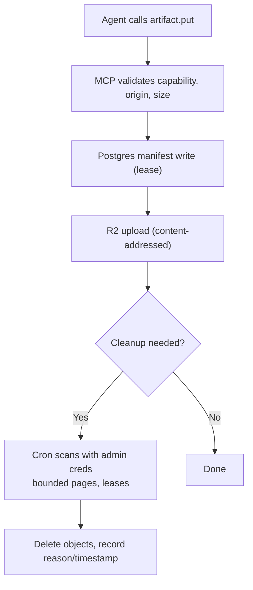
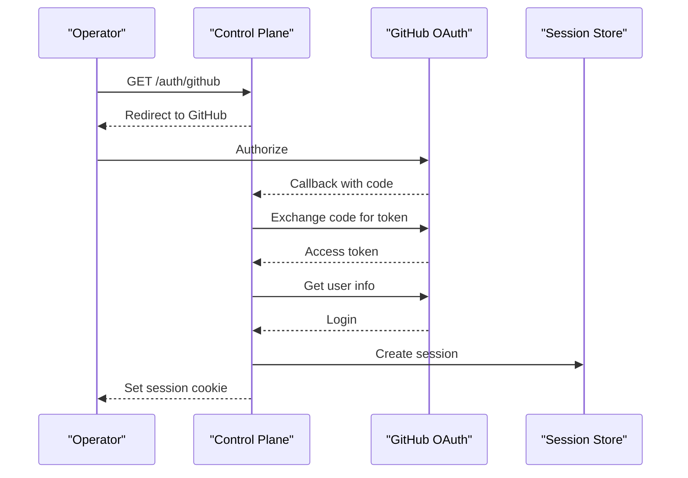
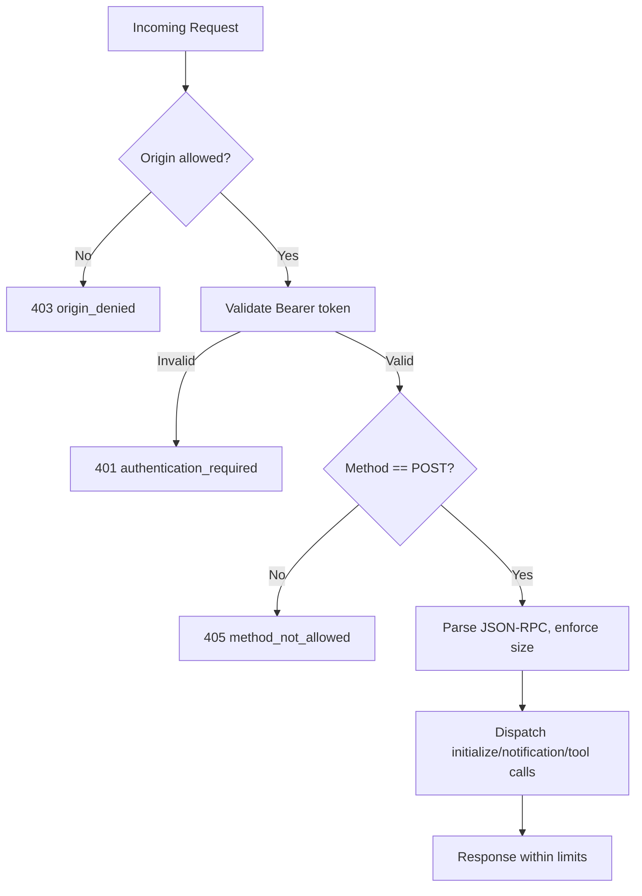
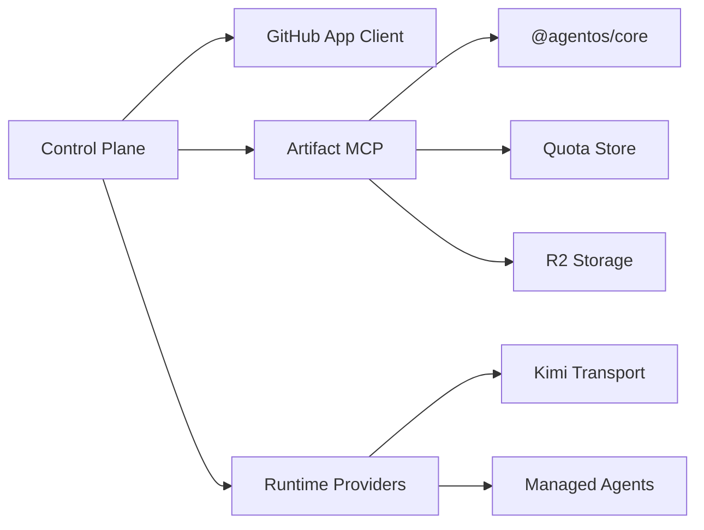

# Integrations

<cite>
**Referenced Files in This Document**
- [README.md](file://README.md)
- [passerine.yaml](file://agentos/passerine.yaml)
- [github-app.ts](file://packages/adapters/src/github/github-app.ts)
- [repository-allowlist.ts](file://packages/adapters/src/github/repository-allowlist.ts)
- [artifact-storage.md](file://docs/architecture/artifact-storage.md)
- [kimi-runtime.md](file://docs/architecture/kimi-runtime.md)
- [transport.ts](file://packages/adapters/src/kimi/transport.ts)
- [loop.test.ts](file://packages/adapters/src/kimi/loop.test.ts)
- [mcp.ts](file://packages/adapters/src/artifacts/mcp.ts)
- [artifact-mcp-route.test.ts](file://apps/control-plane/src/http/artifact-mcp-route.test.ts)
- [artifact-cleanup-runtime.ts](file://apps/control-plane/src/application/artifact-cleanup-runtime.ts)
- [r2-artifact-smoke.mjs](file://packages/adapters/scripts/r2-artifact-smoke.mjs)
- [auth.ts](file://apps/control-plane/src/auth/auth.ts)
- [github.ts](file://apps/control-plane/src/auth/github.ts)
- [api.ts](file://apps/control-plane/src/http/api.ts)
</cite>

## Table of Contents
1. Introduction
2. Project Structure
3. Core Components
4. Architecture Overview
5. Detailed Component Analysis
6. Dependency Analysis
7. Performance Considerations
8. Troubleshooting Guide
9. Conclusion

## Introduction
This document explains the integrations used by Agent OS Passerine, focusing on:
- GitHub App integration for repository access, webhook handling, and draft pull request creation
- AI model provider integrations supporting multiple providers (Anthropic Managed Agents and Kimi)
- Artifact storage with Cloudflare R2 and local storage options
- External service adapters, webhooks, and MCP (Model Context Protocol) server integration
- Configuration requirements, authentication methods, and troubleshooting guidance for each integration point

## Project Structure
Agent OS Passerine is a single-operator, GitHub-focused semi-autonomous build system that turns feature requests into reviewed artifacts and tested draft pull requests while keeping approvals, budgets, credentials, and publication authority outside model sessions. It supports both local experimentation and full-stack production deployments using Postgres, Trigger.dev, Managed Agents, Cloudflare R2, and GitHub Apps.

Key areas relevant to this document:
- Control plane application routes and services under apps/control-plane
- Adapters for GitHub, artifact storage, and model runtimes under packages/adapters
- Configuration and workflow definitions under agentos
- Documentation describing artifact storage and runtime providers

**Diagram sources**
- [github-app.ts:193-443](file://packages/adapters/src/github/github-app.ts#L193-L443)
- [mcp.ts:1-665](file://packages/adapters/src/artifacts/mcp.ts#L1-L665)
- [transport.ts:120-175](file://packages/adapters/src/kimi/transport.ts#L120-L175)
- [artifact-storage.md:1-42](file://docs/architecture/artifact-storage.md#L1-L42)

**Section sources**
- [README.md:1-67](file://README.md#L1-L67)

## Core Components
- GitHub App client: Provides read-only and write-capable clients scoped to selected repositories with strict permission validation and bounded responses.
- Artifact MCP handler: Stateless JSON-RPC endpoint exposing artifact.get, artifact.put, artifact.list with capability-based authorization, origin checks, and size limits.
- Model runtime providers:
  - Managed Agents provider for Anthropic-backed agents
  - Kimi runtime provider implementing an agent loop against Moonshot’s Anthropic-compatible Messages API
- Artifact storage: Postgres-backed manifest with content-addressed objects stored in Cloudflare R2; retention cleanup via cron with separate admin credentials.

Configuration highlights:
- Environment variables drive GitHub OAuth, CLI token, repository bindings, R2 credentials, and model keys
- Workflow definitions specify agents, models, environments, tools, MCPs, policies, budgets, and goals

**Section sources**
- [github-app.ts:96-143](file://packages/adapters/src/github/github-app.ts#L96-L143)
- [mcp.ts:17-34](file://packages/adapters/src/artifacts/mcp.ts#L17-L34)
- [kimi-runtime.md:1-32](file://docs/architecture/kimi-runtime.md#L1-L32)
- [artifact-storage.md:1-42](file://docs/architecture/artifact-storage.md#L1-L42)
- [passerine.yaml:6-252](file://agentos/passerine.yaml#L6-L252)

## Architecture Overview
The control plane orchestrates workflows by invoking adapters:
- GitHub App adapter authenticates per installation and enforces minimal permissions
- Artifact MCP provides secure, capability-scoped access to artifacts for agents
- Model runtime providers execute agent loops with bounded tool calls and transport retries
- Artifact storage persists manifests in Postgres and bodies in R2 with retention policies

**Diagram sources**
- [mcp.ts:617-665](file://packages/adapters/src/artifacts/mcp.ts#L617-L665)
- [github-app.ts:394-408](file://packages/adapters/src/github/github-app.ts#L394-L408)
- [artifact-storage.md:1-42](file://docs/architecture/artifact-storage.md#L1-L42)
- [kimi-runtime.md:13-32](file://docs/architecture/kimi-runtime.md#L13-L32)

## Detailed Component Analysis

### GitHub App Integration
Responsibilities:
- Authenticate via GitHub App installation tokens with strict scope validation
- Provide read-only and write clients scoped to selected repositories
- Enforce response size limits and safe parsing of GitHub API responses
- Support listing open pull requests and creating draft pull requests

Permissions and security:
- Only permitted permissions are accepted (contents, pull_requests, metadata)
- Installation must be selected for exactly one repository ID
- Tokens are validated for type, expiration, and length constraints

Repository allowlist:
- Parses and validates repository bindings from environment
- Ensures reader and publisher allowlists match pairwise
- Derives owner/name from repository URLs safely

PR creation workflow:
- Uses write client to create draft pull requests with validated fields
- Lists existing open PRs for a head/base pair

**Diagram sources**
- [github-app.ts:96-143](file://packages/adapters/src/github/github-app.ts#L96-L143)
- [github-app.ts:193-408](file://packages/adapters/src/github/github-app.ts#L193-L408)
- [repository-allowlist.ts:1-65](file://packages/adapters/src/github/repository-allowlist.ts#L1-L65)

**Section sources**
- [github-app.ts:96-143](file://packages/adapters/src/github/github-app.ts#L96-L143)
- [github-app.ts:193-408](file://packages/adapters/src/github/github-app.ts#L193-L408)
- [repository-allowlist.ts:1-65](file://packages/adapters/src/github/repository-allowlist.ts#L1-L65)

### AI Model Provider Integrations
Supported providers:
- Anthropic Managed Agents: default provider for running agents with bounded tool execution and usage tracking
- Kimi (Moonshot): self-hosted runtime provider using Anthropic-compatible Messages API

Kimi runtime specifics:
- Transport posts to /v1/messages with x-api-key and anthropic-version headers
- Strictly validates content blocks (text, tool_use, tool_result, thinking)
- Retries once on 429/5xx with fixed delay
- Agent loop drives tool use until submit_result or max turns reached

Configuration:
- Model profiles define provider, model name, and pricing metadata
- Routing selects runtime by model profile provider

**Diagram sources**
- [transport.ts:120-175](file://packages/adapters/src/kimi/transport.ts#L120-L175)
- [loop.test.ts:528-644](file://packages/adapters/src/kimi/loop.test.ts#L528-L644)
- [kimi-runtime.md:13-32](file://docs/architecture/kimi-runtime.md#L13-L32)
- [passerine.yaml:6-15](file://agentos/passerine.yaml#L6-L15)

**Section sources**
- [kimi-runtime.md:1-32](file://docs/architecture/kimi-runtime.md#L1-L32)
- [transport.ts:120-175](file://packages/adapters/src/kimi/transport.ts#L120-L175)
- [loop.test.ts:528-644](file://packages/adapters/src/kimi/loop.test.ts#L528-L644)
- [passerine.yaml:6-15](file://agentos/passerine.yaml#L6-L15)

### Artifact Storage Integration (Cloudflare R2 and Local Options)
Design principles:
- Postgres is the authoritative logical-version manifest
- R2 stores content-addressed objects; collisions reconciled by recomputing SHA-256
- MCP surface caps artifact and request/response sizes
- Retention cleanup uses separate admin credentials and bounded pages

Operational details:
- Agent-facing MCP exposes artifact.get, artifact.put, artifact.list
- Cleanup runs via Vercel cron with lease management and abort safety
- Jurisdiction selection supported for R2 endpoints

Local storage options:
- In-memory artifact manifest store used for smoke tests and local experiments
- Repository can be set to memory for local development without cloud accounts

**Diagram sources**
- [artifact-storage.md:1-42](file://docs/architecture/artifact-storage.md#L1-L42)
- [artifact-cleanup-runtime.ts:19-60](file://apps/control-plane/src/application/artifact-cleanup-runtime.ts#L19-L60)
- [r2-artifact-smoke.mjs:1-45](file://packages/adapters/scripts/r2-artifact-smoke.mjs#L1-L45)

**Section sources**
- [artifact-storage.md:1-42](file://docs/architecture/artifact-storage.md#L1-L42)
- [artifact-cleanup-runtime.ts:19-60](file://apps/control-plane/src/application/artifact-cleanup-runtime.ts#L19-L60)
- [r2-artifact-smoke.mjs:1-45](file://packages/adapters/scripts/r2-artifact-smoke.mjs#L1-L45)

### External Service Adapters and Webhook Handling
- GitHub App adapter abstracts GitHub API interactions with strict validation and timeouts
- Repository allowlist ensures only configured repositories are accessible
- Control plane routes expose setup and configuration endpoints; webhook handling is typically managed by GitHub App event routing to the control plane or background workers (Trigger.dev tasks)

Authentication and session:
- GitHub OAuth flow exchanges code for access token and retrieves user identity
- Local development provides safe zero-config defaults for localhost
- CLI token enables programmatic access

**Diagram sources**
- [github.ts:4-53](file://apps/control-plane/src/auth/github.ts#L4-L53)
- [auth.ts:135-179](file://apps/control-plane/src/auth/auth.ts#L135-L179)

**Section sources**
- [github-app.ts:193-408](file://packages/adapters/src/github/github-app.ts#L193-L408)
- [repository-allowlist.ts:1-65](file://packages/adapters/src/github/repository-allowlist.ts#L1-L65)
- [github.ts:4-53](file://apps/control-plane/src/auth/github.ts#L4-L53)
- [auth.ts:135-179](file://apps/control-plane/src/auth/auth.ts#L135-L179)

### MCP (Model Context Protocol) Server Integration
Capabilities:
- Stateless JSON-RPC over HTTP with initialize and notifications
- Capability-based authorization via short-lived HMAC tokens bound to purpose, audience, method, project, run, step, optional prefix, byte/call limits, expiry, nonce
- Origin allowlisting and bearer token enforcement
- Size limits for requests and responses

Route behavior:
- POST only; GET disabled with appropriate Allow header
- Delegates to isolated handler without normal API authentication

**Diagram sources**
- [mcp.ts:122-170](file://packages/adapters/src/artifacts/mcp.ts#L122-L170)
- [mcp.ts:617-665](file://packages/adapters/src/artifacts/mcp.ts#L617-L665)
- [artifact-mcp-route.test.ts:1-27](file://apps/control-plane/src/http/artifact-mcp-route.test.ts#L1-L27)

**Section sources**
- [mcp.ts:17-34](file://packages/adapters/src/artifacts/mcp.ts#L17-L34)
- [mcp.ts:122-170](file://packages/adapters/src/artifacts/mcp.ts#L122-L170)
- [mcp.ts:617-665](file://packages/adapters/src/artifacts/mcp.ts#L617-L665)
- [artifact-mcp-route.test.ts:1-27](file://apps/control-plane/src/http/artifact-mcp-route.test.ts#L1-L27)

## Dependency Analysis
Key dependencies and relationships:
- Control plane depends on adapters for GitHub, artifact MCP, and runtime providers
- Artifact MCP depends on core capabilities and quota stores
- Kimi transport depends on fetch and strict schema validation
- R2 storage depends on account/bucket/jurisdiction and credential separation

**Diagram sources**
- [mcp.ts:1-34](file://packages/adapters/src/artifacts/mcp.ts#L1-L34)
- [transport.ts:120-175](file://packages/adapters/src/kimi/transport.ts#L120-L175)
- [artifact-cleanup-runtime.ts:1-60](file://apps/control-plane/src/application/artifact-cleanup-runtime.ts#L1-L60)

**Section sources**
- [mcp.ts:1-34](file://packages/adapters/src/artifacts/mcp.ts#L1-L34)
- [transport.ts:120-175](file://packages/adapters/src/kimi/transport.ts#L120-L175)
- [artifact-cleanup-runtime.ts:1-60](file://apps/control-plane/src/application/artifact-cleanup-runtime.ts#L1-L60)

## Performance Considerations
- Response size limits protect against large payloads in GitHub and MCP paths
- Kimi transport retries once on transient errors to improve resilience
- Artifact cleanup uses bounded pages and leases to avoid long-running operations
- Model loops enforce turn limits and output bounds to prevent runaway sessions

[No sources needed since this section provides general guidance]

## Troubleshooting Guide
Common issues and resolutions:
- GitHub App authentication failures: verify installation token, permissions, and repository selection
- Repository mismatch: ensure reader and publisher allowlists match pairwise and repository URLs are valid
- R2 credential errors: confirm account, bucket, jurisdiction, and separate admin vs agent credentials
- MCP origin or capability errors: check allowed origins and capability token validity
- Kimi transport errors: validate API key, base URL, and response schema; inspect retry behavior

Configuration references:
- Environment variables for GitHub OAuth, CLI token, repository bindings, R2 credentials, and model keys
- Workflow definitions for agents, models, environments, tools, MCPs, policies, budgets, and goals

**Section sources**
- [github-app.ts:96-143](file://packages/adapters/src/github/github-app.ts#L96-L143)
- [repository-allowlist.ts:1-65](file://packages/adapters/src/github/repository-allowlist.ts#L1-L65)
- [artifact-cleanup-runtime.ts:19-60](file://apps/control-plane/src/application/artifact-cleanup-runtime.ts#L19-L60)
- [mcp.ts:122-170](file://packages/adapters/src/artifacts/mcp.ts#L122-L170)
- [transport.ts:120-175](file://packages/adapters/src/kimi/transport.ts#L120-L175)
- [passerine.yaml:6-252](file://agentos/passerine.yaml#L6-L252)

## Conclusion
Agent OS Passerine integrates GitHub Apps, multiple AI model providers, and robust artifact storage to deliver a secure, auditable, and operator-controlled automation pipeline. The adapters enforce strict boundaries, the MCP surface provides capability-scoped artifact access, and the runtime providers execute agents with bounded resources. Proper configuration of environment variables and careful credential management are essential for reliable operation across local and production environments.

[No sources needed since this section summarizes without analyzing specific files]