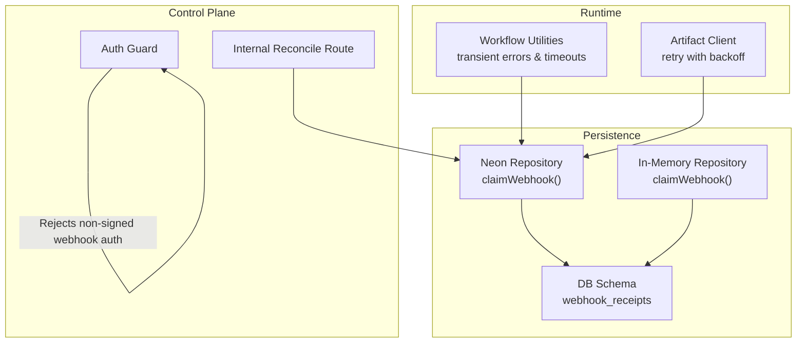
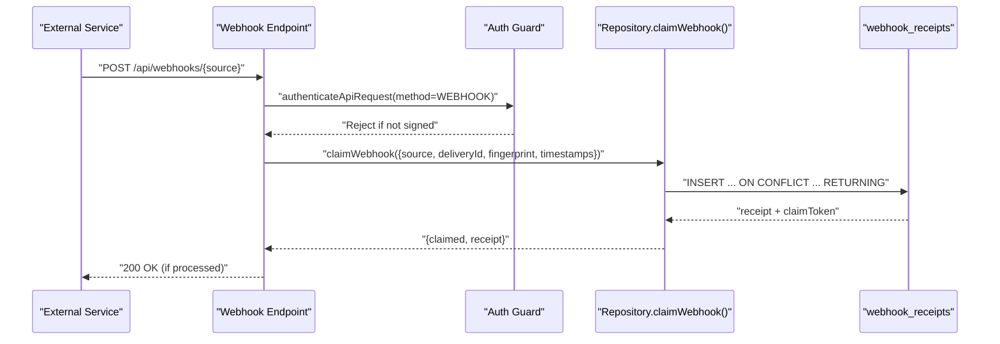
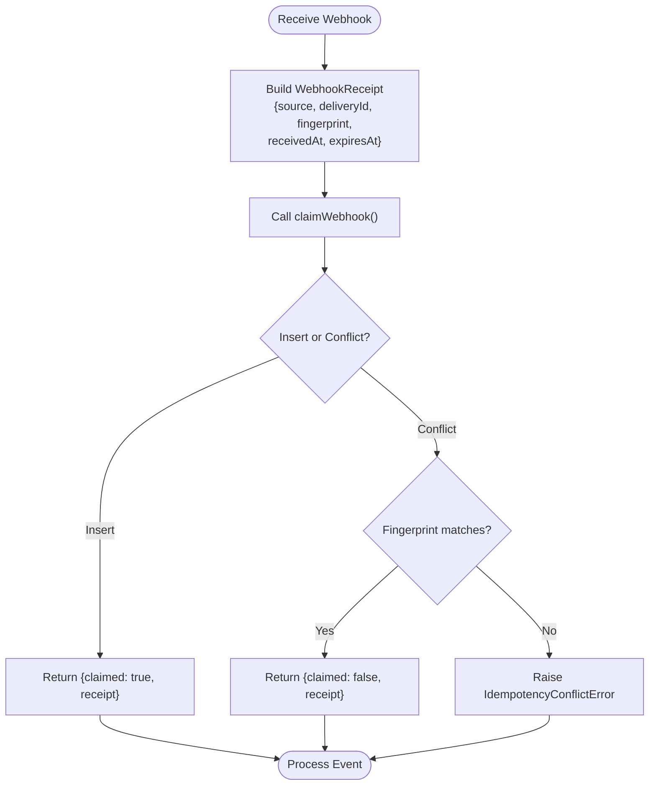
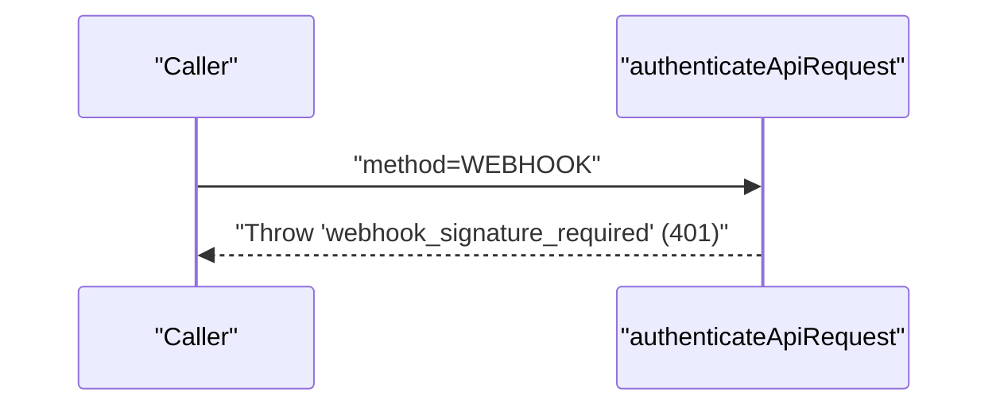
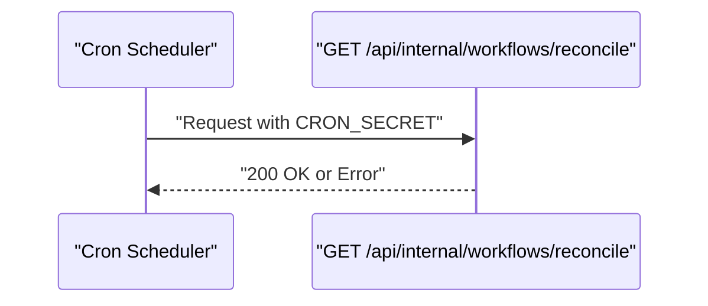
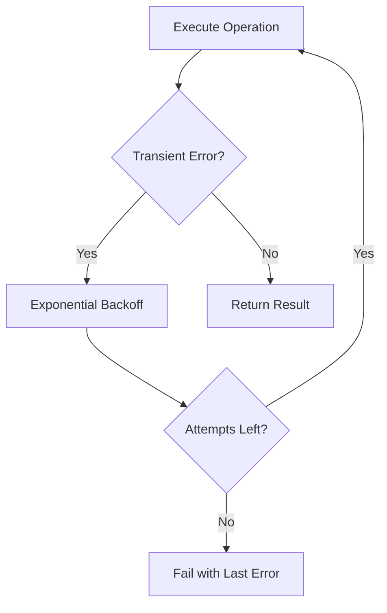
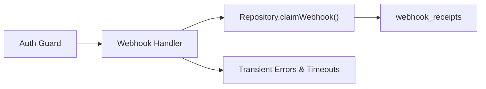

# Webhook Handling

<cite>
**Referenced Files in This Document**
- [neon-repository.ts](file://packages/adapters/src/persistence/neon-repository.ts)
- [in-memory.ts](file://packages/adapters/src/persistence/in-memory.ts)
- [0008_snapshot.json](file://drizzle/meta/0008_snapshot.json)
- [0009_snapshot.json](file://drizzle/meta/0009_snapshot.json)
- [guard.ts](file://apps/control-plane/src/auth/guard.ts)
- [route.ts (internal workflows reconcile)](file://apps/control-plane/app/api/internal/workflows/reconcile/route.ts)
- [workflow.ts](file://packages/adapters/src/trigger/workflow.ts)
- [r2.ts](file://packages/adapters/src/artifacts/r2.ts)
</cite>

## Table of Contents
1. Introduction
2. Project Structure
3. Core Components
4. Architecture Overview
5. Detailed Component Analysis
6. Dependency Analysis
7. Performance Considerations
8. Troubleshooting Guide
9. Conclusion

## Introduction
This document explains how the system handles webhooks and integrates with external services. It covers supported webhook formats, payload validation, event processing workflows, endpoint configuration, retry logic, error handling, security considerations, and troubleshooting for delivery failures, parsing errors, and timeouts. The focus is on the webhook receipt idempotency layer, authentication guard behavior for webhook endpoints, and the runtime’s retry and timeout mechanisms that underpin reliable event processing.

## Project Structure
Webhook-related capabilities are implemented across:
- Persistence layer: idempotent webhook receipt claiming to prevent duplicate processing
- Authentication guard: enforces that webhook requests require signature verification
- Internal routes: cron-triggered reconciliation used by internal automation
- Runtime utilities: transient error classification and retries with exponential backoff
- Database schema: webhook receipts table with expiry index for cleanup

**Diagram sources**
- [neon-repository.ts:1673-1697](file://packages/adapters/src/persistence/neon-repository.ts#L1673-L1697)
- [in-memory.ts:1477-1493](file://packages/adapters/src/persistence/in-memory.ts#L1477-L1493)
- [0008_snapshot.json:1832-1882](file://drizzle/meta/0008_snapshot.json#L1832-L1882)
- [0009_snapshot.json:2094-2147](file://drizzle/meta/0009_snapshot.json#L2094-L2147)
- [guard.ts:33-61](file://apps/control-plane/src/auth/guard.ts#L33-L61)
- [workflow.ts:434-487](file://packages/adapters/src/trigger/workflow.ts#L434-L487)
- [r2.ts:391-421](file://packages/adapters/src/artifacts/r2.ts#L391-L421)

**Section sources**
- [neon-repository.ts:1673-1697](file://packages/adapters/src/persistence/neon-repository.ts#L1673-L1697)
- [in-memory.ts:1477-1493](file://packages/adapters/src/persistence/in-memory.ts#L1477-L1493)
- [0008_snapshot.json:1832-1882](file://drizzle/meta/0008_snapshot.json#L1832-L1882)
- [0009_snapshot.json:2094-2147](file://drizzle/meta/0009_snapshot.json#L2094-L2147)
- [guard.ts:33-61](file://apps/control-plane/src/auth/guard.ts#L33-L61)
- [workflow.ts:434-487](file://packages/adapters/src/trigger/workflow.ts#L434-L487)
- [r2.ts:391-421](file://packages/adapters/src/artifacts/r2.ts#L391-L421)

## Core Components
- Webhook receipt idempotency:
  - claimWebhook inserts or updates a receipt keyed by source and deliveryId, returning whether it was claimed by this caller. It validates fingerprint consistency to detect tampering or mismatched payloads.
  - Implemented in both Neon and in-memory repositories; tests demonstrate single-statement deduplication and replay detection.
- Authentication guard:
  - When method is WEBHOOK, standard session or CLI bearer tokens are rejected; webhook endpoints must use signature verification instead.
- Internal reconciliation route:
  - Exposes an internal GET endpoint protected by a secret, suitable for cron-driven reconciliation tasks.
- Runtime transient error handling and retries:
  - Classifies network and provider errors as transient and wraps operations with timeouts.
  - Artifact client retries transient failures with exponential backoff and respects abort signals.

**Section sources**
- [neon-repository.ts:1673-1697](file://packages/adapters/src/persistence/neon-repository.ts#L1673-L1697)
- [in-memory.ts:1477-1493](file://packages/adapters/src/persistence/in-memory.ts#L1477-L1493)
- [guard.ts:33-61](file://apps/control-plane/src/auth/guard.ts#L33-L61)
- [route.ts (internal workflows reconcile):7-11](file://apps/control-plane/app/api/internal/workflows/reconcile/route.ts#L7-L11)
- [workflow.ts:434-487](file://packages/adapters/src/trigger/workflow.ts#L434-L487)
- [r2.ts:391-421](file://packages/adapters/src/artifacts/r2.ts#L391-L421)

## Architecture Overview
The webhook flow centers on idempotent receipt handling and secure request validation. External services deliver events to configured endpoints. Each delivery is recorded once per source and deliveryId. Subsequent deliveries with the same key are ignored unless fingerprints differ, which indicates a payload change and triggers conflict handling.

**Diagram sources**
- [guard.ts:33-61](file://apps/control-plane/src/auth/guard.ts#L33-L61)
- [neon-repository.ts:1673-1697](file://packages/adapters/src/persistence/neon-repository.ts#L1673-L1697)
- [0008_snapshot.json:1832-1882](file://drizzle/meta/0008_snapshot.json#L1832-L1882)

## Detailed Component Analysis

### Webhook Receipt Idempotency
- Purpose: Ensure each webhook delivery is processed at most once per source and deliveryId, even under retries or concurrent calls.
- Key behaviors:
  - Inserts a receipt with a generated claim token; on conflict, updates fingerprint and returns existing data.
  - Validates stored fingerprint against incoming fingerprint; mismatch raises an idempotency conflict.
  - Returns claimed flag indicating whether this call owns the processing right.
- Data model:
  - Table webhook_receipts includes source, delivery_id, fingerprint, claim_token, received_at, expires_at, with a composite primary key on (source, delivery_id) and an expiry index.

**Diagram sources**
- [neon-repository.ts:1673-1697](file://packages/adapters/src/persistence/neon-repository.ts#L1673-L1697)
- [in-memory.ts:1477-1493](file://packages/adapters/src/persistence/in-memory.ts#L1477-L1493)
- [0008_snapshot.json:1832-1882](file://drizzle/meta/0008_snapshot.json#L1832-L1882)

**Section sources**
- [neon-repository.ts:1673-1697](file://packages/adapters/src/persistence/neon-repository.ts#L1673-L1697)
- [in-memory.ts:1477-1493](file://packages/adapters/src/persistence/in-memory.ts#L1477-L1493)
- [0008_snapshot.json:1832-1882](file://drizzle/meta/0008_snapshot.json#L1832-L1882)
- [0009_snapshot.json:2094-2147](file://drizzle/meta/0009_snapshot.json#L2094-L2147)

### Authentication and Signature Enforcement
- Behavior:
  - For method WEBHOOK, the guard rejects session-based and CLI bearer authentication, requiring signature verification instead.
  - This ensures webhook endpoints cannot be accessed via normal API tokens or browser sessions.
- Implications:
  - Webhook handlers must validate signatures from the external service before processing payloads.
  - Misconfigured signature checks will result in 401 responses with a specific error code.

**Diagram sources**
- [guard.ts:33-61](file://apps/control-plane/src/auth/guard.ts#L33-L61)

**Section sources**
- [guard.ts:33-61](file://apps/control-plane/src/auth/guard.ts#L33-L61)

### Internal Reconciliation Endpoint
- Purpose: Provide a secure, secret-protected GET endpoint for scheduled reconciliation tasks.
- Usage:
  - Intended for cron jobs or internal orchestrators to trigger workflow reconciliation.
  - Protected by a secret passed via request context or headers (as handled by the underlying handler).

**Diagram sources**
- [route.ts (internal workflows reconcile):7-11](file://apps/control-plane/app/api/internal/workflows/reconcile/route.ts#L7-L11)

**Section sources**
- [route.ts (internal workflows reconcile):7-11](file://apps/control-plane/app/api/internal/workflows/reconcile/route.ts#L7-L11)

### Retry Logic and Timeouts
- Transient error classification:
  - Network timeouts, resets, and provider errors (e.g., rate limits, overloaded, 429/502/503/504) are treated as transient.
  - Non-transient errors are considered permanent.
- Timeout enforcement:
  - Operations can be wrapped with a timeout promise to avoid hanging sessions.
- Artifact client retries:
  - Retries transient failures with exponential backoff and supports external abort signals.

**Diagram sources**
- [workflow.ts:434-487](file://packages/adapters/src/trigger/workflow.ts#L434-L487)
- [r2.ts:391-421](file://packages/adapters/src/artifacts/r2.ts#L391-L421)

**Section sources**
- [workflow.ts:434-487](file://packages/adapters/src/trigger/workflow.ts#L434-L487)
- [r2.ts:391-421](file://packages/adapters/src/artifacts/r2.ts#L391-L421)

## Dependency Analysis
- Webhook processing depends on:
  - Authentication guard to enforce signature-only access for webhook methods.
  - Persistence repository to guarantee idempotent handling of deliveries.
  - Database schema for durable storage and efficient cleanup via expiry index.
  - Runtime utilities for resilient execution and timeouts.

**Diagram sources**
- [guard.ts:33-61](file://apps/control-plane/src/auth/guard.ts#L33-L61)
- [neon-repository.ts:1673-1697](file://packages/adapters/src/persistence/neon-repository.ts#L1673-L1697)
- [0008_snapshot.json:1832-1882](file://drizzle/meta/0008_snapshot.json#L1832-L1882)
- [workflow.ts:434-487](file://packages/adapters/src/trigger/workflow.ts#L434-L487)

**Section sources**
- [guard.ts:33-61](file://apps/control-plane/src/auth/guard.ts#L33-L61)
- [neon-repository.ts:1673-1697](file://packages/adapters/src/persistence/neon-repository.ts#L1673-L1697)
- [0008_snapshot.json:1832-1882](file://drizzle/meta/0008_snapshot.json#L1832-L1882)
- [workflow.ts:434-487](file://packages/adapters/src/trigger/workflow.ts#L434-L487)

## Performance Considerations
- Idempotency key design:
  - Using (source, deliveryId) as the unique key ensures O(1) lookups and prevents duplicates.
- Indexing:
  - Expiry index on expires_at enables efficient cleanup of stale receipts.
- Concurrency:
  - Single-statement insert-or-update reduces race conditions and contention.
- Retries:
  - Exponential backoff minimizes load spikes during transient failures.
- Timeouts:
  - Enforcing timeouts prevents long-running requests from blocking resources.

[No sources needed since this section provides general guidance]

## Troubleshooting Guide
Common issues and resolutions:

- Webhook delivery failures:
  - Symptom: Repeated retries or missing events.
  - Checks:
    - Verify signature verification is correctly implemented and matches the external service’s algorithm.
    - Confirm the endpoint is reachable and not blocked by firewall or IP restrictions.
    - Inspect logs for transient errors classified by the runtime (timeouts, rate limits, server errors).
  - Actions:
    - Adjust retry policies and backoff settings if necessary.
    - Use the internal reconciliation endpoint to reprocess missed events where appropriate.

- Payload parsing errors:
  - Symptom: 400-level responses or processing failures.
  - Checks:
    - Validate incoming JSON structure and required fields.
    - Ensure fingerprint calculation matches expectations to avoid idempotency conflicts.
  - Actions:
    - Normalize payloads early and log detailed parse errors for diagnostics.

- Event processing timeouts:
  - Symptom: Requests timing out or being aborted.
  - Checks:
    - Review operation durations and adjust timeouts accordingly.
    - Identify slow downstream dependencies and optimize or cache results.
  - Actions:
    - Wrap long-running steps with timeouts and handle transient errors gracefully.

- Duplicate processing:
  - Symptom: Events processed multiple times.
  - Checks:
    - Confirm claimWebhook is invoked with correct source and deliveryId.
    - Verify fingerprint consistency to detect payload changes.
  - Actions:
    - Investigate why deliveryId differs between attempts; ensure stable identifiers.

**Section sources**
- [guard.ts:33-61](file://apps/control-plane/src/auth/guard.ts#L33-L61)
- [neon-repository.ts:1673-1697](file://packages/adapters/src/persistence/neon-repository.ts#L1673-L1697)
- [workflow.ts:434-487](file://packages/adapters/src/trigger/workflow.ts#L434-L487)
- [r2.ts:391-421](file://packages/adapters/src/artifacts/r2.ts#L391-L421)

## Conclusion
The system provides robust webhook handling through idempotent receipt management, strict authentication enforcement for webhook methods, and resilient runtime behavior with retries and timeouts. By leveraging the database schema for durable storage and using internal reconciliation endpoints for maintenance tasks, deployments can reliably integrate with external services such as GitHub, CI/CD pipelines, and notification providers. Proper signature verification, careful payload validation, and observability into transient errors are essential for operational stability.

[No sources needed since this section summarizes without analyzing specific files]