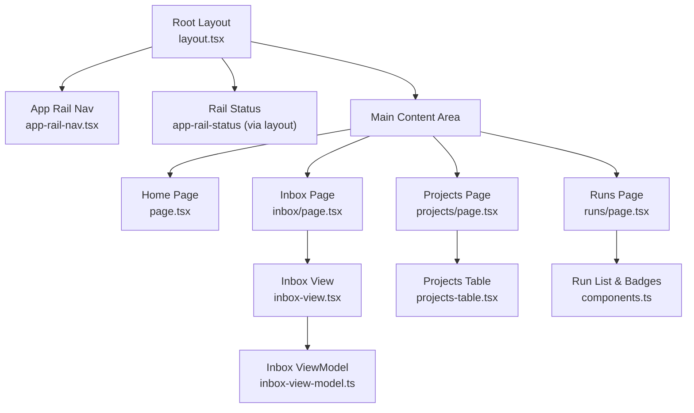
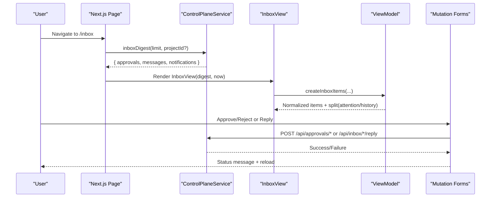
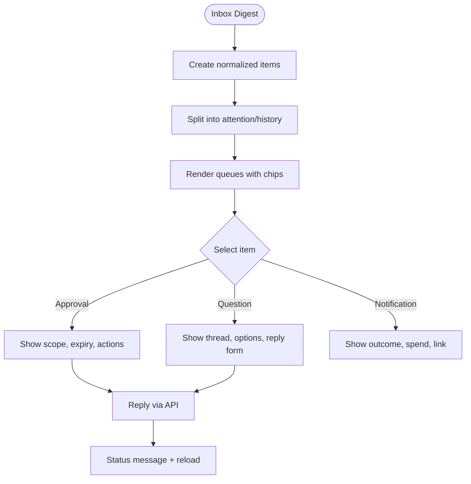
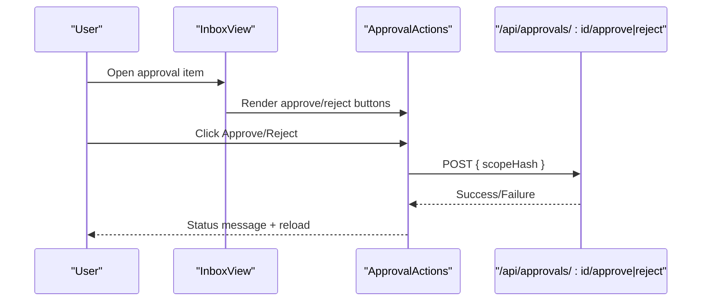
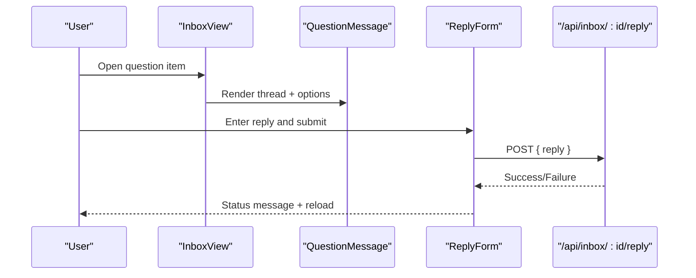
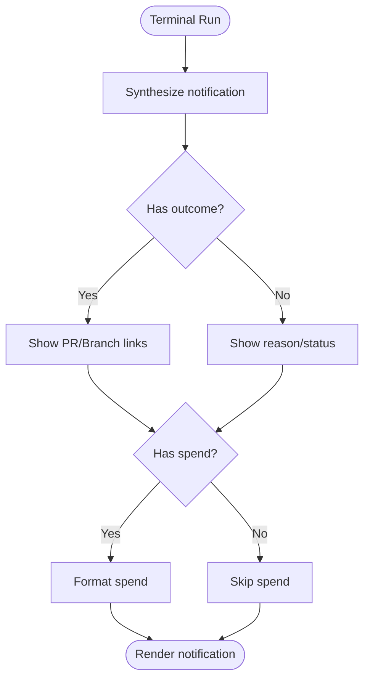
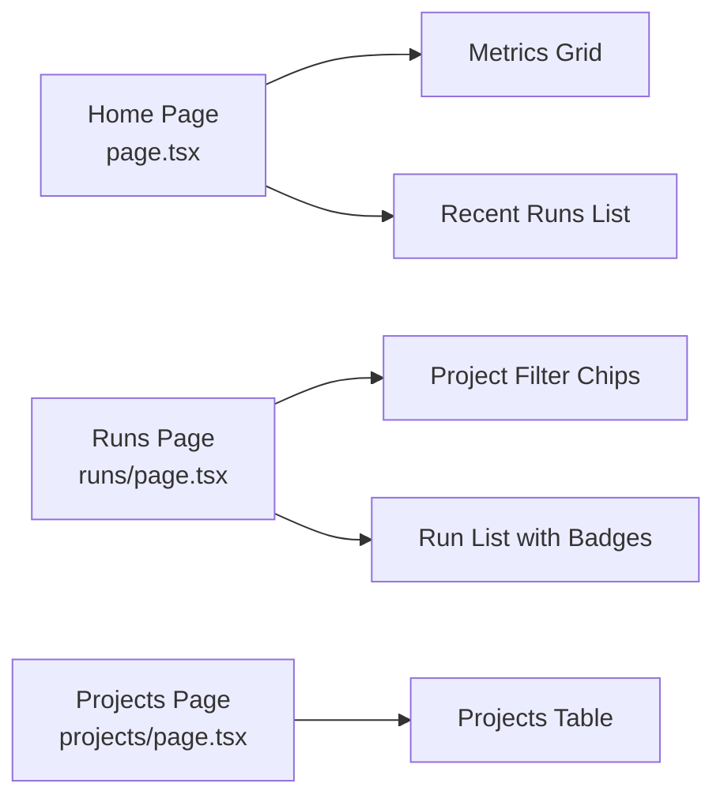
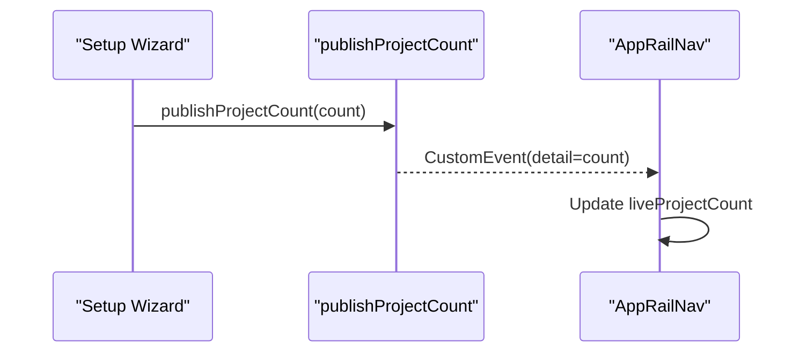
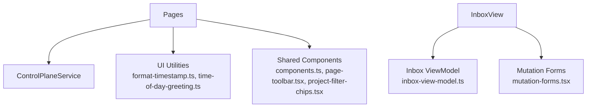

# Dashboard and User Interface

<cite>
**Referenced Files in This Document**
- [layout.tsx](file://apps/control-plane/app/layout.tsx)
- [page.tsx](file://apps/control-plane/app/page.tsx)
- [inbox/page.tsx](file://apps/control-plane/app/inbox/page.tsx)
- [projects/page.tsx](file://apps/control-plane/app/projects/page.tsx)
- [runs/page.tsx](file://apps/control-plane/app/runs/page.tsx)
- [inbox-view.tsx](file://apps/control-plane/src/ui/inbox-view.tsx)
- [inbox-view-model.ts](file://apps/control-plane/src/ui/inbox-view-model.ts)
- [components.ts](file://apps/control-plane/src/ui/components.ts)
- [projects-table.tsx](file://apps/control-plane/src/ui/projects-table.tsx)
- [rail-status-model.ts](file://apps/control-plane/src/ui/rail-status-model.ts)
- [app-rail-nav.tsx](file://apps/control-plane/src/ui/app-rail-nav.tsx)
- [mutation-forms.tsx](file://apps/control-plane/src/ui/mutation-forms.tsx)
- [project-count-signal.ts](file://apps/control-plane/src/ui/project-count-signal.ts)
- [page-toolbar.tsx](file://apps/control-plane/src/ui/page-toolbar.tsx)
- [project-filter-chips.tsx](file://apps/control-plane/src/ui/project-filter-chips.tsx)
- [format-timestamp.ts](file://apps/control-plane/src/ui/format-timestamp.ts)
- [time-of-day-greeting.ts](file://apps/control-plane/src/ui/time-of-day-greeting.ts)
- [control-plane-service.ts](file://apps/control-plane/src/application/control-plane-service.ts)
</cite>

## Table of Contents
1. [Introduction](#introduction)
2. [Project Structure](#project-structure)
3. [Core Components](#core-components)
4. [Architecture Overview](#architecture-overview)
5. [Detailed Component Analysis](#detailed-component-analysis)
6. [Dependency Analysis](#dependency-analysis)
7. [Performance Considerations](#performance-considerations)
8. [Troubleshooting Guide](#troubleshooting-guide)
9. [Conclusion](#conclusion)
10. [Appendices](#appendices)

## Introduction
This document explains the Agent OS Passerine dashboard and user interface, focusing on the inbox system (approvals, questions, notifications), status monitoring, project overview displays, and real-time updates. It also covers UI composition patterns, state management, customization points, accessibility, responsive design, and performance strategies for large datasets.

## Project Structure
The dashboard is a Next.js application with server-rendered pages and client components:
- Pages define routes and fetch data via the control plane service.
- Shared UI components render consistent layouts, tables, badges, and forms.
- The inbox view composes approval workflows, question threads, and run notifications into a unified mailbox.
- Navigation and rail status provide live counts and quick access to key areas.

**Diagram sources**
- [layout.tsx:17-53](file://apps/control-plane/app/layout.tsx#L17-L53)
- [page.tsx:10-86](file://apps/control-plane/app/page.tsx#L10-L86)
- [inbox/page.tsx:12-59](file://apps/control-plane/app/inbox/page.tsx#L12-L59)
- [projects/page.tsx:10-35](file://apps/control-plane/app/projects/page.tsx#L10-L35)
- [runs/page.tsx:12-76](file://apps/control-plane/app/runs/page.tsx#L12-L76)
- [inbox-view.tsx:341-422](file://apps/control-plane/src/ui/inbox-view.tsx#L341-L422)
- [inbox-view-model.ts:205-255](file://apps/control-plane/src/ui/inbox-view-model.ts#L205-L255)
- [projects-table.tsx:6-64](file://apps/control-plane/src/ui/projects-table.tsx#L6-L64)
- [components.ts:12-41](file://apps/control-plane/src/ui/components.ts#L12-L41)

**Section sources**
- [layout.tsx:17-53](file://apps/control-plane/app/layout.tsx#L17-L53)
- [page.tsx:10-86](file://apps/control-plane/app/page.tsx#L10-L86)
- [inbox/page.tsx:12-59](file://apps/control-plane/app/inbox/page.tsx#L12-L59)
- [projects/page.tsx:10-35](file://apps/control-plane/app/projects/page.tsx#L10-L35)
- [runs/page.tsx:12-76](file://apps/control-plane/app/runs/page.tsx#L12-L76)

## Core Components
- Root layout composes the app shell, navigation, and content area, seeding live counts and session context.
- Home page shows an overview with recent runs and project counts.
- Inbox page aggregates approvals, questions, and notifications into a digest and renders the mailbox view.
- Projects page lists projects with last-run status and timestamps.
- Runs page lists recent runs with filters and status indicators.
- Shared UI includes status badges, empty states, toolbars, and project filter chips.

Key responsibilities:
- Data fetching occurs in server components using the control plane service.
- Client components handle interactivity (approvals, replies, cancellations).
- Real-time updates are achieved through lightweight signals and re-renders.

**Section sources**
- [layout.tsx:17-53](file://apps/control-plane/app/layout.tsx#L17-L53)
- [page.tsx:10-86](file://apps/control-plane/app/page.tsx#L10-L86)
- [inbox/page.tsx:12-59](file://apps/control-plane/app/inbox/page.tsx#L12-L59)
- [projects/page.tsx:10-35](file://apps/control-plane/app/projects/page.tsx#L10-L35)
- [runs/page.tsx:12-76](file://apps/control-plane/app/runs/page.tsx#L12-L76)
- [components.ts:12-41](file://apps/control-plane/src/ui/components.ts#L12-L41)
- [page-toolbar.tsx:4-24](file://apps/control-plane/src/ui/page-toolbar.tsx#L4-L24)
- [project-filter-chips.tsx:4-33](file://apps/control-plane/src/ui/project-filter-chips.tsx#L4-L33)

## Architecture Overview
The dashboard follows a server-first rendering model with client-side interactions:
- Server pages call the control plane service to fetch projections (runs, projects, inbox digests).
- Client components manage local state for selections and mutations.
- The inbox view normalizes heterogeneous inputs (approvals, messages, notifications) into a unified item model for display.
- Real-time updates use a lightweight event-based signal for project count changes without full page reloads.

**Diagram sources**
- [inbox/page.tsx:12-59](file://apps/control-plane/app/inbox/page.tsx#L12-L59)
- [inbox-view.tsx:341-422](file://apps/control-plane/src/ui/inbox-view.tsx#L341-L422)
- [inbox-view-model.ts:205-255](file://apps/control-plane/src/ui/inbox-view-model.ts#L205-L255)
- [mutation-forms.tsx:29-54](file://apps/control-plane/src/ui/mutation-forms.tsx#L29-L54)
- [control-plane-service.ts:311-317](file://apps/control-plane/src/application/control-plane-service.ts#L311-L317)

## Detailed Component Analysis

### Inbox System Architecture
The inbox consolidates three kinds of items:
- Approvals: scope decisions with expiry handling and action buttons.
- Questions: agent-operator conversations with optional suggested options and reply form.
- Notifications: synthesized from terminal runs, including outcomes like draft PR links and spend summaries.

Normalization and splitting:
- Items are created from approvals, messages, and notifications, then sorted by time.
- Attention vs history separation highlights pending items first.

Display and interaction:
- Queue sections list items with sender, relative time, subject, preview, and status chip.
- Reading pane renders detailed content based on item kind.
- Mutations send idempotent requests and show accessible status feedback.

**Diagram sources**
- [inbox-view.tsx:341-422](file://apps/control-plane/src/ui/inbox-view.tsx#L341-L422)
- [inbox-view-model.ts:205-255](file://apps/control-plane/src/ui/inbox-view-model.ts#L205-L255)
- [mutation-forms.tsx:56-92](file://apps/control-plane/src/ui/mutation-forms.tsx#L56-L92)
- [mutation-forms.tsx:152-179](file://apps/control-plane/src/ui/mutation-forms.tsx#L152-L179)

**Section sources**
- [inbox-view.tsx:38-285](file://apps/control-plane/src/ui/inbox-view.tsx#L38-L285)
- [inbox-view-model.ts:39-181](file://apps/control-plane/src/ui/inbox-view-model.ts#L39-L181)
- [inbox-view-model.ts:205-255](file://apps/control-plane/src/ui/inbox-view-model.ts#L205-L255)
- [mutation-forms.tsx:29-54](file://apps/control-plane/src/ui/mutation-forms.tsx#L29-L54)

### Approval Workflows
- Approvals include scope previews, expiry times, and optional summaries.
- Pending approvals show approve/reject actions; decided or expired items show outcomes.
- Expiry is derived at read time to align with reconciliation behavior.

**Diagram sources**
- [inbox-view.tsx:62-177](file://apps/control-plane/src/ui/inbox-view.tsx#L62-L177)
- [mutation-forms.tsx:56-92](file://apps/control-plane/src/ui/mutation-forms.tsx#L56-L92)
- [control-plane-service.ts:368-387](file://apps/control-plane/src/application/control-plane-service.ts#L368-L387)

**Section sources**
- [inbox-view.tsx:62-177](file://apps/control-plane/src/ui/inbox-view.tsx#L62-L177)
- [mutation-forms.tsx:56-92](file://apps/control-plane/src/ui/mutation-forms.tsx#L56-L92)
- [control-plane-service.ts:368-387](file://apps/control-plane/src/application/control-plane-service.ts#L368-L387)

### Question Handling
- Questions render a conversation thread between agent and operator.
- Optional suggested options are displayed when provided.
- Replies are sent via a form with validation and idempotency keys.

**Diagram sources**
- [inbox-view.tsx:179-234](file://apps/control-plane/src/ui/inbox-view.tsx#L179-L234)
- [mutation-forms.tsx:152-179](file://apps/control-plane/src/ui/mutation-forms.tsx#L152-L179)

**Section sources**
- [inbox-view.tsx:179-234](file://apps/control-plane/src/ui/inbox-view.tsx#L179-L234)
- [mutation-forms.tsx:152-179](file://apps/control-plane/src/ui/mutation-forms.tsx#L152-L179)

### Notification Management
- Notifications are synthesized from terminal runs and include outcomes such as draft pull request URLs and local branch info.
- Spend totals are formatted and shown when available.
- Links to full run details are provided for deeper inspection.

**Diagram sources**
- [inbox-view.tsx:236-285](file://apps/control-plane/src/ui/inbox-view.tsx#L236-L285)
- [inbox-view-model.ts:66-97](file://apps/control-plane/src/ui/inbox-view-model.ts#L66-L97)
- [control-plane-service.ts:292-317](file://apps/control-plane/src/application/control-plane-service.ts#L292-L317)

**Section sources**
- [inbox-view.tsx:236-285](file://apps/control-plane/src/ui/inbox-view.tsx#L236-L285)
- [inbox-view-model.ts:66-97](file://apps/control-plane/src/ui/inbox-view-model.ts#L66-L97)
- [control-plane-service.ts:292-317](file://apps/control-plane/src/application/control-plane-service.ts#L292-L317)

### Status Monitoring and Project Overview
- Home page displays metrics for projects, recent runs, and budget status.
- Runs page lists recent runs with project filters and status badges.
- Projects page shows binding, revision, last run status, and updated date.

**Diagram sources**
- [page.tsx:10-86](file://apps/control-plane/app/page.tsx#L10-L86)
- [runs/page.tsx:12-76](file://apps/control-plane/app/runs/page.tsx#L12-L76)
- [projects/page.tsx:10-35](file://apps/control-plane/app/projects/page.tsx#L10-L35)
- [projects-table.tsx:6-64](file://apps/control-plane/src/ui/projects-table.tsx#L6-L64)
- [components.ts:12-41](file://apps/control-plane/src/ui/components.ts#L12-L41)

**Section sources**
- [page.tsx:10-86](file://apps/control-plane/app/page.tsx#L10-L86)
- [runs/page.tsx:12-76](file://apps/control-plane/app/runs/page.tsx#L12-L76)
- [projects/page.tsx:10-35](file://apps/control-plane/app/projects/page.tsx#L10-L35)
- [projects-table.tsx:6-64](file://apps/control-plane/src/ui/projects-table.tsx#L6-L64)

### Real-Time Updates
- Project count badge updates via a lightweight custom event without full navigation refreshes.
- Inbox pending count is computed server-side and passed to the toolbar.

**Diagram sources**
- [project-count-signal.ts:16-33](file://apps/control-plane/src/ui/project-count-signal.ts#L16-L33)
- [app-rail-nav.tsx:26-76](file://apps/control-plane/src/ui/app-rail-nav.tsx#L26-L76)

**Section sources**
- [project-count-signal.ts:16-33](file://apps/control-plane/src/ui/project-count-signal.ts#L16-L33)
- [app-rail-nav.tsx:26-76](file://apps/control-plane/src/ui/app-rail-nav.tsx#L26-L76)

### UI Component Composition Patterns
- Reusable components: RunStatusBadge, EmptyState, PageToolbar, ProjectFilterChips.
- Layout composition: root layout assembles rail nav, status, and scrollable content.
- Client/server split: server pages fetch data; client components handle mutations and local state.

**Section sources**
- [components.ts:12-41](file://apps/control-plane/src/ui/components.ts#L12-L41)
- [page-toolbar.tsx:4-24](file://apps/control-plane/src/ui/page-toolbar.tsx#L4-L24)
- [project-filter-chips.tsx:4-33](file://apps/control-plane/src/ui/project-filter-chips.tsx#L4-L33)
- [layout.tsx:17-53](file://apps/control-plane/app/layout.tsx#L17-L53)

### State Management Approaches
- Local component state for selections, replies, and confirmation flows.
- Server-provided props for initial data (digests, counts).
- Lightweight global signals for cross-component updates (project count).

**Section sources**
- [inbox-view.tsx:341-422](file://apps/control-plane/src/ui/inbox-view.tsx#L341-L422)
- [mutation-forms.tsx:29-54](file://apps/control-plane/src/ui/mutation-forms.tsx#L29-L54)
- [project-count-signal.ts:16-33](file://apps/control-plane/src/ui/project-count-signal.ts#L16-L33)

### User Interaction Flows
- Approve/Reject: click triggers idempotent mutation, shows status, reloads to reflect decision.
- Reply: form submission sends reply, shows status, reloads to update thread.
- Cancel run: two-step confirmation prevents accidental cancellation.

**Section sources**
- [mutation-forms.tsx:56-92](file://apps/control-plane/src/ui/mutation-forms.tsx#L56-L92)
- [mutation-forms.tsx:102-149](file://apps/control-plane/src/ui/mutation-forms.tsx#L102-L149)
- [mutation-forms.tsx:152-179](file://apps/control-plane/src/ui/mutation-forms.tsx#L152-L179)

## Dependency Analysis
The dashboard depends on:
- Control plane service for data projections and mutations.
- UI utilities for formatting timestamps and greetings.
- Shared components for consistent presentation.

**Diagram sources**
- [page.tsx:10-86](file://apps/control-plane/app/page.tsx#L10-L86)
- [inbox/page.tsx:12-59](file://apps/control-plane/app/inbox/page.tsx#L12-L59)
- [inbox-view.tsx:341-422](file://apps/control-plane/src/ui/inbox-view.tsx#L341-L422)
- [inbox-view-model.ts:205-255](file://apps/control-plane/src/ui/inbox-view-model.ts#L205-L255)
- [mutation-forms.tsx:29-54](file://apps/control-plane/src/ui/mutation-forms.tsx#L29-L54)
- [format-timestamp.ts:1-14](file://apps/control-plane/src/ui/format-timestamp.ts#L1-L14)
- [time-of-day-greeting.ts:1-25](file://apps/control-plane/src/ui/time-of-day-greeting.ts#L1-L25)

**Section sources**
- [control-plane-service.ts:669-800](file://apps/control-plane/src/application/control-plane-service.ts#L669-L800)
- [format-timestamp.ts:1-14](file://apps/control-plane/src/ui/format-timestamp.ts#L1-L14)
- [time-of-day-greeting.ts:1-25](file://apps/control-plane/src/ui/time-of-day-greeting.ts#L1-L25)

## Performance Considerations
- Concurrency limits: Inbox digest fan-out uses bounded concurrency to avoid saturating database connections.
- Minimal re-renders: Project count updates via lightweight events instead of full navigations.
- Efficient listing: Project and run listings use limited queries and aggregates where possible.
- Relative timestamps: Computed once per render with server-provided “now” to avoid hydration drift.

Recommendations:
- Keep list sizes bounded (e.g., recent runs limit).
- Use pagination or virtualization for very large datasets.
- Debounce heavy operations if adding new interactive features.
- Prefer server-side filtering via project IDs to reduce payload size.

[No sources needed since this section provides general guidance]

## Troubleshooting Guide
Common issues and resolutions:
- Approval save failures: 409 indicates the request is no longer open (expired or already decided); UI surfaces a specific message.
- Reply failures: Generic error messages guide retry; ensure network connectivity and valid input.
- Stale project count: Ensure setup wizard publishes project count; verify subscription in navigation.

Debugging tips:
- Check mutation status messages rendered by aria-live regions.
- Inspect inbox attention counts and pending items to confirm server-side aggregation.
- Validate timestamps and relative time calculations for consistency.

**Section sources**
- [mutation-forms.tsx:11-27](file://apps/control-plane/src/ui/mutation-forms.tsx#L11-L27)
- [rail-status-model.ts:8-22](file://apps/control-plane/src/ui/rail-status-model.ts#L8-L22)
- [project-count-signal.ts:16-33](file://apps/control-plane/src/ui/project-count-signal.ts#L16-L33)

## Conclusion
The dashboard provides a cohesive interface for managing agent-driven workflows through approvals, questions, and notifications. Its architecture balances server-rendered data with client-side interactivity, ensuring clarity and responsiveness. The inbox’s normalized model simplifies complex interactions, while shared components and signals maintain consistency and performance. Accessibility and responsive design are embedded throughout, and extensibility points allow customization and integration with external tools.

[No sources needed since this section summarizes without analyzing specific files]

## Appendices

### Customizing Dashboard Views
- Add new project filters by extending ProjectFilterChips usage in pages.
- Customize status labels by updating RunStatusBadge mappings.
- Introduce new inbox item types by extending the inbox model and view rendering logic.

**Section sources**
- [project-filter-chips.tsx:4-33](file://apps/control-plane/src/ui/project-filter-chips.tsx#L4-L33)
- [components.ts:12-41](file://apps/control-plane/src/ui/components.ts#L12-L41)
- [inbox-view-model.ts:8-26](file://apps/control-plane/src/ui/inbox-view-model.ts#L8-L26)

### Extending UI Components
- Reuse PageToolbar for consistent headers across new pages.
- Compose EmptyState for clear messaging when data is absent.
- Leverage format-timestamp and time-of-day-greeting for consistent UX.

**Section sources**
- [page-toolbar.tsx:4-24](file://apps/control-plane/src/ui/page-toolbar.tsx#L4-L24)
- [components.ts:28-41](file://apps/control-plane/src/ui/components.ts#L28-L41)
- [format-timestamp.ts:1-14](file://apps/control-plane/src/ui/format-timestamp.ts#L1-L14)
- [time-of-day-greeting.ts:1-25](file://apps/control-plane/src/ui/time-of-day-greeting.ts#L1-L25)

### Integrating with External Monitoring Tools
- Use the runs and projects endpoints to surface metrics in dashboards.
- Subscribe to inbox attention counts for alerting on pending approvals/questions.
- Emit custom events for project lifecycle changes to integrate with external systems.

**Section sources**
- [runs/page.tsx:12-76](file://apps/control-plane/app/runs/page.tsx#L12-L76)
- [projects/page.tsx:10-35](file://apps/control-plane/app/projects/page.tsx#L10-L35)
- [project-count-signal.ts:16-33](file://apps/control-plane/src/ui/project-count-signal.ts#L16-L33)

### Accessibility Considerations
- Skip-to-content link for keyboard users.
- Semantic headings and landmarks for screen readers.
- Aria labels and roles for status badges and live regions.
- Accessible forms with labels and focus management on status updates.

**Section sources**
- [layout.tsx:27-46](file://apps/control-plane/app/layout.tsx#L27-L46)
- [components.ts:12-41](file://apps/control-plane/src/ui/components.ts#L12-L41)
- [mutation-forms.tsx:87-89](file://apps/control-plane/src/ui/mutation-forms.tsx#L87-L89)
- [mutation-forms.tsx:171-176](file://apps/control-plane/src/ui/mutation-forms.tsx#L171-L176)

### Responsive Design Patterns
- App shell with aside navigation and scrollable content area.
- Tables and lists adapt to screen size via CSS classes.
- Toolbars and filters stack gracefully on smaller screens.

**Section sources**
- [layout.tsx:30-48](file://apps/control-plane/app/layout.tsx#L30-L48)
- [projects-table.tsx:11-63](file://apps/control-plane/src/ui/projects-table.tsx#L11-L63)
- [page-toolbar.tsx:15-22](file://apps/control-plane/src/ui/page-toolbar.tsx#L15-L22)