# Approval Workflow

<cite>
**Referenced Files in This Document**
- [route.ts](file://apps/control-plane/app/api/approvals/[id]/approve/route.ts)
- [route.ts](file://apps/control-plane/app/api/approvals/[id]/reject/route.ts)
- [control-plane-service.ts](file://apps/control-plane/src/application/control-plane-service.ts)
- [workflow-reconciliation.ts](file://apps/control-plane/src/application/workflow-reconciliation.ts)
- [mutation-forms.tsx](file://apps/control-plane/src/ui/mutation-forms.tsx)
- [inbox-view.tsx](file://apps/control-plane/src/ui/inbox-view.tsx)
- [contracts.ts](file://apps/control-plane/src/http/contracts.ts)
- [lifecycle.ts](file://packages/core/src/lifecycle.ts)
- [neon-repository.ts](file://packages/adapters/src/persistence/neon-repository.ts)
- [in-memory.ts](file://packages/adapters/src/persistence/in-memory.ts)
- [workflow.ts](file://packages/adapters/src/trigger/workflow.ts)
</cite>

## Table of Contents
1. [Introduction](#introduction)
2. [Project Structure](#project-structure)
3. [Core Components](#core-components)
4. [Architecture Overview](#architecture-overview)
5. [Detailed Component Analysis](#detailed-component-analysis)
6. [Dependency Analysis](#dependency-analysis)
7. [Performance Considerations](#performance-considerations)
8. [Troubleshooting Guide](#troubleshooting-guide)
9. [Conclusion](#conclusion)

## Introduction
This document explains the approval workflow that gates implementation behind human authorization. When an agent needs to proceed with changes, it requests a scope approval. The system creates an approval with a redacted preview and an expiration deadline. Operators review the request in the inbox and choose Approve or Reject via the ApprovalActions component. Backend endpoints validate the decision against the current time and stored state, persist durable events, and resume the workflow with the decision. Expired approvals are surfaced as expired on read and can be enforced by reconciliation and database guards.

## Project Structure
The approval flow spans UI components, API routes, application service logic, persistence adapters, and workflow reconciliation:
- UI: Inbox renders approval items and exposes ApprovalActions for approve/reject.
- API: POST /api/approvals/{id}/approve and /api/approvals/{id}/reject accept decisions.
- Service: ControlPlaneService creates approvals, projects safe previews, consumes decisions, and emits workflow resume intents.
- Persistence: Adapters enforce atomic consume and expiry constraints.
- Reconciliation: Scans runs and approvals to expire stale ones and deliver resume intents based on approval events.

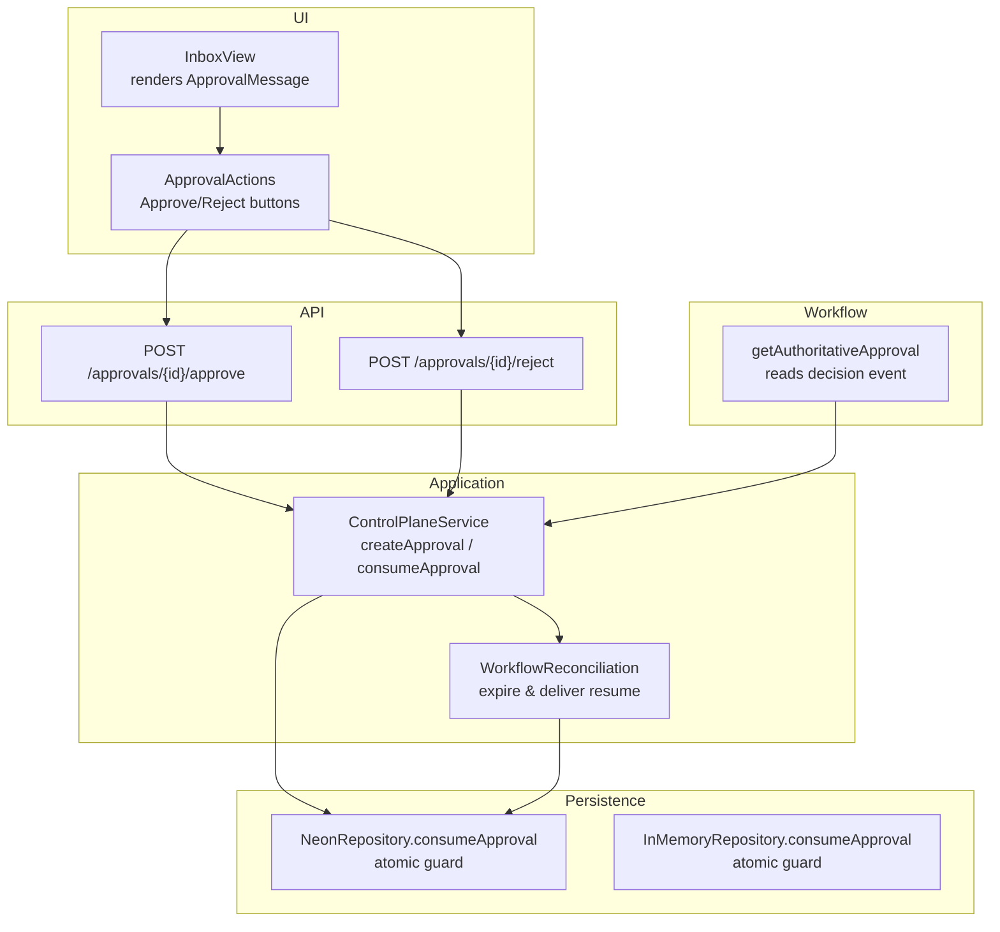

**Diagram sources**
- [inbox-view.tsx:62-177](file://apps/control-plane/src/ui/inbox-view.tsx#L62-L177)
- [mutation-forms.tsx:56-92](file://apps/control-plane/src/ui/mutation-forms.tsx#L56-L92)
- [route.ts:11-32](file://apps/control-plane/app/api/approvals/[id]/approve/route.ts#L11-L32)
- [route.ts:11-32](file://apps/control-plane/app/api/approvals/[id]/reject/route.ts#L11-L32)
- [control-plane-service.ts:1311-1433](file://apps/control-plane/src/application/control-plane-service.ts#L1311-L1433)
- [workflow-reconciliation.ts:156-507](file://apps/control-plane/src/application/workflow-reconciliation.ts#L156-L507)
- [neon-repository.ts:949-968](file://packages/adapters/src/persistence/neon-repository.ts#L949-L968)
- [in-memory.ts:765-812](file://packages/adapters/src/persistence/in-memory.ts#L765-L812)
- [workflow.ts:1104-1141](file://packages/adapters/src/trigger/workflow.ts#L1104-L1141)

**Section sources**
- [inbox-view.tsx:62-177](file://apps/control-plane/src/ui/inbox-view.tsx#L62-L177)
- [mutation-forms.tsx:56-92](file://apps/control-plane/src/ui/mutation-forms.tsx#L56-L92)
- [route.ts:11-32](file://apps/control-plane/app/api/approvals/[id]/approve/route.ts#L11-L32)
- [route.ts:11-32](file://apps/control-plane/app/api/approvals/[id]/reject/route.ts#L11-L32)
- [control-plane-service.ts:1311-1433](file://apps/control-plane/src/application/control-plane-service.ts#L1311-L1433)
- [workflow-reconciliation.ts:156-507](file://apps/control-plane/src/application/workflow-reconciliation.ts#L156-L507)
- [neon-repository.ts:949-968](file://packages/adapters/src/persistence/neon-repository.ts#L949-L968)
- [in-memory.ts:765-812](file://packages/adapters/src/persistence/in-memory.ts#L765-L812)
- [workflow.ts:1104-1141](file://packages/adapters/src/trigger/workflow.ts#L1104-L1141)

## Core Components
- Approval creation: The service creates an approval tied to a run, computes a fingerprint (scope hash), stores a redacted preview, and sets an expiration timestamp. Idempotency prevents duplicate approvals for the same key.
- Scope preview: The full scope is never exposed; only a redacted short preview is shown to operators.
- Decision processing: Approve/Reject endpoints validate authentication, body schema, idempotency header, and scope hash match, then atomically consume the approval and emit a durable event.
- Expiration handling: Read-time projection marks pending approvals past their expiresAt as expired. Reconciliation also writes expired status when workflows exceed deadlines.
- Workflow integration: After consumption, a resume intent is dispatched so the workflow resumes with the decision. The workflow reads authoritative approval state and the matching decision event before proceeding.

**Section sources**
- [control-plane-service.ts:1311-1433](file://apps/control-plane/src/application/control-plane-service.ts#L1311-L1433)
- [control-plane-service.ts:368-387](file://apps/control-plane/src/application/control-plane-service.ts#L368-L387)
- [contracts.ts:362-371](file://apps/control-plane/src/http/contracts.ts#L362-L371)
- [workflow-reconciliation.ts:214-264](file://apps/control-plane/src/application/workflow-reconciliation.ts#L214-L264)
- [workflow.ts:1104-1141](file://packages/adapters/src/trigger/workflow.ts#L1104-L1141)

## Architecture Overview
The approval lifecycle integrates UI actions, API validation, service orchestration, persistence guards, and workflow resumption.

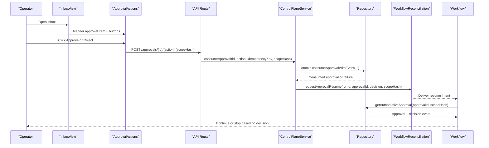

**Diagram sources**
- [inbox-view.tsx:62-177](file://apps/control-plane/src/ui/inbox-view.tsx#L62-L177)
- [mutation-forms.tsx:56-92](file://apps/control-plane/src/ui/mutation-forms.tsx#L56-L92)
- [route.ts:11-32](file://apps/control-plane/app/api/approvals/[id]/approve/route.ts#L11-L32)
- [route.ts:11-32](file://apps/control-plane/app/api/approvals/[id]/reject/route.ts#L11-L32)
- [control-plane-service.ts:1355-1433](file://apps/control-plane/src/application/control-plane-service.ts#L1355-L1433)
- [workflow-reconciliation.ts:472-495](file://apps/control-plane/src/application/workflow-reconciliation.ts#L472-L495)
- [workflow.ts:1104-1141](file://packages/adapters/src/trigger/workflow.ts#L1104-L1141)

## Detailed Component Analysis

### Approval Creation and Projection
- Creates an approval bound to a run with a deterministic ID per idempotency key.
- Computes a scope fingerprint used as the scope hash.
- Stores a redacted scope preview for operator review.
- Projects expired status at read time if the current time exceeds expiresAt while still pending.

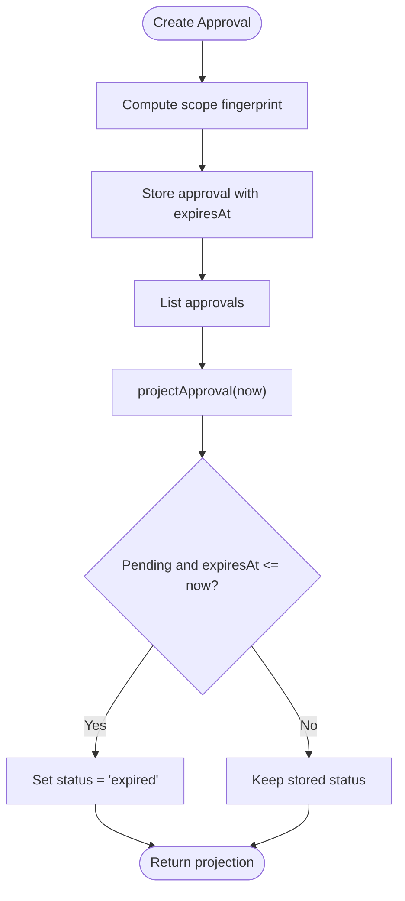

**Diagram sources**
- [control-plane-service.ts:1311-1344](file://apps/control-plane/src/application/control-plane-service.ts#L1311-L1344)
- [control-plane-service.ts:368-387](file://apps/control-plane/src/application/control-plane-service.ts#L368-L387)

**Section sources**
- [control-plane-service.ts:1311-1344](file://apps/control-plane/src/application/control-plane-service.ts#L1311-L1344)
- [control-plane-service.ts:368-387](file://apps/control-plane/src/application/control-plane-service.ts#L368-L387)

### ApprovalActions and UI Integration
- Renders Approve and Reject buttons for pending approvals.
- Sends POST requests with a generated Idempotency-Key header and the approval’s scopeHash.
- Displays user-facing messages and reloads on success.
- Provides accessibility support via aria-live region and focus management.

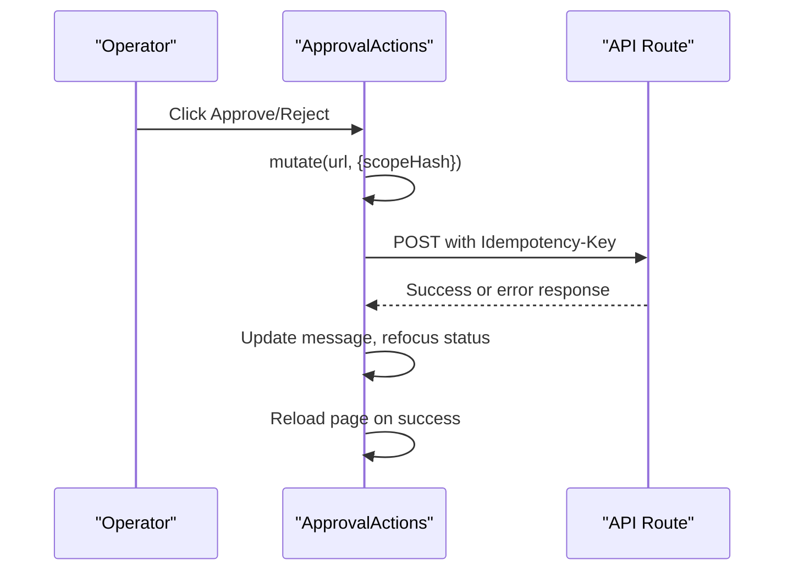

**Diagram sources**
- [mutation-forms.tsx:29-54](file://apps/control-plane/src/ui/mutation-forms.tsx#L29-L54)
- [mutation-forms.tsx:56-92](file://apps/control-plane/src/ui/mutation-forms.tsx#L56-L92)

**Section sources**
- [mutation-forms.tsx:29-92](file://apps/control-plane/src/ui/mutation-forms.tsx#L29-L92)
- [inbox-view.tsx:169-174](file://apps/control-plane/src/ui/inbox-view.tsx#L169-L174)

### API Endpoints: Approve and Reject
- Require API authentication.
- Validate request body using approvalDecisionSchema (requires scopeHash).
- Enforce idempotency via Idempotency-Key header parsing.
- Call consumeApproval with bounded path id and decision type.

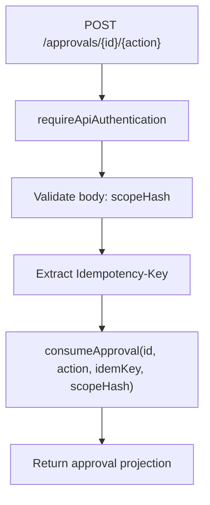

**Diagram sources**
- [route.ts:11-32](file://apps/control-plane/app/api/approvals/[id]/approve/route.ts#L11-L32)
- [route.ts:11-32](file://apps/control-plane/app/api/approvals/[id]/reject/route.ts#L11-L32)
- [contracts.ts:362-371](file://apps/control-plane/src/http/contracts.ts#L362-L371)

**Section sources**
- [route.ts:11-32](file://apps/control-plane/app/api/approvals/[id]/approve/route.ts#L11-L32)
- [route.ts:11-32](file://apps/control-plane/app/api/approvals/[id]/reject/route.ts#L11-L32)
- [contracts.ts:362-371](file://apps/control-plane/src/http/contracts.ts#L362-L371)

### Service: consumeApproval and State Transitions
- Validates scope hash match to prevent mismatched decisions.
- Enforces expiration by comparing expiresAt with consumedAt.
- Atomically consumes the approval and records a durable event (approval.approved or approval.rejected).
- Dispatches a workflow resume intent with idempotency keys.

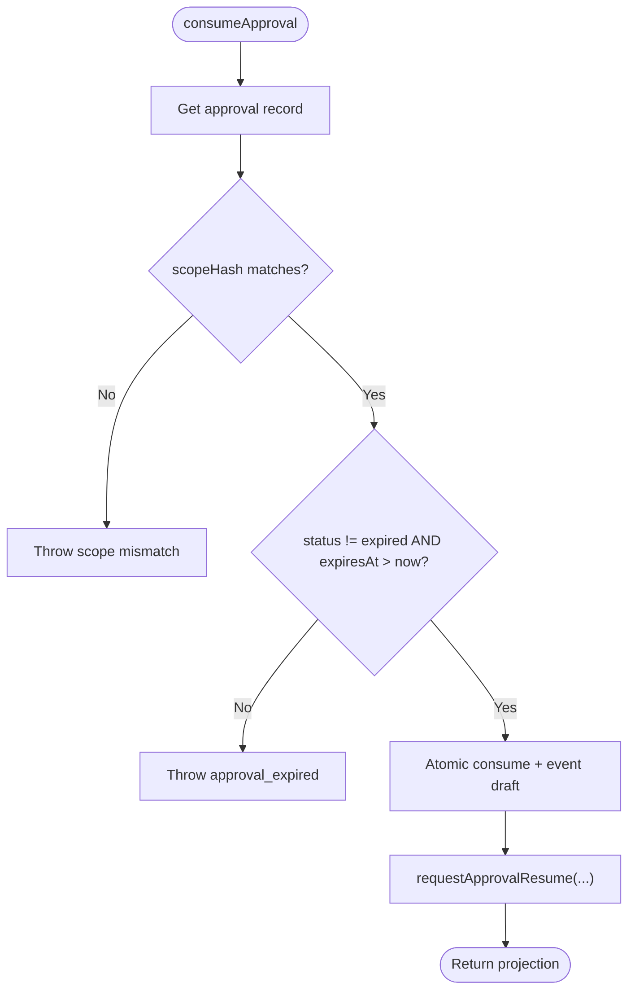

**Diagram sources**
- [control-plane-service.ts:1355-1433](file://apps/control-plane/src/application/control-plane-service.ts#L1355-L1433)

**Section sources**
- [control-plane-service.ts:1355-1433](file://apps/control-plane/src/application/control-plane-service.ts#L1355-L1433)

### Expiration Handling and Reconciliation
- Read-time projection marks pending approvals past expiresAt as expired for consistent UI behavior.
- Reconciliation scans runs nearing deadlines and expires all pending approvals for those runs.
- It also delivers resume intents based on approval events already persisted.

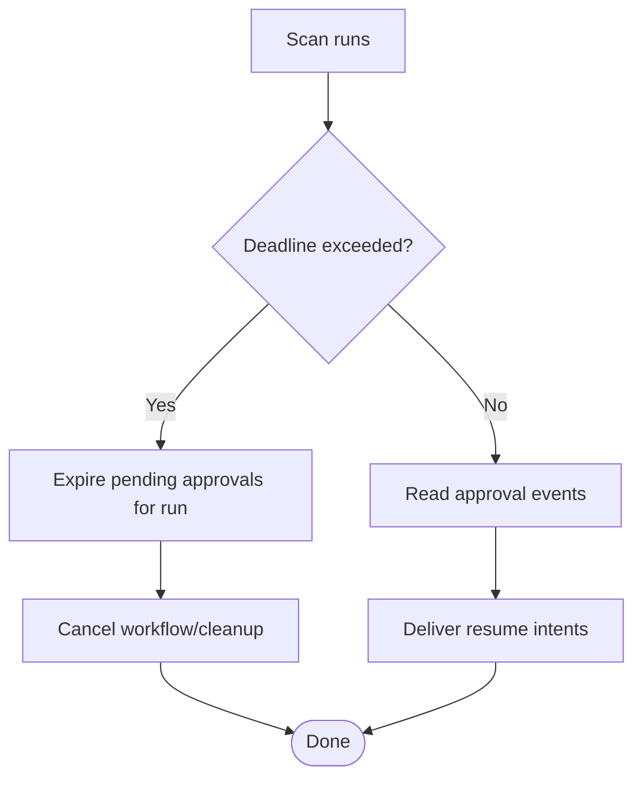

**Diagram sources**
- [workflow-reconciliation.ts:214-264](file://apps/control-plane/src/application/workflow-reconciliation.ts#L214-L264)
- [workflow-reconciliation.ts:472-495](file://apps/control-plane/src/application/workflow-reconciliation.ts#L472-L495)

**Section sources**
- [workflow-reconciliation.ts:214-264](file://apps/control-plane/src/application/workflow-reconciliation.ts#L214-L264)
- [workflow-reconciliation.ts:472-495](file://apps/control-plane/src/application/workflow-reconciliation.ts#L472-L495)

### Workflow Resumption and Decision Resolution
- The workflow waits for an authoritative approval decision.
- It verifies binding (runId, scope) and ensures the approval is consumed.
- It locates the matching decision event (approved/rejected) and proceeds accordingly.

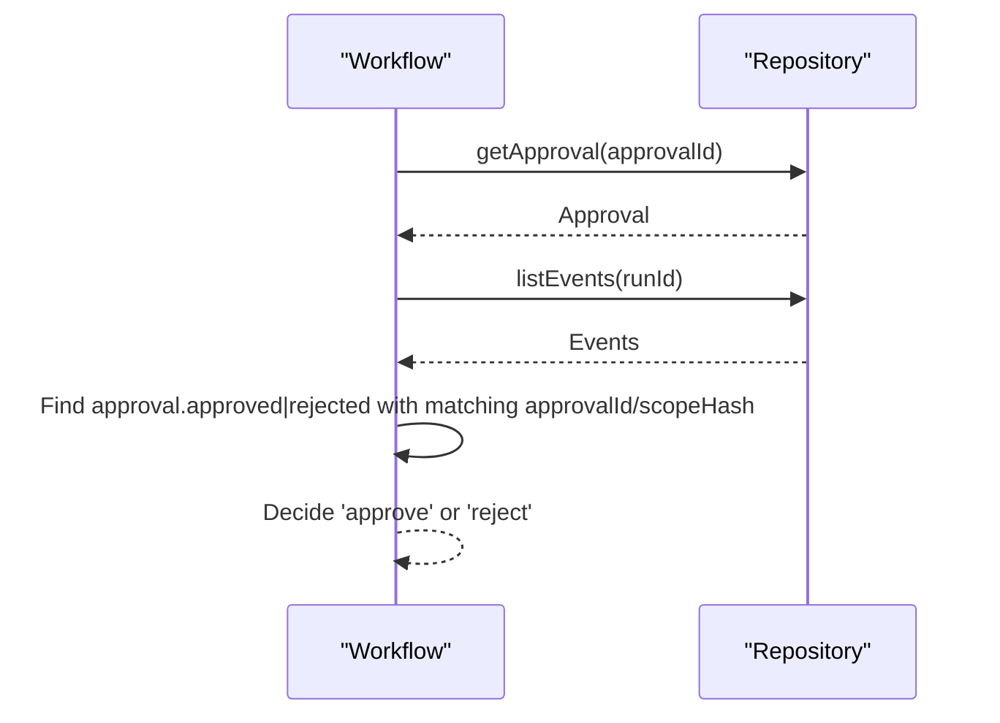

**Diagram sources**
- [workflow.ts:1104-1141](file://packages/adapters/src/trigger/workflow.ts#L1104-L1141)

**Section sources**
- [workflow.ts:1104-1141](file://packages/adapters/src/trigger/workflow.ts#L1104-L1141)

### Data Models and Lifecycle States
- Approval states: pending, approved, rejected, expired.
- Event-driven transitions ensure immutability and idempotency.
- Redundant checks across layers protect against race conditions and misuse.

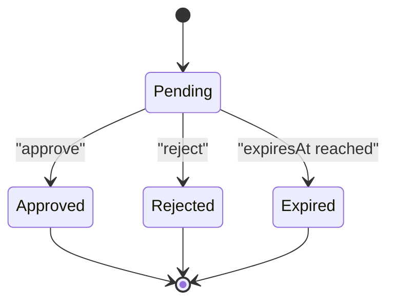

**Diagram sources**
- [lifecycle.ts:109-218](file://packages/core/src/lifecycle.ts#L109-L218)

**Section sources**
- [lifecycle.ts:109-218](file://packages/core/src/lifecycle.ts#L109-L218)

### Persistence Guards
- Neon adapter enforces atomicity: only one consumer can succeed, and only if status is pending and not expired.
- In-memory adapter mirrors these rules for tests and local usage.

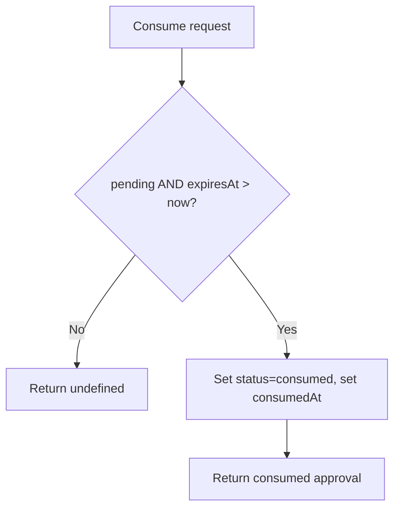

**Diagram sources**
- [neon-repository.ts:949-968](file://packages/adapters/src/persistence/neon-repository.ts#L949-L968)
- [in-memory.ts:765-812](file://packages/adapters/src/persistence/in-memory.ts#L765-L812)

**Section sources**
- [neon-repository.ts:949-968](file://packages/adapters/src/persistence/neon-repository.ts#L949-L968)
- [in-memory.ts:765-812](file://packages/adapters/src/persistence/in-memory.ts#L765-L812)

## Dependency Analysis
- UI depends on API contracts and mutation utilities to send decisions.
- API routes depend on authentication, schema validation, and service methods.
- Service depends on repository for persistence and optional outbox for workflow dispatch.
- Reconciliation depends on repository to scan runs/events and update approvals.
- Workflow depends on repository to read authoritative approval state and decision events.

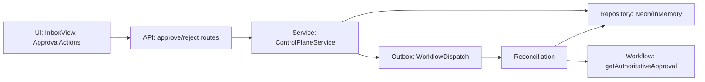

**Diagram sources**
- [inbox-view.tsx:62-177](file://apps/control-plane/src/ui/inbox-view.tsx#L62-L177)
- [mutation-forms.tsx:56-92](file://apps/control-plane/src/ui/mutation-forms.tsx#L56-L92)
- [route.ts:11-32](file://apps/control-plane/app/api/approvals/[id]/approve/route.ts#L11-L32)
- [route.ts:11-32](file://apps/control-plane/app/api/approvals/[id]/reject/route.ts#L11-L32)
- [control-plane-service.ts:1311-1433](file://apps/control-plane/src/application/control-plane-service.ts#L1311-L1433)
- [workflow-reconciliation.ts:156-507](file://apps/control-plane/src/application/workflow-reconciliation.ts#L156-L507)
- [workflow.ts:1104-1141](file://packages/adapters/src/trigger/workflow.ts#L1104-L1141)

**Section sources**
- [control-plane-service.ts:1311-1433](file://apps/control-plane/src/application/control-plane-service.ts#L1311-L1433)
- [workflow-reconciliation.ts:156-507](file://apps/control-plane/src/application/workflow-reconciliation.ts#L156-L507)
- [workflow.ts:1104-1141](file://packages/adapters/src/trigger/workflow.ts#L1104-L1141)

## Performance Considerations
- Concurrency limits: Inbox digest queries are bounded to avoid overwhelming the database driver.
- Read-time projection avoids extra writes for expiry, reducing contention.
- Idempotency headers prevent duplicate decisions under retries.
- Atomic persistence operations ensure correctness without heavy locking.

[No sources needed since this section provides general guidance]

## Troubleshooting Guide
Common errors and how they arise:
- Scope hash mismatch: Occurs when the submitted scopeHash does not match the stored approval fingerprint.
- Approval expired: Decision attempted after expiresAt or when status is already expired.
- Already decided: Attempting to consume an approval that has been consumed previously.
- Invalid approval: Mismatched runId, scope, or fingerprint during consumption.

Mitigations:
- Ensure the UI sends the exact scopeHash from the approval item.
- Respect expiration deadlines; do not retry expired approvals.
- Use unique Idempotency-Key headers to safely retry failed requests.

**Section sources**
- [control-plane-service.ts:1355-1433](file://apps/control-plane/src/application/control-plane-service.ts#L1355-L1433)
- [neon-repository.ts:949-968](file://packages/adapters/src/persistence/neon-repository.ts#L949-L968)
- [in-memory.ts:765-812](file://packages/adapters/src/persistence/in-memory.ts#L765-L812)

## Conclusion
The approval workflow provides a secure, auditable gate between specification and implementation. It combines clear operator UX, robust backend validation, durable event storage, and resilient reconciliation to ensure decisions are correct, timely, and irreversible. Expired approvals are consistently surfaced, and workflows resume only with authoritative decisions, protecting systems from unintended changes.