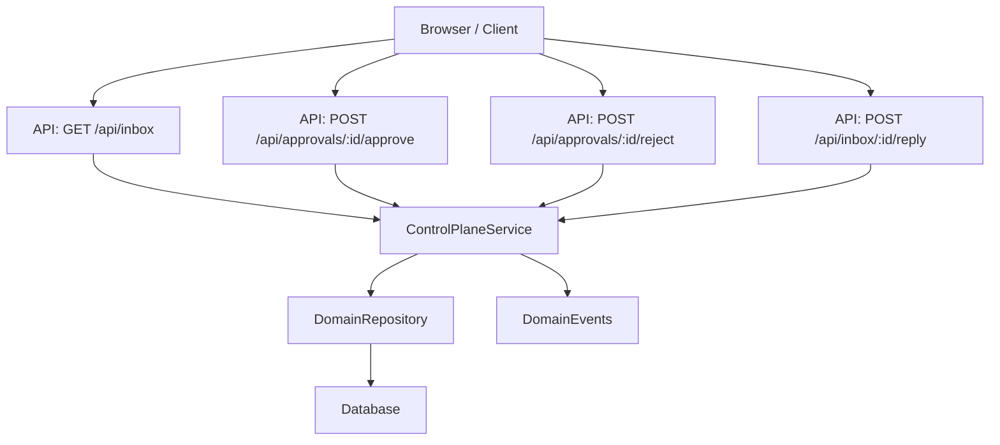
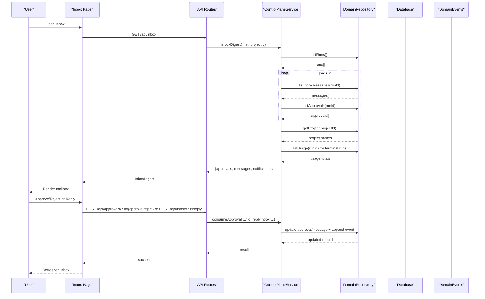
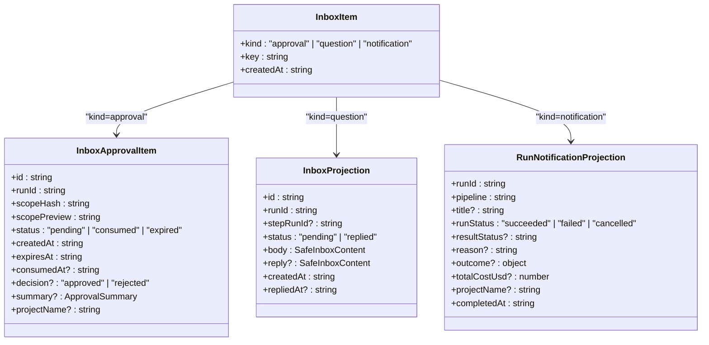
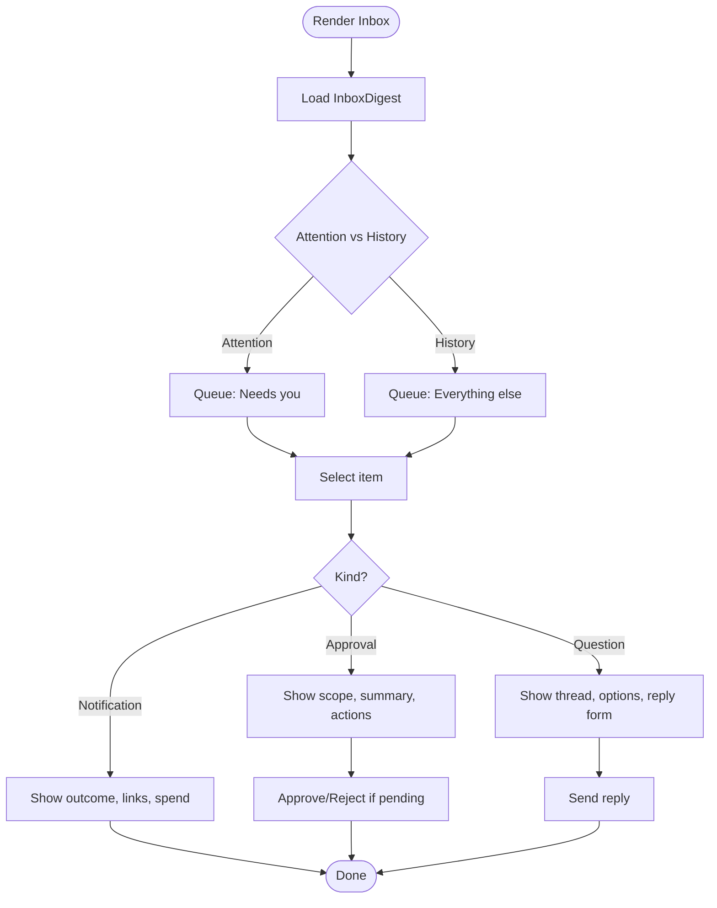
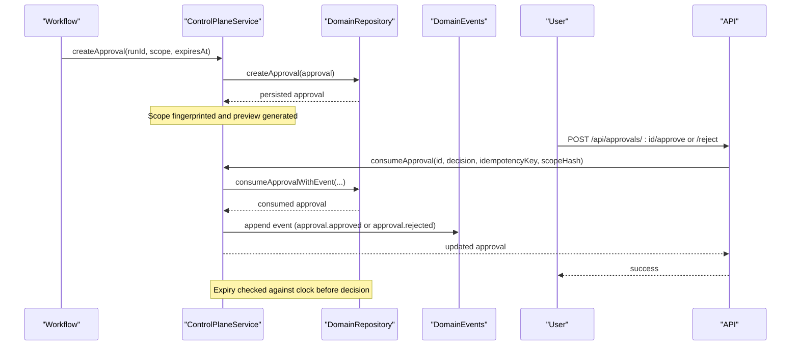
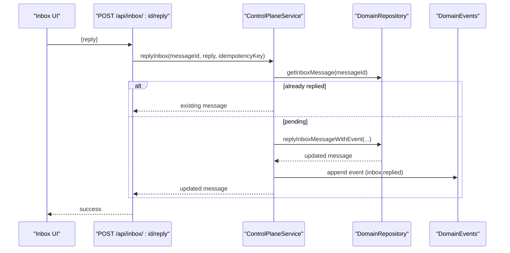
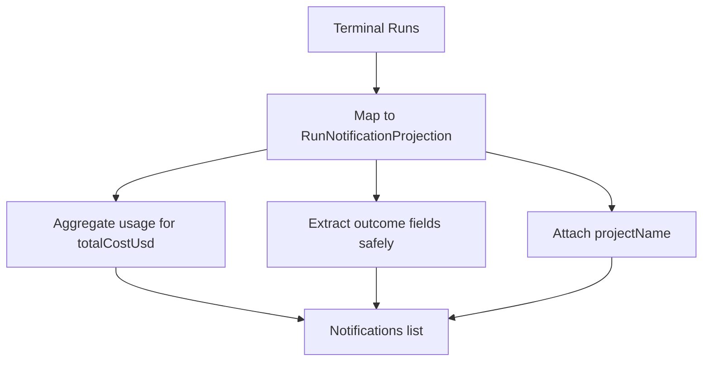
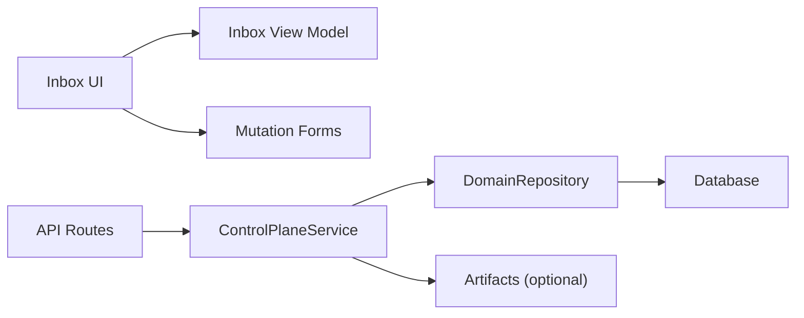

# Inbox System and Approvals

<cite>
**Referenced Files in This Document**
- [page.tsx](file://apps/control-plane/app/inbox/page.tsx)
- [inbox-view.tsx](file://apps/control-plane/src/ui/inbox-view.tsx)
- [inbox-view-model.ts](file://apps/control-plane/src/ui/inbox-view-model.ts)
- [mutation-forms.tsx](file://apps/control-plane/src/ui/mutation-forms.tsx)
- [route.ts (inbox listing)](file://apps/control-plane/app/api/inbox/route.ts)
- [route.ts (inbox reply)](file://apps/control-plane/app/api/inbox/[id]/reply/route.ts)
- [route.ts (approve approval)](file://apps/control-plane/app/api/approvals/[id]/approve/route.ts)
- [route.ts (reject approval)](file://apps/control-plane/app/api/approvals/[id]/reject/route.ts)
- [control-plane-service.ts](file://apps/control-plane/src/application/control-plane-service.ts)
- [0000_domain_persistence.sql](file://drizzle/0000_domain_persistence.sql)
</cite>

## Table of Contents
1. [Introduction](#introduction)
2. [Project Structure](#project-structure)
3. [Core Components](#core-components)
4. [Architecture Overview](#architecture-overview)
5. [Detailed Component Analysis](#detailed-component-analysis)
6. [Dependency Analysis](#dependency-analysis)
7. [Performance Considerations](#performance-considerations)
8. [Troubleshooting Guide](#troubleshooting-guide)
9. [Conclusion](#conclusion)
10. [Appendices](#appendices)

## Introduction
This document explains the Agent OS Passerine inbox system that enables human-in-the-loop interactions with agents. It covers three inbox item types:
- Approvals: scope approval workflows where a human decides whether to proceed with implementation.
- Questions: interactive agent conversations where operators reply to agent prompts, including suggested options.
- Notifications: run completion status messages summarizing outcomes and costs.

It details how items are created, how state is managed, and how users interact with each type. It also documents the approval lifecycle from request to decision, including scope preview generation, expiration handling, and audit trails via domain events. Guidance is provided for customizing notifications, extending approvals, and integrating external channels. Accessibility considerations for screen readers and keyboard navigation are included.

## Project Structure
The inbox spans server routes, a service layer, UI components, and persistence:
- Server routes expose endpoints for listing inbox items, replying to questions, and approving/rejecting scopes.
- The control plane service aggregates approvals, messages, and synthesized notifications into an inbox digest.
- The UI renders queues, reading panes, forms, and actions.
- Persistence stores approvals, inbox messages, runs, and domain events.

**Diagram sources**
- [route.ts (inbox listing):11-32](file://apps/control-plane/app/api/inbox/route.ts#L11-L32)
- [route.ts (inbox reply):13-33](file://apps/control-plane/app/api/inbox/[id]/reply/route.ts#L13-L33)
- [route.ts (approve approval):11-32](file://apps/control-plane/app/api/approvals/[id]/approve/route.ts#L11-L32)
- [route.ts (reject approval):11-32](file://apps/control-plane/app/api/approvals/[id]/reject/route.ts#L11-L32)
- [control-plane-service.ts:1435-1584](file://apps/control-plane/src/application/control-plane-service.ts#L1435-L1584)
- [control-plane-service.ts:1311-1433](file://apps/control-plane/src/application/control-plane-service.ts#L1311-L1433)

**Section sources**
- [page.tsx:12-59](file://apps/control-plane/app/inbox/page.tsx#L12-L59)
- [inbox-view.tsx:341-423](file://apps/control-plane/src/ui/inbox-view.tsx#L341-L423)
- [inbox-view-model.ts:205-256](file://apps/control-plane/src/ui/inbox-view-model.ts#L205-L256)
- [route.ts (inbox listing):11-32](file://apps/control-plane/app/api/inbox/route.ts#L11-L32)
- [route.ts (inbox reply):13-33](file://apps/control-plane/app/api/inbox/[id]/reply/route.ts#L13-L33)
- [route.ts (approve approval):11-32](file://apps/control-plane/app/api/approvals/[id]/approve/route.ts#L11-L32)
- [route.ts (reject approval):11-32](file://apps/control-plane/app/api/approvals/[id]/reject/route.ts#L11-L32)
- [control-plane-service.ts:1435-1584](file://apps/control-plane/src/application/control-plane-service.ts#L1435-L1584)
- [control-plane-service.ts:1311-1433](file://apps/control-plane/src/application/control-plane-service.ts#L1311-L1433)
- [0000_domain_persistence.sql:6-15](file://drizzle/0000_domain_persistence.sql#L6-L15)
- [0000_domain_persistence.sql:110-119](file://drizzle/0000_domain_persistence.sql#L110-L119)

## Core Components
- Inbox page loads a digest of approvals, messages, and notifications and renders them in a mailbox layout.
- Inbox view model unifies approvals, questions, and notifications into a single list with attention/history split and display helpers.
- Mutation forms provide approve/reject actions and reply forms with idempotency and user feedback.
- Control plane service implements inbox aggregation, approval creation/consumption, message replies, and notification synthesis.
- Database schema defines tables for approvals, inbox messages, runs, and domain events.

Key responsibilities:
- Approvals: create, expire, consume, summarize, and persist decisions with audit events.
- Questions: store agent prompts, operator replies, and thread context; support suggested options.
- Notifications: synthesize terminal run outcomes and optional cost summaries.

**Section sources**
- [page.tsx:12-59](file://apps/control-plane/app/inbox/page.tsx#L12-L59)
- [inbox-view.tsx:38-285](file://apps/control-plane/src/ui/inbox-view.tsx#L38-L285)
- [inbox-view-model.ts:8-37](file://apps/control-plane/src/ui/inbox-view-model.ts#L8-L37)
- [mutation-forms.tsx:56-92](file://apps/control-plane/src/ui/mutation-forms.tsx#L56-L92)
- [mutation-forms.tsx:152-179](file://apps/control-plane/src/ui/mutation-forms.tsx#L152-L179)
- [control-plane-service.ts:246-317](file://apps/control-plane/src/application/control-plane-service.ts#L246-L317)
- [control-plane-service.ts:1311-1433](file://apps/control-plane/src/application/control-plane-service.ts#L1311-L1433)
- [control-plane-service.ts:1435-1584](file://apps/control-plane/src/application/control-plane-service.ts#L1435-L1584)
- [0000_domain_persistence.sql:6-15](file://drizzle/0000_domain_persistence.sql#L6-L15)
- [0000_domain_persistence.sql:110-119](file://drizzle/0000_domain_persistence.sql#L110-L119)

## Architecture Overview
The inbox architecture combines durable records with read-time projections:
- Approvals are durable intents stored as rows with timestamps and fingerprints. Expiry is enforced both at read time and at decision time.
- Messages are durable conversation threads with optional replies.
- Notifications are derived from terminal runs, enabling retroactive history without extra emissions.

**Diagram sources**
- [route.ts (inbox listing):11-32](file://apps/control-plane/app/api/inbox/route.ts#L11-L32)
- [control-plane-service.ts:1435-1584](file://apps/control-plane/src/application/control-plane-service.ts#L1435-L1584)
- [route.ts (approve approval):11-32](file://apps/control-plane/app/api/approvals/[id]/approve/route.ts#L11-L32)
- [route.ts (reject approval):11-32](file://apps/control-plane/app/api/approvals/[id]/reject/route.ts#L11-L32)
- [route.ts (inbox reply):13-33](file://apps/control-plane/app/api/inbox/[id]/reply/route.ts#L13-L33)
- [control-plane-service.ts:1311-1433](file://apps/control-plane/src/application/control-plane-service.ts#L1311-L1433)
- [control-plane-service.ts:1719-1764](file://apps/control-plane/src/application/control-plane-service.ts#L1719-L1764)

## Detailed Component Analysis

### Inbox Data Model and Projection
- Unified InboxItem discriminates between approval, question, and notification kinds.
- Subject, preview, sender, chip labels, and attention splitting are computed in the view model.
- Conversation threading for questions is built from message body and optional reply.

**Diagram sources**
- [inbox-view-model.ts:8-37](file://apps/control-plane/src/ui/inbox-view-model.ts#L8-L37)
- [control-plane-service.ts:246-317](file://apps/control-plane/src/application/control-plane-service.ts#L246-L317)

**Section sources**
- [inbox-view-model.ts:8-37](file://apps/control-plane/src/ui/inbox-view-model.ts#L8-L37)
- [inbox-view-model.ts:39-64](file://apps/control-plane/src/ui/inbox-view-model.ts#L39-L64)
- [inbox-view-model.ts:99-181](file://apps/control-plane/src/ui/inbox-view-model.ts#L99-L181)
- [inbox-view-model.ts:205-256](file://apps/control-plane/src/ui/inbox-view-model.ts#L205-L256)

### Inbox UI and Interaction Patterns
- The inbox page fetches a digest and projects pending counts using attention logic.
- The mailbox splits items into “Needs you” and “History”.
- Each item shows a marker, subject, preview, status chip, and run attribution.
- Reading pane renders approval details, question threads with options, or notification summaries.

**Diagram sources**
- [page.tsx:12-59](file://apps/control-plane/app/inbox/page.tsx#L12-L59)
- [inbox-view.tsx:287-423](file://apps/control-plane/src/ui/inbox-view.tsx#L287-L423)
- [inbox-view-model.ts:242-256](file://apps/control-plane/src/ui/inbox-view-model.ts#L242-L256)

**Section sources**
- [page.tsx:12-59](file://apps/control-plane/app/inbox/page.tsx#L12-L59)
- [inbox-view.tsx:38-285](file://apps/control-plane/src/ui/inbox-view.tsx#L38-L285)
- [inbox-view.tsx:287-423](file://apps/control-plane/src/ui/inbox-view.tsx#L287-L423)

### Approval Workflow Lifecycle
- Creation: services create approvals with a fingerprinted scope and expiry timestamp.
- Preview: scope previews are redacted and truncated for safe display.
- Expiration: approvals are considered expired when the current time passes expiresAt; this is enforced both in projection and at consumption.
- Decision: approve or reject consumes the approval, writes a domain event, and optionally resumes the workflow.
- Audit trail: decisions are recorded as domain events with payloads containing approval identifiers and scope hashes.

**Diagram sources**
- [control-plane-service.ts:1311-1344](file://apps/control-plane/src/application/control-plane-service.ts#L1311-L1344)
- [control-plane-service.ts:1355-1433](file://apps/control-plane/src/application/control-plane-service.ts#L1355-L1433)
- [route.ts (approve approval):11-32](file://apps/control-plane/app/api/approvals/[id]/approve/route.ts#L11-L32)
- [route.ts (reject approval):11-32](file://apps/control-plane/app/api/approvals/[id]/reject/route.ts#L11-L32)

**Section sources**
- [control-plane-service.ts:368-387](file://apps/control-plane/src/application/control-plane-service.ts#L368-L387)
- [control-plane-service.ts:1311-1433](file://apps/control-plane/src/application/control-plane-service.ts#L1311-L1433)
- [0000_domain_persistence.sql:6-15](file://drizzle/0000_domain_persistence.sql#L6-L15)

### Question-Answer Conversation Model
- Messages store agent prompts and optional replies.
- The UI builds a conversation thread from message body and reply, showing agent/operator labels and timestamps.
- Suggested options are displayed when present in the message body.
- Replies are posted with idempotency keys to prevent duplicates.

**Diagram sources**
- [route.ts (inbox reply):13-33](file://apps/control-plane/app/api/inbox/[id]/reply/route.ts#L13-L33)
- [control-plane-service.ts:1719-1764](file://apps/control-plane/src/application/control-plane-service.ts#L1719-L1764)

**Section sources**
- [inbox-view.tsx:179-234](file://apps/control-plane/src/ui/inbox-view.tsx#L179-L234)
- [inbox-view-model.ts:39-64](file://apps/control-plane/src/ui/inbox-view-model.ts#L39-L64)
- [mutation-forms.tsx:152-179](file://apps/control-plane/src/ui/mutation-forms.tsx#L152-L179)
- [control-plane-service.ts:1719-1764](file://apps/control-plane/src/application/control-plane-service.ts#L1719-L1764)

### Notification Synthesis
- Notifications are derived from terminal runs, not emitted by workers, ensuring retroactive coverage.
- Headlines reflect pipeline type and result status; success includes checkmarks.
- Optional outcomes include draft pull request URLs and local branch information.
- Spend is aggregated from usage records and displayed when available.

**Diagram sources**
- [control-plane-service.ts:1500-1562](file://apps/control-plane/src/application/control-plane-service.ts#L1500-L1562)

**Section sources**
- [control-plane-service.ts:292-317](file://apps/control-plane/src/application/control-plane-service.ts#L292-L317)
- [control-plane-service.ts:1500-1562](file://apps/control-plane/src/application/control-plane-service.ts#L1500-L1562)
- [inbox-view.tsx:236-285](file://apps/control-plane/src/ui/inbox-view.tsx#L236-L285)

### Persistence Schema
- Approvals table stores scope, fingerprint, status, timestamps, and consumption time.
- Inbox messages table stores body, optional reply, status, and timestamps.
- Domain events table provides an immutable audit log for all decisions and replies.

**Section sources**
- [0000_domain_persistence.sql:6-15](file://drizzle/0000_domain_persistence.sql#L6-L15)
- [0000_domain_persistence.sql:62-73](file://drizzle/0000_domain_persistence.sql#L62-L73)
- [0000_domain_persistence.sql:110-119](file://drizzle/0000_domain_persistence.sql#L110-L119)

## Dependency Analysis
- UI depends on the inbox view model for unified rendering and on mutation forms for actions.
- API routes depend on authentication, input/output schemas, and the control plane service.
- Control plane service depends on repository abstractions and optional artifacts integration for approval summaries.
- Database schema enforces referential integrity and indexes for performance.

**Diagram sources**
- [inbox-view.tsx:341-423](file://apps/control-plane/src/ui/inbox-view.tsx#L341-L423)
- [inbox-view-model.ts:205-256](file://apps/control-plane/src/ui/inbox-view-model.ts#L205-L256)
- [mutation-forms.tsx:56-92](file://apps/control-plane/src/ui/mutation-forms.tsx#L56-L92)
- [route.ts (inbox listing):11-32](file://apps/control-plane/app/api/inbox/route.ts#L11-L32)
- [control-plane-service.ts:1637-1717](file://apps/control-plane/src/application/control-plane-service.ts#L1637-L1717)

**Section sources**
- [inbox-view.tsx:341-423](file://apps/control-plane/src/ui/inbox-view.tsx#L341-L423)
- [inbox-view-model.ts:205-256](file://apps/control-plane/src/ui/inbox-view-model.ts#L205-L256)
- [mutation-forms.tsx:56-92](file://apps/control-plane/src/ui/mutation-forms.tsx#L56-L92)
- [route.ts (inbox listing):11-32](file://apps/control-plane/app/api/inbox/route.ts#L11-L32)
- [control-plane-service.ts:1637-1717](file://apps/control-plane/src/application/control-plane-service.ts#L1637-L1717)

## Performance Considerations
- Concurrency limits: inbox digest and run listings cap concurrent queries to avoid database connection saturation.
- Spend lookups are bounded to a limited number of terminal runs to reduce load.
- Project name resolution is fail-soft to keep the inbox responsive even if project metadata is unavailable.
- Redaction and truncation minimize payload sizes and protect sensitive data.

[No sources needed since this section provides general guidance]

## Troubleshooting Guide
Common issues and resolutions:
- Approval expired: attempting to decide after expiresAt fails with a conflict; the UI avoids offering actions on expired items.
- Already decided: duplicate approvals or replies are rejected due to idempotency checks.
- Not found: missing inbox messages or approvals return appropriate errors.
- Network or transient failures: mutation forms surface friendly messages and avoid infinite retry loops.

Operational tips:
- Use domain events to trace approval decisions and inbox replies.
- Inspect inbox projections to confirm expiry logic and attention counts.
- Validate that artifact reads for approval summaries degrade gracefully when unavailable.

**Section sources**
- [mutation-forms.tsx:11-27](file://apps/control-plane/src/ui/mutation-forms.tsx#L11-L27)
- [control-plane-service.ts:1355-1433](file://apps/control-plane/src/application/control-plane-service.ts#L1355-L1433)
- [control-plane-service.ts:1719-1764](file://apps/control-plane/src/application/control-plane-service.ts#L1719-L1764)

## Conclusion
The inbox system provides a robust, auditable, and user-friendly interface for human-in-the-loop operations. Approvals enforce expiry and idempotent decisions with clear audit trails. Questions enable threaded conversations with suggested options. Notifications offer concise, reliable summaries of run outcomes. The design balances durability with efficient projections and safeguards against performance pitfalls.

[No sources needed since this section summarizes without analyzing specific files]

## Appendices

### Customizing Notification Formats
- Notifications are synthesized from terminal runs; adjust headline generation and outcome mapping in the service’s projection logic to tailor messages.
- Add or refine fields such as reason, outcome links, or spend formatting while preserving safety checks for URLs and strings.

**Section sources**
- [control-plane-service.ts:1500-1562](file://apps/control-plane/src/application/control-plane-service.ts#L1500-L1562)
- [inbox-view-model.ts:66-97](file://apps/control-plane/src/ui/inbox-view-model.ts#L66-L97)

### Extending Approval Workflows
- Introduce new approval types by adding distinct scope markers or summaries and updating the UI to render additional details.
- Ensure expiry enforcement remains consistent across projection and consumption paths.
- Emit domain events for new decision types to maintain auditability.

**Section sources**
- [control-plane-service.ts:1311-1433](file://apps/control-plane/src/application/control-plane-service.ts#L1311-L1433)
- [inbox-view.tsx:62-177](file://apps/control-plane/src/ui/inbox-view.tsx#L62-L177)

### Integrating External Communication Channels
- Use domain events to publish approval decisions and inbox replies to external systems via webhooks or message brokers.
- Leverage the outbox pattern through workflow dispatch interfaces to decouple event emission from immediate delivery.
- Ensure idempotency keys propagate to prevent duplicate deliveries.

**Section sources**
- [control-plane-service.ts:62-87](file://apps/control-plane/src/application/control-plane-service.ts#L62-L87)
- [control-plane-service.ts:1766-1811](file://apps/control-plane/src/application/control-plane-service.ts#L1766-L1811)

### Accessibility Considerations
- Screen readers: use semantic headings, aria-labels for sections, and live regions for status updates.
- Keyboard navigation: ensure buttons and forms are focusable and operable via keyboard; provide visible focus states.
- Content structure: group related controls and messages under meaningful landmarks; avoid relying solely on color for status.

**Section sources**
- [inbox-view.tsx:302-338](file://apps/control-plane/src/ui/inbox-view.tsx#L302-L338)
- [mutation-forms.tsx:87-90](file://apps/control-plane/src/ui/mutation-forms.tsx#L87-L90)
- [mutation-forms.tsx:152-179](file://apps/control-plane/src/ui/mutation-forms.tsx#L152-L179)