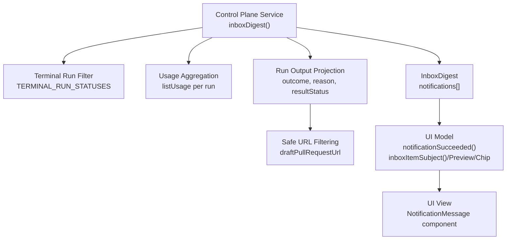
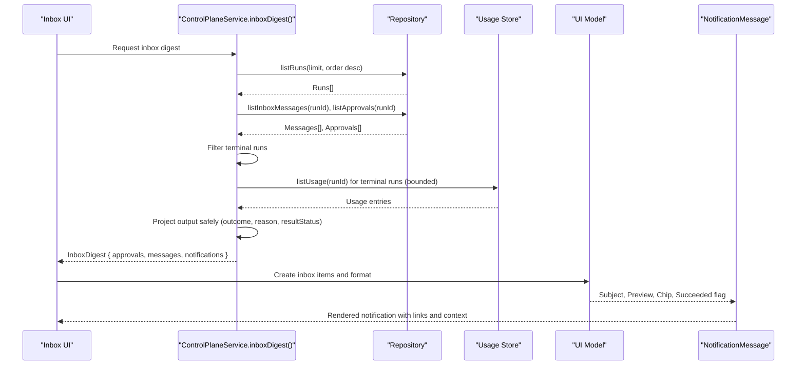
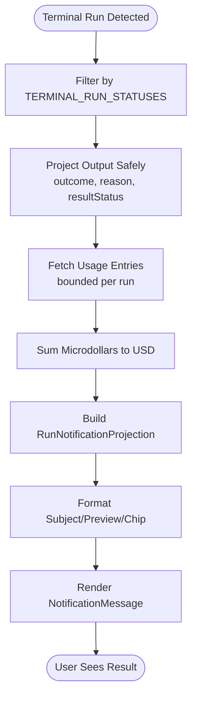
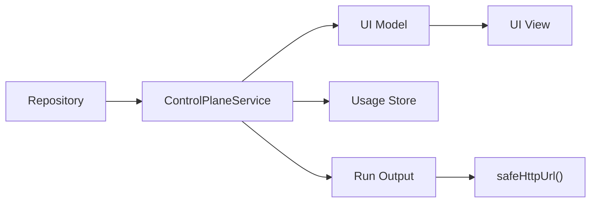

# Notifications System

<cite>
**Referenced Files in This Document**
- [control-plane-service.ts](file://apps/control-plane/src/application/control-plane-service.ts)
- [inbox-view-model.ts](file://apps/control-plane/src/ui/inbox-view-model.ts)
- [inbox-view.tsx](file://apps/control-plane/src/ui/inbox-view.tsx)
- [inbox-view.test.ts](file://apps/control-plane/src/ui/inbox-view.test.ts)
</cite>

## Table of Contents
1. [Introduction](#introduction)
2. [Project Structure](#project-structure)
3. [Core Components](#core-components)
4. [Architecture Overview](#architecture-overview)
5. [Detailed Component Analysis](#detailed-component-analysis)
6. [Dependency Analysis](#dependency-analysis)
7. [Performance Considerations](#performance-considerations)
8. [Troubleshooting Guide](#troubleshooting-guide)
9. [Conclusion](#conclusion)
10. [Appendices](#appendices)

## Introduction
This document explains the notifications system that informs users when workflows reach terminal states and summarizes their outcomes. Notifications are synthesized at read time from durable run records so every completed run is represented in the inbox, even retroactively. The system surfaces success and failure scenarios, outcome details such as draft pull request links and local branch information, cost attribution, and a link to the full run details page. It also documents how success is determined and how different notification types appear to users.

## Project Structure
The notifications system spans three main areas:
- Service layer that synthesizes notifications from terminal runs and aggregates spend data
- UI model that formats subjects, previews, chips, and success determination
- UI components that render notification messages with links and contextual information

**Diagram sources**
- [control-plane-service.ts:1464-1584](file://apps/control-plane/src/application/control-plane-service.ts#L1464-L1584)
- [control-plane-service.ts:319-332](file://apps/control-plane/src/application/control-plane-service.ts#L319-L332)
- [control-plane-service.ts:578-596](file://apps/control-plane/src/application/control-plane-service.ts#L578-L596)
- [inbox-view-model.ts:86-107](file://apps/control-plane/src/ui/inbox-view-model.ts#L86-L107)
- [inbox-view.tsx:236-285](file://apps/control-plane/src/ui/inbox-view.tsx#L236-L285)

**Section sources**
- [control-plane-service.ts:1464-1584](file://apps/control-plane/src/application/control-plane-service.ts#L1464-L1584)
- [inbox-view-model.ts:86-107](file://apps/control-plane/src/ui/inbox-view-model.ts#L86-L107)
- [inbox-view.tsx:236-285](file://apps/control-plane/src/ui/inbox-view.tsx#L236-L285)

## Core Components
- Terminal run detection: Only runs with terminal statuses produce notifications.
- Notification projection: Each terminal run becomes a RunNotificationProjection containing run identifiers, pipeline type, title, status fields, optional outcome, optional reason, optional total cost, project name, and completion timestamp.
- Success determination: A dedicated function evaluates whether a notification represents a successful outcome based on both run-level and workflow result-level status.
- Display formatting: Subjects, previews, chips, and message bodies are generated for consistent user experience.
- Message rendering: The UI renders success or failure messaging, links to draft pull requests, local branch context, spend totals, and a link to the full run details.

**Section sources**
- [control-plane-service.ts:292-317](file://apps/control-plane/src/application/control-plane-service.ts#L292-L317)
- [control-plane-service.ts:1542-1562](file://apps/control-plane/src/application/control-plane-service.ts#L1542-L1562)
- [inbox-view-model.ts:66-107](file://apps/control-plane/src/ui/inbox-view-model.ts#L66-L107)
- [inbox-view.tsx:236-285](file://apps/control-plane/src/ui/inbox-view.tsx#L236-L285)

## Architecture Overview
Notifications are not emitted by workers; they are derived at read time from durable run records. This design ensures history is complete without requiring migration or worker changes. The service gathers recent runs, filters terminal ones, projects output safely, aggregates usage costs, and returns an InboxDigest including approvals, messages, and notifications. The UI then formats these into human-readable items and renders them in the inbox view.

**Diagram sources**
- [control-plane-service.ts:1464-1584](file://apps/control-plane/src/application/control-plane-service.ts#L1464-L1584)
- [inbox-view-model.ts:86-107](file://apps/control-plane/src/ui/inbox-view-model.ts#L86-L107)
- [inbox-view.tsx:236-285](file://apps/control-plane/src/ui/inbox-view.tsx#L236-L285)

## Detailed Component Analysis

### Notification Synthesis in the Service Layer
- Terminal run filtering: Uses a set of terminal statuses to select runs eligible for notifications.
- Output projection: Safely extracts outcome, reason, and resultStatus from run output, ensuring only safe HTTP(S) URLs pass through for draft pull request links.
- Spend aggregation: For terminal runs, usage entries are fetched and summed to compute totalCostUsd, capped to avoid excessive database load.
- Notification construction: Builds RunNotificationProjection objects with all relevant fields, including pipeline, title, statuses, outcome, reason, cost, project name, and completion timestamp.

Key behaviors:
- Outcome includes draftPullRequestUrl, localBranch, and localRepositoryUrl when present.
- Reason is truncated to a safe length.
- ResultStatus reflects workflow-level outcomes like succeeded, rejected, expired, budget_exhausted, failed.

**Section sources**
- [control-plane-service.ts:319-332](file://apps/control-plane/src/application/control-plane-service.ts#L319-L332)
- [control-plane-service.ts:578-596](file://apps/control-plane/src/application/control-plane-service.ts#L578-L596)
- [control-plane-service.ts:1500-1562](file://apps/control-plane/src/application/control-plane-service.ts#L1500-L1562)

### Success Determination: notificationSucceeded
The success determination function checks both the run-level status and the workflow result status:
- A notification is considered successful only if the run status is succeeded and the result status is either undefined (defaulting to succeeded) or explicitly succeeded.
- This dual check prevents marking runs as successful when the workflow result indicates otherwise (e.g., rejected or budget exhausted).

Impact:
- Influences subject suffix (success indicator), chip label (“Completed”), and preview text.
- Drives the message body’s opening sentence (“The run finished successfully.” vs. reason-based messaging).

**Section sources**
- [inbox-view-model.ts:86-93](file://apps/control-plane/src/ui/inbox-view-model.ts#L86-L93)
- [inbox-view-model.ts:99-107](file://apps/control-plane/src/ui/inbox-view-model.ts#L99-L107)
- [inbox-view.tsx:236-249](file://apps/control-plane/src/ui/inbox-view.tsx#L236-L249)

### Display Format and User Experience
Subjects and previews:
- Subject combines a headline (“Run complete”, “Goal rejected”, etc.) with an optional title, appending a success indicator when appropriate.
- Preview highlights key outcome signals: draft pull request opened, local branch presence, reason text, and total spend.

Chips and attention:
- Chips reflect positive, negative, neutral, or attention tones depending on outcome and status.
- Notifications do not require attention unless paired with other interactive items.

Message body:
- Success case: Positive confirmation message.
- Failure case: Displays reason or a generic final state message.
- Links: Draft pull request link when available; link to full run details always present.
- Context: Local branch and repository URL when provided; total spend formatted consistently.

Examples grounded in tests:
- Successful run with local branch and spend shows subject with success marker, preview with branch and spend, and “Completed” chip.
- Failed and rejected runs show distinct subjects and negative chips, with reasons surfaced in previews.

**Section sources**
- [inbox-view-model.ts:66-107](file://apps/control-plane/src/ui/inbox-view-model.ts#L66-L107)
- [inbox-view-model.ts:126-136](file://apps/control-plane/src/ui/inbox-view-model.ts#L126-L136)
- [inbox-view-model.ts:142-163](file://apps/control-plane/src/ui/inbox-view-model.ts#L142-L163)
- [inbox-view.tsx:236-285](file://apps/control-plane/src/ui/inbox-view.tsx#L236-L285)
- [inbox-view.test.ts:163-215](file://apps/control-plane/src/ui/inbox-view.test.ts#L163-L215)

### Data Flow and Processing Logic

**Diagram sources**
- [control-plane-service.ts:1500-1562](file://apps/control-plane/src/application/control-plane-service.ts#L1500-L1562)
- [inbox-view-model.ts:66-107](file://apps/control-plane/src/ui/inbox-view-model.ts#L66-L107)
- [inbox-view.tsx:236-285](file://apps/control-plane/src/ui/inbox-view.tsx#L236-L285)

## Dependency Analysis
- Control plane service depends on repository interfaces to list runs, messages, approvals, and usage.
- UI model depends on service projections to format display logic and determine success.
- UI view depends on model functions to render consistent messages and links.
- Safe URL filtering ensures external inputs cannot inject unsafe hrefs.

**Diagram sources**
- [control-plane-service.ts:578-596](file://apps/control-plane/src/application/control-plane-service.ts#L578-L596)
- [control-plane-service.ts:1464-1584](file://apps/control-plane/src/application/control-plane-service.ts#L1464-L1584)
- [inbox-view-model.ts:86-107](file://apps/control-plane/src/ui/inbox-view-model.ts#L86-L107)
- [inbox-view.tsx:236-285](file://apps/control-plane/src/ui/inbox-view.tsx#L236-L285)

**Section sources**
- [control-plane-service.ts:578-596](file://apps/control-plane/src/application/control-plane-service.ts#L578-L596)
- [control-plane-service.ts:1464-1584](file://apps/control-plane/src/application/control-plane-service.ts#L1464-L1584)
- [inbox-view-model.ts:86-107](file://apps/control-plane/src/ui/inbox-view-model.ts#L86-L107)
- [inbox-view.tsx:236-285](file://apps/control-plane/src/ui/inbox-view.tsx#L236-L285)

## Performance Considerations
- Concurrency bounds: Digest fan-out uses a bounded concurrency helper to avoid overwhelming database connections.
- Spend lookups: Limited to a fixed number of terminal runs per digest to prevent excessive usage queries.
- Safe projections: Minimal parsing and truncation reduce payload sizes and risk.

Recommendations:
- Keep limits conservative to maintain responsiveness under load.
- Monitor database connection usage during peak inbox loads.
- Ensure usage queries remain bounded and efficient.

[No sources needed since this section provides general guidance]

## Troubleshooting Guide
Common issues and resolutions:
- Missing draft pull request link: Verify that the run output contains a valid http(s) draftPullRequestUrl; unsafe or malformed URLs are filtered out.
- No local branch shown: Ensure the run output includes localBranch; absence means no branch was created or recorded.
- Incorrect success indication: Confirm both runStatus and resultStatus align; notificationSucceeded requires runStatus succeeded and resultStatus defaulted or explicitly succeeded.
- Excessive inbox latency: Check that inboxDigest concurrency and NOTIFICATION_SPEND_LOOKUPS limits are appropriate for your environment.

**Section sources**
- [control-plane-service.ts:578-596](file://apps/control-plane/src/application/control-plane-service.ts#L578-L596)
- [control-plane-service.ts:1500-1562](file://apps/control-plane/src/application/control-plane-service.ts#L1500-L1562)
- [inbox-view-model.ts:86-93](file://apps/control-plane/src/ui/inbox-view-model.ts#L86-L93)

## Conclusion
The notifications system provides a robust, read-time synthesis of terminal run outcomes into actionable inbox items. It clearly communicates success and failure, exposes outcome details like draft pull requests and local branches, attributes costs, and guides users to full run details. The separation of concerns between service projection, UI modeling, and rendering ensures consistency, safety, and performance.

[No sources needed since this section summarizes without analyzing specific files]

## Appendices

### Example Notification Types and User Experience
- Successful feature run with local branch and spend:
  - Subject: “Run complete: Add CSV export ✓”
  - Preview: “Local branch agentos/run-release-1a2b3c4d. Total spend: $5.95.”
  - Chip: “Completed” (positive)
  - Message: Success statement, optional draft PR link, local branch context, spend, link to full run.

- Failed run with reason:
  - Subject: “Run failed”
  - Preview: Reason text (e.g., verification step exceeded its budget)
  - Chip: “Failed” (negative)
  - Message: Reason or final state message, link to full run.

- Rejected goal run:
  - Subject: “Goal rejected”
  - Preview: May include reason if present
  - Chip: “Failed” (negative)
  - Message: Final state message, link to full run.

These examples are validated by tests and reflect the actual behavior of the inbox model and view.

**Section sources**
- [inbox-view.test.ts:163-215](file://apps/control-plane/src/ui/inbox-view.test.ts#L163-L215)
- [inbox-view.tsx:236-285](file://apps/control-plane/src/ui/inbox-view.tsx#L236-L285)