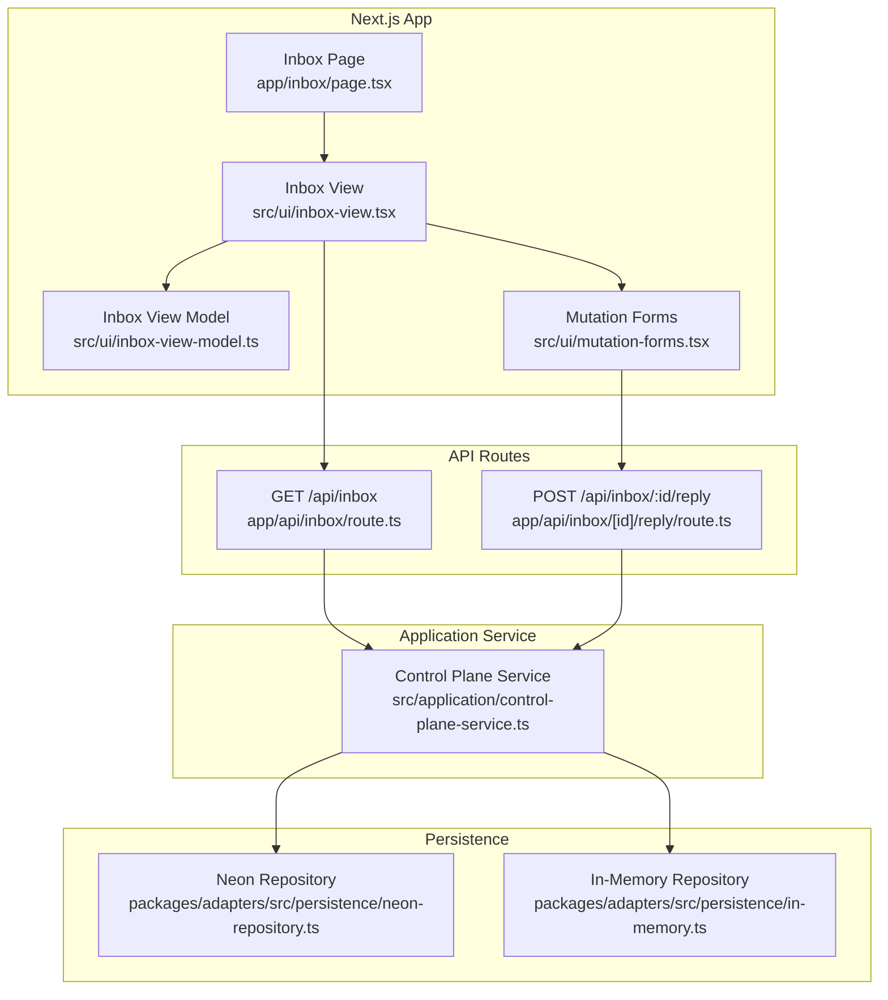
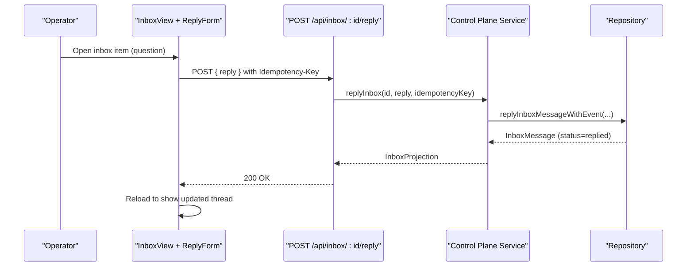
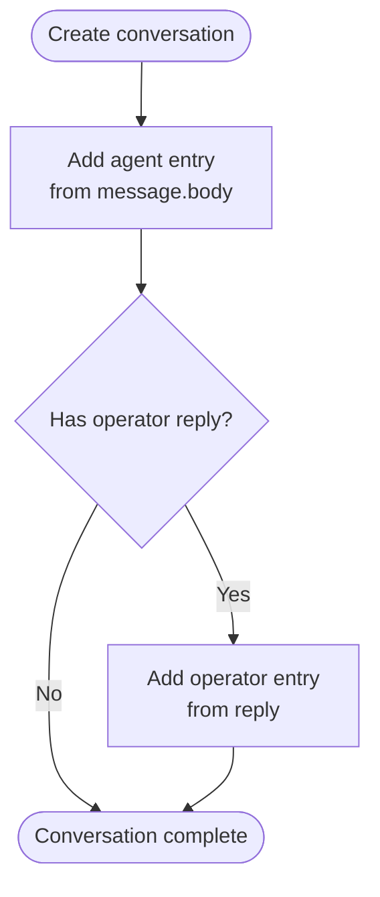
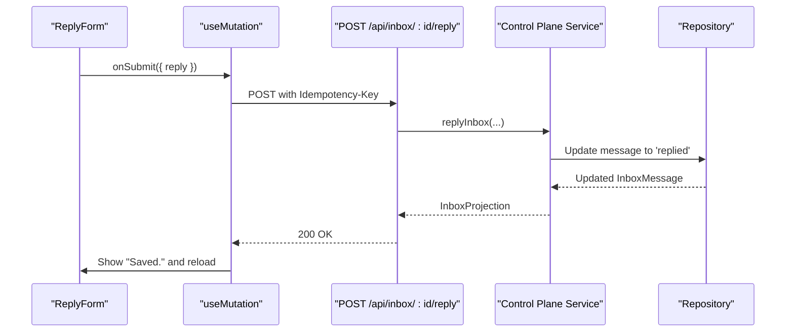
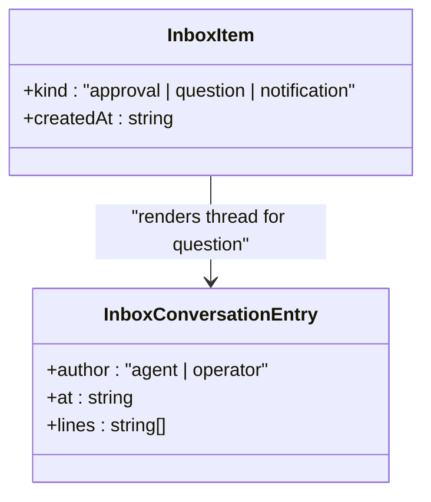
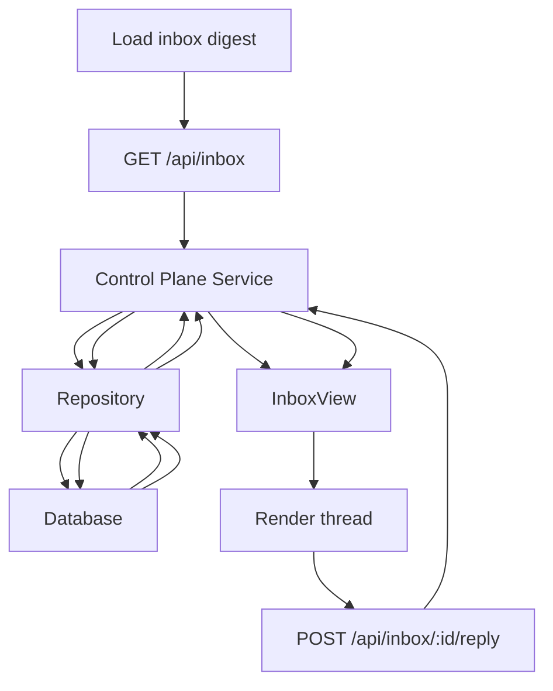
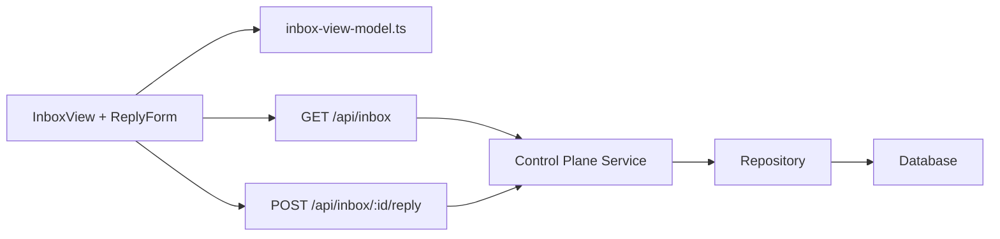

# Question and Answer Conversation

<cite>
**Referenced Files in This Document**
- [page.tsx](file://apps/control-plane/app/inbox/page.tsx)
- [inbox-view.tsx](file://apps/control-plane/src/ui/inbox-view.tsx)
- [inbox-view-model.ts](file://apps/control-plane/src/ui/inbox-view-model.ts)
- [mutation-forms.tsx](file://apps/control-plane/src/ui/mutation-forms.tsx)
- [route.ts (inbox reply)](file://apps/control-plane/app/api/inbox/[id]/reply/route.ts)
- [route.ts (inbox listing)](file://apps/control-plane/app/api/inbox/route.ts)
- [control-plane-service.ts](file://apps/control-plane/src/application/control-plane-service.ts)
- [contracts.ts](file://apps/control-plane/src/http/contracts.ts)
- [neon-repository.ts](file://packages/adapters/src/persistence/neon-repository.ts)
- [in-memory.ts](file://packages/adapters/src/persistence/in-memory.ts)
</cite>

## Table of Contents
1. [Introduction](#introduction)
2. [Project Structure](#project-structure)
3. [Core Components](#core-components)
4. [Architecture Overview](#architecture-overview)
5. [Detailed Component Analysis](#detailed-component-analysis)
6. [Dependency Analysis](#dependency-analysis)
7. [Performance Considerations](#performance-considerations)
8. [Troubleshooting Guide](#troubleshooting-guide)
9. [Conclusion](#conclusion)

## Introduction
This document explains the interactive question-answer conversation system that enables back-and-forth dialogue between agents and operators. It covers how questions are created, how conversation threads maintain message history and context, how operators submit replies via the ReplyForm component, how suggested options are displayed, how messages are formatted with timestamps and sender identification, and how conversations are persisted and retrieved.

## Project Structure
The inbox feature is implemented as a Next.js app route that loads an inbox digest and renders a client-side view. The view composes a list of items (approvals, questions, notifications) and displays a selected item’s thread. For questions, it shows a conversation thread built from the agent’s initial message and any operator reply, along with optional suggested options provided by the agent. Operators can send replies through a form that calls a server API to persist the response.

**Diagram sources**
- [page.tsx:12-56](file://apps/control-plane/app/inbox/page.tsx#L12-L56)
- [inbox-view.tsx:341-423](file://apps/control-plane/src/ui/inbox-view.tsx#L341-L423)
- [inbox-view-model.ts:205-256](file://apps/control-plane/src/ui/inbox-view-model.ts#L205-L256)
- [mutation-forms.tsx:152-179](file://apps/control-plane/src/ui/mutation-forms.tsx#L152-L179)
- [route.ts (inbox listing):11-32](file://apps/control-plane/app/api/inbox/route.ts#L11-L32)
- [route.ts (inbox reply):13-33](file://apps/control-plane/app/api/inbox/[id]/reply/route.ts#L13-L33)
- [control-plane-service.ts:1719-1764](file://apps/control-plane/src/application/control-plane-service.ts#L1719-L1764)
- [neon-repository.ts:1020-1073](file://packages/adapters/src/persistence/neon-repository.ts#L1020-L1073)
- [in-memory.ts:857-877](file://packages/adapters/src/persistence/in-memory.ts#L857-L877)

**Section sources**
- [page.tsx:12-56](file://apps/control-plane/app/inbox/page.tsx#L12-L56)
- [inbox-view.tsx:341-423](file://apps/control-plane/src/ui/inbox-view.tsx#L341-L423)

## Core Components
- Inbox page: Loads project filters and an inbox digest containing messages, approvals, and notifications. Renders either an empty state or the InboxView.
- Inbox view: Builds a unified list of inbox items, separates attention items from history, and renders the selected item’s details. For questions, it renders a conversation thread and a reply form when pending.
- View model: Creates conversation entries from message body and reply, formats subjects and previews, computes chips for status, and splits items into attention vs history.
- Reply form: A client form that posts a reply to the server with an idempotency key and refreshes on success.
- API routes: Provide endpoints to list inbox items and reply to a specific message.
- Control plane service: Projects inbox content safely, handles reply logic with idempotency and event conflict handling, and returns projections.
- Persistence: Stores inbox messages with status transitions from pending to replied, including reply payload and timestamp.

**Section sources**
- [inbox-view-model.ts:39-64](file://apps/control-plane/src/ui/inbox-view-model.ts#L39-L64)
- [inbox-view-model.ts:99-163](file://apps/control-plane/src/ui/inbox-view-model.ts#L99-L163)
- [inbox-view-model.ts:205-256](file://apps/control-plane/src/ui/inbox-view-model.ts#L205-L256)
- [mutation-forms.tsx:152-179](file://apps/control-plane/src/ui/mutation-forms.tsx#L152-L179)
- [route.ts (inbox listing):11-32](file://apps/control-plane/app/api/inbox/route.ts#L11-L32)
- [route.ts (inbox reply):13-33](file://apps/control-plane/app/api/inbox/[id]/reply/route.ts#L13-L33)
- [control-plane-service.ts:389-423](file://apps/control-plane/src/application/control-plane-service.ts#L389-L423)
- [control-plane-service.ts:1719-1764](file://apps/control-plane/src/application/control-plane-service.ts#L1719-L1764)
- [neon-repository.ts:1020-1073](file://packages/adapters/src/persistence/neon-repository.ts#L1020-L1073)
- [in-memory.ts:857-877](file://packages/adapters/src/persistence/in-memory.ts#L857-L877)

## Architecture Overview
The conversation flow starts when an agent creates a question message with optional suggested options. The inbox lists this message as a “question” item. Operators open the item, see the agent’s message and any prior reply, and optionally choose from suggested options or type a detailed reply. The ReplyForm sends the reply to the server, which persists it and marks the message as replied. The UI reloads to reflect the updated thread.

**Diagram sources**
- [mutation-forms.tsx:152-179](file://apps/control-plane/src/ui/mutation-forms.tsx#L152-L179)
- [route.ts (inbox reply):13-33](file://apps/control-plane/app/api/inbox/[id]/reply/route.ts#L13-L33)
- [control-plane-service.ts:1719-1764](file://apps/control-plane/src/application/control-plane-service.ts#L1719-L1764)
- [neon-repository.ts:1020-1073](file://packages/adapters/src/persistence/neon-repository.ts#L1020-L1073)

## Detailed Component Analysis

### Conversation Threading Model
- Agent message: The first entry in the thread is authored by the agent, using fields from the message body such as question, message, text, or answer.
- Operator reply: If present, a second entry is authored by the operator, using fields from the reply object.
- Timestamps: Each entry includes an ISO timestamp; operator replies use repliedAt if available, otherwise createdAt.
- Options: When the agent provides suggested options, they are rendered under the agent’s message.

**Diagram sources**
- [inbox-view-model.ts:39-64](file://apps/control-plane/src/ui/inbox-view-model.ts#L39-L64)

**Section sources**
- [inbox-view-model.ts:39-64](file://apps/control-plane/src/ui/inbox-view-model.ts#L39-L64)
- [inbox-view.tsx:179-234](file://apps/control-plane/src/ui/inbox-view.tsx#L179-L234)

### ReplyForm Component
- Purpose: Allows operators to submit a reply to a pending question.
- Behavior: Submits a JSON payload with a reply string or structured object to the server endpoint, attaching a generated idempotency key. On success, the page reloads to show the updated thread.
- Validation: Server schema enforces reply size and shape.

**Diagram sources**
- [mutation-forms.tsx:29-54](file://apps/control-plane/src/ui/mutation-forms.tsx#L29-L54)
- [mutation-forms.tsx:152-179](file://apps/control-plane/src/ui/mutation-forms.tsx#L152-L179)
- [route.ts (inbox reply):13-33](file://apps/control-plane/app/api/inbox/[id]/reply/route.ts#L13-L33)
- [control-plane-service.ts:1719-1764](file://apps/control-plane/src/application/control-plane-service.ts#L1719-L1764)
- [neon-repository.ts:1020-1073](file://packages/adapters/src/persistence/neon-repository.ts#L1020-L1073)

**Section sources**
- [mutation-forms.tsx:152-179](file://apps/control-plane/src/ui/mutation-forms.tsx#L152-L179)
- [contracts.ts:121-128](file://apps/control-plane/src/http/contracts.ts#L121-L128)

### Message Formatting, Timestamps, and Sender Identification
- Sender labels: Agent messages display “Agent OS”; operator replies display “You”.
- Timestamps: Displayed in UTC using a human-readable format; relative time formatting is used in list views.
- Content lines: Extracted from message body and reply fields, deduplicated, and rendered as paragraphs.
- Suggested options: Rendered only for agent messages when options are present.

**Diagram sources**
- [inbox-view-model.ts:28-32](file://apps/control-plane/src/ui/inbox-view-model.ts#L28-L32)
- [inbox-view.tsx:179-234](file://apps/control-plane/src/ui/inbox-view.tsx#L179-L234)

**Section sources**
- [inbox-view.tsx:28-36](file://apps/control-plane/src/ui/inbox-view.tsx#L28-L36)
- [inbox-view.tsx:179-234](file://apps/control-plane/src/ui/inbox-view.tsx#L179-L234)
- [inbox-view-model.ts:99-163](file://apps/control-plane/src/ui/inbox-view-model.ts#L99-L163)

### Agent Question Structure and Follow-up Prompts
- Body fields: Agents can include text, question, message, answer, and options.
- Options: When provided, they appear as suggested choices for the operator.
- Follow-ups: Operators can respond with free-form text or structured data; subsequent agent messages can continue the thread based on the reply.

**Section sources**
- [contracts.ts:325-353](file://apps/control-plane/src/http/contracts.ts#L325-L353)
- [control-plane-service.ts:389-423](file://apps/control-plane/src/application/control-plane-service.ts#L389-L423)
- [inbox-view.tsx:213-224](file://apps/control-plane/src/ui/inbox-view.tsx#L213-L224)

### Conversation Persistence and Retrieval Patterns
- Listing: The inbox listing endpoint returns messages and approvals, optionally filtered by project.
- Retrieval: The inbox page requests a digest and renders items; each question item contains its full projection for rendering.
- Reply persistence: The service validates idempotency and updates the message status to replied, storing the reply payload and timestamp. Both in-memory and Neon repositories enforce atomicity and constraints.

**Diagram sources**
- [route.ts (inbox listing):11-32](file://apps/control-plane/app/api/inbox/route.ts#L11-L32)
- [control-plane-service.ts:1719-1764](file://apps/control-plane/src/application/control-plane-service.ts#L1719-L1764)
- [neon-repository.ts:1020-1073](file://packages/adapters/src/persistence/neon-repository.ts#L1020-L1073)
- [in-memory.ts:857-877](file://packages/adapters/src/persistence/in-memory.ts#L857-L877)

**Section sources**
- [route.ts (inbox listing):11-32](file://apps/control-plane/app/api/inbox/route.ts#L11-L32)
- [control-plane-service.ts:1719-1764](file://apps/control-plane/src/application/control-plane-service.ts#L1719-L1764)
- [neon-repository.ts:1020-1073](file://packages/adapters/src/persistence/neon-repository.ts#L1020-L1073)
- [in-memory.ts:857-877](file://packages/adapters/src/persistence/in-memory.ts#L857-L877)

## Dependency Analysis
- UI depends on view model functions to build conversation entries and compute inbox items.
- UI components call API routes for listing and replying.
- API routes depend on authentication and contract schemas for validation.
- Control plane service coordinates repository operations and projects domain models to safe projections.
- Repositories implement persistence with consistent status transitions and indexes.

**Diagram sources**
- [inbox-view.tsx:341-423](file://apps/control-plane/src/ui/inbox-view.tsx#L341-L423)
- [inbox-view-model.ts:205-256](file://apps/control-plane/src/ui/inbox-view-model.ts#L205-L256)
- [route.ts (inbox listing):11-32](file://apps/control-plane/app/api/inbox/route.ts#L11-L32)
- [route.ts (inbox reply):13-33](file://apps/control-plane/app/api/inbox/[id]/reply/route.ts#L13-L33)
- [control-plane-service.ts:1719-1764](file://apps/control-plane/src/application/control-plane-service.ts#L1719-L1764)
- [neon-repository.ts:1020-1073](file://packages/adapters/src/persistence/neon-repository.ts#L1020-L1073)

**Section sources**
- [inbox-view.tsx:341-423](file://apps/control-plane/src/ui/inbox-view.tsx#L341-L423)
- [inbox-view-model.ts:205-256](file://apps/control-plane/src/ui/inbox-view-model.ts#L205-L256)
- [route.ts (inbox listing):11-32](file://apps/control-plane/app/api/inbox/route.ts#L11-L32)
- [route.ts (inbox reply):13-33](file://apps/control-plane/app/api/inbox/[id]/reply/route.ts#L13-L33)
- [control-plane-service.ts:1719-1764](file://apps/control-plane/src/application/control-plane-service.ts#L1719-L1764)
- [neon-repository.ts:1020-1073](file://packages/adapters/src/persistence/neon-repository.ts#L1020-L1073)

## Performance Considerations
- Pagination and limits: Inbox listing uses bounded limits to avoid large payloads.
- Indexing: Database indexes optimize queries by run_id and created_at for efficient retrieval.
- Client-side formatting: Relative timestamps reduce re-render churn and keep UI responsive.
- Idempotency: Prevents duplicate replies and reduces unnecessary retries.

[No sources needed since this section provides general guidance]

## Troubleshooting Guide
- Duplicate reply attempts: The service detects idempotency conflicts and returns a conflict error; the UI surfaces a clear message indicating the request is no longer open.
- Already replied messages: Persistence layers reject replies for non-pending messages to prevent inconsistent state.
- Missing reply content: If reply content is unavailable, the UI shows a placeholder indicating the agent requested input.

**Section sources**
- [control-plane-service.ts:1719-1764](file://apps/control-plane/src/application/control-plane-service.ts#L1719-L1764)
- [in-memory.ts:857-877](file://packages/adapters/src/persistence/in-memory.ts#L857-L877)
- [mutation-forms.tsx:11-27](file://apps/control-plane/src/ui/mutation-forms.tsx#L11-L27)
- [inbox-view.tsx:203-212](file://apps/control-plane/src/ui/inbox-view.tsx#L203-L212)

## Conclusion
The question-answer conversation system provides a robust, user-friendly interface for agents to request clarification and for operators to provide detailed responses. It maintains clear conversation threads, supports suggested options, formats messages with timestamps and sender identification, and ensures reliable persistence with idempotent operations. The modular architecture separates UI concerns, API contracts, service logic, and persistence, enabling maintainability and scalability.