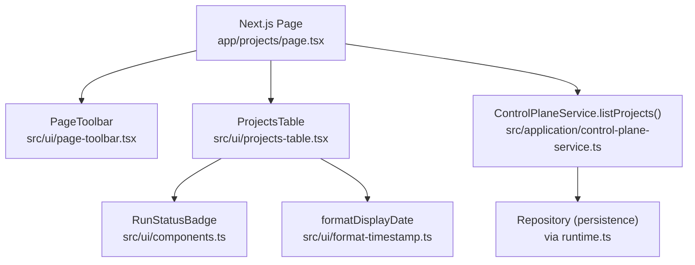
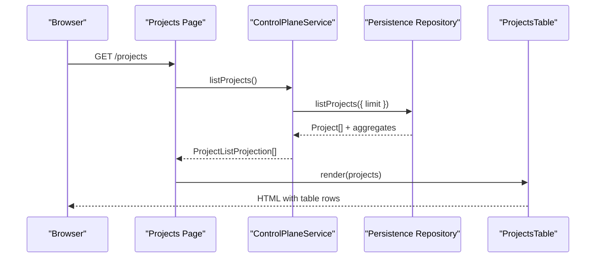
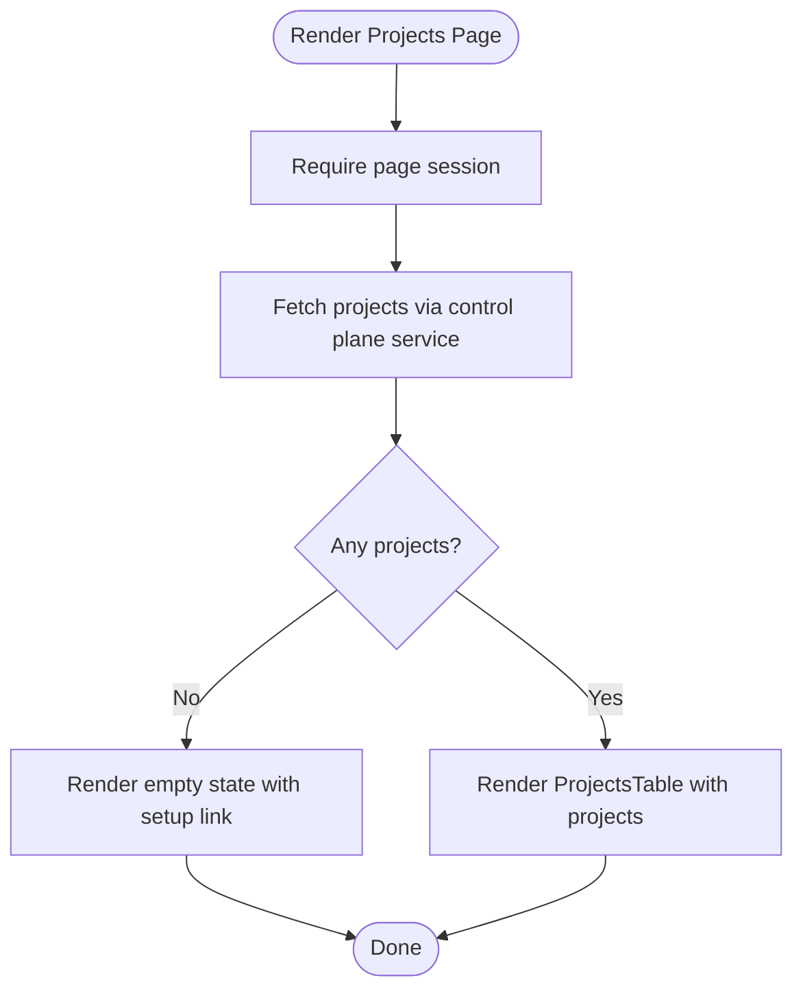
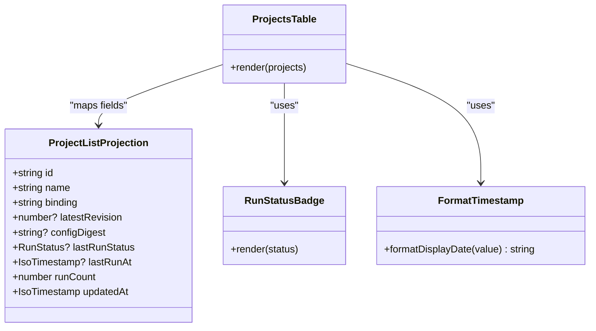
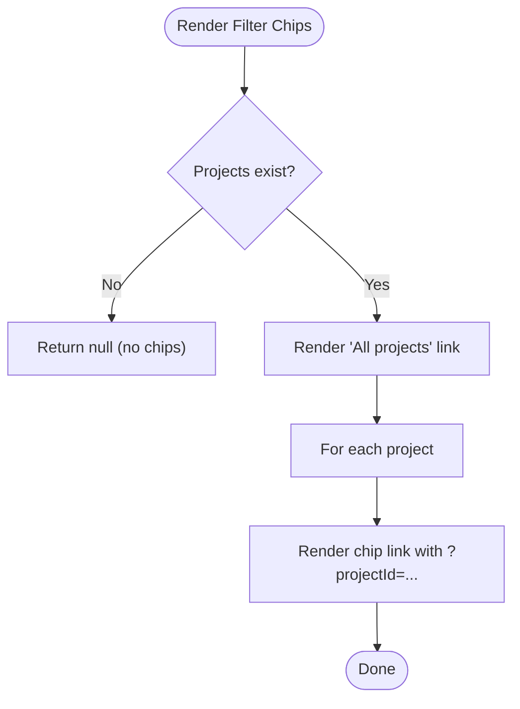
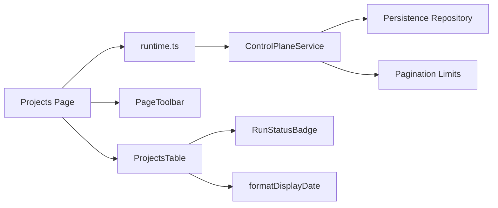

# Project Overview and Dashboard Views

<cite>
**Referenced Files in This Document**
- [page.tsx](file://apps/control-plane/app/projects/page.tsx)
- [projects-table.tsx](file://apps/control-plane/src/ui/projects-table.tsx)
- [project-filter-chips.tsx](file://apps/control-plane/src/ui/project-filter-chips.tsx)
- [page-toolbar.tsx](file://apps/control-plane/src/ui/page-toolbar.tsx)
- [components.ts](file://apps/control-plane/src/ui/components.ts)
- [format-timestamp.ts](file://apps/control-plane/src/ui/format-timestamp.ts)
- [control-plane-service.ts](file://apps/control-plane/src/application/control-plane-service.ts)
- [runtime.ts](file://apps/control-plane/src/application/runtime.ts)
- [pagination.ts](file://packages/adapters/src/persistence/pagination.ts)
</cite>

## Table of Contents
1. [Introduction](#introduction)
2. [Project Structure](#project-structure)
3. [Core Components](#core-components)
4. [Architecture Overview](#architecture-overview)
5. [Detailed Component Analysis](#detailed-component-analysis)
6. [Dependency Analysis](#dependency-analysis)
7. [Performance Considerations](#performance-considerations)
8. [Troubleshooting Guide](#troubleshooting-guide)
9. [Conclusion](#conclusion)
10. [Appendices](#appendices)

## Introduction
This document explains the project overview dashboard that provides a comprehensive view of all managed projects and their current states. It covers the projects table, filter chips, page toolbar, data binding, sorting and filtering strategies, pagination, customization guidance, integration points with external tools, responsive design patterns, and accessibility considerations.

## Project Structure
The dashboard is implemented as a Next.js server component page that renders a toolbar and a projects table. Data is fetched on the server using the control plane service, which queries persistence and returns lightweight projections for UI rendering.

**Diagram sources**
- [page.tsx:10-32](file://apps/control-plane/app/projects/page.tsx#L10-L32)
- [page-toolbar.tsx:4-24](file://apps/control-plane/src/ui/page-toolbar.tsx#L4-L24)
- [projects-table.tsx:6-64](file://apps/control-plane/src/ui/projects-table.tsx#L6-L64)
- [control-plane-service.ts:788-800](file://apps/control-plane/src/application/control-plane-service.ts#L788-L800)
- [runtime.ts:573-625](file://apps/control-plane/src/application/runtime.ts#L573-L625)
- [components.ts:12-26](file://apps/control-plane/src/ui/components.ts#L12-L26)
- [format-timestamp.ts:9-13](file://apps/control-plane/src/ui/format-timestamp.ts#L9-L13)

**Section sources**
- [page.tsx:10-32](file://apps/control-plane/app/projects/page.tsx#L10-L32)
- [runtime.ts:573-625](file://apps/control-plane/src/application/runtime.ts#L573-L625)

## Core Components
- Projects page: Server component that authenticates the session, fetches projects via the control plane service, computes a count label, and renders either an empty state or the projects table.
- Page toolbar: Renders title, description, and an optional action area (e.g., project count).
- Projects table: Displays columns for project name, binding, revision, last run status, and updated time. Uses a status badge and formatted date.
- Filter chips: Navigation-based filters that link to other pages with a query parameter to scope by project.
- Status badge and empty state: Reusable UI components with accessible labels and roles.

**Section sources**
- [page.tsx:10-32](file://apps/control-plane/app/projects/page.tsx#L10-L32)
- [page-toolbar.tsx:4-24](file://apps/control-plane/src/ui/page-toolbar.tsx#L4-L24)
- [projects-table.tsx:6-64](file://apps/control-plane/src/ui/projects-table.tsx#L6-L64)
- [project-filter-chips.tsx:4-33](file://apps/control-plane/src/ui/project-filter-chips.tsx#L4-L33)
- [components.ts:12-41](file://apps/control-plane/src/ui/components.ts#L12-L41)

## Architecture Overview
The dashboard follows a server-rendered data flow:
- The page calls the control plane service to list projects.
- The service composes repository queries and returns a lightweight projection suitable for the UI.
- The table renders the projection without client-side transformation.
- Filter chips are links that pass a project identifier via query string to downstream pages.

**Diagram sources**
- [page.tsx:10-32](file://apps/control-plane/app/projects/page.tsx#L10-L32)
- [control-plane-service.ts:788-800](file://apps/control-plane/src/application/control-plane-service.ts#L788-L800)
- [runtime.ts:573-625](file://apps/control-plane/src/application/runtime.ts#L573-L625)

## Detailed Component Analysis

### Projects Page
- Authentication: Requires a page session before rendering.
- Data fetching: Calls the control plane service to retrieve all projects.
- Counting: Computes a human-readable label for the number of projects.
- Rendering: Shows an empty state when there are no projects; otherwise renders the projects table.

**Diagram sources**
- [page.tsx:10-32](file://apps/control-plane/app/projects/page.tsx#L10-L32)

**Section sources**
- [page.tsx:10-32](file://apps/control-plane/app/projects/page.tsx#L10-L32)

### Projects Table
- Columns: Project name (with id), binding, latest revision (with short config digest), last run status, updated timestamp.
- Data binding: Directly maps fields from ProjectListProjection to table cells.
- Status display: Uses RunStatusBadge for consistent, accessible status rendering.
- Date formatting: Uses formatDisplayDate for localized, readable dates.

**Diagram sources**
- [projects-table.tsx:6-64](file://apps/control-plane/src/ui/projects-table.tsx#L6-L64)
- [control-plane-service.ts:105-115](file://apps/control-plane/src/application/control-plane-service.ts#L105-L115)
- [components.ts:12-26](file://apps/control-plane/src/ui/components.ts#L12-L26)
- [format-timestamp.ts:9-13](file://apps/control-plane/src/ui/format-timestamp.ts#L9-L13)

**Section sources**
- [projects-table.tsx:6-64](file://apps/control-plane/src/ui/projects-table.tsx#L6-L64)
- [control-plane-service.ts:105-115](file://apps/control-plane/src/application/control-plane-service.ts#L105-L115)

### Project Filter Chips
- Purpose: Provide quick navigation to filter views by project across related pages.
- Behavior: Renders “All projects” plus one chip per project; active project is indicated via aria-current.
- Query parameter: Appends projectId to the target base path for downstream filtering.

**Diagram sources**
- [project-filter-chips.tsx:4-33](file://apps/control-plane/src/ui/project-filter-chips.tsx#L4-L33)

**Section sources**
- [project-filter-chips.tsx:4-33](file://apps/control-plane/src/ui/project-filter-chips.tsx#L4-L33)

### Page Toolbar
- Purpose: Provides a consistent header with title, description, and an action area.
- Usage: Displays the project count label on the projects page.
- Accessibility: Uses semantic heading and optional id for programmatic association.

**Section sources**
- [page-toolbar.tsx:4-24](file://apps/control-plane/src/ui/page-toolbar.tsx#L4-L24)
- [page.tsx:17-24](file://apps/control-plane/app/projects/page.tsx#L17-L24)

### Data Model and Projection
- ProjectListProjection defines the minimal set of fields required by the projects table, including identifiers, binding, revision metadata, last run status, counts, and timestamps.
- The control plane service builds this projection efficiently by querying only what is needed for listing.

**Section sources**
- [control-plane-service.ts:105-115](file://apps/control-plane/src/application/control-plane-service.ts#L105-L115)
- [control-plane-service.ts:788-800](file://apps/control-plane/src/application/control-plane-service.ts#L788-L800)

## Dependency Analysis
- Page depends on runtime to obtain the control plane service instance.
- Control plane service depends on persistence repository and optional integrations (workflow dispatch, artifact store).
- UI components depend on shared utilities for status badges and date formatting.
- Pagination limits are enforced at the adapter layer to protect performance.

**Diagram sources**
- [page.tsx:10-32](file://apps/control-plane/app/projects/page.tsx#L10-L32)
- [runtime.ts:573-625](file://apps/control-plane/src/application/runtime.ts#L573-L625)
- [control-plane-service.ts:788-800](file://apps/control-plane/src/application/control-plane-service.ts#L788-L800)
- [pagination.ts:1-10](file://packages/adapters/src/persistence/pagination.ts#L1-L10)

**Section sources**
- [pagination.ts:1-10](file://packages/adapters/src/persistence/pagination.ts#L1-L10)
- [runtime.ts:573-625](file://apps/control-plane/src/application/runtime.ts#L573-L625)

## Performance Considerations
- Server-side data fetching: The projects page fetches data once on the server, minimizing client work.
- Lightweight projections: Only necessary fields are returned to reduce payload size.
- Concurrency controls: The service uses bounded concurrency for heavy fan-out operations elsewhere; similar principles apply to avoid overloading the database.
- Pagination caps: List limits are bounded to prevent excessive data retrieval.

[No sources needed since this section provides general guidance]

## Troubleshooting Guide
- No projects shown: If the list is empty, the page displays an empty state directing users to Setup to register the first project.
- Session errors: The page requires a valid session; ensure authentication is configured and the user is logged in.
- Status not updating: The last run status reflects the most recent run; if stale, verify background reconciliation or workflow dispatch is running.
- Filter chips not visible: Chips only render when there are projects; ensure projects exist before expecting chips.

**Section sources**
- [page.tsx:25-32](file://apps/control-plane/app/projects/page.tsx#L25-L32)
- [project-filter-chips.tsx:13-14](file://apps/control-plane/src/ui/project-filter-chips.tsx#L13-L14)

## Conclusion
The project overview dashboard provides a clear, server-rendered view of all managed projects with essential metadata and status indicators. It leverages lightweight projections, reusable UI components, and simple navigation-based filters. The architecture emphasizes performance and accessibility while remaining extensible for future enhancements such as client-side sorting, advanced filtering, and pagination controls.

[No sources needed since this section summarizes without analyzing specific files]

## Appendices

### Customization Guidance
- Adding new columns: Extend the projects table to include additional fields from ProjectListProjection or enrich the projection in the control plane service. Ensure any new fields are available in the server-side projection and add corresponding table headers and cells.
- Adding new filters: Implement filter chips similar to the existing pattern by generating links with appropriate query parameters. Downstream pages can read these parameters to scope results.
- Integrating with external project management tools: Use the control plane service’s project identifiers and bindings to construct deep links or embed references to external systems. Where possible, expose stable IDs and binding labels for interoperability.

[No sources needed since this section provides general guidance]

### Responsive Design Patterns
- Tables: Use CSS classes applied to the table wrapper to enable horizontal scrolling or stacking on small screens. Ensure text truncation and alignment remain readable on mobile devices.
- Toolbar: Keep title and description concise; consider collapsing or reordering elements on narrow viewports.
- Chips: Wrap chips in a scrollable container to allow horizontal navigation on mobile.

[No sources needed since this section provides general guidance]

### Accessibility Compliance
- Screen readers:
  - Use semantic headings and associate them with ids where needed.
  - Provide descriptive aria-labels for status badges and interactive elements.
  - Mark empty states with appropriate roles to announce context.
- Keyboard navigation:
  - Ensure all links and interactive elements are reachable via keyboard.
  - Use aria-current to indicate the active filter chip.
- Color independence:
  - Status badges include both visual styling and text/aria-labels so meaning is conveyed without color alone.

**Section sources**
- [components.ts:12-26](file://apps/control-plane/src/ui/components.ts#L12-L26)
- [project-filter-chips.tsx:15-30](file://apps/control-plane/src/ui/project-filter-chips.tsx#L15-L30)
- [page-toolbar.tsx:15-22](file://apps/control-plane/src/ui/page-toolbar.tsx#L15-L22)