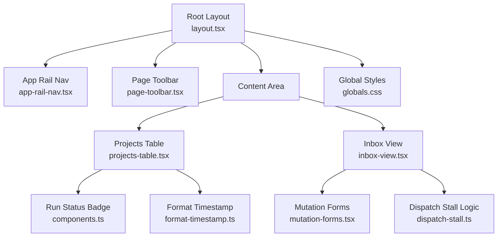
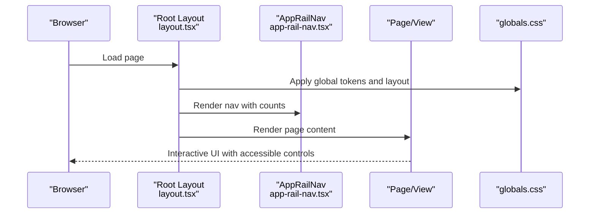
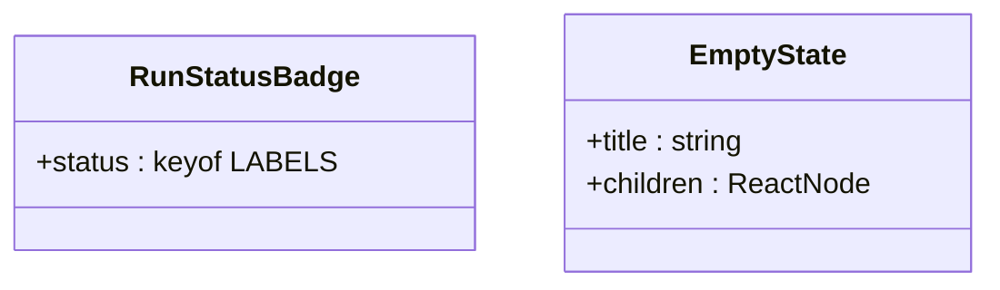
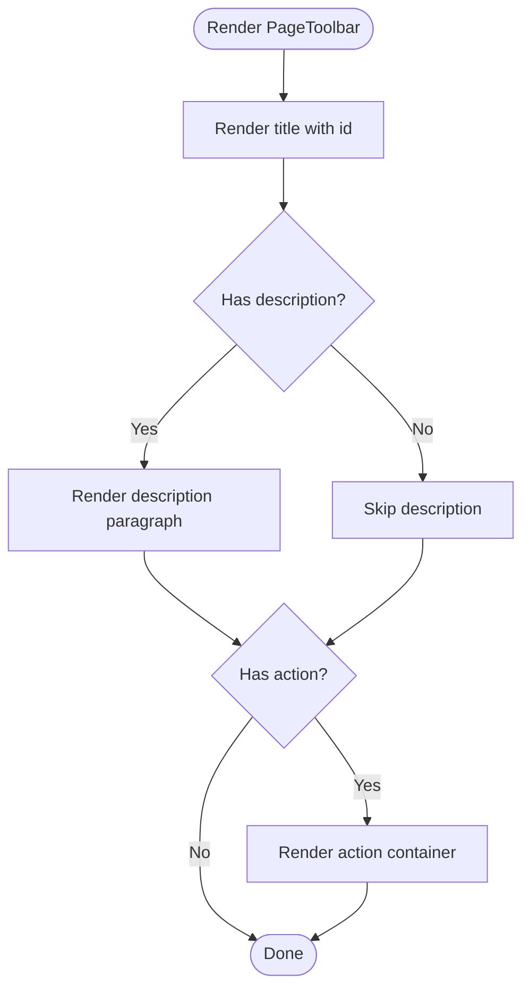
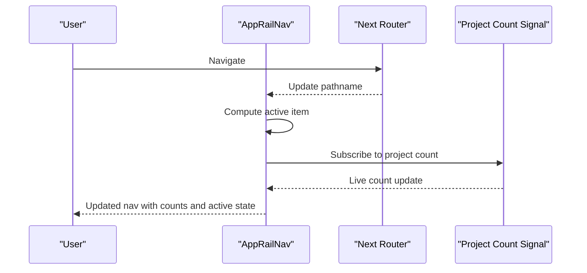
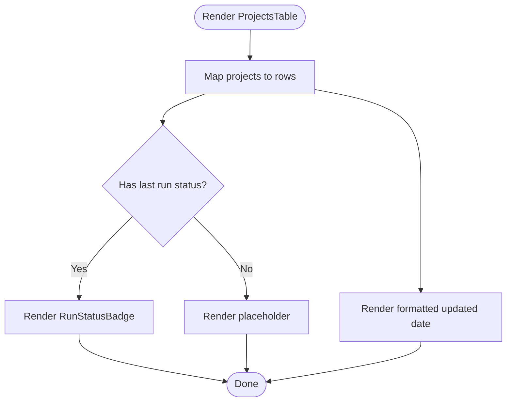
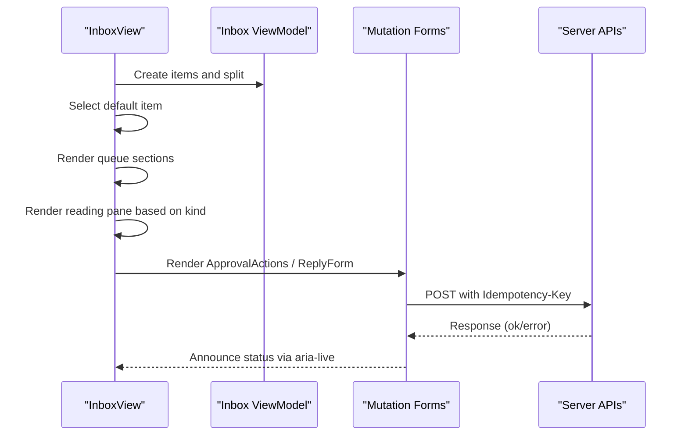
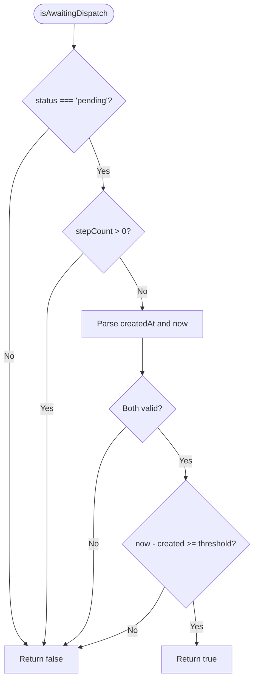
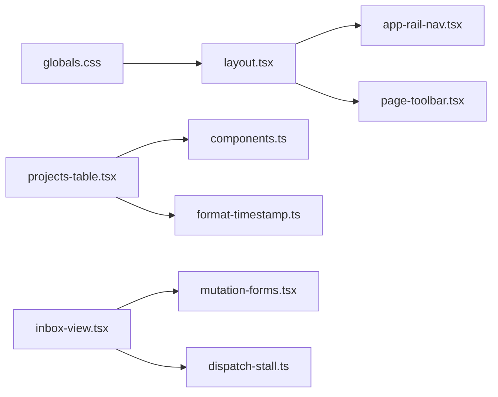

# Reusable UI Components and Patterns

<cite>
**Referenced Files in This Document**
- [components.ts](file://apps/control-plane/src/ui/components.ts)
- [format-timestamp.ts](file://apps/control-plane/src/ui/format-timestamp.ts)
- [time-of-day-greeting.ts](file://apps/control-plane/src/ui/time-of-day-greeting.ts)
- [page-toolbar.tsx](file://apps/control-plane/src/ui/page-toolbar.tsx)
- [mutation-forms.tsx](file://apps/control-plane/src/ui/mutation-forms.tsx)
- [projects-table.tsx](file://apps/control-plane/src/ui/projects-table.tsx)
- [inbox-view.tsx](file://apps/control-plane/src/ui/inbox-view.tsx)
- [app-rail-nav.tsx](file://apps/control-plane/src/ui/app-rail-nav.tsx)
- [project-filter-chips.tsx](file://apps/control-plane/src/ui/project-filter-chips.tsx)
- [dispatch-stall.ts](file://apps/control-plane/src/ui/dispatch-stall.ts)
- [globals.css](file://apps/control-plane/app/globals.css)
- [layout.tsx](file://apps/control-plane/app/layout.tsx)
</cite>

## Table of Contents
1. [Introduction](#introduction)
2. [Project Structure](#project-structure)
3. [Core Components](#core-components)
4. [Architecture Overview](#architecture-overview)
5. [Detailed Component Analysis](#detailed-component-analysis)
6. [Dependency Analysis](#dependency-analysis)
7. [Performance Considerations](#performance-considerations)
8. [Troubleshooting Guide](#troubleshooting-guide)
9. [Conclusion](#conclusion)
10. [Appendices](#appendices)

## Introduction
This document describes the reusable UI component library and shared patterns used throughout the Agent OS Passerine dashboard. It explains how components are composed, their prop interfaces, styling approaches, and utility functions for timestamps and greetings. It also outlines design system principles (colors, typography, spacing, responsive behavior), guidance for creating and extending components, testing strategies, accessibility requirements, and cross-browser considerations.

## Project Structure
The UI layer is organized under apps/control-plane/src/ui with small, focused components and utilities:
- Shared primitives and status indicators live in a compact module.
- Layout scaffolding and navigation are provided by rail and toolbar components.
- Domain-specific views (inbox, projects table) compose primitives and utilities.
- Global styles define the design tokens and layout rules.
- The root layout wires the shell, rail, and content area.

**Diagram sources**
- [layout.tsx:17-53](file://apps/control-plane/app/layout.tsx#L17-L53)
- [app-rail-nav.tsx:26-76](file://apps/control-plane/src/ui/app-rail-nav.tsx#L26-L76)
- [page-toolbar.tsx:4-24](file://apps/control-plane/src/ui/page-toolbar.tsx#L4-L24)
- [projects-table.tsx:6-64](file://apps/control-plane/src/ui/projects-table.tsx#L6-L64)
- [inbox-view.tsx:341-422](file://apps/control-plane/src/ui/inbox-view.tsx#L341-L422)
- [components.ts:12-41](file://apps/control-plane/src/ui/components.ts#L12-L41)
- [format-timestamp.ts:8-13](file://apps/control-plane/src/ui/format-timestamp.ts#L8-L13)
- [mutation-forms.tsx:29-54](file://apps/control-plane/src/ui/mutation-forms.tsx#L29-L54)
- [dispatch-stall.ts:28-44](file://apps/control-plane/src/ui/dispatch-stall.ts#L28-L44)
- [globals.css:1-36](file://apps/control-plane/app/globals.css#L1-L36)

**Section sources**
- [layout.tsx:17-53](file://apps/control-plane/app/layout.tsx#L17-L53)
- [globals.css:1-36](file://apps/control-plane/app/globals.css#L1-L36)

## Core Components
- RunStatusBadge: Renders a localized status label with an accessible aria-label and a semantic class derived from the status value.
- EmptyState: Provides a consistent empty-state container with role="status" and accessible heading structure.
- PageToolbar: Composes page title, description, and optional action area with accessible headings and id support.
- AppRailNav: Client-side navigation with active state detection, count badges, and live project count updates via a signal subscription.
- ProjectFilterChips: Filter chips that render “All projects” plus per-project links with proper aria-current usage.
- ProjectsTable: Displays a list of projects with formatted dates and status badges; composes formatting and badge components.
- InboxView: Orchestrates inbox queues, selection, and detail rendering for approvals, questions, and notifications; integrates mutation forms for actions.
- MutationForms: Provides a useMutation hook and domain-specific action components (ApprovalActions, CancelRunAction, ReplyForm) with idempotency keys, pending states, and accessible status announcements.

Prop interfaces and composition patterns:
- Props are narrowly typed using TypeScript to constrain values (e.g., status keys mapped to labels).
- Components prefer composition over configuration: pass children or slots where appropriate (e.g., PageToolbar action).
- Accessibility is first-class: aria-labels, roles, aria-live regions, and focus management are applied consistently.

Styling approach:
- CSS custom properties define a cohesive palette and semantic tokens for surfaces, ink, lines, signals, and statuses.
- Utility classes encapsulate common layouts (grid/flex), spacing, and interactive states (hover, focus-visible).
- Responsive behavior uses clamp() and media queries for fluid typography and layout adjustments.

**Section sources**
- [components.ts:12-41](file://apps/control-plane/src/ui/components.ts#L12-L41)
- [page-toolbar.tsx:4-24](file://apps/control-plane/src/ui/page-toolbar.tsx#L4-L24)
- [app-rail-nav.tsx:26-76](file://apps/control-plane/src/ui/app-rail-nav.tsx#L26-L76)
- [project-filter-chips.tsx:4-33](file://apps/control-plane/src/ui/project-filter-chips.tsx#L4-L33)
- [projects-table.tsx:6-64](file://apps/control-plane/src/ui/projects-table.tsx#L6-L64)
- [inbox-view.tsx:341-422](file://apps/control-plane/src/ui/inbox-view.tsx#L341-L422)
- [mutation-forms.tsx:29-54](file://apps/control-plane/src/ui/mutation-forms.tsx#L29-L54)
- [globals.css:1-36](file://apps/control-plane/app/globals.css#L1-L36)

## Architecture Overview
The dashboard follows a layered architecture:
- Root layout assembles the app shell, rail, and scrollable content area.
- Navigation and filters provide context-aware routing and filtering.
- Domain views compose primitives and utilities to present data and actions.
- Global styles centralize design tokens and layout rules.

**Diagram sources**
- [layout.tsx:17-53](file://apps/control-plane/app/layout.tsx#L17-L53)
- [app-rail-nav.tsx:26-76](file://apps/control-plane/src/ui/app-rail-nav.tsx#L26-L76)
- [globals.css:1-36](file://apps/control-plane/app/globals.css#L1-L36)

## Detailed Component Analysis

### RunStatusBadge and EmptyState
- RunStatusBadge maps status keys to labels and renders a span with an aria-label describing the status. It applies a base class plus a status-specific modifier class for styling.
- EmptyState wraps a section with role="status", a heading, and descriptive paragraph, ensuring screen readers announce it appropriately.

**Diagram sources**
- [components.ts:12-41](file://apps/control-plane/src/ui/components.ts#L12-L41)

**Section sources**
- [components.ts:12-41](file://apps/control-plane/src/ui/components.ts#L12-L41)

### PageToolbar
- Accepts title, optional description, optional action slot, and an id for the heading.
- Uses semantic header and h1 elements for accessibility and SEO.

**Diagram sources**
- [page-toolbar.tsx:4-24](file://apps/control-plane/src/ui/page-toolbar.tsx#L4-L24)

**Section sources**
- [page-toolbar.tsx:4-24](file://apps/control-plane/src/ui/page-toolbar.tsx#L4-L24)

### AppRailNav
- Tracks current pathname and marks active items.
- Shows count badges conditionally for Inbox and Projects.
- Subscribes to a live project count signal to keep nav counts up-to-date without full reloads.

**Diagram sources**
- [app-rail-nav.tsx:26-76](file://apps/control-plane/src/ui/app-rail-nav.tsx#L26-L76)

**Section sources**
- [app-rail-nav.tsx:26-76](file://apps/control-plane/src/ui/app-rail-nav.tsx#L26-L76)

### ProjectFilterChips
- Renders “All projects” plus per-project filter links with aria-current indicating the active filter.
- Encodes query parameters safely for URL-based filtering.

**Section sources**
- [project-filter-chips.tsx:4-33](file://apps/control-plane/src/ui/project-filter-chips.tsx#L4-L33)

### ProjectsTable
- Maps over projects to render rows with name, binding, revision, last run status, and updated date.
- Composes RunStatusBadge and formatDisplayDate for consistent presentation.

**Diagram sources**
- [projects-table.tsx:6-64](file://apps/control-plane/src/ui/projects-table.tsx#L6-L64)
- [components.ts:12-26](file://apps/control-plane/src/ui/components.ts#L12-L26)
- [format-timestamp.ts:8-13](file://apps/control-plane/src/ui/format-timestamp.ts#L8-L13)

**Section sources**
- [projects-table.tsx:6-64](file://apps/control-plane/src/ui/projects-table.tsx#L6-L64)

### InboxView
- Builds inbox items from digest, splits into attention/history, manages selected item state, and renders queue sections and reading pane.
- Integrates ApprovalActions, ReplyForm, and notification details.

**Diagram sources**
- [inbox-view.tsx:341-422](file://apps/control-plane/src/ui/inbox-view.tsx#L341-L422)
- [mutation-forms.tsx:29-54](file://apps/control-plane/src/ui/mutation-forms.tsx#L29-L54)

**Section sources**
- [inbox-view.tsx:341-422](file://apps/control-plane/src/ui/inbox-view.tsx#L341-L422)
- [mutation-forms.tsx:29-54](file://apps/control-plane/src/ui/mutation-forms.tsx#L29-L54)

### Dispatch Stall Detection
- Determines if a run appears undispatched based on status, step count, and age relative to a threshold constant.
- Helps surface operational issues when no worker is connected.

**Diagram sources**
- [dispatch-stall.ts:28-44](file://apps/control-plane/src/ui/dispatch-stall.ts#L28-L44)

**Section sources**
- [dispatch-stall.ts:28-44](file://apps/control-plane/src/ui/dispatch-stall.ts#L28-L44)

## Dependency Analysis
- Components depend on shared utilities for formatting and status logic.
- The root layout composes rail and status components and injects global styles.
- Inbox view depends on mutation forms for server interactions and dispatch stall logic for operational insights.

**Diagram sources**
- [layout.tsx:17-53](file://apps/control-plane/app/layout.tsx#L17-L53)
- [projects-table.tsx:6-64](file://apps/control-plane/src/ui/projects-table.tsx#L6-L64)
- [components.ts:12-41](file://apps/control-plane/src/ui/components.ts#L12-L41)
- [format-timestamp.ts:8-13](file://apps/control-plane/src/ui/format-timestamp.ts#L8-L13)
- [inbox-view.tsx:341-422](file://apps/control-plane/src/ui/inbox-view.tsx#L341-L422)
- [mutation-forms.tsx:29-54](file://apps/control-plane/src/ui/mutation-forms.tsx#L29-L54)
- [dispatch-stall.ts:28-44](file://apps/control-plane/src/ui/dispatch-stall.ts#L28-L44)
- [globals.css:1-36](file://apps/control-plane/app/globals.css#L1-L36)

**Section sources**
- [layout.tsx:17-53](file://apps/control-plane/app/layout.tsx#L17-L53)
- [projects-table.tsx:6-64](file://apps/control-plane/src/ui/projects-table.tsx#L6-L64)
- [inbox-view.tsx:341-422](file://apps/control-plane/src/ui/inbox-view.tsx#L341-L422)
- [globals.css:1-36](file://apps/control-plane/app/globals.css#L1-L36)

## Performance Considerations
- Prefer client-side subscriptions for live counts to avoid full page reloads (e.g., project count in navigation).
- Use lightweight formatting utilities (Intl.DateTimeFormat) to minimize overhead and ensure locale-aware output.
- Keep components small and focused to reduce re-render scope; compose rather than configure deeply nested props.
- Avoid unnecessary DOM mutations; leverage stable keys and minimal state changes.

[No sources needed since this section provides general guidance]

## Troubleshooting Guide
Common issues and resolutions:
- Stalled runs: If a run remains pending with no steps beyond the configured threshold, the UI can flag it as awaiting dispatch. Verify worker connectivity and environment readiness.
- Mutation failures: When saving or acting on approvals/replies, the UI displays server-provided messages when available; otherwise generic messages guide retry behavior. For conflict scenarios (e.g., expired approvals), the message clarifies that the request is no longer open.
- Focus and announcements: After mutations, status text is announced via aria-live regions; ensure these elements remain in the DOM and are reachable by assistive technologies.

**Section sources**
- [dispatch-stall.ts:28-44](file://apps/control-plane/src/ui/dispatch-stall.ts#L28-L44)
- [mutation-forms.tsx:11-27](file://apps/control-plane/src/ui/mutation-forms.tsx#L11-L27)
- [mutation-forms.tsx:29-54](file://apps/control-plane/src/ui/mutation-forms.tsx#L29-L54)

## Conclusion
The Passerine dashboard’s UI layer emphasizes composability, accessibility, and consistency through small, well-scoped components and a robust design system. Utilities standardize formatting and time-based behaviors, while global styles enforce a unified visual language. Following the patterns outlined here will help maintain coherence as new features and components are added.

[No sources needed since this section summarizes without analyzing specific files]

## Appendices

### Design System Principles
- Color scheme: Semantic tokens for surfaces, ink, lines, signals, and statuses enable consistent theming and clear affordances.
- Typography: Inter font stack with system fallbacks; fluid sizing via clamp() for headings and metrics; consistent line heights and letter-spacing.
- Spacing: Consistent gaps and paddings across grids and lists; emphasis through borders and subtle backgrounds.
- Responsive breakpoints: Media queries adjust layout at key widths; fluid typography ensures readability across devices.

**Section sources**
- [globals.css:1-36](file://apps/control-plane/app/globals.css#L1-L36)
- [globals.css:245-271](file://apps/control-plane/app/globals.css#L245-L271)
- [globals.css:366-411](file://apps/control-plane/app/globals.css#L366-L411)
- [globals.css:1034-1060](file://apps/control-plane/app/globals.css#L1034-L1060)

### Creating New Components
Guidelines:
- Define narrow, typed props and prefer composition for flexible behavior.
- Include accessibility attributes (aria-label, role, aria-live) where applicable.
- Use existing primitives (RunStatusBadge, PageToolbar) and utilities (formatDisplayDate, timeOfDayGreeting) to maintain consistency.
- Style with semantic classes and CSS variables; avoid inline styles unless necessary.

Example references:
- Prop typing and composition: [components.ts:12-41](file://apps/control-plane/src/ui/components.ts#L12-L41), [page-toolbar.tsx:4-24](file://apps/control-plane/src/ui/page-toolbar.tsx#L4-L24)
- Formatting utilities: [format-timestamp.ts:8-13](file://apps/control-plane/src/ui/format-timestamp.ts#L8-L13), [time-of-day-greeting.ts:4-24](file://apps/control-plane/src/ui/time-of-day-greeting.ts#L4-L24)

**Section sources**
- [components.ts:12-41](file://apps/control-plane/src/ui/components.ts#L12-L41)
- [page-toolbar.tsx:4-24](file://apps/control-plane/src/ui/page-toolbar.tsx#L4-L24)
- [format-timestamp.ts:8-13](file://apps/control-plane/src/ui/format-timestamp.ts#L8-L13)
- [time-of-day-greeting.ts:4-24](file://apps/control-plane/src/ui/time-of-day-greeting.ts#L4-L24)

### Testing Strategies
- Unit tests for pure utilities (e.g., timestamp formatting, greeting logic) to validate edge cases like invalid inputs and timezone handling.
- Component tests for interactive pieces (e.g., mutation forms) to assert pending states, error messages, and aria-live announcements.
- Integration tests for flows like inbox approval and reply submission to verify end-to-end behavior and server interaction.

[No sources needed since this section provides general guidance]

### Accessibility Requirements
- Provide meaningful labels and roles (e.g., aria-label on status badges, role="status" on empty states).
- Ensure keyboard navigability and visible focus indicators using focus-visible styles.
- Announce dynamic updates via aria-live regions after mutations or state changes.
- Use semantic HTML (header, main, nav, button) to improve screen reader experience.

**Section sources**
- [components.ts:12-26](file://apps/control-plane/src/ui/components.ts#L12-L26)
- [mutation-forms.tsx:29-54](file://apps/control-plane/src/ui/mutation-forms.tsx#L29-L54)
- [globals.css:52-55](file://apps/control-plane/app/globals.css#L52-L55)

### Cross-Browser Compatibility
- Rely on widely supported APIs (Intl.DateTimeFormat) for localization and formatting.
- Use modern CSS features cautiously; test focus-visible behavior and color-mix usage across target browsers.
- Validate responsive layouts and fluid typography on mobile and desktop environments.

[No sources needed since this section provides general guidance]