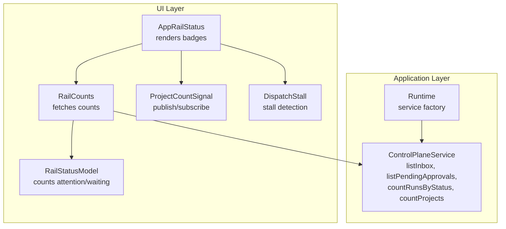
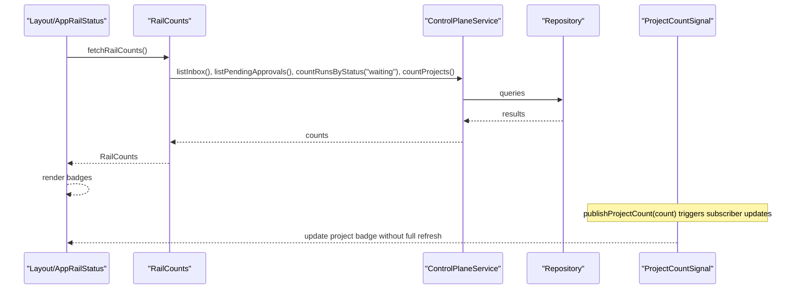
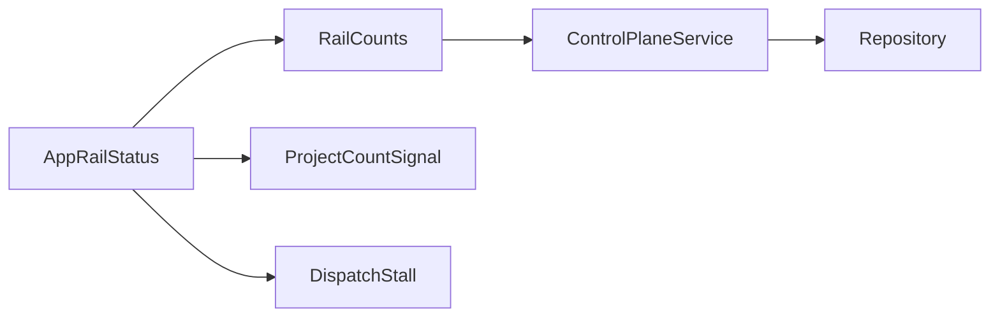

# Status Monitoring and Real-time Updates

<cite>
**Referenced Files in This Document**
- [rail-status-model.ts](file://apps/control-plane/src/ui/rail-status-model.ts)
- [project-count-signal.ts](file://apps/control-plane/src/ui/project-count-signal.ts)
- [dispatch-stall.ts](file://apps/control-plane/src/ui/dispatch-stall.ts)
- [app-rail-status.tsx](file://apps/control-plane/src/ui/app-rail-status.tsx)
- [rail-counts.ts](file://apps/control-plane/src/ui/rail-counts.ts)
- [control-plane-service.ts](file://apps/control-plane/src/application/control-plane-service.ts)
- [runtime.ts](file://apps/control-plane/src/application/runtime.ts)
</cite>

## Table of Contents
1. Introduction
2. Project Structure
3. Core Components
4. Architecture Overview
5. Detailed Component Analysis
6. Dependency Analysis
7. Performance Considerations
8. Troubleshooting Guide
9. Conclusion

## Introduction
This document explains the real-time status monitoring system that provides live updates on workflow execution and project health. It covers:
- Rail status model architecture for state tracking, transition detection, and visual indicators across workflow phases
- Project count signal system that aggregates and displays project metrics, run counts, and resource utilization
- Dispatch stall detection mechanism to identify hung or stalled workflows and surface actionable alerts
- Guidance for implementing custom status indicators, extending the monitoring dashboard, and integrating with external alerting systems
- Performance optimization strategies for handling large volumes of real-time data while minimizing UI re-renders

## Project Structure
The monitoring stack is implemented in the control-plane application under the UI layer and integrates with the application service layer for data fetching. Key modules include:
- Rail status model: computes attention and waiting counts from inbox and runs
- Rail counts aggregator: performs a single shared fetch for all rail badges
- Project count signal: lightweight event-based broadcast to update project badge without full page refresh
- Dispatch stall detector: identifies runs that appear stuck before dispatch
- App rail status component: renders compact status badges in the layout

**Diagram sources**
- [app-rail-status.tsx:1-34](file://apps/control-plane/src/ui/app-rail-status.tsx#L1-L34)
- [rail-counts.ts:1-35](file://apps/control-plane/src/ui/rail-counts.ts#L1-L35)
- [rail-status-model.ts:1-23](file://apps/control-plane/src/ui/rail-status-model.ts#L1-L23)
- [project-count-signal.ts:1-34](file://apps/control-plane/src/ui/project-count-signal.ts#L1-L34)
- [dispatch-stall.ts:1-45](file://apps/control-plane/src/ui/dispatch-stall.ts#L1-L45)
- [control-plane-service.ts:1435-1627](file://apps/control-plane/src/application/control-plane-service.ts#L1435-L1627)
- [runtime.ts:573-625](file://apps/control-plane/src/application/runtime.ts#L573-L625)

**Section sources**
- [app-rail-status.tsx:1-34](file://apps/control-plane/src/ui/app-rail-status.tsx#L1-L34)
- [rail-counts.ts:1-35](file://apps/control-plane/src/ui/rail-counts.ts#L1-L35)
- [rail-status-model.ts:1-23](file://apps/control-plane/src/ui/rail-status-model.ts#L1-L23)
- [project-count-signal.ts:1-34](file://apps/control-plane/src/ui/project-count-signal.ts#L1-L34)
- [dispatch-stall.ts:1-45](file://apps/control-plane/src/ui/dispatch-stall.ts#L1-L45)
- [control-plane-service.ts:1435-1627](file://apps/control-plane/src/application/control-plane-service.ts#L1435-L1627)
- [runtime.ts:573-625](file://apps/control-plane/src/application/runtime.ts#L573-L625)

## Core Components
- Rail status model: Computes attention (pending approvals + pending inbox messages) and waiting runs counts used by the rail badges.
- Rail counts aggregator: Performs one shared fetch to gather inbox, approvals, waiting runs, and project count; fails softly so a bad backend does not break the UI.
- Project count signal: Publishes and subscribes to a lightweight event to update the project badge without full navigation or heavy re-renders.
- Dispatch stall detector: Flags runs that remain pending with no steps after a threshold, indicating no worker picked them up.
- App rail status component: Renders compact badges for attention and waiting items; hides when there is nothing to show.

**Section sources**
- [rail-status-model.ts:1-23](file://apps/control-plane/src/ui/rail-status-model.ts#L1-L23)
- [rail-counts.ts:1-35](file://apps/control-plane/src/ui/rail-counts.ts#L1-L35)
- [project-count-signal.ts:1-34](file://apps/control-plane/src/ui/project-count-signal.ts#L1-L34)
- [dispatch-stall.ts:1-45](file://apps/control-plane/src/ui/dispatch-stall.ts#L1-L45)
- [app-rail-status.tsx:1-34](file://apps/control-plane/src/ui/app-rail-status.tsx#L1-L34)

## Architecture Overview
The monitoring flow starts at the layout-level component, which requests aggregated counts once per render. The aggregator calls the control plane service to retrieve inbox, approvals, waiting runs, and project counts. The UI renders badges based on these counts. Separately, the project count signal allows targeted updates to the project badge without full page refreshes. The dispatch stall detector evaluates run metadata to detect stalls and can be surfaced as an alert or indicator.

**Diagram sources**
- [rail-counts.ts:11-35](file://apps/control-plane/src/ui/rail-counts.ts#L11-L35)
- [control-plane-service.ts:1435-1627](file://apps/control-plane/src/application/control-plane-service.ts#L1435-L1627)
- [project-count-signal.ts:16-33](file://apps/control-plane/src/ui/project-count-signal.ts#L16-L33)
- [app-rail-status.tsx:1-34](file://apps/control-plane/src/ui/app-rail-status.tsx#L1-L34)

## Detailed Component Analysis

### Rail Status Model
Purpose:
- Count attention items by combining pending approvals and pending inbox messages.
- Count runs that are waiting for execution.

Key behaviors:
- Attention count includes all pending approvals plus only inbox messages marked pending.
- Waiting runs count filters runs by status.

Complexity:
- Linear in the number of approvals and inbox messages for attention counting.
- Linear in the number of runs for waiting runs counting.

Optimization opportunities:
- Cache projections if lists grow large.
- Use server-side filtering where possible to reduce payload size.

Error handling:
- Defensive checks on message status and run status fields ensure robustness against unexpected shapes.

**Section sources**
- [rail-status-model.ts:8-22](file://apps/control-plane/src/ui/rail-status-model.ts#L8-L22)

### Rail Counts Aggregator
Purpose:
- Provide a single, fail-safe fetch that returns inbox attention, waiting runs, and project count.

Data flow:
- Calls multiple service methods concurrently to minimize latency.
- Uses a small limit for pending approvals to avoid heavy payloads.
- Returns undefined on errors so the UI degrades gracefully.

Integration points:
- Depends on ControlPlaneService for inbox, approvals, run counts, and project counts.
- Consumed by AppRailStatus to render badges.

Performance characteristics:
- Parallel I/O via concurrent service calls.
- Fail-soft design prevents cascading failures.

**Section sources**
- [rail-counts.ts:11-35](file://apps/control-plane/src/ui/rail-counts.ts#L11-L35)
- [control-plane-service.ts:1435-1627](file://apps/control-plane/src/application/control-plane-service.ts#L1435-L1627)

### Project Count Signal System
Purpose:
- Broadcast project count changes to subscribers without forcing a full page refresh or navigation.

Mechanism:
- Publishes a custom event with a numeric detail.
- Subscribers receive validated events and ignore invalid payloads.
- Safe on the server side; no-op when window is unavailable.

Use cases:
- Update project badge after setup wizard completes.
- Minimize UI churn by touching only the badge area.

Extensibility:
- Can be extended to broadcast other lightweight metrics using the same pattern.

**Section sources**
- [project-count-signal.ts:1-34](file://apps/control-plane/src/ui/project-count-signal.ts#L1-L34)

### Dispatch Stall Detection
Purpose:
- Identify runs that appear hung because no worker has picked them up.

Detection logic:
- Only applies to runs with status pending and zero steps.
- Compares creation time with current time against a configured threshold.
- Ignores unparseable timestamps to remain robust.

Operational impact:
- Surfaces “undispatched” state earlier than reconciliation cycles would.
- Helps operators quickly notice missing workers or misconfiguration.

Customization:
- Threshold is configurable via constant; adjust based on environment expectations.

**Section sources**
- [dispatch-stall.ts:1-45](file://apps/control-plane/src/ui/dispatch-stall.ts#L1-L45)

### App Rail Status Component
Purpose:
- Render compact status badges for attention and waiting items in the global layout.

Behavior:
- Hides entirely when there are no counts to display.
- Links to inbox and runs pages for quick access.
- Delegates rendering decisions to counts provided by the aggregator.

Visual indicators:
- Attention badge highlights inbox needs.
- Waiting badge indicates queued runs.

**Section sources**
- [app-rail-status.tsx:1-34](file://apps/control-plane/src/ui/app-rail-status.tsx#L1-L34)

## Dependency Analysis
The monitoring components form a layered dependency graph:
- UI components depend on RailCounts for aggregated metrics.
- RailCounts depends on ControlPlaneService for data.
- ControlPlaneService depends on repository and runtime infrastructure.
- ProjectCountSignal is decoupled and communicates via events.
- DispatchStall is pure logic depending only on run metadata and time.

**Diagram sources**
- [app-rail-status.tsx:1-34](file://apps/control-plane/src/ui/app-rail-status.tsx#L1-L34)
- [rail-counts.ts:11-35](file://apps/control-plane/src/ui/rail-counts.ts#L11-L35)
- [control-plane-service.ts:1435-1627](file://apps/control-plane/src/application/control-plane-service.ts#L1435-L1627)
- [project-count-signal.ts:16-33](file://apps/control-plane/src/ui/project-count-signal.ts#L16-L33)
- [dispatch-stall.ts:28-44](file://apps/control-plane/src/ui/dispatch-stall.ts#L28-L44)

**Section sources**
- [rail-counts.ts:11-35](file://apps/control-plane/src/ui/rail-counts.ts#L11-L35)
- [control-plane-service.ts:1435-1627](file://apps/control-plane/src/application/control-plane-service.ts#L1435-L1627)
- [project-count-signal.ts:16-33](file://apps/control-plane/src/ui/project-count-signal.ts#L16-L33)
- [dispatch-stall.ts:28-44](file://apps/control-plane/src/ui/dispatch-stall.ts#L28-L44)

## Performance Considerations
- Single shared fetch: RailCounts batches multiple service calls into one request cycle to reduce overhead and keep the UI responsive.
- Fail-soft aggregation: Errors do not propagate to the UI; badges simply hide rather than breaking the page.
- Event-driven updates: ProjectCountSignal avoids full navigations and minimizes re-renders by broadcasting lightweight events.
- Server-side limits: Pending approvals are fetched with a reasonable limit to cap payload sizes.
- Concurrency: Parallel service calls reduce total latency for badge data.
- Debouncing and throttling: When integrating additional real-time signals, consider debouncing frequent updates to prevent excessive re-renders.
- Caching: For high-frequency metrics, consider client-side caching or optimistic UI updates backed by eventual consistency.

[No sources needed since this section provides general guidance]

## Troubleshooting Guide
Common issues and resolutions:
- Badges not updating after project creation: Ensure the project count signal is published after creation and that subscribers are active. Verify the event name and payload validation.
- Stalled runs not detected: Confirm that runs have status pending and stepCount equals zero, and that timestamps are valid. Adjust the stall threshold if necessary for your environment.
- Missing badges due to backend errors: Check that the control plane service is reachable; the aggregator will return undefined on errors, causing badges to hide.
- Excessive UI updates: Validate that subscribers unsubscribe properly and that event payloads are filtered to valid numbers.

**Section sources**
- [project-count-signal.ts:16-33](file://apps/control-plane/src/ui/project-count-signal.ts#L16-L33)
- [dispatch-stall.ts:28-44](file://apps/control-plane/src/ui/dispatch-stall.ts#L28-L44)
- [rail-counts.ts:17-35](file://apps/control-plane/src/ui/rail-counts.ts#L17-L35)

## Conclusion
The monitoring system combines a lean UI layer with a robust service integration to provide real-time visibility into workflow execution and project health. The rail status model and counts aggregator deliver concise, fail-safe metrics. The project count signal enables efficient, targeted updates without disruptive re-renders. The dispatch stall detector offers early warning for hung workflows. Together, these components form a scalable foundation for extending dashboards, adding custom indicators, and integrating with external alerting systems while maintaining performance and reliability.

[No sources needed since this section summarizes without analyzing specific files]