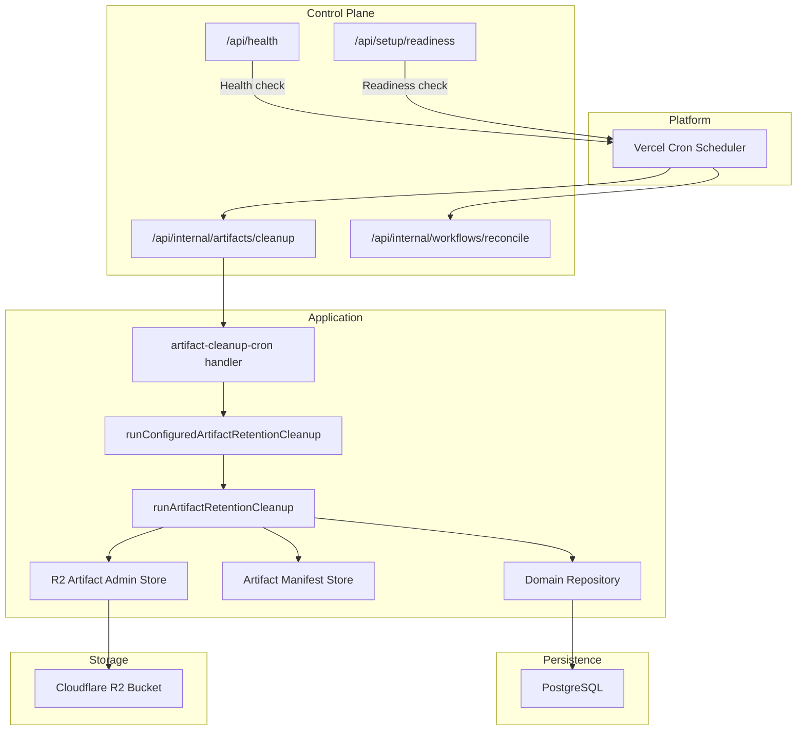
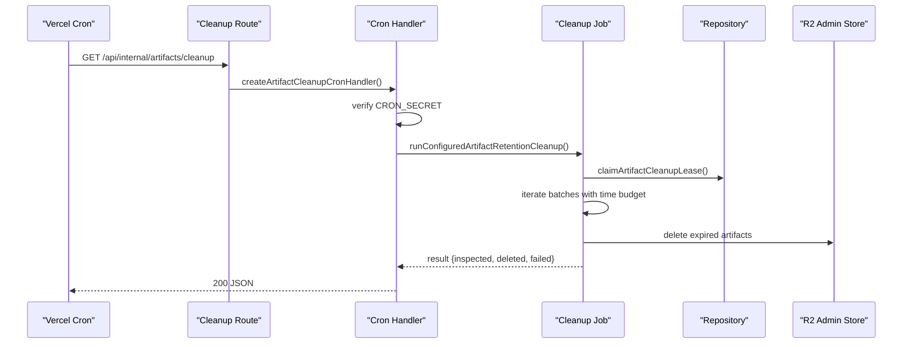
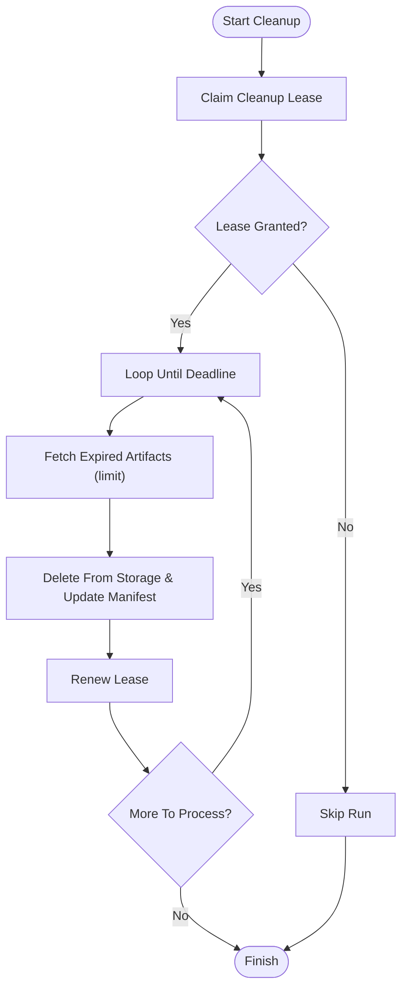
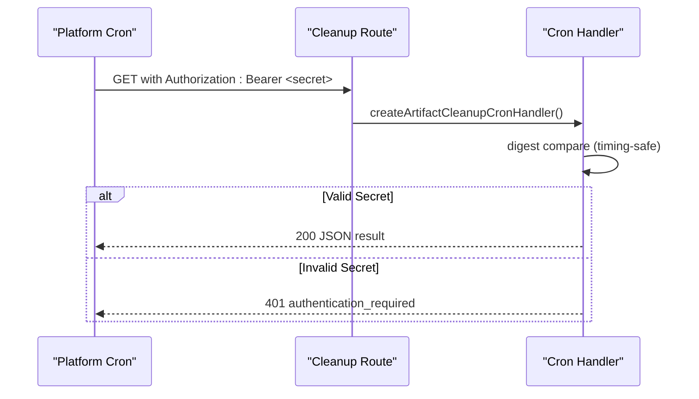
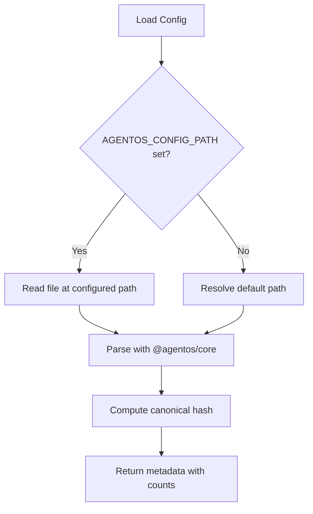
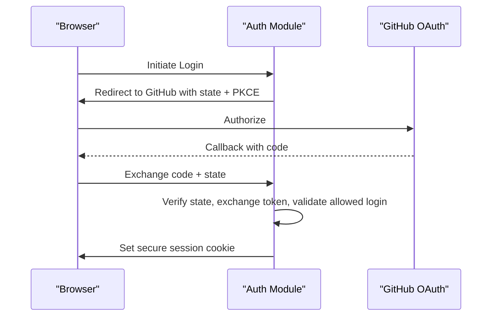
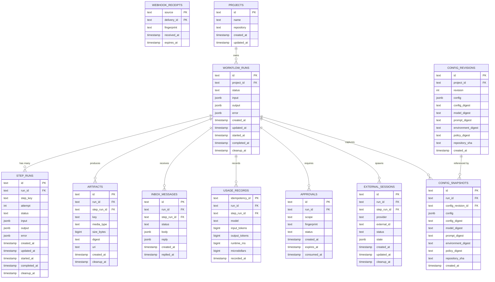
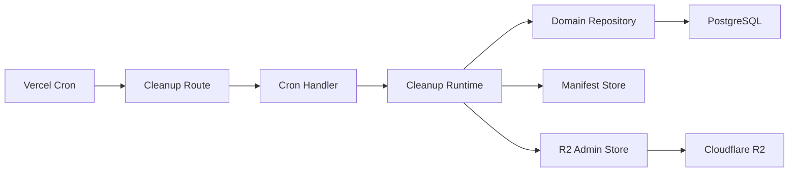

# Maintenance and Administration

<cite>
**Referenced Files in This Document**
- [agentos/README.md](file://agentos/README.md)
- [agentos/agent-os.yaml](file://agentos/agent-os.yaml)
- [agentos/passerine.yaml](file://agentos/passerine.yaml)
- [apps/control-plane/src/application/artifact-cleanup.ts](file://apps/control-plane/src/application/artifact-cleanup.ts)
- [apps/control-plane/src/application/artifact-cleanup-runtime.ts](file://apps/control-plane/src/application/artifact-cleanup-runtime.ts)
- [apps/control-plane/src/http/artifact-cleanup-cron.ts](file://apps/control-plane/src/http/artifact-cleanup-cron.ts)
- [apps/control-plane/app/api/internal/artifacts/cleanup/route.ts](file://apps/control-plane/app/api/internal/artifacts/cleanup/route.ts)
- [apps/control-plane/app/api/internal/workflows/reconcile/route.ts](file://apps/control-plane/app/api/internal/workflows/reconcile/route.ts)
- [apps/control-plane/src/config/configuration-loader.ts](file://apps/control-plane/src/config/configuration-loader.ts)
- [apps/control-plane/src/auth/auth.ts](file://apps/control-plane/src/auth/auth.ts)
- [drizzle/0000_domain_persistence.sql](file://drizzle/0000_domain_persistence.sql)
- [vercel.json](file://vercel.json)
- [apps/control-plane/app/api/health/route.ts](file://apps/control-plane/app/api/health/route.ts)
- [apps/control-plane/app/api/setup/readiness/route.ts](file://apps/control-plane/app/api/setup/readiness/route.ts)
- [docs/architecture/threat-model.md](file://docs/architecture/threat-model.md)
</cite>

## Table of Contents
1. Introduction
2. Project Structure
3. Core Components
4. Architecture Overview
5. Detailed Component Analysis
6. Dependency Analysis
7. Performance Considerations
8. Troubleshooting Guide
9. Conclusion
10. Appendices

## Introduction
This document provides maintenance and administration guidance for Agent OS Passerine. It covers routine maintenance (database cleanup, artifact lifecycle management, configuration backups), administrative tasks (user management, permissions, system configuration changes), backup and recovery procedures, disaster recovery and business continuity planning, capacity planning and scaling considerations, performance tuning recommendations, and security maintenance (certificate rotation, dependency updates, vulnerability scanning). The content is grounded in the repository’s implementation details to ensure accuracy and operational safety.

## Project Structure
Agent OS Passerine exposes a control plane with Next.js API routes, background jobs via platform cron scheduling, and a Postgres-backed domain model managed by Drizzle migrations. Configuration files define projects, agents, environments, pipelines, policies, budgets, and runtime settings. Artifact storage uses Cloudflare R2 with admin credentials separated from agent credentials. Authentication integrates GitHub OAuth with secure session cookies and optional local development bypass.

**Diagram sources**
- [vercel.json:1-12](file://vercel.json#L1-L12)
- [apps/control-plane/app/api/internal/artifacts/cleanup/route.ts:1-12](file://apps/control-plane/app/api/internal/artifacts/cleanup/route.ts#L1-L12)
- [apps/control-plane/app/api/internal/workflows/reconcile/route.ts:1-13](file://apps/control-plane/app/api/internal/workflows/reconcile/route.ts#L1-L13)
- [apps/control-plane/src/http/artifact-cleanup-cron.ts:1-35](file://apps/control-plane/src/http/artifact-cleanup-cron.ts#L1-L35)
- [apps/control-plane/src/application/artifact-cleanup-runtime.ts:1-77](file://apps/control-plane/src/application/artifact-cleanup-runtime.ts#L1-L77)
- [apps/control-plane/src/application/artifact-cleanup.ts:1-118](file://apps/control-plane/src/application/artifact-cleanup.ts#L1-L118)
- [drizzle/0000_domain_persistence.sql:1-216](file://drizzle/0000_domain_persistence.sql#L1-L216)

**Section sources**
- [vercel.json:1-12](file://vercel.json#L1-L12)
- [apps/control-plane/app/api/internal/artifacts/cleanup/route.ts:1-12](file://apps/control-plane/app/api/internal/artifacts/cleanup/route.ts#L1-L12)
- [apps/control-plane/app/api/internal/workflows/reconcile/route.ts:1-13](file://apps/control-plane/app/api/internal/workflows/reconcile/route.ts#L1-L13)
- [apps/control-plane/src/http/artifact-cleanup-cron.ts:1-35](file://apps/control-plane/src/http/artifact-cleanup-cron.ts#L1-L35)
- [apps/control-plane/src/application/artifact-cleanup-runtime.ts:1-77](file://apps/control-plane/src/application/artifact-cleanup-runtime.ts#L1-L77)
- [apps/control-plane/src/application/artifact-cleanup.ts:1-118](file://apps/control-plane/src/application/artifact-cleanup.ts#L1-L118)
- [drizzle/0000_domain_persistence.sql:1-216](file://drizzle/0000_domain_persistence.sql#L1-L216)

## Core Components
- Artifact retention cleanup job: Implements bounded, leased, time-budgeted deletion of expired artifacts across manifest and object storage.
- Cron endpoints: Securely expose internal endpoints for artifact cleanup and workflow reconciliation using a shared secret.
- Configuration loader: Loads and validates project configuration metadata, including counts and digests.
- Authentication: GitHub OAuth flow with secure session cookies, environment-based configuration, and local development bypass rules.
- Persistence schema: Domain tables for runs, steps, artifacts, approvals, inbox messages, usage records, and config revisions/snapshots, with indexes supporting cleanup and queries.

**Section sources**
- [apps/control-plane/src/application/artifact-cleanup.ts:1-118](file://apps/control-plane/src/application/artifact-cleanup.ts#L1-L118)
- [apps/control-plane/src/http/artifact-cleanup-cron.ts:1-35](file://apps/control-plane/src/http/artifact-cleanup-cron.ts#L1-L35)
- [apps/control-plane/src/config/configuration-loader.ts:1-82](file://apps/control-plane/src/config/configuration-loader.ts#L1-L82)
- [apps/control-plane/src/auth/auth.ts:1-358](file://apps/control-plane/src/auth/auth.ts#L1-L358)
- [drizzle/0000_domain_persistence.sql:1-216](file://drizzle/0000_domain_persistence.sql#L1-L216)

## Architecture Overview
The control plane schedules periodic maintenance tasks through platform cron triggers. Each trigger invokes a protected route that authenticates via a shared secret and executes an application-level job. For artifact cleanup, the job claims a distributed lease, iterates over expiring artifacts with concurrency limits, renews the lease within a time budget, and deletes objects from R2 while updating manifests and database records. Workflow reconciliation follows a similar pattern. Health and readiness endpoints support monitoring and orchestration.

**Diagram sources**
- [vercel.json:1-12](file://vercel.json#L1-L12)
- [apps/control-plane/app/api/internal/artifacts/cleanup/route.ts:1-12](file://apps/control-plane/app/api/internal/artifacts/cleanup/route.ts#L1-L12)
- [apps/control-plane/src/http/artifact-cleanup-cron.ts:1-35](file://apps/control-plane/src/http/artifact-cleanup-cron.ts#L1-L35)
- [apps/control-plane/src/application/artifact-cleanup-runtime.ts:1-77](file://apps/control-plane/src/application/artifact-cleanup-runtime.ts#L1-L77)
- [apps/control-plane/src/application/artifact-cleanup.ts:1-118](file://apps/control-plane/src/application/artifact-cleanup.ts#L1-L118)

## Detailed Component Analysis

### Artifact Retention Cleanup
- Purpose: Remove expired artifacts safely under distributed leases and strict time budgets to avoid long-running jobs and resource contention.
- Key behaviors:
  - Claims a lease with expiration and renewal mechanism.
  - Processes batches up to a configured page limit with concurrency.
  - Enforces time budget and safety margin; aborts if lease cannot be renewed or deadline approaches.
  - Delegates actual deletions to the artifact admin store bound to R2.
- Operational notes:
  - Ensure separate admin and agent credentials for R2 to enforce least privilege.
  - Monitor logs for skipped runs (lease not claimed) and failures per batch.
  - Adjust page limit and time budget based on workload and storage size.

**Diagram sources**
- [apps/control-plane/src/application/artifact-cleanup.ts:1-118](file://apps/control-plane/src/application/artifact-cleanup.ts#L1-L118)
- [apps/control-plane/src/application/artifact-cleanup-runtime.ts:1-77](file://apps/control-plane/src/application/artifact-cleanup-runtime.ts#L1-L77)

**Section sources**
- [apps/control-plane/src/application/artifact-cleanup.ts:1-118](file://apps/control-plane/src/application/artifact-cleanup.ts#L1-L118)
- [apps/control-plane/src/application/artifact-cleanup-runtime.ts:1-77](file://apps/control-plane/src/application/artifact-cleanup-runtime.ts#L1-L77)

### Cron Endpoint Security
- Purpose: Protect internal maintenance endpoints with a shared secret using timing-safe comparison.
- Requirements:
  - Provide a CRON_SECRET with length between 32 and 256 bytes.
  - Invoke endpoints with Authorization header set to Bearer <secret>.
  - Responses include cache-control headers to prevent caching.

**Diagram sources**
- [apps/control-plane/src/http/artifact-cleanup-cron.ts:1-35](file://apps/control-plane/src/http/artifact-cleanup-cron.ts#L1-L35)
- [apps/control-plane/app/api/internal/artifacts/cleanup/route.ts:1-12](file://apps/control-plane/app/api/internal/artifacts/cleanup/route.ts#L1-L12)

**Section sources**
- [apps/control-plane/src/http/artifact-cleanup-cron.ts:1-35](file://apps/control-plane/src/http/artifact-cleanup-cron.ts#L1-L35)
- [apps/control-plane/app/api/internal/artifacts/cleanup/route.ts:1-12](file://apps/control-plane/app/api/internal/artifacts/cleanup/route.ts#L1-L12)

### Configuration Management
- Purpose: Load, validate, and summarize project configuration for operations and audits.
- Capabilities:
  - Reads configuration from AGENTOS_CONFIG_PATH or default path.
  - Computes canonical digest and counts models, agents, environments, pipelines, and steps.
  - Requires AGENTOS_CONFIG_PATH in production to ensure deterministic sourcing.

**Diagram sources**
- [apps/control-plane/src/config/configuration-loader.ts:1-82](file://apps/control-plane/src/config/configuration-loader.ts#L1-L82)

**Section sources**
- [apps/control-plane/src/config/configuration-loader.ts:1-82](file://apps/control-plane/src/config/configuration-loader.ts#L1-L82)
- [agentos/README.md:1-38](file://agentos/README.md#L1-L38)

### Authentication and User Management
- Purpose: Manage user sessions and access control via GitHub OAuth with secure cookies and environment-driven configuration.
- Key aspects:
  - Requires AGENTOS_PUBLIC_URL (HTTPS in production) and AGENTOS_SESSION_SECRET (minimum 32 bytes).
  - Supports local development bypass when public URL resolves to localhost variants.
  - Issues short-lived OAuth state and longer-lived session cookies with cryptographic sealing.
  - Validates allowed login identity and sanitizes return-to paths.

**Diagram sources**
- [apps/control-plane/src/auth/auth.ts:1-358](file://apps/control-plane/src/auth/auth.ts#L1-L358)

**Section sources**
- [apps/control-plane/src/auth/auth.ts:1-358](file://apps/control-plane/src/auth/auth.ts#L1-L358)

### Database Schema and Cleanup Indexes
- Purpose: Persist domain entities and support efficient cleanup and querying.
- Highlights:
  - Tables for workflow runs, step runs, artifacts, approvals, inbox messages, usage records, and configuration revisions/snapshots.
  - Dedicated indexes on cleanup_at columns to accelerate retention cleanup.
  - Foreign keys cascade deletes to maintain referential integrity.

**Diagram sources**
- [drizzle/0000_domain_persistence.sql:1-216](file://drizzle/0000_domain_persistence.sql#L1-L216)

**Section sources**
- [drizzle/0000_domain_persistence.sql:1-216](file://drizzle/0000_domain_persistence.sql#L1-L216)

## Dependency Analysis
- Platform dependencies: Vercel cron schedules invoke internal endpoints at defined intervals.
- Application dependencies: Routes depend on cron handlers and application services; cleanup depends on repository, manifest store, and R2 admin store.
- Persistence dependencies: All domain tables are linked to workflow_runs; cleanup indexes optimize retention scans.
- External dependencies: Cloudflare R2 for artifact storage; GitHub OAuth for authentication.

**Diagram sources**
- [vercel.json:1-12](file://vercel.json#L1-L12)
- [apps/control-plane/app/api/internal/artifacts/cleanup/route.ts:1-12](file://apps/control-plane/app/api/internal/artifacts/cleanup/route.ts#L1-L12)
- [apps/control-plane/src/http/artifact-cleanup-cron.ts:1-35](file://apps/control-plane/src/http/artifact-cleanup-cron.ts#L1-L35)
- [apps/control-plane/src/application/artifact-cleanup-runtime.ts:1-77](file://apps/control-plane/src/application/artifact-cleanup-runtime.ts#L1-L77)
- [drizzle/0000_domain_persistence.sql:1-216](file://drizzle/0000_domain_persistence.sql#L1-L216)

**Section sources**
- [vercel.json:1-12](file://vercel.json#L1-L12)
- [apps/control-plane/app/api/internal/artifacts/cleanup/route.ts:1-12](file://apps/control-plane/app/api/internal/artifacts/cleanup/route.ts#L1-L12)
- [apps/control-plane/src/http/artifact-cleanup-cron.ts:1-35](file://apps/control-plane/src/http/artifact-cleanup-cron.ts#L1-L35)
- [apps/control-plane/src/application/artifact-cleanup-runtime.ts:1-77](file://apps/control-plane/src/application/artifact-cleanup-runtime.ts#L1-L77)
- [drizzle/0000_domain_persistence.sql:1-216](file://drizzle/0000_domain_persistence.sql#L1-L216)

## Performance Considerations
- Artifact cleanup:
  - Use page limits and concurrency tuned to storage throughput and database load.
  - Keep time budget and safety margin conservative to avoid overlapping runs.
  - Monitor skipped runs due to lease contention; adjust frequency if necessary.
- Database:
  - Leverage existing cleanup indexes on cleanup_at columns for efficient scans.
  - Periodically review query plans for high-volume tables (workflow_runs, step_runs, artifacts).
- Configuration:
  - Validate configuration frequently in CI to catch drift early.
  - Use canonical digests to detect unintended changes.
- Authentication:
  - Ensure HTTPS in production and strong session secrets to minimize overhead and risk.
  - Limit allowed logins to reduce attack surface.

[No sources needed since this section provides general guidance]

## Troubleshooting Guide
- Cron endpoint returns 401:
  - Verify CRON_SECRET length and exact Authorization header value.
  - Confirm platform cron invocation includes correct secret.
- Cleanup job skips runs:
  - Indicates lease not claimed; may be due to concurrent execution or misconfigured owner.
  - Check lease duration and schedule frequency.
- Cleanup fails to delete artifacts:
  - Inspect R2 admin credentials and bucket configuration.
  - Ensure admin credentials differ from agent credentials.
- Health and readiness:
  - Use /api/health for basic liveness checks.
  - Use /api/setup/readiness to validate environment configuration before deployment.

**Section sources**
- [apps/control-plane/src/http/artifact-cleanup-cron.ts:1-35](file://apps/control-plane/src/http/artifact-cleanup-cron.ts#L1-L35)
- [apps/control-plane/src/application/artifact-cleanup-runtime.ts:1-77](file://apps/control-plane/src/application/artifact-cleanup-runtime.ts#L1-L77)
- [apps/control-plane/app/api/health/route.ts:1-6](file://apps/control-plane/app/api/health/route.ts#L1-L6)
- [apps/control-plane/app/api/setup/readiness/route.ts:1-23](file://apps/control-plane/app/api/setup/readiness/route.ts#L1-L23)

## Conclusion
Agent OS Passerine provides robust mechanisms for maintenance and administration: secure cron-triggered artifact cleanup, configurable and auditable configuration loading, and strong authentication flows. Operators should regularly back up databases and configurations, monitor cleanup performance, rotate secrets and certificates, and plan capacity based on workload patterns. Adhering to these practices ensures reliable operation, data integrity, and security posture.

[No sources needed since this section summarizes without analyzing specific files]

## Appendices

### Routine Maintenance Procedures
- Database cleanup:
  - Rely on built-in cleanup indexes and scheduled jobs to remove expired artifacts and related records.
  - Validate cleanup effectiveness by inspecting deleted counts and failure rates.
- Artifact lifecycle management:
  - Configure R2 admin credentials separately from agent credentials.
  - Tune page limits and time budgets to match storage and database capacity.
- Configuration backups:
  - Back up AGENTOS_CONFIG_PATH contents and any repository-managed configuration files.
  - Record canonical digests alongside backups for change tracking.

**Section sources**
- [apps/control-plane/src/application/artifact-cleanup.ts:1-118](file://apps/control-plane/src/application/artifact-cleanup.ts#L1-L118)
- [apps/control-plane/src/application/artifact-cleanup-runtime.ts:1-77](file://apps/control-plane/src/application/artifact-cleanup-runtime.ts#L1-L77)
- [apps/control-plane/src/config/configuration-loader.ts:1-82](file://apps/control-plane/src/config/configuration-loader.ts#L1-L82)

### Administrative Tasks
- User management:
  - Configure allowed login via environment variables; restrict to authorized operators.
  - Rotate session secrets periodically; ensure minimum length requirements.
- Permission updates:
  - Review policies in configuration files to protect sensitive paths and control tools/MCP access.
- System configuration changes:
  - Use configuration apply workflows with idempotency keys to prevent conflicts.
  - Validate configuration before applying; handle stale-configuration conflicts by re-planning.

**Section sources**
- [apps/control-plane/src/auth/auth.ts:1-358](file://apps/control-plane/src/auth/auth.ts#L1-L358)
- [agentos/README.md:1-38](file://agentos/README.md#L1-L38)
- [agentos/agent-os.yaml:1-61](file://agentos/agent-os.yaml#L1-L61)
- [agentos/passerine.yaml:1-252](file://agentos/passerine.yaml#L1-L252)

### Backup and Recovery Procedures
- Database backup:
  - Schedule regular snapshots of PostgreSQL; retain according to compliance needs.
  - Test restore procedures to validate integrity and completeness.
- Artifact backup:
  - Back up R2 buckets containing artifacts; ensure admin credentials are available for restoration.
- Configuration backup:
  - Version-control configuration files; back up AGENTOS_CONFIG_PATH contents.
  - Maintain canonical digests to detect drift and enable rollback.

[No sources needed since this section provides general guidance]

### Disaster Recovery and Business Continuity
- Failover procedures:
  - Define runbooks for restoring database from snapshots and rehydrating artifact storage.
  - Validate health and readiness endpoints post-recovery.
- Business continuity strategies:
  - Separate admin and agent credentials to limit blast radius during incidents.
  - Use cron schedules to reconcile workflows and clean up artifacts even under degraded conditions.

[No sources needed since this section provides general guidance]

### Capacity Planning and Scaling
- Workload analysis:
  - Monitor artifact creation rates and cleanup throughput; adjust page limits and concurrency.
  - Track database growth and query latency; consider indexing and partitioning strategies.
- Scaling considerations:
  - Scale horizontally where possible; ensure cron endpoints remain responsive under load.
  - Right-size R2 bucket and database instances based on retention policies and peak usage.

[No sources needed since this section provides general guidance]

### Performance Tuning Recommendations
- Cleanup tuning:
  - Align time budget and safety margin with expected batch sizes and storage latency.
  - Avoid overlapping runs by ensuring sufficient spacing between cron invocations.
- Database tuning:
  - Review indexes on cleanup_at and high-cardinality columns; add composite indexes if needed.
  - Analyze slow queries and optimize joins involving workflow_runs and step_runs.

[No sources needed since this section provides general guidance]

### Security Maintenance
- Certificate rotation:
  - Ensure AGENTOS_PUBLIC_URL uses HTTPS; rotate TLS certificates per provider guidelines.
- Dependency updates:
  - Freeze lockfiles and update dependencies in controlled cycles; test thoroughly before promotion.
- Vulnerability scanning:
  - Integrate scanning into CI; block merges on critical vulnerabilities.
  - Follow threat model guidance for persistence, runtime, and supply chain risks.

**Section sources**
- [apps/control-plane/src/auth/auth.ts:1-358](file://apps/control-plane/src/auth/auth.ts#L1-L358)
- [docs/architecture/threat-model.md:64-86](file://docs/architecture/threat-model.md#L64-L86)