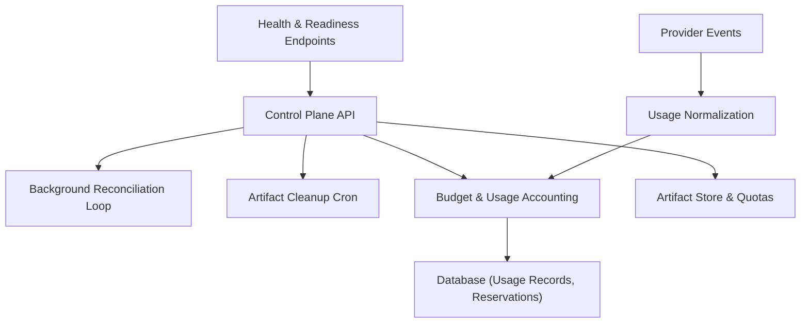
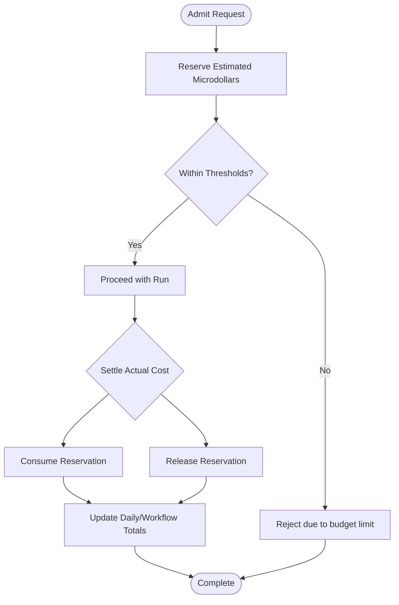
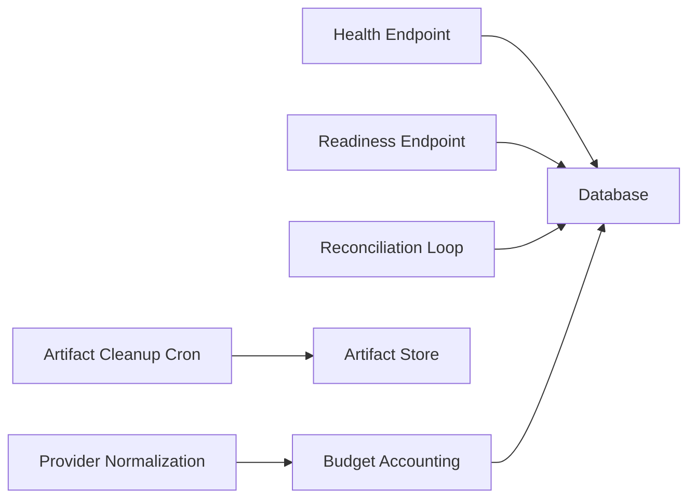

# Metrics and Monitoring

<cite>
**Referenced Files in This Document**
- [instrumentation.ts](file://apps/control-plane/instrumentation.ts)
- [health/route.ts](file://apps/control-plane/app/api/health/route.ts)
- [ready/route.ts](file://apps/control-plane/app/api/ready/route.ts)
- [setup-readiness.ts](file://apps/control-plane/app/api/setup/readiness/route.ts)
- [local-reconciliation-loop.ts](file://apps/control-plane/src/application/local-reconciliation-loop.ts)
- [workflow-dispatch.test.ts](file://apps/control-plane/src/application/workflow-dispatch.test.ts)
- [artifact-cleanup-cron.ts](file://apps/control-plane/src/http/artifact-cleanup-cron.ts)
- [artifact-cleanup-schedule.test.ts](file://apps/control-plane/src/http/artifact-cleanup-schedule.test.ts)
- [vercel.json](file://vercel.json)
- [budget.ts](file://packages/core/src/budget.ts)
- [0020_deployment_daily_budget.sql](file://drizzle/0020_deployment_daily_budget.sql)
- [normalization.ts](file://packages/adapters/src/managed-agents/normalization.ts)
- [trigger/workflow.ts](file://packages/adapters/src/trigger/workflow.ts)
- [quota.ts](file://packages/adapters/src/artifacts/quota.ts)
- [in-memory.ts](file://packages/adapters/src/artifacts/in-memory.ts)
</cite>

## Table of Contents
1. Introduction
2. Project Structure
3. Core Components
4. Architecture Overview
5. Detailed Component Analysis
6. Dependency Analysis
7. Performance Considerations
8. Troubleshooting Guide
9. Conclusion

## Introduction
This document explains how Agent OS Passerine collects metrics and supports monitoring for workflows, artifacts, budgets, and system health. It covers built-in observability surfaces such as usage accounting, budget reservations, artifact storage quotas, readiness endpoints, and background reconciliation loops. It also provides guidance on alerting strategies and integrating with external systems like Prometheus, Grafana, or cloud monitoring services.

## Project Structure
The monitoring surface spans several layers:
- Health and readiness endpoints expose liveness and dependency checks.
- Background loops reconcile stalled runs and perform periodic maintenance tasks via platform cron jobs.
- Budget and usage accounting track microdollar costs per workflow and day, including reservations and settlements.
- Artifact storage enforces quotas and exposes administrative operations for cleanup.
- Provider event normalization converts provider usage into a common model used by cost accounting.



**Diagram sources**
- [health/route.ts:1-6](file://apps/control-plane/app/api/health/route.ts#L1-L6)
- [ready/route.ts:1-13](file://apps/control-plane/app/api/ready/route.ts#L1-L13)
- [local-reconciliation-loop.ts:57-95](file://apps/control-plane/src/application/local-reconciliation-loop.ts#L57-L95)
- [artifact-cleanup-cron.ts:1-200](file://apps/control-plane/src/http/artifact-cleanup-cron.ts#L1-L200)
- [budget.ts:1-200](file://packages/core/src/budget.ts#L1-L200)
- [0020_deployment_daily_budget.sql:56-75](file://drizzle/0020_deployment_daily_budget.sql#L56-L75)
- [normalization.ts:267-293](file://packages/adapters/src/managed-agents/normalization.ts#L267-L293)

**Section sources**
- [health/route.ts:1-6](file://apps/control-plane/app/api/health/route.ts#L1-L6)
- [ready/route.ts:1-13](file://apps/control-plane/app/api/ready/route.ts#L1-L13)
- [local-reconciliation-loop.ts:57-95](file://apps/control-plane/src/application/local-reconciliation-loop.ts#L57-L95)
- [artifact-cleanup-cron.ts:1-200](file://apps/control-plane/src/http/artifact-cleanup-cron.ts#L1-L200)
- [budget.ts:1-200](file://packages/core/src/budget.ts#L1-L200)
- [0020_deployment_daily_budget.sql:56-75](file://drizzle/0020_deployment_daily_budget.sql#L56-L75)
- [normalization.ts:267-293](file://packages/adapters/src/managed-agents/normalization.ts#L267-L293)

## Core Components
- Health and readiness probes:
  - Liveness returns a simple status to indicate the process is alive.
  - Readiness performs a lightweight database operation to confirm dependencies are available.
  - Setup readiness validates environment configuration for deployment readiness.
- Background reconciliation loop:
  - Runs periodically in development to fail stalled runs that exceed deadlines, ensuring local fidelity with production behavior driven by platform cron.
- Budget and usage accounting:
  - Tracks daily and per-workflow spending in microdollars.
  - Supports reservation-based admission control with consumption and release settlement.
  - Database functions enforce per-run, per-project, and deployment-wide thresholds.
- Artifact storage and quotas:
  - Enforces per-operation byte quotas and cumulative limits using capability claims.
  - Provides admin endpoints for cleanup and listing logs/artifacts.
- Provider usage normalization:
  - Converts provider events into a standardized usage model including tokens, cache usage, and runtime milliseconds.

**Section sources**
- [health/route.ts:1-6](file://apps/control-plane/app/api/health/route.ts#L1-L6)
- [ready/route.ts:1-13](file://apps/control-plane/app/api/ready/route.ts#L1-L13)
- [setup-readiness.ts:1-23](file://apps/control-plane/app/api/setup/readiness/route.ts#L1-L23)
- [local-reconciliation-loop.ts:57-95](file://apps/control-plane/src/application/local-reconciliation-loop.ts#L57-L95)
- [budget.ts:129-221](file://packages/core/src/budget.ts#L129-L221)
- [0020_deployment_daily_budget.sql:56-75](file://drizzle/0020_deployment_daily_budget.sql#L56-L75)
- [quota.ts:1-45](file://packages/adapters/src/artifacts/quota.ts#L1-L45)
- [normalization.ts:267-293](file://packages/adapters/src/managed-agents/normalization.ts#L267-L293)

## Architecture Overview
The system combines request-time health checks, scheduled background work, and persistent accounting to provide operational visibility.

```mermaid
sequenceDiagram
participant Client as "Client"
participant API as "Control Plane API"
participant Health as "Health/Readiness"
participant DB as "Database"
participant Cron as "Platform Cron"
participant Reconcile as "Reconciliation Loop"
participant Budget as "Budget & Usage"
participant Artifacts as "Artifact Store"
Client->>API : GET /api/health
API-->>Client : {status : "ok"}
Client->>API : GET /api/ready
API->>DB : listProjects(limit=1)
DB-->>API : success/failure
API-->>Client : {status : "ready"|"unavailable"}
Cron->>API : POST /api/internal/workflows/reconcile
API->>Reconcile : run()
Reconcile->>DB : read stalled runs
Reconcile-->>API : update statuses
Cron->>API : POST /api/internal/artifacts/cleanup
API->>Artifacts : delete expired artifacts
Artifacts-->>API : result
Note over Budget,DB : Usage and budget decisions persist to DB; queries aggregate totals for reporting.
```

**Diagram sources**
- [health/route.ts:1-6](file://apps/control-plane/app/api/health/route.ts#L1-L6)
- [ready/route.ts:1-13](file://apps/control-plane/app/api/ready/route.ts#L1-L13)
- [local-reconciliation-loop.ts:57-95](file://apps/control-plane/src/application/local-reconciliation-loop.ts#L57-L95)
- [artifact-cleanup-cron.ts:1-200](file://apps/control-plane/src/http/artifact-cleanup-cron.ts#L1-L200)
- [vercel.json:1-12](file://vercel.json#L1-L12)

## Detailed Component Analysis

### Health and Readiness Probes
- Liveness endpoint returns a minimal response to signal process health.
- Readiness endpoint attempts a database query to validate connectivity and basic functionality.
- Setup readiness endpoint validates environment configuration required for deployment readiness.

Operational use:
- Use liveness for container orchestration restarts.
- Use readiness to gate traffic until dependencies are healthy.
- Use setup readiness during deployment pipelines to ensure correct configuration.

**Section sources**
- [health/route.ts:1-6](file://apps/control-plane/app/api/health/route.ts#L1-L6)
- [ready/route.ts:1-13](file://apps/control-plane/app/api/ready/route.ts#L1-L13)
- [setup-readiness.ts:1-23](file://apps/control-plane/app/api/setup/readiness/route.ts#L1-L23)

### Background Reconciliation Loop
- In development, a local reconciliation loop starts once per server instance and periodically sweeps for stalled runs, failing them at their deadline to mirror production behavior.
- Production relies on platform cron jobs to trigger reconciliation endpoints.

Operational implications:
- Ensures long-running workflows do not remain stuck indefinitely.
- Provides a mechanism to detect and recover from worker failures.

**Section sources**
- [instrumentation.ts:1-39](file://apps/control-plane/instrumentation.ts#L1-L39)
- [local-reconciliation-loop.ts:57-95](file://apps/control-plane/src/application/local-reconciliation-loop.ts#L57-L95)
- [vercel.json:1-12](file://vercel.json#L1-L12)

### Workflow Execution Times and Status Tracking
- The trigger layer aggregates usage records per run to compute totals, which can be surfaced for execution time and cost insights.
- Terminal statuses include succeeded, failed, and cancelled, enabling clear lifecycle monitoring.

Monitoring strategy:
- Track run duration by aggregating usage entries per run.
- Monitor terminal status transitions to detect stalls or unexpected failures.

**Section sources**
- [trigger/workflow.ts:304-347](file://packages/adapters/src/trigger/workflow.ts#L304-L347)

### Artifact Storage Usage and Cleanup
- Artifact store supports listing logs and artifacts with cursors, enabling pagination for large datasets.
- Capability-based quotas constrain bytes per operation and cumulative usage per claim fingerprint.
- Admin cleanup endpoints are triggered by platform cron jobs to remove expired artifacts.

Operational guidance:
- Use listing APIs to audit storage growth and identify top consumers.
- Configure retention policies aligned with business needs and monitor cleanup effectiveness.

**Section sources**
- [in-memory.ts:61-97](file://packages/adapters/src/artifacts/in-memory.ts#L61-L97)
- [quota.ts:1-45](file://packages/adapters/src/artifacts/quota.ts#L1-L45)
- [artifact-cleanup-schedule.test.ts:1-20](file://apps/control-plane/src/http/artifact-cleanup-schedule.test.ts#L1-L20)
- [artifact-cleanup-cron.ts:1-200](file://apps/control-plane/src/http/artifact-cleanup-cron.ts#L1-L200)
- [vercel.json:1-12](file://vercel.json#L1-L12)

### Budget Consumption Tracking
- Usage accounting tracks daily and per-workflow spending in microdollars, supporting precise cost attribution.
- Reservation-based admission control allows pre-allocating budget for estimated costs, then settling actual consumption or releasing unused reservations.
- Database functions enforce thresholds across run, project, and deployment scopes, returning specific reasons when limits are exceeded.

Alerting and controls:
- Alert when daily or per-workflow spending approaches configured thresholds.
- Use reservation outcomes to detect over-provisioned or under-utilized allocations.



**Diagram sources**
- [budget.ts:129-221](file://packages/core/src/budget.ts#L129-L221)
- [budget.ts:448-497](file://packages/core/src/budget.ts#L448-L497)
- [0020_deployment_daily_budget.sql:56-75](file://drizzle/0020_deployment_daily_budget.sql#L56-L75)

**Section sources**
- [budget.ts:129-221](file://packages/core/src/budget.ts#L129-L221)
- [budget.ts:448-497](file://packages/core/src/budget.ts#L448-L497)
- [0020_deployment_daily_budget.sql:56-75](file://drizzle/0020_deployment_daily_budget.sql#L56-L75)

### System Resource Utilization and Provider Usage
- Provider events are normalized into a standard model capturing input/output tokens, cache reads/creations, and runtime milliseconds.
- These fields enable accurate cost calculation and resource utilization tracking per workflow step.

Monitoring strategy:
- Aggregate token counts and runtime to derive CPU/memory proxies where appropriate.
- Correlate cache usage with cost savings and performance improvements.

**Section sources**
- [normalization.ts:267-293](file://packages/adapters/src/managed-agents/normalization.ts#L267-L293)

### Approval Queues and Background Processes
- Approval endpoints exist for approving or rejecting items in queues, enabling human-in-the-loop workflows.
- Background processes (reconciliation, cleanup) are orchestrated via platform cron jobs, ensuring deterministic scheduling independent of request lifetimes.

Operational guidance:
- Monitor queue depth and approval latency to detect bottlenecks.
- Ensure cron schedules align with SLAs and expected throughput.

**Section sources**
- [vercel.json:1-12](file://vercel.json#L1-L12)

## Dependency Analysis
Key dependencies and interactions:
- Health and readiness depend on database connectivity and environment configuration.
- Reconciliation depends on durable state and platform cron triggers.
- Budget accounting depends on usage records and database threshold functions.
- Artifact management depends on capability claims and retention policies.



**Diagram sources**
- [health/route.ts:1-6](file://apps/control-plane/app/api/health/route.ts#L1-L6)
- [ready/route.ts:1-13](file://apps/control-plane/app/api/ready/route.ts#L1-L13)
- [local-reconciliation-loop.ts:57-95](file://apps/control-plane/src/application/local-reconciliation-loop.ts#L57-L95)
- [artifact-cleanup-cron.ts:1-200](file://apps/control-plane/src/http/artifact-cleanup-cron.ts#L1-L200)
- [budget.ts:129-221](file://packages/core/src/budget.ts#L129-L221)
- [normalization.ts:267-293](file://packages/adapters/src/managed-agents/normalization.ts#L267-L293)

**Section sources**
- [health/route.ts:1-6](file://apps/control-plane/app/api/health/route.ts#L1-L6)
- [ready/route.ts:1-13](file://apps/control-plane/app/api/ready/route.ts#L1-L13)
- [local-reconciliation-loop.ts:57-95](file://apps/control-plane/src/application/local-reconciliation-loop.ts#L57-L95)
- [artifact-cleanup-cron.ts:1-200](file://apps/control-plane/src/http/artifact-cleanup-cron.ts#L1-L200)
- [budget.ts:129-221](file://packages/core/src/budget.ts#L129-L221)
- [normalization.ts:267-293](file://packages/adapters/src/managed-agents/normalization.ts#L267-L293)

## Performance Considerations
- Keep reconciliation intervals reasonable to avoid excessive database load while ensuring timely failure detection.
- Use cursor-based listing for artifacts to prevent memory pressure on large datasets.
- Normalize provider events efficiently and cap event sizes to avoid overhead.
- Aggregate usage totals judiciously; prefer incremental updates and indexed queries for frequent reads.

[No sources needed since this section provides general guidance]

## Troubleshooting Guide
Common issues and diagnostics:
- Stalled runs:
  - Verify reconciliation loop is active and cron jobs are firing.
  - Check for errors in sweep logic and ensure database connectivity.
- Budget rejections:
  - Inspect threshold calculations and reservation states.
  - Confirm actual vs estimated costs and review settlement outcomes.
- Artifact storage growth:
  - Audit listings and quotas; ensure cleanup cron runs successfully.
  - Validate capability claims and cumulative byte limits.
- Health/readiness failures:
  - Confirm database availability and environment configuration.
  - Review setup readiness validation results.

Debugging techniques:
- Use readiness endpoints to isolate dependency issues quickly.
- Enable detailed logging around reconciliation sweeps and cleanup operations.
- Correlate provider usage events with cost spikes to identify inefficient steps.

**Section sources**
- [local-reconciliation-loop.ts:57-95](file://apps/control-plane/src/application/local-reconciliation-loop.ts#L57-L95)
- [budget.ts:448-497](file://packages/core/src/budget.ts#L448-L497)
- [artifact-cleanup-cron.ts:1-200](file://apps/control-plane/src/http/artifact-cleanup-cron.ts#L1-L200)
- [ready/route.ts:1-13](file://apps/control-plane/app/api/ready/route.ts#L1-L13)

## Conclusion
Agent OS Passerine provides a robust foundation for monitoring through health probes, background reconciliation, budget accounting, artifact quotas, and normalized provider usage. By combining these signals with external monitoring integrations and alerting rules, operators can maintain reliable, observable, and cost-controlled workflows.

[No sources needed since this section summarizes without analyzing specific files]