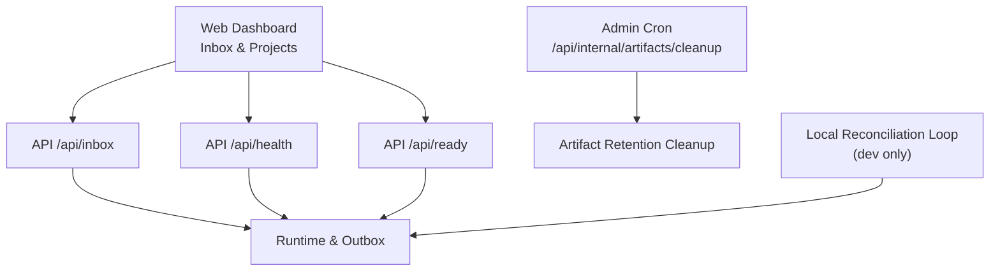
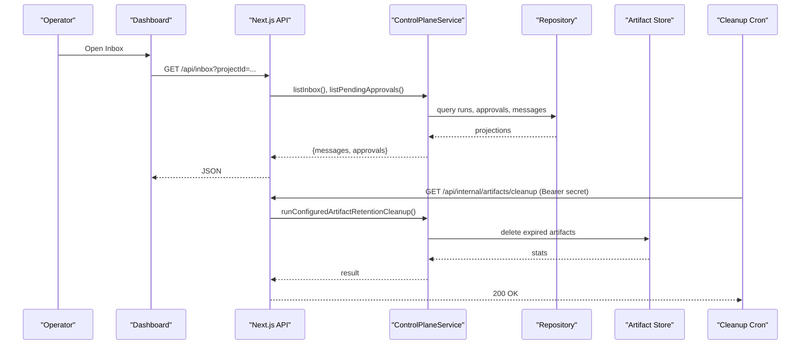
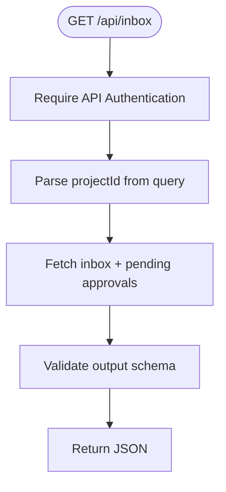
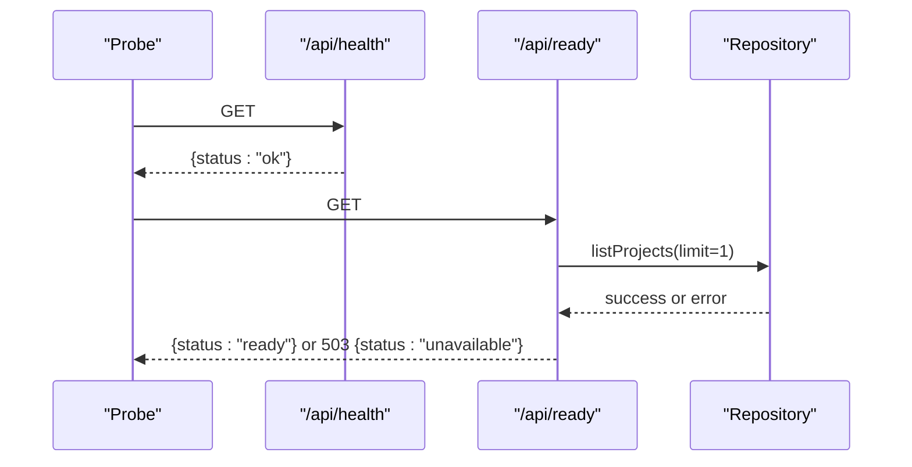
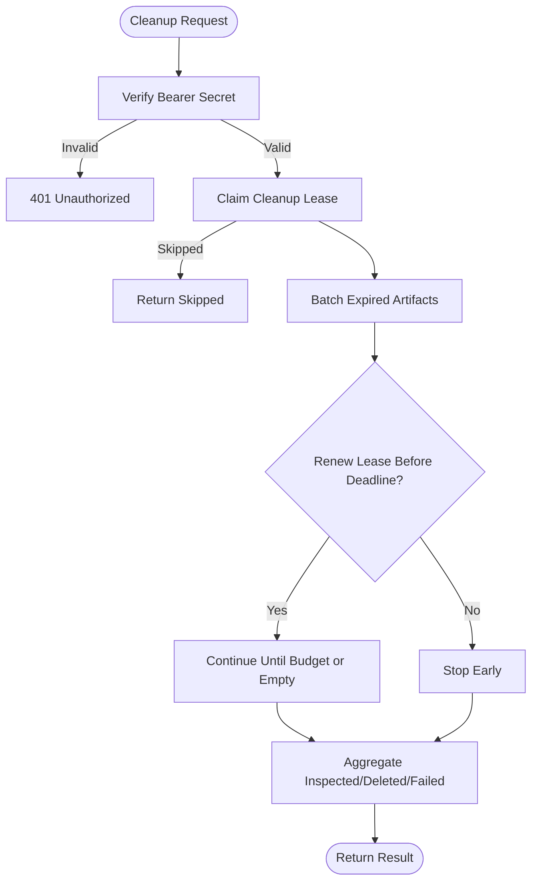
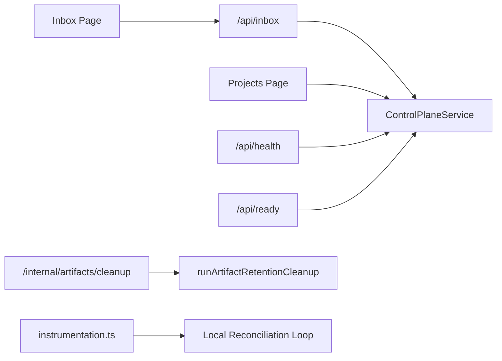

# Monitoring and Operations

<cite>
**Referenced Files in This Document**
- [apps/control-plane/app/inbox/page.tsx](file://apps/control-plane/app/inbox/page.tsx)
- [apps/control-plane/src/ui/inbox-view.tsx](file://apps/control-plane/src/ui/inbox-view.tsx)
- [apps/control-plane/src/ui/rail-status-model.ts](file://apps/control-plane/src/ui/rail-status-model.ts)
- [apps/control-plane/app/projects/page.tsx](file://apps/control-plane/app/projects/page.tsx)
- [apps/control-plane/src/ui/projects-table.tsx](file://apps/control-plane/src/ui/projects-table.tsx)
- [apps/control-plane/app/api/inbox/route.ts](file://apps/control-plane/app/api/inbox/route.ts)
- [apps/control-plane/app/api/health/route.ts](file://apps/control-plane/app/api/health/route.ts)
- [apps/control-plane/app/api/ready/route.ts](file://apps/control-plane/app/api/ready/route.ts)
- [apps/control-plane/src/http/artifact-cleanup-cron.ts](file://apps/control-plane/src/http/artifact-cleanup-cron.ts)
- [apps/control-plane/app/api/internal/artifacts/cleanup/route.ts](file://apps/control-plane/app/api/internal/artifacts/cleanup/route.ts)
- [apps/control-plane/src/application/artifact-cleanup.ts](file://apps/control-plane/src/application/artifact-cleanup.ts)
- [apps/control-plane/instrumentation.ts](file://apps/control-plane/instrumentation.ts)
- [apps/control-plane/src/application/runtime.ts](file://apps/control-plane/src/application/runtime.ts)
</cite>

## Table of Contents
1. Introduction
2. Project Structure
3. Core Components
4. Architecture Overview
5. Detailed Component Analysis
6. Dependency Analysis
7. Performance Considerations
8. Troubleshooting Guide
9. Conclusion
10. Appendices

## Introduction
This document explains monitoring and operations for Agent OS Passerine with a focus on the web dashboard, inbox system, status monitoring, project overview, metrics collection, logging strategies, alerting mechanisms, operational procedures (maintenance, artifact cleanup, resource management), troubleshooting, performance tuning, capacity planning, backup and recovery, disaster recovery, and scaling strategies. It is designed to be accessible to both operators and developers.

## Project Structure
The control plane exposes:
- A Next.js web application with pages for Inbox and Projects that render dashboards and interactive views.
- API routes for inbox listing, health checks, readiness, and internal maintenance endpoints.
- Background reconciliation and artifact retention cleanup logic to keep the system healthy and bounded.

**Diagram sources**
- [apps/control-plane/app/inbox/page.tsx:12-23](file://apps/control-plane/app/inbox/page.tsx#L12-L23)
- [apps/control-plane/app/api/inbox/route.ts:11-32](file://apps/control-plane/app/api/inbox/route.ts#L11-L32)
- [apps/control-plane/app/api/health/route.ts:3-5](file://apps/control-plane/app/api/health/route.ts#L3-L5)
- [apps/control-plane/app/api/ready/route.ts:5-12](file://apps/control-plane/app/api/ready/route.ts#L5-L12)
- [apps/control-plane/app/api/internal/artifacts/cleanup/route.ts:7-12](file://apps/control-plane/app/api/internal/artifacts/cleanup/route.ts#L7-L12)
- [apps/control-plane/src/http/artifact-cleanup-cron.ts:12-34](file://apps/control-plane/src/http/artifact-cleanup-cron.ts#L12-L34)
- [apps/control-plane/instrumentation.ts:12-39](file://apps/control-plane/instrumentation.ts#L12-L39)
- [apps/control-plane/src/application/runtime.ts:573-625](file://apps/control-plane/src/application/runtime.ts#L573-L625)

**Section sources**
- [apps/control-plane/app/inbox/page.tsx:12-23](file://apps/control-plane/app/inbox/page.tsx#L12-L23)
- [apps/control-plane/app/projects/page.tsx:10-35](file://apps/control-plane/app/projects/page.tsx#L10-L35)
- [apps/control-plane/app/api/health/route.ts:3-5](file://apps/control-plane/app/api/health/route.ts#L3-L5)
- [apps/control-plane/app/api/ready/route.ts:5-12](file://apps/control-plane/app/api/ready/route.ts#L5-L12)
- [apps/control-plane/instrumentation.ts:12-39](file://apps/control-plane/instrumentation.ts#L12-L39)

## Core Components
- Web Dashboard:
  - Inbox page aggregates approvals, messages, and notifications; shows pending counts and filters by project.
  - Projects page lists configured projects with last run status and timestamps.
- Status Monitoring:
  - Health endpoint returns service liveness.
  - Readiness endpoint validates database connectivity via repository access.
- Artifact Cleanup:
  - Internal cron-protected endpoint triggers retention cleanup with lease-based coordination and time budgets.
- Runtime and Dispatch:
  - Central runtime composition wires managed agents, optional kimi provider, durable outbox, checkpoints, and source snapshot ingestion.

**Section sources**
- [apps/control-plane/app/inbox/page.tsx:12-23](file://apps/control-plane/app/inbox/page.tsx#L12-L23)
- [apps/control-plane/src/ui/inbox-view.tsx:341-423](file://apps/control-plane/src/ui/inbox-view.tsx#L341-L423)
- [apps/control-plane/app/projects/page.tsx:10-35](file://apps/control-plane/app/projects/page.tsx#L10-L35)
- [apps/control-plane/src/ui/projects-table.tsx:6-65](file://apps/control-plane/src/ui/projects-table.tsx#L6-L65)
- [apps/control-plane/app/api/health/route.ts:3-5](file://apps/control-plane/app/api/health/route.ts#L3-L5)
- [apps/control-plane/app/api/ready/route.ts:5-12](file://apps/control-plane/app/api/ready/route.ts#L5-L12)
- [apps/control-plane/src/http/artifact-cleanup-cron.ts:12-34](file://apps/control-plane/src/http/artifact-cleanup-cron.ts#L12-L34)
- [apps/control-plane/src/application/artifact-cleanup.ts:35-117](file://apps/control-plane/src/application/artifact-cleanup.ts#L35-L117)
- [apps/control-plane/src/application/runtime.ts:573-625](file://apps/control-plane/src/application/runtime.ts#L573-L625)

## Architecture Overview
The control plane orchestrates user interactions through the web dashboard, which calls APIs backed by the control plane service. Background processes reconcile work and perform artifact cleanup under strict safety constraints.

**Diagram sources**
- [apps/control-plane/app/api/inbox/route.ts:11-32](file://apps/control-plane/app/api/inbox/route.ts#L11-L32)
- [apps/control-plane/src/application/runtime.ts:573-625](file://apps/control-plane/src/application/runtime.ts#L573-L625)
- [apps/control-plane/app/api/internal/artifacts/cleanup/route.ts:7-12](file://apps/control-plane/app/api/internal/artifacts/cleanup/route.ts#L7-L12)
- [apps/control-plane/src/http/artifact-cleanup-cron.ts:12-34](file://apps/control-plane/src/http/artifact-cleanup-cron.ts#L12-L34)
- [apps/control-plane/src/application/artifact-cleanup.ts:35-117](file://apps/control-plane/src/application/artifact-cleanup.ts#L35-L117)

## Detailed Component Analysis

### Inbox System and Pending Approvals
- The Inbox page loads a digest of approvals, messages, and notifications and computes a pending attention count using project filtering.
- The Inbox view renders queues for “Needs you” and “History,” supports approval actions, reply forms, and links to full run details.
- The API route enforces authentication, validates query parameters, and returns a typed listing.

**Diagram sources**
- [apps/control-plane/app/api/inbox/route.ts:11-32](file://apps/control-plane/app/api/inbox/route.ts#L11-L32)
- [apps/control-plane/app/inbox/page.tsx:12-23](file://apps/control-plane/app/inbox/page.tsx#L12-L23)
- [apps/control-plane/src/ui/inbox-view.tsx:341-423](file://apps/control-plane/src/ui/inbox-view.tsx#L341-L423)

**Section sources**
- [apps/control-plane/app/inbox/page.tsx:12-23](file://apps/control-plane/app/inbox/page.tsx#L12-L23)
- [apps/control-plane/src/ui/inbox-view.tsx:341-423](file://apps/control-plane/src/ui/inbox-view.tsx#L341-L423)
- [apps/control-plane/app/api/inbox/route.ts:11-32](file://apps/control-plane/app/api/inbox/route.ts#L11-L32)

### Status Monitoring and Project Overview
- Health endpoint provides a simple liveness check.
- Readiness endpoint performs a minimal repository operation to confirm database availability.
- Projects page displays configured projects with binding, revision, last run status, and update time.

**Diagram sources**
- [apps/control-plane/app/api/health/route.ts:3-5](file://apps/control-plane/app/api/health/route.ts#L3-L5)
- [apps/control-plane/app/api/ready/route.ts:5-12](file://apps/control-plane/app/api/ready/route.ts#L5-L12)

**Section sources**
- [apps/control-plane/app/api/health/route.ts:3-5](file://apps/control-plane/app/api/health/route.ts#L3-L5)
- [apps/control-plane/app/api/ready/route.ts:5-12](file://apps/control-plane/app/api/ready/route.ts#L5-L12)
- [apps/control-plane/app/projects/page.tsx:10-35](file://apps/control-plane/app/projects/page.tsx#L10-L35)
- [apps/control-plane/src/ui/projects-table.tsx:6-65](file://apps/control-plane/src/ui/projects-table.tsx#L6-L65)

### Metrics Collection
- The codebase does not include an explicit metrics export endpoint in the analyzed files. Operators should integrate external observability (e.g., platform metrics, request counters, latency histograms) around the API layer and background jobs.
- Use readiness and health endpoints as probes for uptime and dependency health.

[No sources needed since this section provides general guidance]

### Logging Strategies
- No centralized logger is visible in the analyzed files. Recommended strategy:
  - Structured logs at API boundaries (request id, method, path, status).
  - Log lifecycle events for inbox operations, approvals, and replies.
  - Log artifact cleanup batches (inspected, deleted, failed) and lease renewals.
  - Correlate logs across requests and background tasks using consistent identifiers.

[No sources needed since this section provides general guidance]

### Alerting Mechanisms
- Configure alerts on:
  - Health/readiness failures.
  - Elevated inbox attention counts (pending approvals/messages).
  - Artifact cleanup failures or excessive skipped runs due to leases.
  - Run stalls detected by reconciliation loops.

[No sources needed since this section provides general guidance]

### Operational Procedures

#### System Maintenance
- Apply configuration changes via setup flows and verify with readiness checks.
- Use the local reconciliation loop in development to ensure stalled runs are resolved deterministically.

**Section sources**
- [apps/control-plane/instrumentation.ts:12-39](file://apps/control-plane/instrumentation.ts#L12-L39)
- [apps/control-plane/app/api/ready/route.ts:5-12](file://apps/control-plane/app/api/ready/route.ts#L5-L12)

#### Artifact Cleanup
- Triggered via a protected internal endpoint requiring a Bearer token validated with constant-time comparison.
- Cleanup job claims a distributed lease, iterates expired artifacts within a time budget, renews the lease periodically, and reports inspected/deleted/failed counts.

**Diagram sources**
- [apps/control-plane/src/http/artifact-cleanup-cron.ts:12-34](file://apps/control-plane/src/http/artifact-cleanup-cron.ts#L12-L34)
- [apps/control-plane/src/application/artifact-cleanup.ts:35-117](file://apps/control-plane/src/application/artifact-cleanup.ts#L35-L117)
- [apps/control-plane/app/api/internal/artifacts/cleanup/route.ts:7-12](file://apps/control-plane/app/api/internal/artifacts/cleanup/route.ts#L7-L12)

**Section sources**
- [apps/control-plane/src/http/artifact-cleanup-cron.ts:12-34](file://apps/control-plane/src/http/artifact-cleanup-cron.ts#L12-L34)
- [apps/control-plane/src/application/artifact-cleanup.ts:35-117](file://apps/control-plane/src/application/artifact-cleanup.ts#L35-L117)
- [apps/control-plane/app/api/internal/artifacts/cleanup/route.ts:7-12](file://apps/control-plane/app/api/internal/artifacts/cleanup/route.ts#L7-L12)

#### Resource Management
- Runtime composition binds managed agents and optional kimi provider, with handle routing and cancellation support.
- Source snapshots are ingested from GitHub or local paths based on configuration, ensuring provenance integrity.

**Section sources**
- [apps/control-plane/src/application/runtime.ts:319-385](file://apps/control-plane/src/application/runtime.ts#L319-L385)
- [apps/control-plane/src/application/runtime.ts:387-571](file://apps/control-plane/src/application/runtime.ts#L387-L571)

### Troubleshooting Guide
- Inbox empty or stale:
  - Confirm authentication and project filter; verify inbox API returns data.
  - Check pending approvals and messages counts.
- Runs stuck in running/waiting:
  - In development, the local reconciliation loop resolves stalled runs; ensure it is active.
  - In production, rely on scheduled reconciliation and outbox processing.
- Readiness failures:
  - Investigate database connectivity and repository access.

**Section sources**
- [apps/control-plane/app/api/inbox/route.ts:11-32](file://apps/control-plane/app/api/inbox/route.ts#L11-L32)
- [apps/control-plane/instrumentation.ts:12-39](file://apps/control-plane/instrumentation.ts#L12-L39)
- [apps/control-plane/app/api/ready/route.ts:5-12](file://apps/control-plane/app/api/ready/route.ts#L5-L12)

### Performance Tuning Recommendations
- Limit inbox listings to reasonable page sizes (already bounded in routes).
- Tune artifact cleanup time budget and safety margin to balance throughput and stability.
- Avoid concurrent cleanup conflicts by relying on lease-based coordination.

**Section sources**
- [apps/control-plane/app/api/inbox/route.ts:11-32](file://apps/control-plane/app/api/inbox/route.ts#L11-L32)
- [apps/control-plane/src/application/artifact-cleanup.ts:35-117](file://apps/control-plane/src/application/artifact-cleanup.ts#L35-L117)

### Capacity Planning Considerations
- Estimate inbox volume per project and set pagination limits accordingly.
- Size artifact storage and retention policies based on growth rates.
- Plan reconciliation frequency to prevent backlog accumulation during high load.

[No sources needed since this section provides general guidance]

### Backup and Recovery
- Back up the database and artifact store regularly.
- Ensure environment secrets (runtime keys, R2 credentials, GitHub app configs) are stored securely and recoverable.
- Validate restore by running readiness checks and verifying inbox/project data consistency.

[No sources needed since this section provides general guidance]

### Disaster Recovery
- Maintain runbooks for restoring database and artifacts.
- Test failover scenarios including GitHub reader and artifact store access.
- Keep reconciliation and cleanup processes enabled post-recovery to stabilize state.

[No sources needed since this section provides general guidance]

### Scaling Strategies
- Horizontal scaling of the Next.js server is supported; ensure shared state (database, artifact store) is externalized.
- Use read replicas for heavy listing queries if necessary.
- Offload long-running tasks to workers while keeping the control plane stateless where possible.

[No sources needed since this section provides general guidance]

## Dependency Analysis
Key dependencies among components:
- Dashboard pages depend on API routes and UI models.
- API routes depend on the control plane service and persistence.
- Cleanup cron depends on secure handler and cleanup job implementation.
- Instrumentation initializes local reconciliation in development.

**Diagram sources**
- [apps/control-plane/app/inbox/page.tsx:12-23](file://apps/control-plane/app/inbox/page.tsx#L12-L23)
- [apps/control-plane/app/api/inbox/route.ts:11-32](file://apps/control-plane/app/api/inbox/route.ts#L11-L32)
- [apps/control-plane/app/projects/page.tsx:10-35](file://apps/control-plane/app/projects/page.tsx#L10-L35)
- [apps/control-plane/app/api/health/route.ts:3-5](file://apps/control-plane/app/api/health/route.ts#L3-L5)
- [apps/control-plane/app/api/ready/route.ts:5-12](file://apps/control-plane/app/api/ready/route.ts#L5-L12)
- [apps/control-plane/app/api/internal/artifacts/cleanup/route.ts:7-12](file://apps/control-plane/app/api/internal/artifacts/cleanup/route.ts#L7-L12)
- [apps/control-plane/src/application/artifact-cleanup.ts:35-117](file://apps/control-plane/src/application/artifact-cleanup.ts#L35-L117)
- [apps/control-plane/instrumentation.ts:12-39](file://apps/control-plane/instrumentation.ts#L12-L39)

**Section sources**
- [apps/control-plane/app/inbox/page.tsx:12-23](file://apps/control-plane/app/inbox/page.tsx#L12-L23)
- [apps/control-plane/app/api/inbox/route.ts:11-32](file://apps/control-plane/app/api/inbox/route.ts#L11-L32)
- [apps/control-plane/app/projects/page.tsx:10-35](file://apps/control-plane/app/projects/page.tsx#L10-L35)
- [apps/control-plane/app/api/health/route.ts:3-5](file://apps/control-plane/app/api/health/route.ts#L3-L5)
- [apps/control-plane/app/api/ready/route.ts:5-12](file://apps/control-plane/app/api/ready/route.ts#L5-L12)
- [apps/control-plane/app/api/internal/artifacts/cleanup/route.ts:7-12](file://apps/control-plane/app/api/internal/artifacts/cleanup/route.ts#L7-L12)
- [apps/control-plane/src/application/artifact-cleanup.ts:35-117](file://apps/control-plane/src/application/artifact-cleanup.ts#L35-L117)
- [apps/control-plane/instrumentation.ts:12-39](file://apps/control-plane/instrumentation.ts#L12-L39)

## Performance Considerations
- Inbox queries are paginated; tune page size based on expected attention volume.
- Artifact cleanup uses bounded concurrency and time budgets to avoid overloading storage and database.
- Readiness checks are lightweight but validate critical dependencies.

**Section sources**
- [apps/control-plane/app/api/inbox/route.ts:11-32](file://apps/control-plane/app/api/inbox/route.ts#L11-L32)
- [apps/control-plane/src/application/artifact-cleanup.ts:35-117](file://apps/control-plane/src/application/artifact-cleanup.ts#L35-L117)
- [apps/control-plane/app/api/ready/route.ts:5-12](file://apps/control-plane/app/api/ready/route.ts#L5-L12)

## Troubleshooting Guide
- Inbox shows no items:
  - Verify authentication and project filter; inspect inbox API response.
  - Check pending approvals and message statuses.
- Readiness unavailable:
  - Confirm database URL and permissions; retry readiness probe.
- Cleanup not deleting artifacts:
  - Ensure CRON_SECRET is correctly set and matches expected format.
  - Review lease acquisition and time budget settings.

**Section sources**
- [apps/control-plane/app/api/inbox/route.ts:11-32](file://apps/control-plane/app/api/inbox/route.ts#L11-L32)
- [apps/control-plane/app/api/ready/route.ts:5-12](file://apps/control-plane/app/api/ready/route.ts#L5-L12)
- [apps/control-plane/src/http/artifact-cleanup-cron.ts:12-34](file://apps/control-plane/src/http/artifact-cleanup-cron.ts#L12-L34)

## Conclusion
Agent OS Passerine’s control plane provides a robust dashboard for inbox-driven approvals and project oversight, along with essential operational endpoints for health and readiness. Artifact retention cleanup is secured and bounded to maintain system hygiene. Operators should integrate metrics, logging, and alerting around these components, follow the outlined maintenance and recovery procedures, and plan capacity and scaling based on workload characteristics.

## Appendices

### Key Endpoints Summary
- GET /api/health: Liveness check
- GET /api/ready: Readiness check with database validation
- GET /api/inbox: List inbox messages and pending approvals (authenticated)
- GET /api/internal/artifacts/cleanup: Trigger artifact retention cleanup (cron-protected)

**Section sources**
- [apps/control-plane/app/api/health/route.ts:3-5](file://apps/control-plane/app/api/health/route.ts#L3-L5)
- [apps/control-plane/app/api/ready/route.ts:5-12](file://apps/control-plane/app/api/ready/route.ts#L5-L12)
- [apps/control-plane/app/api/inbox/route.ts:11-32](file://apps/control-plane/app/api/inbox/route.ts#L11-L32)
- [apps/control-plane/app/api/internal/artifacts/cleanup/route.ts:7-12](file://apps/control-plane/app/api/internal/artifacts/cleanup/route.ts#L7-L12)