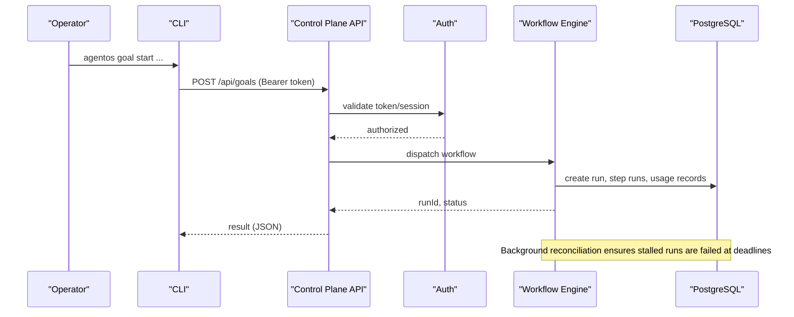
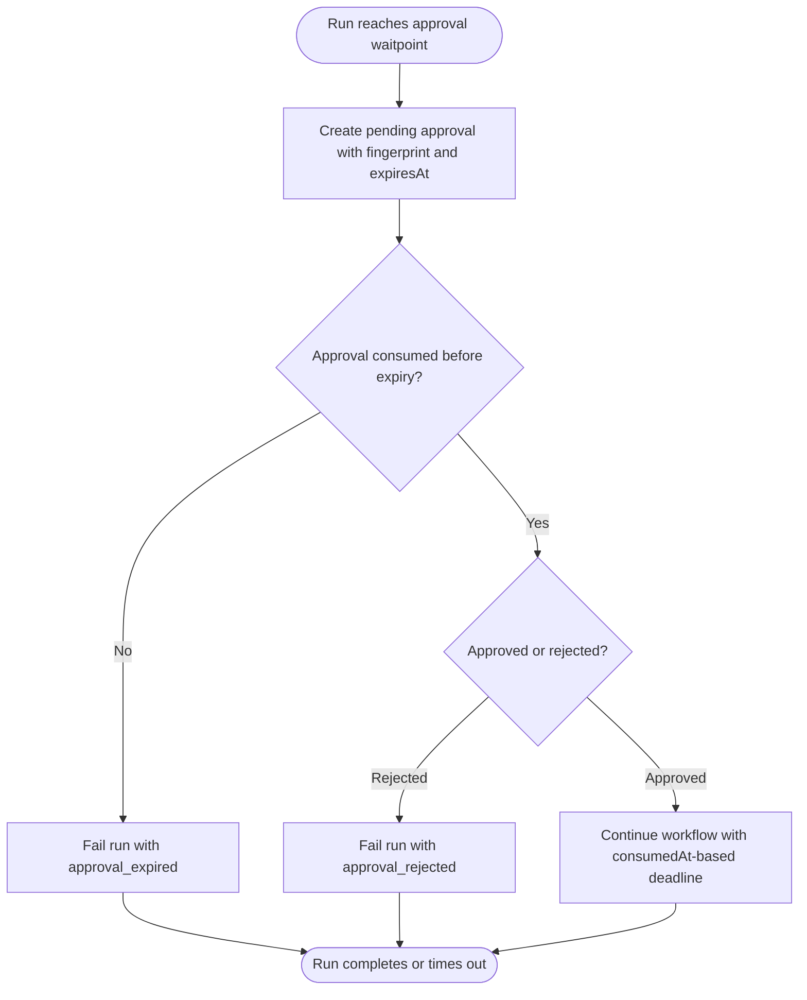
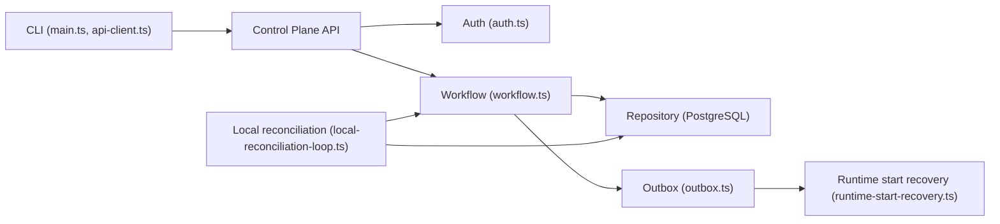

# Troubleshooting and Debugging

<cite>
**Referenced Files in This Document**
- [README.md](file://README.md)
- [main.ts](file://apps/cli/src/main.ts)
- [api-client.ts](file://apps/cli/src/api-client.ts)
- [auth.ts](file://apps/control-plane/src/auth/auth.ts)
- [error.tsx](file://apps/control-plane/app/error.tsx)
- [health/route.ts](file://apps/control-plane/app/api/health/route.ts)
- [setup/readiness/route.ts](file://apps/control-plane/app/api/setup/readiness/route.ts)
- [instrumentation.ts](file://apps/control-plane/instrumentation.ts)
- [local-reconciliation-loop.ts](file://apps/control-plane/src/application/local-reconciliation-loop.ts)
- [workflow.ts](file://packages/adapters/src/trigger/workflow.ts)
- [outbox.ts](file://packages/adapters/src/trigger/outbox.ts)
- [runtime-start-recovery.ts](file://packages/adapters/src/trigger/runtime-start-recovery.ts)
- [reconciliation-cursor-store.ts](file://packages/adapters/src/trigger/reconciliation-cursor-store.ts)
- [postgres-store.ts](file://packages/adapters/src/github/postgres-store.ts)
- [validation.ts](file://packages/adapters/src/persistence/validation.ts)
- [0020_deployment_daily_budget.sql](file://drizzle/0020_deployment_daily_budget.sql)
- [0015_durable_reconciliation_cursor.sql](file://drizzle/0015_durable_reconciliation_cursor.sql)
- [durable-feature-workflow.md](file://docs/architecture/durable-feature-workflow.md)
- [threat-model.md](file://docs/architecture/threat-model.md)
</cite>

## Table of Contents
1. [Introduction](#introduction)
2. [Project Structure](#project-structure)
3. [Core Components](#core-components)
4. [Architecture Overview](#architecture-overview)
5. [Detailed Component Analysis](#detailed-component-analysis)
6. [Dependency Analysis](#dependency-analysis)
7. [Performance Considerations](#performance-considerations)
8. [Troubleshooting Guide](#troubleshooting-guide)
9. [Conclusion](#conclusion)
10. [Appendices](#appendices)

## Introduction
This document provides a comprehensive troubleshooting and debugging guide for Agent OS Passerine. It focuses on diagnosing workflow failures, approval bottlenecks, authentication problems, integration errors, CLI/API issues, background process stalls, performance regressions, memory leaks, resource contention, corrupted states, stuck workflows, and data inconsistencies. It also includes error message interpretation strategies, log analysis techniques, root cause identification methods, recovery procedures, escalation paths, and support contacts.

## Project Structure
Agent OS Passerine is a single-operator, GitHub-focused semi-autonomous build system. The control plane exposes Next.js API routes, the CLI communicates with the control plane over authenticated HTTP, and durable workflows run via Trigger.dev with PostgreSQL-backed persistence and reconciliation.

```mermaid
graph TB
subgraph "CLI"
CLI["CLI (apps/cli)"]
end
subgraph "Control Plane"
Routes["Next.js API routes"]
Auth["Auth module"]
Reconcile["Local reconciliation loop"]
end
subgraph "Durable Workflows"
Trigger["Trigger.dev adapter"]
Outbox["Outbox + runtime start recovery"]
Repo["PostgreSQL repository"]
end
CLI --> |Authenticated HTTP| Routes
Routes --> Auth
Routes --> Trigger
Trigger --> Repo
Reconcile --> Repo
Reconcile --> Trigger
```

**Diagram sources**
- [main.ts:50-78](file://apps/cli/src/main.ts#L50-L78)
- [api-client.ts:130-243](file://apps/cli/src/api-client.ts#L130-L243)
- [auth.ts:80-157](file://apps/control-plane/src/auth/auth.ts#L80-L157)
- [local-reconciliation-loop.ts:32-95](file://apps/control-plane/src/application/local-reconciliation-loop.ts#L32-L95)
- [outbox.ts:167-215](file://packages/adapters/src/trigger/outbox.ts#L167-L215)
- [reconciliation-cursor-store.ts:46-90](file://packages/adapters/src/trigger/reconciliation-cursor-store.ts#L46-L90)

**Section sources**
- [README.md:1-67](file://README.md#L1-L67)

## Core Components
- CLI client: validates inputs, enforces size limits, redacts secrets, and maps remote error codes to user-friendly messages.
- Control plane auth: configures OAuth or local bypass, issues secure cookies/sessions, and validates tokens.
- Durable workflows: classify transient vs permanent errors, enforce timeouts, manage approvals, and reconcile stalled runs.
- Persistence and budgeting: PostgreSQL-based admission, reservations, usage accounting, and cursor tracking.

Key responsibilities:
- CLI: safe transport to /api/* endpoints, idempotency keys, bounded payloads, structured error output.
- Auth: environment-driven configuration, strict validation, token handling, session lifecycle.
- Workflow engine: retry semantics, approval gating, execution deadlines, checkpointing, outbox processing.
- Data layer: typed migrations, constraints, and functions that protect concurrency and budgets.

**Section sources**
- [api-client.ts:14-33](file://apps/cli/src/api-client.ts#L14-L33)
- [api-client.ts:97-128](file://apps/cli/src/api-client.ts#L97-L128)
- [auth.ts:80-157](file://apps/control-plane/src/auth/auth.ts#L80-L157)
- [workflow.ts:434-468](file://packages/adapters/src/trigger/workflow.ts#L434-L468)
- [workflow.ts:1104-1141](file://packages/adapters/src/trigger/workflow.ts#L1104-L1141)
- [0020_deployment_daily_budget.sql:75-91](file://drizzle/0020_deployment_daily_budget.sql#L75-L91)

## Architecture Overview
The system follows a request-response model for CLI/API interactions and an event-driven durable workflow model for long-running tasks.



**Diagram sources**
- [main.ts:186-278](file://apps/cli/src/main.ts#L186-L278)
- [api-client.ts:153-243](file://apps/cli/src/api-client.ts#L153-L243)
- [auth.ts:279-315](file://apps/control-plane/src/auth/auth.ts#L279-L315)
- [workflow.ts:1104-1141](file://packages/adapters/src/trigger/workflow.ts#L1104-L1141)
- [local-reconciliation-loop.ts:32-95](file://apps/control-plane/src/application/local-reconciliation-loop.ts#L32-L95)

## Detailed Component Analysis

### CLI Diagnostics and Error Handling
- Input validation and safety:
  - Enforces absolute URLs, HTTPS except localhost, no credentials in URL, bounded request/response sizes, and JSON serialization checks.
  - Redacts secrets from logs and error messages.
- Remote error mapping:
  - Maps server error codes to stable CLI error codes; unknown codes become generic remote errors.
- Exit codes:
  - Usage errors return exit code 2; other CLI errors return 1; API errors map to 3 or 4 based on 401/403.

Common CLI symptoms and fixes:
- “Agent OS URL must be an absolute URL” or “must use HTTPS outside localhost”: fix AGENTOS_URL or run locally with http://localhost.
- “Agent OS API token is required/invalid”: set AGENTOS_API_TOKEN with a valid bearer token.
- “request body is too large” or “canonical configuration is too large”: reduce payload size or configuration.
- “server response is too large” or “server returned invalid JSON”: check server health and network intermediaries.

**Section sources**
- [main.ts:50-66](file://apps/cli/src/main.ts#L50-L66)
- [main.ts:281-322](file://apps/cli/src/main.ts#L281-L322)
- [api-client.ts:79-95](file://apps/cli/src/api-client.ts#L79-L95)
- [api-client.ts:97-128](file://apps/cli/src/api-client.ts#L97-L128)
- [api-client.ts:130-151](file://apps/cli/src/api-client.ts#L130-L151)
- [api-client.ts:153-243](file://apps/cli/src/api-client.ts#L153-L243)

### Authentication and Authorization Issues
- Environment configuration:
  - Requires AGENTOS_PUBLIC_URL, AGENTOS_SESSION_SECRET (>=32 bytes), and GitHub OAuth settings in production; local development allows a bypass when public URL points to localhost.
- Session and OAuth:
  - Secure cookies with HttpOnly, Secure, SameSite=Lax; stateful OAuth flow with PKCE and short-lived state TTL.
- Common errors:
  - “auth_not_configured” (missing/invalid env): ensure all required variables are present and valid.
  - “oauth_callback_error”, “invalid_oauth_state”, “expired_oauth_state”: reattempt login within time window and ensure correct redirect.
  - “login_not_allowed”: allowedLogin does not match current user.

Recovery steps:
- Regenerate AGENTOS_SESSION_SECRET if rotated without migrating sessions.
- Verify AGENTOS_PUBLIC_URL matches the actual deployment domain.
- For local dev, ensure AGENTOS_PUBLIC_URL uses http://localhost and keep .env.local symlinked into apps/control-plane.

**Section sources**
- [auth.ts:80-157](file://apps/control-plane/src/auth/auth.ts#L80-L157)
- [auth.ts:208-230](file://apps/control-plane/src/auth/auth.ts#L208-L230)
- [auth.ts:239-315](file://apps/control-plane/src/auth/auth.ts#L239-L315)
- [auth.ts:323-351](file://apps/control-plane/src/auth/auth.ts#L323-L351)

### Workflow Failures, Stalls, and Approval Bottlenecks
- Transient vs permanent errors:
  - Network timeouts, rate limits, and 5xx responses are classified as transient and retried; other failures are permanent.
- Timeouts and deadlines:
  - Runtime sessions have per-session timeouts; workflows have absolute deadlines including approval waits.
- Approvals:
  - Feature spec and DoD approval is created with a fingerprint and expiry; waiting runs fail with approval_expired if not consumed before expiry.
  - Authoritative decision requires matching approvalId, scopeHash, and presence of approval.approved/rejected events.
- Stalled runs:
  - Local reconciliation loop sweeps and fails runs past their deadlines; production relies on cron-triggered reconciliation.

Diagnostic checklist:
- Check run status and events for missing approval decisions or expired approvals.
- Inspect workflow timeouts and whether consumption timestamps exist for consumed approvals.
- Validate reconciliation cursors and that sweeps are running.



**Diagram sources**
- [workflow.ts:1104-1141](file://packages/adapters/src/trigger/workflow.ts#L1104-L1141)
- [workflow.ts:1205-1359](file://packages/adapters/src/trigger/workflow.ts#L1205-L1359)
- [local-reconciliation-loop.ts:32-95](file://apps/control-plane/src/application/local-reconciliation-loop.ts#L32-L95)

**Section sources**
- [workflow.ts:434-468](file://packages/adapters/src/trigger/workflow.ts#L434-L468)
- [workflow.ts:1104-1141](file://packages/adapters/src/trigger/workflow.ts#L1104-L1141)
- [workflow.ts:1205-1359](file://packages/adapters/src/trigger/workflow.ts#L1205-L1359)
- [durable-feature-workflow.md:110-151](file://docs/architecture/durable-feature-workflow.md#L110-L151)

### Integration Errors (GitHub, R2, Model Providers)
- GitHub publication conflicts:
  - Detected by specific database conflict codes/messages; indicates duplicate or conflicting publication attempts.
- Provider errors:
  - Unknown handles or unresponsive transports surface as provider-specific errors; cleanup terminates parked consumers.
- MCP artifacts:
  - Bounded responses and sanitized outputs prevent secret exposure and oversized responses.

Remediation:
- Retry transient provider errors; investigate persistent ones by inspecting handle validity and transport health.
- Reduce MCP response caps and verify sanitization when responses are unexpectedly large.

**Section sources**
- [postgres-store.ts:138-174](file://packages/adapters/src/github/postgres-store.ts#L138-L174)
- [mcp.ts:53-120](file://packages/adapters/src/artifacts/mcp.ts#L53-L120)

### Background Processes and Reconciliation
- Local development:
  - A reconciliation loop starts after a delay and periodically sweeps to fail overdue runs and expire stale approvals.
- Production:
  - Cron triggers reconciliation; cursors persist progress to avoid redundant work.
- Cursor store:
  - Upserts cursor rows with ordering to ensure monotonic advancement.

Symptoms:
- Runs stuck in running/waiting beyond deadlines indicate reconciliation not executing or failing.
- Missing or stale cursors can cause repeated work or missed progress.

**Section sources**
- [instrumentation.ts:1-40](file://apps/control-plane/instrumentation.ts#L1-L40)
- [local-reconciliation-loop.ts:32-95](file://apps/control-plane/src/application/local-reconciliation-loop.ts#L32-L95)
- [reconciliation-cursor-store.ts:46-90](file://packages/adapters/src/trigger/reconciliation-cursor-store.ts#L46-L90)
- [0015_durable_reconciliation_cursor.sql:1-6](file://drizzle/0015_durable_reconciliation_cursor.sql#L1-L6)

### Health and Readiness Checks
- Health endpoint:
  - Simple GET returns ok for basic liveness.
- Readiness endpoint:
  - Validates setup readiness using environment configuration; useful for pre-flight checks.

Usage:
- Probe /api/health for liveness.
- Use /api/setup/readiness to validate configuration before starting workflows.

**Section sources**
- [health/route.ts:1-6](file://apps/control-plane/app/api/health/route.ts#L1-L6)
- [setup/readiness/route.ts:1-24](file://apps/control-plane/app/api/setup/readiness/route.ts#L1-L24)

## Dependency Analysis


**Diagram sources**
- [main.ts:50-78](file://apps/cli/src/main.ts#L50-L78)
- [api-client.ts:130-243](file://apps/cli/src/api-client.ts#L130-L243)
- [auth.ts:80-157](file://apps/control-plane/src/auth/auth.ts#L80-L157)
- [workflow.ts:434-468](file://packages/adapters/src/trigger/workflow.ts#L434-L468)
- [outbox.ts:167-215](file://packages/adapters/src/trigger/outbox.ts#L167-L215)
- [runtime-start-recovery.ts:68-132](file://packages/adapters/src/trigger/runtime-start-recovery.ts#L68-L132)
- [local-reconciliation-loop.ts:32-95](file://apps/control-plane/src/application/local-reconciliation-loop.ts#L32-L95)

**Section sources**
- [workflow.ts:304-347](file://packages/adapters/src/trigger/workflow.ts#L304-L347)
- [0020_deployment_daily_budget.sql:75-91](file://drizzle/0020_deployment_daily_budget.sql#L75-L91)

## Performance Considerations
- Budget and concurrency controls:
  - Admission function enforces daily thresholds, global leases, and atomic reservations to prevent resource exhaustion.
- Usage accounting:
  - Strict validation of usage fields ensures accurate billing and prevents malformed entries.
- Timeouts and retries:
  - Classify transient errors to avoid unnecessary retries; enforce per-session and workflow-level timeouts.
- Response sizing:
  - Enforce maximum response/request sizes to guard against memory pressure and slow clients.

Recommendations:
- Monitor usage records and budget reservations to detect spikes early.
- Tune timeouts based on observed provider latency distributions.
- Avoid oversized payloads; split large operations where possible.

**Section sources**
- [0020_deployment_daily_budget.sql:75-91](file://drizzle/0020_deployment_daily_budget.sql#L75-L91)
- [validation.ts:1-57](file://packages/adapters/src/persistence/validation.ts#L1-L57)
- [workflow.ts:434-468](file://packages/adapters/src/trigger/workflow.ts#L434-L468)
- [api-client.ts:97-128](file://apps/cli/src/api-client.ts#L97-L128)

## Troubleshooting Guide

### Systematic Debugging Approach
- Start with health and readiness:
  - Call /api/health and /api/setup/readiness to confirm service availability and configuration.
- Validate CLI connectivity:
  - Ensure AGENTOS_URL and AGENTOS_API_TOKEN are correct; enable verbose JSON output to capture structured errors.
- Inspect runs and approvals:
  - List runs and approvals; look for expired approvals, missing decisions, or non-terminal statuses.
- Check reconciliation:
  - Confirm reconciliation loops are active locally or cron-enabled in production; verify cursor progression.
- Review logs and errors:
  - Capture CLI stderr/stdout; collect control plane logs around failure timestamps; note error codes and messages.

### Common Issues and Resolutions

#### Workflow Failures
- Symptoms:
  - Runs fail with transient classification errors or hit absolute deadlines.
- Actions:
  - Identify transient vs permanent errors; adjust provider settings or retry policies.
  - Verify approval lifecycles and consumption timestamps.
  - Ensure reconciliation is running to fail overdue runs deterministically.

#### Approval Bottlenecks
- Symptoms:
  - Runs stuck in waiting due to pending approvals expiring.
- Actions:
  - Approve or reject promptly; monitor approval expiry and consumption.
  - Investigate why approvals were not presented or acted upon.

#### Authentication Problems
- Symptoms:
  - 401/403 responses, invalid state, or login not allowed.
- Actions:
  - Fix environment variables; regenerate session secrets if needed; ensure public URL correctness.
  - Re-attempt OAuth flow within TTL; verify allowed login configuration.

#### Integration Errors
- Symptoms:
  - Provider errors, MCP response caps exceeded, GitHub publication conflicts.
- Actions:
  - Handle transient provider errors; reduce MCP response sizes; resolve conflicts by deduplicating publication keys.

#### Background Process Stalls
- Symptoms:
  - Runs remain running/waiting beyond deadlines.
- Actions:
  - Verify reconciliation loop/cron; check cursor tables; restart services if necessary.

#### Corrupted States and Data Inconsistencies
- Symptoms:
  - Conflicting ownership, duplicate resources, or inconsistent usage records.
- Actions:
  - Use reconciliation to converge state; audit usage records for anomalies; repair conflicts through controlled operations.

### Log Analysis Strategies
- CLI:
  - Use JSON mode to parse structured errors; watch for redacted tokens and size limit violations.
- Control plane:
  - Correlate request IDs with error envelopes; focus on auth, workflow dispatch, and reconciliation logs.
- Workflows:
  - Track transient classifications, timeout breaches, and approval events; review checkpoints and effects.

### Root Cause Identification Methods
- Map error codes to known categories:
  - CLI maps remote codes to stable identifiers; use these to triage quickly.
- Trace state transitions:
  - Follow run -> step runs -> usage records -> approvals to pinpoint where state diverged.
- Validate constraints:
  - Ensure usage values are valid integers and within bounds; check budget admissions and reservations.

### Recovery Procedures
- Stuck workflows:
  - Allow reconciliation to fail them at deadlines; if not, trigger reconciliation manually or restart services.
- Expired approvals:
  - Re-create approvals with updated fingerprints; ensure timely consumption.
- Corrupted sessions:
  - Rotate session secrets and force re-authentication; clear stale cookies.
- Data inconsistencies:
  - Run reconciliation sweeps; audit usage and reservations; resolve conflicts via controlled updates.

### Escalation Procedures and Support Contacts
- If critical issues persist after following recovery steps:
  - Collect CLI JSON output, control plane logs, run IDs, approval IDs, and timestamps.
  - Open an issue with full context; include environment details and reproduction steps.
  - For urgent incidents, contact the maintainers via the project’s primary communication channel referenced in the repository.

[No sources needed since this section summarizes operational guidance]

## Conclusion
Effective troubleshooting of Agent OS Passerine hinges on understanding its layered architecture: CLI safety and error mapping, robust authentication, durable workflows with explicit approval gating, and reconciliation-driven consistency. By systematically validating health, inspecting runs and approvals, ensuring reconciliation is active, and interpreting error codes and logs, most issues can be resolved quickly. When needed, leverage recovery procedures and escalate with complete diagnostic context.

## Appendices

### Quick Reference: Key Endpoints and Commands
- CLI commands:
  - init, config validate/plan/apply, feature/start, goal start/show, runs list/show/cancel, inbox list/reply/approve/reject.
- API endpoints:
  - /api/health, /api/setup/readiness, plus workflow-related routes under /api/runs, /api/goals, /api/inbox, etc.

**Section sources**
- [main.ts:16-39](file://apps/cli/src/main.ts#L16-L39)
- [health/route.ts:1-6](file://apps/control-plane/app/api/health/route.ts#L1-L6)
- [setup/readiness/route.ts:1-24](file://apps/control-plane/app/api/setup/readiness/route.ts#L1-L24)

### Security and Abuse Considerations
- Threat model highlights:
  - Guard against cross-tenant actions, prompt injection, SSRF, replay attacks, path traversal, secret exposure, resource exhaustion, and confused-deputy approvals.

**Section sources**
- [threat-model.md:88-102](file://docs/architecture/threat-model.md#L88-L102)