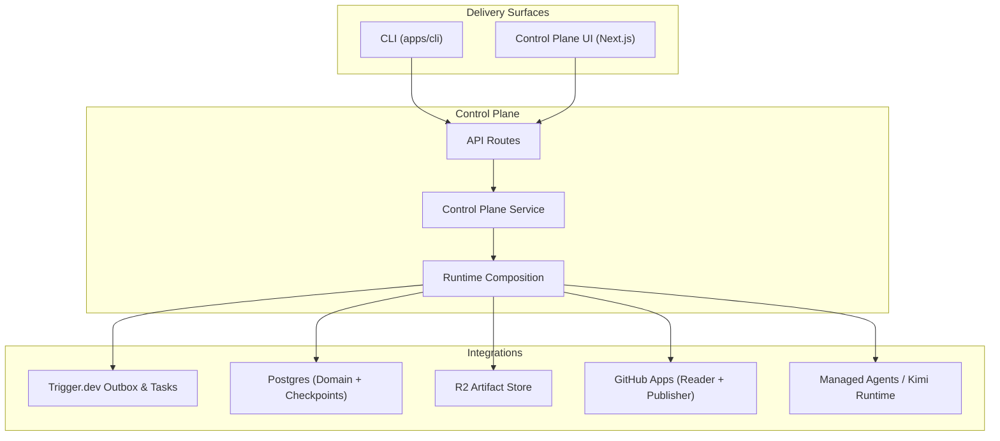
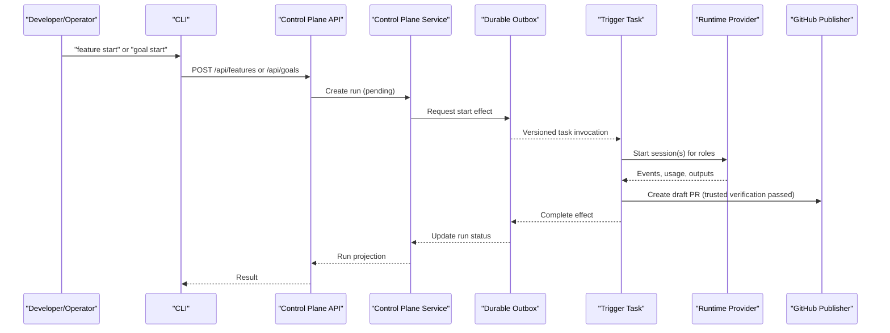
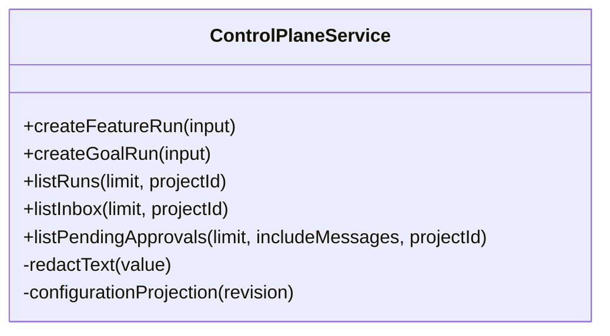
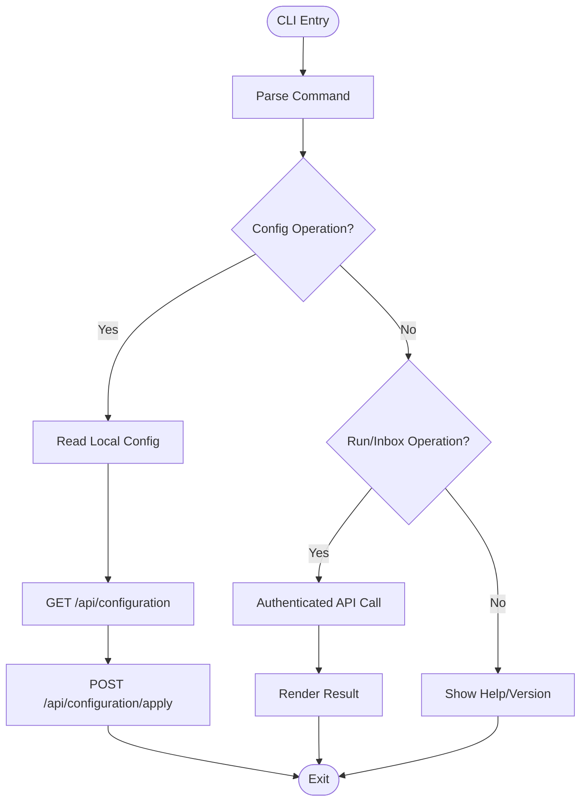
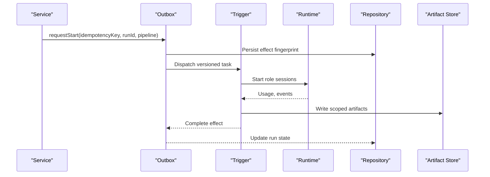
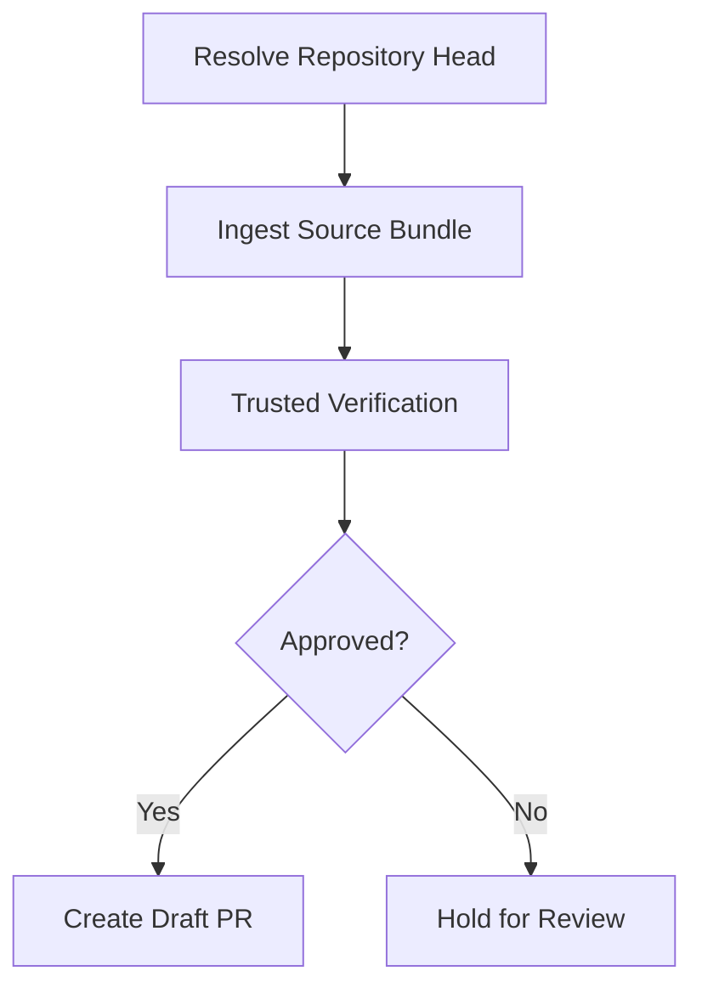
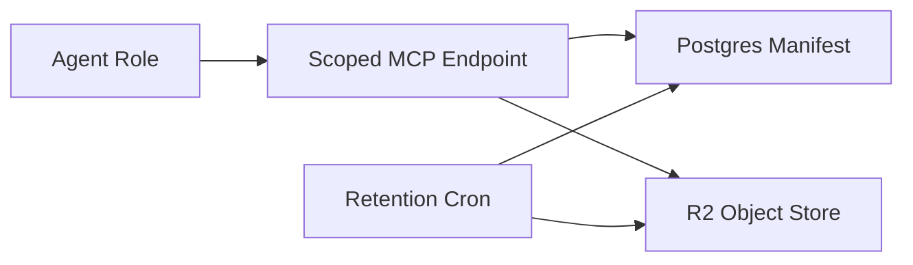
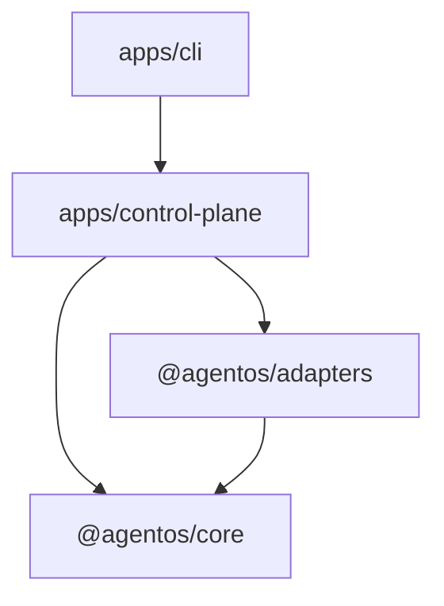

# Project Overview

<cite>
**Referenced Files in This Document**
- [README.md](file://README.md)
- [PRODUCT.md](file://PRODUCT.md)
- [agentos/README.md](file://agentos/README.md)
- [agentos/agent-os.yaml](file://agentos/agent-os.yaml)
- [apps/cli/src/main.ts](file://apps/cli/src/main.ts)
- [apps/control-plane/app/api/runs/route.ts](file://apps/control-plane/app/api/runs/route.ts)
- [apps/control-plane/app/api/goals/route.ts](file://apps/control-plane/app/api/goals/route.ts)
- [apps/control-plane/app/api/inbox/route.ts](file://apps/control-plane/app/api/inbox/route.ts)
- [apps/control-plane/src/application/runtime.ts](file://apps/control-plane/src/application/runtime.ts)
- [apps/control-plane/src/application/control-plane-service.ts](file://apps/control-plane/src/application/control-plane-service.ts)
- [docs/architecture/README.md](file://docs/architecture/README.md)
- [docs/architecture/durable-feature-workflow.md](file://docs/architecture/durable-feature-workflow.md)
- [docs/architecture/artifact-storage.md](file://docs/architecture/artifact-storage.md)
</cite>

## Table of Contents
1. [Introduction](#introduction)
2. [Project Structure](#project-structure)
3. [Core Components](#core-components)
4. [Architecture Overview](#architecture-overview)
5. [Detailed Component Analysis](#detailed-component-analysis)
6. [Dependency Analysis](#dependency-analysis)
7. [Performance Considerations](#performance-considerations)
8. [Troubleshooting Guide](#troubleshooting-guide)
9. [Conclusion](#conclusion)

## Introduction
Agent OS Passerine is a single-operator, GitHub-focused semi-autonomous build system. It turns a feature request into reviewed artifacts and a tested draft pull request while keeping approvals, budgets, credentials, and publication authority outside model sessions. The operator reviews agent work, answers questions, approves narrowly scoped actions, and inspects evidence without losing context. The system never merges or deploys code; it produces a draft PR for the operator to review and merge manually.

Key concepts:
- Runs: durable, auditable executions that transform inputs (feature requests or goals) into outputs (artifacts, tests, draft PRs).
- Goals: bounded, multi-step objectives with strict step limits, retries, timeouts, and immutable criterion provenance.
- Artifacts: scoped, content-addressed outputs produced by agents and verified by trusted verification steps.
- Approvals: human-in-the-loop decisions bound to a scope hash, ensuring operators approve exactly what they intend.

Practical value:
- A developer posts a feature request; Agent OS orchestrates planning, implementation, testing, and verification, then returns a tested draft PR with evidence.
- An operator can start a goal to automate a bounded task with strict budget and safety boundaries, reviewing intermediate approvals as needed.

**Section sources**
- [README.md:1-67](file://README.md#L1-L67)
- [PRODUCT.md:1-46](file://PRODUCT.md#L1-L46)

## Project Structure
The repository is a TypeScript monorepo with clear boundaries:
- packages/core: platform-independent domain types, policies, and orchestration contracts.
- packages/adapters: integration boundary for persistence, model providers, tools, and external systems.
- apps/control-plane: Next.js operator interface that composes core and adapters at the application boundary.
- apps/cli: terminal delivery surface for configuration management, run creation, inbox interaction, and approvals.
- agentos: repository-local definitions for projects, models, agents, environments, pipelines, policies, budgets, goals, and runtime routing.
- docs/architecture: cross-cutting design decisions and runbooks.

**Diagram sources**
- [docs/architecture/README.md:1-63](file://docs/architecture/README.md#L1-L63)
- [apps/control-plane/src/application/runtime.ts:387-571](file://apps/control-plane/src/application/runtime.ts#L387-L571)

**Section sources**
- [docs/architecture/README.md:1-63](file://docs/architecture/README.md#L1-L63)

## Core Components
- Control plane service: centralizes run lifecycle, configuration apply, inbox, approvals, and dispatch intents.
- CLI tool: parses commands, validates local configuration, and communicates with the control plane via authenticated API calls.
- Workflow orchestration: durable outbox and checkpointing coordinate Trigger tasks, approval waitpoints, runtime sessions, and publication.
- GitHub integration: read-only reader resolves repository heads and source bundles; publisher creates only draft PRs after trusted verification.

Operational highlights:
- Bounded goal workflows enforce max steps, retries, and timeouts.
- Human-in-the-loop approvals are tied to a scope hash to prevent scope creep.
- Budgets limit per-workflow and daily spend with admission controls.
- Artifacts are stored in R2 with scoped MCP access and retention policies.

**Section sources**
- [apps/control-plane/src/application/control-plane-service.ts:1-200](file://apps/control-plane/src/application/control-plane-service.ts#L1-L200)
- [apps/cli/src/main.ts:16-39](file://apps/cli/src/main.ts#L16-L39)
- [docs/architecture/durable-feature-workflow.md:1-191](file://docs/architecture/durable-feature-workflow.md#L1-L191)
- [docs/architecture/artifact-storage.md:1-42](file://docs/architecture/artifact-storage.md#L1-L42)

## Architecture Overview
Agent OS separates concerns across layers:
- Delivery surfaces (CLI and UI) do not own policy; they call stable APIs.
- The control plane composes domain logic with adapters and enforces security boundaries.
- Adapters encapsulate infrastructure (Postgres, R2, GitHub, Trigger, Managed Agents/Kimi).
- Core remains portable and free of provider-specific dependencies.

**Diagram sources**
- [apps/control-plane/app/api/runs/route.ts:13-29](file://apps/control-plane/app/api/runs/route.ts#L13-L29)
- [apps/control-plane/app/api/goals/route.ts:10-34](file://apps/control-plane/app/api/goals/route.ts#L10-L34)
- [apps/control-plane/src/application/runtime.ts:387-571](file://apps/control-plane/src/application/runtime.ts#L387-L571)
- [docs/architecture/durable-feature-workflow.md:8-44](file://docs/architecture/durable-feature-workflow.md#L8-L44)

## Detailed Component Analysis

### Control Plane Service
Responsibilities:
- Configuration apply with revision and digest checks.
- Run creation for features and goals with idempotency.
- Inbox listing and pending approvals retrieval.
- Dispatch intent emission to durable outbox.

Security and resilience:
- Secrets redaction in projections.
- Deterministic IDs from idempotency keys.
- Approval events bound to scope hashes.

**Diagram sources**
- [apps/control-plane/src/application/control-plane-service.ts:1-200](file://apps/control-plane/src/application/control-plane-service.ts#L1-L200)

**Section sources**
- [apps/control-plane/src/application/control-plane-service.ts:1-200](file://apps/control-plane/src/application/control-plane-service.ts#L1-L200)

### CLI Tool
Capabilities:
- Initialize repository-local configuration.
- Validate, plan, and apply configuration changes with idempotency.
- Start runs (features and goals), list/show runs, cancel runs.
- Interact with inbox: list, reply, approve, reject with scope-hash enforcement.

Safety:
- Input size limits for replies.
- Stable JSON output for automation.
- Connection validation for URL and token.

**Diagram sources**
- [apps/cli/src/main.ts:16-39](file://apps/cli/src/main.ts#L16-L39)
- [apps/cli/src/main.ts:186-279](file://apps/cli/src/main.ts#L186-L279)

**Section sources**
- [apps/cli/src/main.ts:16-39](file://apps/cli/src/main.ts#L16-L39)
- [apps/cli/src/main.ts:186-279](file://apps/cli/src/main.ts#L186-L279)

### Workflow Orchestration
Orchestration ensures durability and safety:
- Durable outbox records fingerprints before side effects.
- Trigger tasks coordinate role-based sessions and approvals.
- Runtime composition supports managed agents and optional Kimi runtime with handle routing.
- Source ingestion binds exact repository SHA and writes bounded artifacts.

**Diagram sources**
- [apps/control-plane/src/application/runtime.ts:387-571](file://apps/control-plane/src/application/runtime.ts#L387-L571)
- [docs/architecture/durable-feature-workflow.md:60-108](file://docs/architecture/durable-feature-workflow.md#L60-L108)

**Section sources**
- [apps/control-plane/src/application/runtime.ts:387-571](file://apps/control-plane/src/application/runtime.ts#L387-L571)
- [docs/architecture/durable-feature-workflow.md:60-108](file://docs/architecture/durable-feature-workflow.md#L60-L108)

### GitHub Integration
- Reader App resolves repository heads and ingests source bundles safely.
- Publisher App creates only draft PRs after trusted verification and policy checks.
- Local experiment mode publishes to local git branches without touching working trees.

**Diagram sources**
- [apps/control-plane/src/application/runtime.ts:118-235](file://apps/control-plane/src/application/runtime.ts#L118-L235)
- [docs/architecture/durable-feature-workflow.md:8-44](file://docs/architecture/durable-feature-workflow.md#L8-L44)

**Section sources**
- [apps/control-plane/src/application/runtime.ts:118-235](file://apps/control-plane/src/application/runtime.ts#L118-L235)
- [docs/architecture/durable-feature-workflow.md:8-44](file://docs/architecture/durable-feature-workflow.md#L8-L44)

### Artifact Storage
- Scoped MCP endpoints expose artifact.get, artifact.put, artifact.list with HMAC capabilities.
- Postgres maintains authoritative manifest; R2 stores content-addressed objects.
- Retention and cleanup are cron-driven with leases and bounded pages.

**Diagram sources**
- [docs/architecture/artifact-storage.md:1-42](file://docs/architecture/artifact-storage.md#L1-L42)

**Section sources**
- [docs/architecture/artifact-storage.md:1-42](file://docs/architecture/artifact-storage.md#L1-L42)

## Dependency Analysis
- CLI depends on control plane APIs; no domain policy in CLI.
- Control plane depends on core contracts and adapters; adapters depend on core but not vice versa.
- Runtime composition wires Trigger, Postgres, R2, GitHub, and runtime providers through well-defined ports.

**Diagram sources**
- [docs/architecture/README.md:1-63](file://docs/architecture/README.md#L1-L63)

**Section sources**
- [docs/architecture/README.md:1-63](file://docs/architecture/README.md#L1-L63)

## Performance Considerations
- Budgets and concurrency limits protect resources and costs.
- Durable checkpoints and outbox reduce retry storms and ensure progress.
- Artifact MCP caps prevent oversized payloads; larger artifacts use direct trusted store contracts.
- Local experiments avoid network overhead when appropriate.

[No sources needed since this section provides general guidance]

## Troubleshooting Guide
Common issues and diagnostics:
- Missing environment variables for runtime components will fail fast when needed (e.g., database URL required when workflow dispatch is enabled).
- Reader configuration errors surface distinct statuses for setup wizard health checks.
- Scope-hash enforcement prevents approving unintended changes; ensure the correct scope hash is used for approvals.
- Use CLI JSON output for automation-friendly error codes and messages.

Operational tips:
- Verify credentials with live smoke tests when available.
- For local development, enable seed data and use localhost login bypass.
- Reconcile stale configurations using plan before apply.

**Section sources**
- [apps/control-plane/src/application/runtime.ts:92-116](file://apps/control-plane/src/application/runtime.ts#L92-L116)
- [apps/cli/src/main.ts:281-323](file://apps/cli/src/main.ts#L281-L323)
- [agentos/README.md:1-38](file://agentos/README.md#L1-L38)

## Conclusion
Agent OS Passerine delivers a secure, auditable path from feature requests to tested draft PRs with human oversight at critical points. Its architecture isolates policy from delivery surfaces, uses durable orchestration to survive failures, and enforces budgets, approvals, and artifact scoping. Operators gain confidence through reproducible runs, clear evidence, and safe publication boundaries.

[No sources needed since this section summarizes without analyzing specific files]