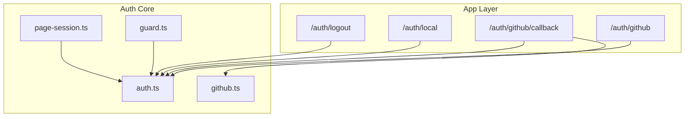
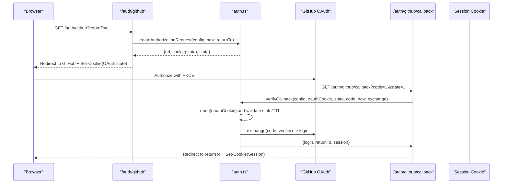
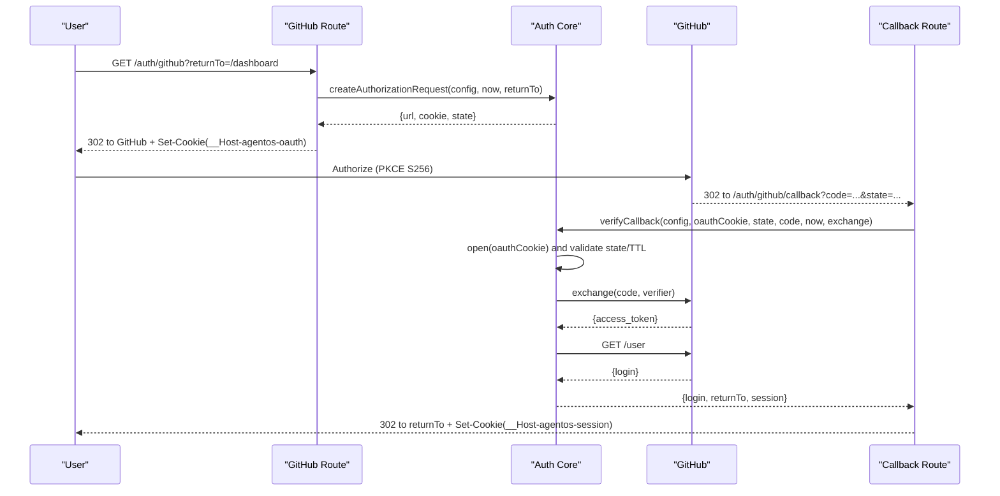
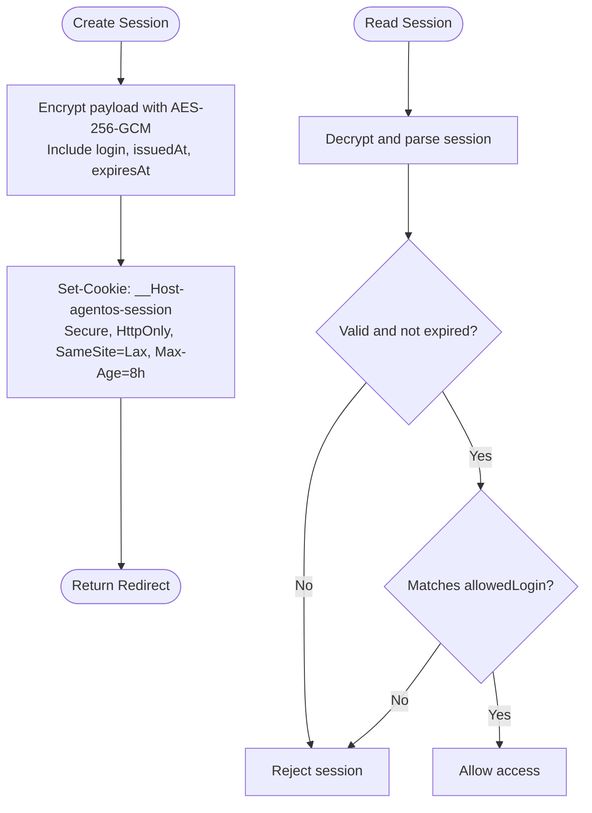
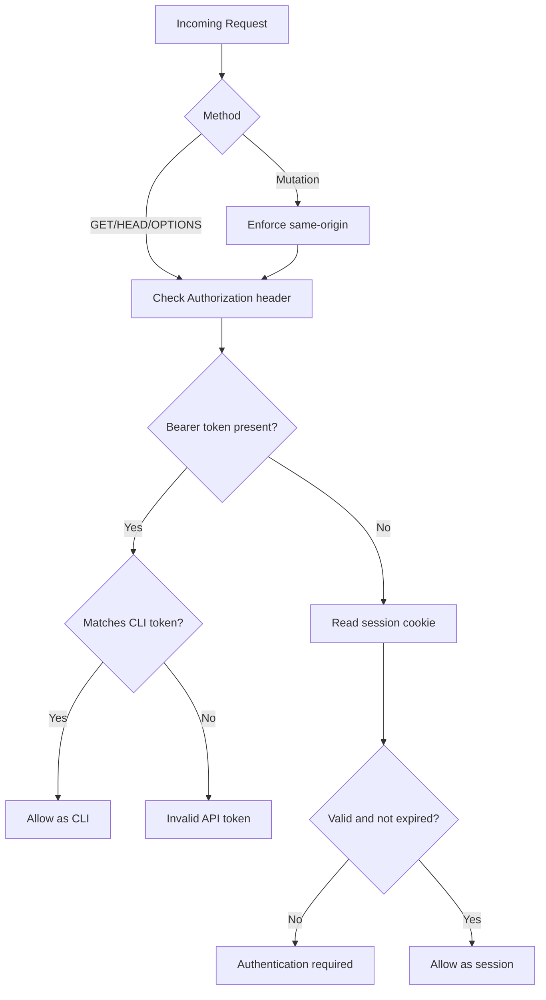
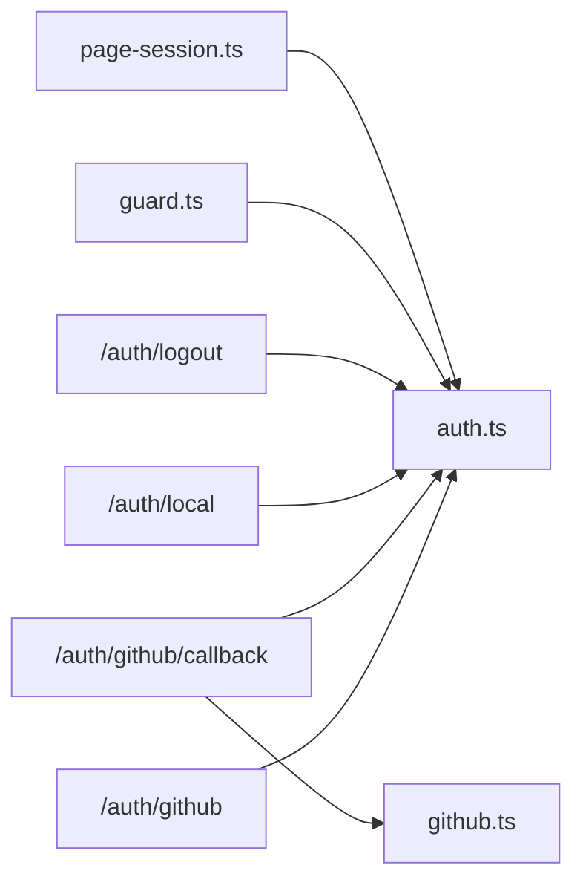

# Authentication

<cite>
**Referenced Files in This Document**
- [auth.ts](file://apps/control-plane/src/auth/auth.ts)
- [github.ts](file://apps/control-plane/src/auth/github.ts)
- [guard.ts](file://apps/control-plane/src/auth/guard.ts)
- [page-session.ts](file://apps/control-plane/src/auth/page-session.ts)
- [route.ts (GitHub OAuth start)](file://apps/control-plane/app/auth/github/route.ts)
- [route.ts (GitHub OAuth callback)](file://apps/control-plane/app/auth/github/callback/route.ts)
- [route.ts (Local login bypass)](file://apps/control-plane/app/auth/local/route.ts)
- [route.ts (Logout)](file://apps/control-plane/app/auth/logout/route.ts)
- [README.md](file://README.md)
</cite>

## Table of Contents
1. Introduction
2. Project Structure
3. Core Components
4. Architecture Overview
5. Detailed Component Analysis
6. Dependency Analysis
7. Performance Considerations
8. Troubleshooting Guide
9. Conclusion
10. Appendices

## Introduction
This document explains the Agent OS Passerine authentication system with a focus on:
- GitHub OAuth flow using PKCE and state validation
- Local development mode with localhost bypass and simplified authentication
- Session management including secure cookie creation, AES-256-GCM encryption, and expiration handling
- Configuration requirements for production and development environments, environment variables, and security considerations

The system is implemented as Next.js API routes backed by a shared authentication module that handles configuration parsing, cryptographic operations, and session lifecycle.

## Project Structure
Authentication-related code is organized into two layers:
- App layer (Next.js routes): entry points for user flows such as starting GitHub OAuth, handling callbacks, local login bypass, and logout
- Auth core (shared library): configuration loading, PKCE state handling, session sealing/unsealing, and request authentication helpers

**Diagram sources**
- [route.ts (GitHub OAuth start):1-27](file://apps/control-plane/app/auth/github/route.ts#L1-L27)
- [route.ts (GitHub OAuth callback):1-56](file://apps/control-plane/app/auth/github/callback/route.ts#L1-L56)
- [route.ts (Local login bypass):1-76](file://apps/control-plane/app/auth/local/route.ts#L1-L76)
- [route.ts (Logout):1-20](file://apps/control-plane/app/auth/logout/route.ts#L1-L20)
- [auth.ts:1-358](file://apps/control-plane/src/auth/auth.ts#L1-L358)
- [github.ts:1-54](file://apps/control-plane/src/auth/github.ts#L1-L54)
- [guard.ts:1-62](file://apps/control-plane/src/auth/guard.ts#L1-L62)
- [page-session.ts:1-23](file://apps/control-plane/src/auth/page-session.ts#L1-L23)

**Section sources**
- [route.ts (GitHub OAuth start):1-27](file://apps/control-plane/app/auth/github/route.ts#L1-L27)
- [route.ts (GitHub OAuth callback):1-56](file://apps/control-plane/app/auth/github/callback/route.ts#L1-L56)
- [route.ts (Local login bypass):1-76](file://apps/control-plane/app/auth/local/route.ts#L1-L76)
- [route.ts (Logout):1-20](file://apps/control-plane/app/auth/logout/route.ts#L1-L20)
- [auth.ts:1-358](file://apps/control-plane/src/auth/auth.ts#L1-L358)
- [github.ts:1-54](file://apps/control-plane/src/auth/github.ts#L1-L54)
- [guard.ts:1-62](file://apps/control-plane/src/auth/guard.ts#L1-L62)
- [page-session.ts:1-23](file://apps/control-plane/src/auth/page-session.ts#L1-L23)

## Core Components
- Configuration loader: parses environment variables, enforces production constraints, and provides safe defaults for local development
- GitHub OAuth client: initiates authorization with PKCE, exchanges code for token, and retrieves user identity
- Session manager: creates encrypted sessions with expiration, reads and validates sessions, and clears cookies
- Request guard: authenticates API requests via session or CLI token and enforces CSRF protections for mutations
- Page session helper: reads and requires sessions in server components/pages

Key responsibilities:
- Enforce HTTPS in production and validate public URL format
- Use PKCE to prevent authorization code interception
- Store short-lived OAuth state securely in a signed/encrypted cookie
- Issue long-lived but expiring sessions encrypted with AES-256-GCM
- Protect cross-origin mutations with origin checks

**Section sources**
- [auth.ts:73-157](file://apps/control-plane/src/auth/auth.ts#L73-L157)
- [auth.ts:167-206](file://apps/control-plane/src/auth/auth.ts#L167-L206)
- [auth.ts:239-315](file://apps/control-plane/src/auth/auth.ts#L239-L315)
- [auth.ts:323-351](file://apps/control-plane/src/auth/auth.ts#L323-L351)
- [github.ts:4-53](file://apps/control-plane/src/auth/github.ts#L4-L53)
- [guard.ts:17-61](file://apps/control-plane/src/auth/guard.ts#L17-L61)
- [page-session.ts:7-22](file://apps/control-plane/src/auth/page-session.ts#L7-L22)

## Architecture Overview
The authentication architecture separates concerns between user-facing routes and reusable auth primitives:

**Diagram sources**
- [route.ts (GitHub OAuth start):12-26](file://apps/control-plane/app/auth/github/route.ts#L12-L26)
- [auth.ts:239-273](file://apps/control-plane/src/auth/auth.ts#L239-L273)
- [route.ts (GitHub OAuth callback):25-54](file://apps/control-plane/app/auth/github/callback/route.ts#L25-L54)
- [auth.ts:279-315](file://apps/control-plane/src/auth/auth.ts#L279-L315)
- [github.ts:4-53](file://apps/control-plane/src/auth/github.ts#L4-L53)

## Detailed Component Analysis

### GitHub OAuth Flow with PKCE
- Authorization initiation:
  - Generates a random state and PKCE code_verifier
  - Builds the GitHub authorize URL with scope read:user and S256 challenge
  - Stores an encrypted OAuth state cookie containing state, verifier, returnTo, and issuedAt
  - Redirects the browser to GitHub
- Callback handling:
  - Validates presence of code and state
  - Decrypts and verifies the OAuth state cookie against the callback state
  - Ensures the OAuth state has not expired
  - Exchanges the code for an access token and fetches the user identity
  - Checks the login against allowedLogin
  - Issues an encrypted session cookie and redirects to returnTo

Security properties:
- PKCE prevents authorization code interception attacks
- State parameter prevents CSRF during OAuth
- Short TTL for OAuth state cookie limits replay window
- Strict redirect validation prevents open redirect vulnerabilities

**Section sources**
- [route.ts (GitHub OAuth start):12-26](file://apps/control-plane/app/auth/github/route.ts#L12-L26)
- [auth.ts:239-273](file://apps/control-plane/src/auth/auth.ts#L239-L273)
- [route.ts (GitHub OAuth callback):25-54](file://apps/control-plane/app/auth/github/callback/route.ts#L25-L54)
- [auth.ts:279-315](file://apps/control-plane/src/auth/auth.ts#L279-L315)
- [github.ts:4-53](file://apps/control-plane/src/auth/github.ts#L4-L53)

#### Sequence Diagram: GitHub OAuth Start and Callback

**Diagram sources**
- [route.ts (GitHub OAuth start):12-26](file://apps/control-plane/app/auth/github/route.ts#L12-L26)
- [auth.ts:239-273](file://apps/control-plane/src/auth/auth.ts#L239-L273)
- [route.ts (GitHub OAuth callback):25-54](file://apps/control-plane/app/auth/github/callback/route.ts#L25-L54)
- [auth.ts:279-315](file://apps/control-plane/src/auth/auth.ts#L279-L315)
- [github.ts:4-53](file://apps/control-plane/src/auth/github.ts#L4-L53)

### Local Development Mode with Localhost Bypass
- When running locally (non-production and publicUrl resolves to localhost variants), the system allows a simplified login without requiring a GitHub OAuth app
- The local login route issues a session directly after validating that the request originates from localhost and sanitizing returnTo
- This enables rapid iteration without configuring GitHub OAuth credentials

Security considerations:
- Local bypass is disabled in production
- Only localhost-like hosts are permitted for bypass
- ReturnTo values are strictly validated to prevent open redirects

**Section sources**
- [route.ts (Local login bypass):16-35](file://apps/control-plane/app/auth/local/route.ts#L16-L35)
- [route.ts (Local login bypass):38-75](file://apps/control-plane/app/auth/local/route.ts#L38-L75)
- [auth.ts:64-71](file://apps/control-plane/src/auth/auth.ts#L64-L71)
- [auth.ts:118-157](file://apps/control-plane/src/auth/auth.ts#L118-L157)

### Session Management
- Encryption:
  - Sessions are sealed using AES-256-GCM with a per-request nonce and an HMAC tag derived from the session secret
  - The resulting cookie value contains nonce, ciphertext, and auth tag encoded in base64url
- Cookie attributes:
  - Secure, HttpOnly, SameSite=Lax, Path=/
  - Uses __Host- prefix for strict delivery constraints
- Expiration:
  - Sessions include issuedAt and expiresAt timestamps
  - readSession rejects expired or tampered sessions and ensures the login matches allowedLogin
- Clearing:
  - Logout clears the session cookie and redirects to login

**Diagram sources**
- [auth.ts:167-206](file://apps/control-plane/src/auth/auth.ts#L167-L206)
- [auth.ts:208-218](file://apps/control-plane/src/auth/auth.ts#L208-L218)
- [auth.ts:323-351](file://apps/control-plane/src/auth/auth.ts#L323-L351)

**Section sources**
- [auth.ts:167-206](file://apps/control-plane/src/auth/auth.ts#L167-L206)
- [auth.ts:208-218](file://apps/control-plane/src/auth/auth.ts#L208-L218)
- [auth.ts:323-351](file://apps/control-plane/src/auth/auth.ts#L323-L351)
- [route.ts (Logout):10-19](file://apps/control-plane/app/auth/logout/route.ts#L10-L19)

### Request Authentication and CSRF Protection
- API endpoints authenticate via:
  - Bearer token matching AGENTOS_CLI_TOKEN for programmatic clients
  - Session cookie for browser-based requests
- For non-safe HTTP methods (mutations), the guard enforces same-origin requests by checking Origin and Sec-Fetch-Site headers
- Webhook requests require signature verification and are rejected if missing

**Diagram sources**
- [guard.ts:17-61](file://apps/control-plane/src/auth/guard.ts#L17-L61)

**Section sources**
- [guard.ts:17-61](file://apps/control-plane/src/auth/guard.ts#L17-L61)

## Dependency Analysis
The following diagram shows how routes depend on the auth core and each other:

**Diagram sources**
- [route.ts (GitHub OAuth start):1-27](file://apps/control-plane/app/auth/github/route.ts#L1-L27)
- [route.ts (GitHub OAuth callback):1-56](file://apps/control-plane/app/auth/github/callback/route.ts#L1-L56)
- [route.ts (Local login bypass):1-76](file://apps/control-plane/app/auth/local/route.ts#L1-L76)
- [route.ts (Logout):1-20](file://apps/control-plane/app/auth/logout/route.ts#L1-L20)
- [auth.ts:1-358](file://apps/control-plane/src/auth/auth.ts#L1-L358)
- [github.ts:1-54](file://apps/control-plane/src/auth/github.ts#L1-L54)
- [guard.ts:1-62](file://apps/control-plane/src/auth/guard.ts#L1-L62)
- [page-session.ts:1-23](file://apps/control-plane/src/auth/page-session.ts#L1-L23)

**Section sources**
- [route.ts (GitHub OAuth start):1-27](file://apps/control-plane/app/auth/github/route.ts#L1-L27)
- [route.ts (GitHub OAuth callback):1-56](file://apps/control-plane/app/auth/github/callback/route.ts#L1-L56)
- [route.ts (Local login bypass):1-76](file://apps/control-plane/app/auth/local/route.ts#L1-L76)
- [route.ts (Logout):1-20](file://apps/control-plane/app/auth/logout/route.ts#L1-L20)
- [auth.ts:1-358](file://apps/control-plane/src/auth/auth.ts#L1-L358)
- [github.ts:1-54](file://apps/control-plane/src/auth/github.ts#L1-L54)
- [guard.ts:1-62](file://apps/control-plane/src/auth/guard.ts#L1-L62)
- [page-session.ts:1-23](file://apps/control-plane/src/auth/page-session.ts#L1-L23)

## Performance Considerations
- Cryptographic operations:
  - AES-256-GCM sealing/unsealing is efficient; ensure session payloads remain small
  - Nonce generation uses cryptographically secure randomness
- Network calls:
  - GitHub token exchange and user lookup are performed only during callback; cache results where appropriate at higher layers
- Cookie size:
  - Encrypted sessions are compact; avoid adding large payloads to sessions
- Expiration strategy:
  - 8-hour session TTL balances usability and security; adjust based on operational needs

[No sources needed since this section provides general guidance]

## Troubleshooting Guide
Common issues and resolutions:
- Missing or invalid environment variables:
  - Ensure AGENTOS_PUBLIC_URL is set and valid; in production it must be HTTPS
  - AGENTOS_SESSION_SECRET must be at least 32 bytes in non-local-bypass modes
  - GITHUB_CLIENT_ID, GITHUB_CLIENT_SECRET, and GITHUB_ALLOWED_LOGIN are required outside local bypass
- OAuth errors:
  - Invalid or expired OAuth state indicates mismatched state or timeout; clear cookies and retry
  - Code exchange failures indicate network or credential issues; check GitHub app settings and scopes
- Session not recognized:
  - Verify cookies are being sent and not blocked by SameSite/Secure policies
  - Confirm session has not expired and login matches allowedLogin
- CSRF rejection:
  - Mutations must originate from the same site; ensure Origin and Sec-Fetch-Site headers are correct

**Section sources**
- [auth.ts:73-157](file://apps/control-plane/src/auth/auth.ts#L73-L157)
- [auth.ts:279-315](file://apps/control-plane/src/auth/auth.ts#L279-L315)
- [guard.ts:17-61](file://apps/control-plane/src/auth/guard.ts#L17-L61)

## Conclusion
The Agent OS Passerine authentication system implements a robust, secure flow combining GitHub OAuth with PKCE and state validation, alongside a convenient local development bypass. Sessions are encrypted with AES-256-GCM and enforced with strict cookie attributes and expiration checks. Production deployments require explicit configuration and HTTPS, while development benefits from safe defaults on localhost. Request guards protect APIs and enforce CSRF controls for mutations.

[No sources needed since this section summarizes without analyzing specific files]

## Appendices

### Environment Variables and Configuration
- Required in production:
  - AGENTOS_PUBLIC_URL: absolute HTTPS URL
  - AGENTOS_SESSION_SECRET: minimum 32 bytes
  - GITHUB_CLIENT_ID, GITHUB_CLIENT_SECRET, GITHUB_ALLOWED_LOGIN
- Optional:
  - AGENTOS_CLI_TOKEN: used for programmatic API access via Bearer token
- Development defaults:
  - If NODE_ENV is not production and publicUrl resolves to localhost variants, local bypass is enabled and default values are used for GitHub credentials and allowed login
  - Default session secret is provided for convenience in local development

Setup notes:
- Create .env.local at the repository root and symlink into apps/control-plane/.env.local
- Follow the quick start instructions for local development and full stack setup

**Section sources**
- [README.md:21-35](file://README.md#L21-L35)
- [auth.ts:80-157](file://apps/control-plane/src/auth/auth.ts#L80-L157)