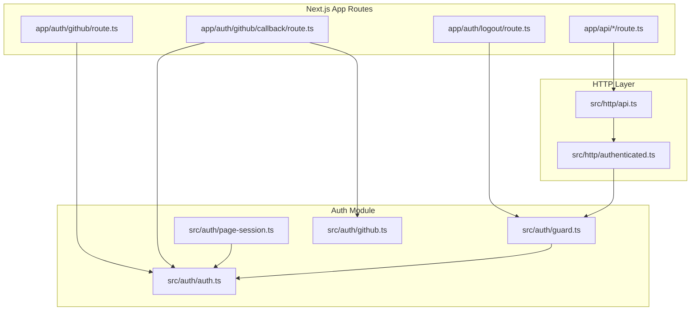
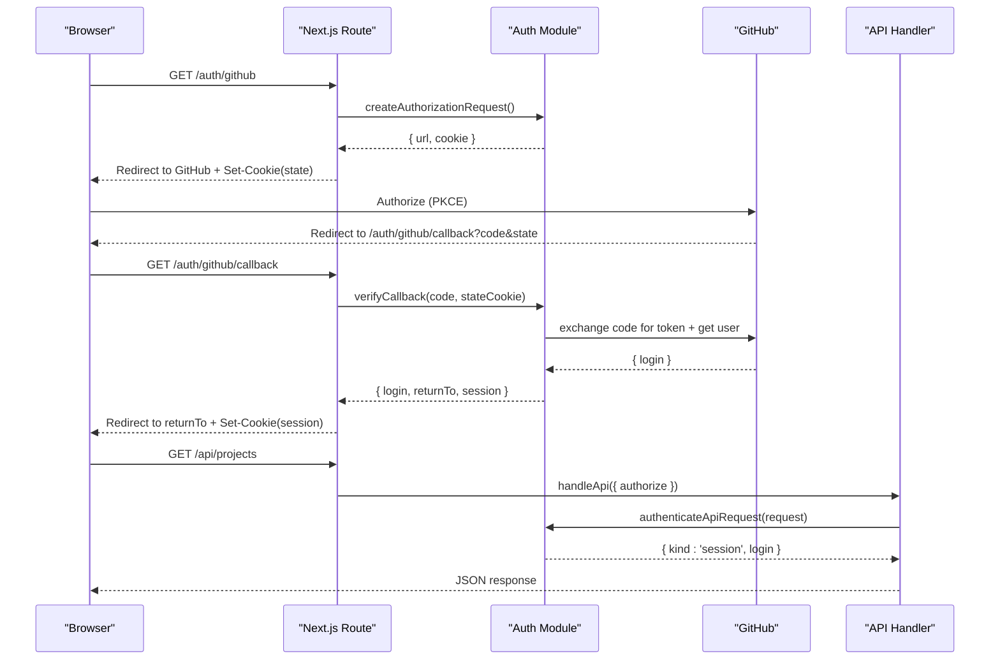
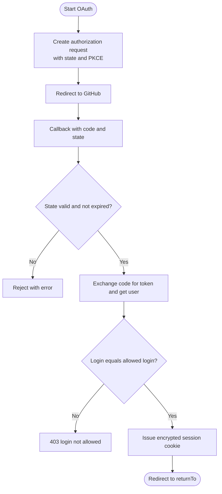
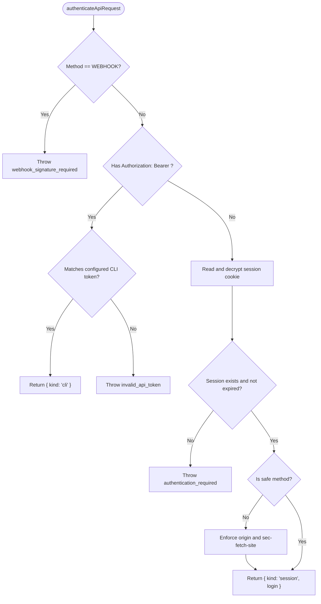
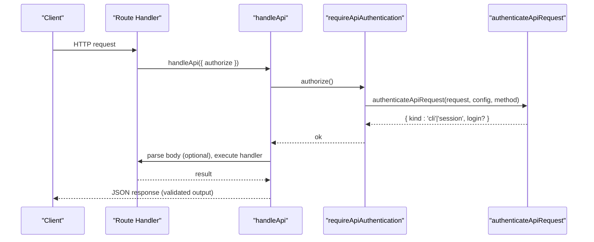
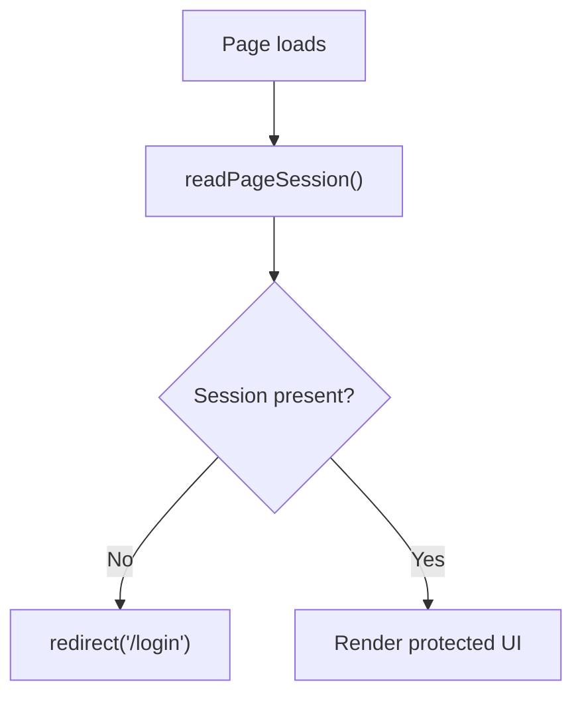
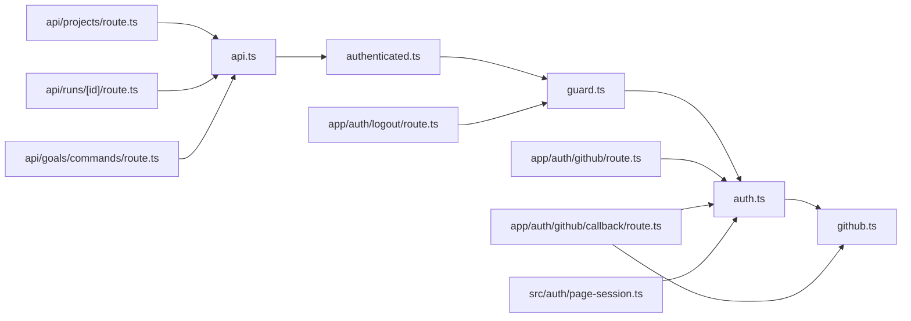

# Authorization

<cite>
**Referenced Files in This Document**
- [auth.ts](file://apps/control-plane/src/auth/auth.ts)
- [github.ts](file://apps/control-plane/src/auth/github.ts)
- [guard.ts](file://apps/control-plane/src/auth/guard.ts)
- [authenticated.ts](file://apps/control-plane/src/http/authenticated.ts)
- [api.ts](file://apps/control-plane/src/http/api.ts)
- [route.ts (projects)](file://apps/control-plane/app/api/projects/route.ts)
- [route.ts (runs/[id])](file://apps/control-plane/app/api/runs/[id]/route.ts)
- [route.ts (goals/commands)](file://apps/control-plane/app/api/goals/commands/route.ts)
- [route.ts (github)](file://apps/control-plane/app/auth/github/route.ts)
- [route.ts (github/callback)](file://apps/control-plane/app/auth/github/callback/route.ts)
- [route.ts (logout)](file://apps/control-plane/app/auth/logout/route.ts)
- [page-session.ts](file://apps/control-plane/src/auth/page-session.ts)
</cite>

## Table of Contents
1. Introduction
2. Project Structure
3. Core Components
4. Architecture Overview
5. Detailed Component Analysis
6. Dependency Analysis
7. Performance Considerations
8. Troubleshooting Guide
9. Conclusion

## Introduction
This document explains the authorization system in Agent OS Passerine’s control plane. It covers how user identity is established via GitHub OAuth, how sessions are issued and validated, how API routes are protected with a guard middleware, and how roles and permissions are enforced. It also provides examples of protected routes, custom guards, and best practices for adding new authorization checks to features.

## Project Structure
Authorization spans several layers:
- Identity and session management live in the auth module.
- Route handlers use a shared HTTP handler that enforces authorization and input/output contracts.
- UI pages read server-side sessions to gate access.

**Diagram sources**
- [route.ts (github):1-27](file://apps/control-plane/app/auth/github/route.ts#L1-L27)
- [route.ts (github/callback):1-56](file://apps/control-plane/app/auth/github/callback/route.ts#L1-L56)
- [route.ts (logout):1-19](file://apps/control-plane/app/auth/logout/route.ts#L1-L19)
- [auth.ts:1-358](file://apps/control-plane/src/auth/auth.ts#L1-L358)
- [github.ts:1-54](file://apps/control-plane/src/auth/github.ts#L1-L54)
- [guard.ts:1-62](file://apps/control-plane/src/auth/guard.ts#L1-L62)
- [page-session.ts:1-23](file://apps/control-plane/src/auth/page-session.ts#L1-L23)
- [api.ts:1-130](file://apps/control-plane/src/http/api.ts#L1-L130)
- [authenticated.ts:1-18](file://apps/control-plane/src/http/authenticated.ts#L1-L18)

**Section sources**
- [auth.ts:1-358](file://apps/control-plane/src/auth/auth.ts#L1-L358)
- [github.ts:1-54](file://apps/control-plane/src/auth/github.ts#L1-L54)
- [guard.ts:1-62](file://apps/control-plane/src/auth/guard.ts#L1-L62)
- [authenticated.ts:1-18](file://apps/control-plane/src/http/authenticated.ts#L1-L18)
- [api.ts:1-130](file://apps/control-plane/src/http/api.ts#L1-L130)
- [page-session.ts:1-23](file://apps/control-plane/src/auth/page-session.ts#L1-L23)

## Core Components
- Auth configuration and session cryptography: builds environment-backed config, issues and validates encrypted sessions, and sanitizes redirect targets.
- GitHub OAuth flow: creates an authorization request with PKCE, exchanges code for token, resolves GitHub login, and enforces allowed login.
- Request authentication guard: authenticates API requests via session cookie or CLI bearer token, rejects cross-origin mutations, and blocks webhook method misuse.
- HTTP handler contract: runs authorization first, parses and validates request bodies, executes handlers, validates outputs, and normalizes errors.
- Page session helpers: reads Next.js cookies server-side to determine logged-in users and redirect unauthenticated visitors.

Key responsibilities:
- Role determination: The only supported role model is an allowlist of a single allowed GitHub login. Access is granted if the authenticated login matches the configured allowed login.
- Permission enforcement: All API routes opt into protection by calling requireApiAuthentication within handleApi. Mutating browser requests enforce same-origin headers.

**Section sources**
- [auth.ts:14-21](file://apps/control-plane/src/auth/auth.ts#L14-L21)
- [auth.ts:80-157](file://apps/control-plane/src/auth/auth.ts#L80-L157)
- [auth.ts:239-315](file://apps/control-plane/src/auth/auth.ts#L239-L315)
- [auth.ts:323-351](file://apps/control-plane/src/auth/auth.ts#L323-L351)
- [github.ts:4-53](file://apps/control-plane/src/auth/github.ts#L4-L53)
- [guard.ts:17-61](file://apps/control-plane/src/auth/guard.ts#L17-L61)
- [api.ts:93-129](file://apps/control-plane/src/http/api.ts#L93-L129)
- [authenticated.ts:4-17](file://apps/control-plane/src/http/authenticated.ts#L4-L17)
- [page-session.ts:7-22](file://apps/control-plane/src/auth/page-session.ts#L7-L22)

## Architecture Overview
The authorization architecture combines OAuth-based identity, encrypted session cookies, and per-route authorization.

**Diagram sources**
- [route.ts (github):12-26](file://apps/control-plane/app/auth/github/route.ts#L12-L26)
- [route.ts (github/callback):25-55](file://apps/control-plane/app/auth/github/callback/route.ts#L25-L55)
- [auth.ts:239-315](file://apps/control-plane/src/auth/auth.ts#L239-L315)
- [github.ts:4-53](file://apps/control-plane/src/auth/github.ts#L4-L53)
- [api.ts:93-129](file://apps/control-plane/src/http/api.ts#L93-L129)
- [authenticated.ts:4-7](file://apps/control-plane/src/http/authenticated.ts#L4-L7)
- [guard.ts:33-61](file://apps/control-plane/src/auth/guard.ts#L33-L61)

## Detailed Component Analysis

### GitHub OAuth Flow and Session Issuance
- Authorization initiation generates a state and PKCE verifier, stores a short-lived state cookie, and redirects to GitHub.
- Callback validates state, exchanges code for a GitHub token, fetches the user profile, enforces the allowed login, and issues an encrypted session cookie.
- Sessions contain login, issuedAt, and expiresAt; they are validated on each request.

**Diagram sources**
- [auth.ts:239-273](file://apps/control-plane/src/auth/auth.ts#L239-L273)
- [auth.ts:279-315](file://apps/control-plane/src/auth/auth.ts#L279-L315)
- [github.ts:4-53](file://apps/control-plane/src/auth/github.ts#L4-L53)
- [route.ts (github):12-26](file://apps/control-plane/app/auth/github/route.ts#L12-L26)
- [route.ts (github/callback):25-55](file://apps/control-plane/app/auth/github/callback/route.ts#L25-L55)

**Section sources**
- [auth.ts:239-315](file://apps/control-plane/src/auth/auth.ts#L239-L315)
- [github.ts:4-53](file://apps/control-plane/src/auth/github.ts#L4-L53)
- [route.ts (github):12-26](file://apps/control-plane/app/auth/github/route.ts#L12-L26)
- [route.ts (github/callback):25-55](file://apps/control-plane/app/auth/github/callback/route.ts#L25-L55)

### Request Authentication Guard
- Supports two identities:
  - Session-based: derived from a secure, HttpOnly, SameSite=Lax cookie containing an encrypted session.
  - CLI-based: a separate bearer token compared using constant-time equality.
- Enforces same-origin mutation policy for non-safe methods when using session auth.
- Explicitly rejects misused WEBHOOK method to prevent bypassing webhook signature checks.

**Diagram sources**
- [guard.ts:33-61](file://apps/control-plane/src/auth/guard.ts#L33-L61)
- [guard.ts:17-31](file://apps/control-plane/src/auth/guard.ts#L17-L31)
- [auth.ts:335-351](file://apps/control-plane/src/auth/auth.ts#L335-L351)

**Section sources**
- [guard.ts:17-61](file://apps/control-plane/src/auth/guard.ts#L17-L61)
- [auth.ts:335-351](file://apps/control-plane/src/auth/auth.ts#L335-L351)

### API Handler Integration and Protected Routes
- Every route uses handleApi with an authorize function that calls requireApiAuthentication.
- handleApi runs authorization before parsing the body, ensuring unauthorized requests fail fast.
- Output validation ensures responses conform to declared schemas.

Examples:
- List projects: requires authentication and returns a list projection.
- Get run by id: requires authentication and returns a run projection.
- List trusted goal commands: requires authentication and returns an allowlist.

**Diagram sources**
- [api.ts:93-129](file://apps/control-plane/src/http/api.ts#L93-L129)
- [authenticated.ts:4-7](file://apps/control-plane/src/http/authenticated.ts#L4-L7)
- [guard.ts:33-61](file://apps/control-plane/src/auth/guard.ts#L33-L61)
- [route.ts (projects):9-18](file://apps/control-plane/app/api/projects/route.ts#L9-L18)
- [route.ts (runs/[id]):9-24](file://apps/control-plane/app/api/runs/[id]/route.ts#L9-L24)
- [route.ts (goals/commands):21-41](file://apps/control-plane/app/api/goals/commands/route.ts#L21-L41)

**Section sources**
- [api.ts:93-129](file://apps/control-plane/src/http/api.ts#L93-L129)
- [authenticated.ts:4-17](file://apps/control-plane/src/http/authenticated.ts#L4-L17)
- [route.ts (projects):9-18](file://apps/control-plane/app/api/projects/route.ts#L9-L18)
- [route.ts (runs/[id]):9-24](file://apps/control-plane/app/api/runs/[id]/route.ts#L9-L24)
- [route.ts (goals/commands):21-41](file://apps/control-plane/app/api/goals/commands/route.ts#L21-L41)

### UI Pages and Server-Side Session Checks
- Pages can read the current session server-side to decide what to render or whether to redirect to login.
- Unauthenticated page requests are redirected to the login page.

**Diagram sources**
- [page-session.ts:7-22](file://apps/control-plane/src/auth/page-session.ts#L7-L22)

**Section sources**
- [page-session.ts:7-22](file://apps/control-plane/src/auth/page-session.ts#L7-L22)

### Logout Flow
- POST to logout enforces same-origin mutation policy and clears the session cookie, then redirects to login.

**Section sources**
- [route.ts (logout):10-18](file://apps/control-plane/app/auth/logout/route.ts#L10-L18)
- [guard.ts:17-31](file://apps/control-plane/src/auth/guard.ts#L17-L31)

## Dependency Analysis
High-level dependencies between authorization components:

**Diagram sources**
- [auth.ts:1-358](file://apps/control-plane/src/auth/auth.ts#L1-L358)
- [github.ts:1-54](file://apps/control-plane/src/auth/github.ts#L1-L54)
- [guard.ts:1-62](file://apps/control-plane/src/auth/guard.ts#L1-L62)
- [authenticated.ts:1-18](file://apps/control-plane/src/http/authenticated.ts#L1-L18)
- [api.ts:1-130](file://apps/control-plane/src/http/api.ts#L1-L130)
- [route.ts (projects):1-19](file://apps/control-plane/app/api/projects/route.ts#L1-L19)
- [route.ts (runs/[id]):1-25](file://apps/control-plane/app/api/runs/[id]/route.ts#L1-L25)
- [route.ts (goals/commands):1-42](file://apps/control-plane/app/api/goals/commands/route.ts#L1-L42)
- [route.ts (github):1-27](file://apps/control-plane/app/auth/github/route.ts#L1-L27)
- [route.ts (github/callback):1-56](file://apps/control-plane/app/auth/github/callback/route.ts#L1-L56)
- [route.ts (logout):1-19](file://apps/control-plane/app/auth/logout/route.ts#L1-L19)
- [page-session.ts:1-23](file://apps/control-plane/src/auth/page-session.ts#L1-L23)

**Section sources**
- [auth.ts:1-358](file://apps/control-plane/src/auth/auth.ts#L1-L358)
- [github.ts:1-54](file://apps/control-plane/src/auth/github.ts#L1-L54)
- [guard.ts:1-62](file://apps/control-plane/src/auth/guard.ts#L1-L62)
- [authenticated.ts:1-18](file://apps/control-plane/src/http/authenticated.ts#L1-L18)
- [api.ts:1-130](file://apps/control-plane/src/http/api.ts#L1-L130)
- [route.ts (projects):1-19](file://apps/control-plane/app/api/projects/route.ts#L1-L19)
- [route.ts (runs/[id]):1-25](file://apps/control-plane/app/api/runs/[id]/route.ts#L1-L25)
- [route.ts (goals/commands):1-42](file://apps/control-plane/app/api/goals/commands/route.ts#L1-L42)
- [route.ts (github):1-27](file://apps/control-plane/app/auth/github/route.ts#L1-L27)
- [route.ts (github/callback):1-56](file://apps/control-plane/app/auth/github/callback/route.ts#L1-L56)
- [route.ts (logout):1-19](file://apps/control-plane/app/auth/logout/route.ts#L1-L19)
- [page-session.ts:1-23](file://apps/control-plane/src/auth/page-session.ts#L1-L23)

## Performance Considerations
- Session encryption/decryption uses AES-GCM with random nonces; keep payloads small to minimize CPU usage.
- Body parsing streams and enforces size limits to avoid memory spikes; ensure maxBodyBytes aligns with feature needs.
- Cross-origin checks are lightweight header validations; prefer them over expensive checks.
- Avoid unnecessary re-authentication by caching per-request decisions where appropriate at higher layers.

[No sources needed since this section provides general guidance]

## Troubleshooting Guide
Common errors and their causes:
- authentication_required: Missing or invalid session cookie. Ensure the client sends the session cookie and it has not expired.
- invalid_api_token: Bearer token does not match the configured CLI token. Verify AGENTOS_CLI_TOKEN and the Authorization header.
- webhook_signature_required: Misuse of WEBHOOK method through the API guard. Use proper webhook handling outside this guard.
- cross-origin mutation rejected: Non-safe method without matching origin/sec-fetch-site. Ensure browser requests originate from the same site.
- login_not_allowed: Authenticated GitHub login does not match the configured allowed login. Update GITHUB_ALLOWED_LOGIN or sign in with the correct account.
- oauth_exchange_failed / oauth_identity_failed: GitHub token exchange or user lookup failed. Check network connectivity and GitHub credentials.

Where these are handled:
- Guard throws specific AuthError codes for authentication and CSRF-like checks.
- Auth callback throws errors for state mismatch, expiration, and identity failures.
- API handler converts AuthError and ServiceError into standardized JSON responses.

**Section sources**
- [guard.ts:17-61](file://apps/control-plane/src/auth/guard.ts#L17-L61)
- [auth.ts:279-315](file://apps/control-plane/src/auth/auth.ts#L279-L315)
- [api.ts:115-129](file://apps/control-plane/src/http/api.ts#L115-L129)

## Conclusion
Agent OS Passerine implements a focused authorization model centered on GitHub OAuth and a single allowed login. Requests are authenticated via secure session cookies or a dedicated CLI token, with strict protections against cross-origin mutations. API routes protect themselves by invoking a shared authentication guard inside a unified handler that validates inputs and outputs. For new features, always add an authorize step via requireApiAuthentication, validate inputs and outputs with schemas, and rely on the guard for consistent security policies.

[No sources needed since this section summarizes without analyzing specific files]