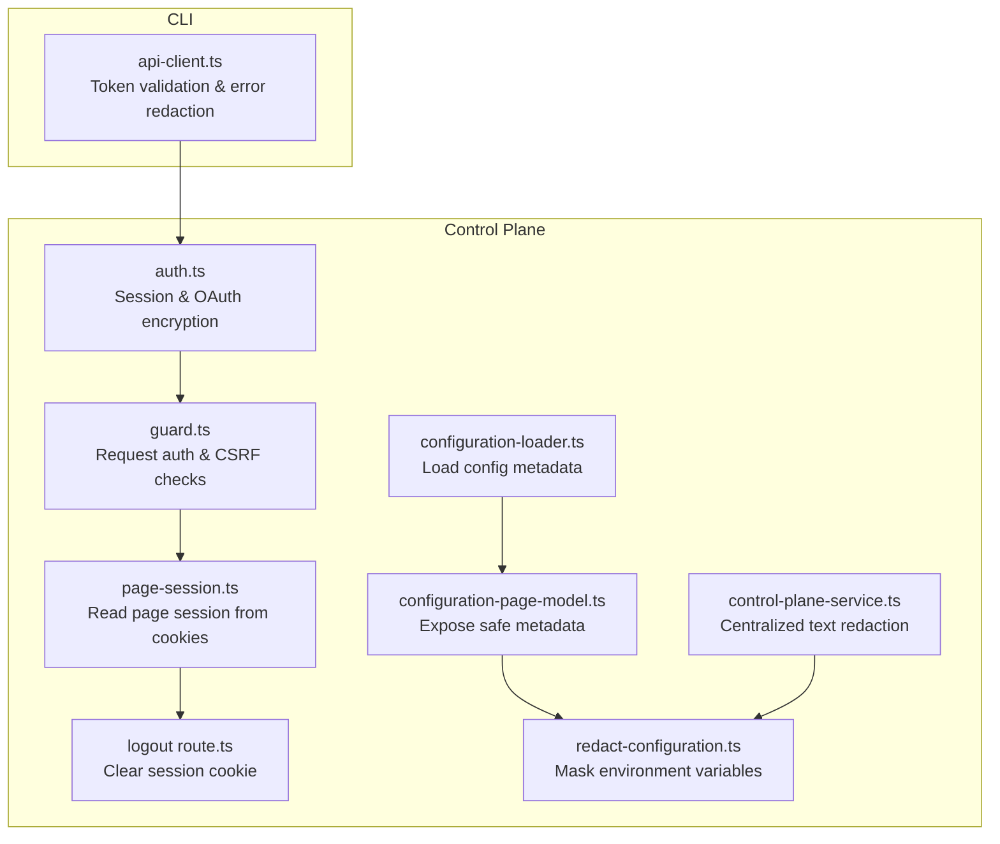
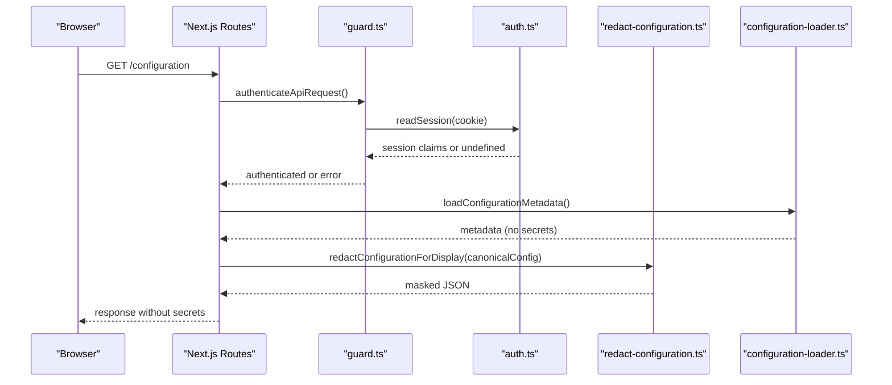
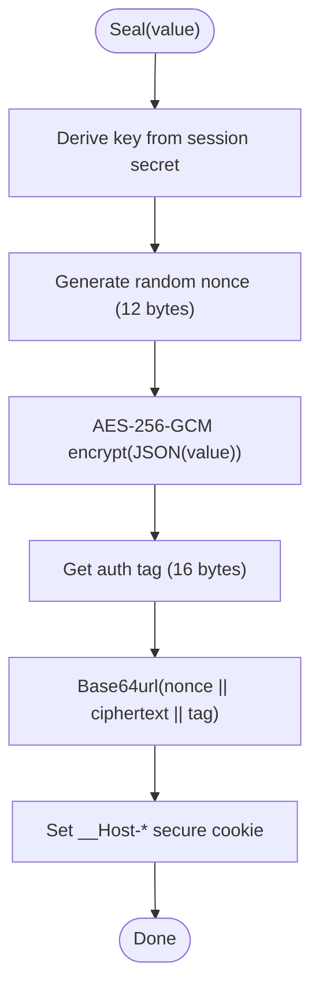
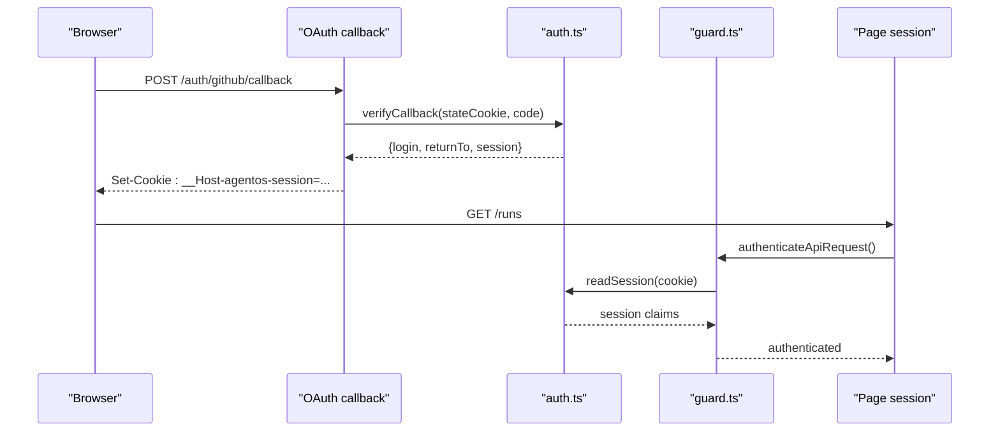
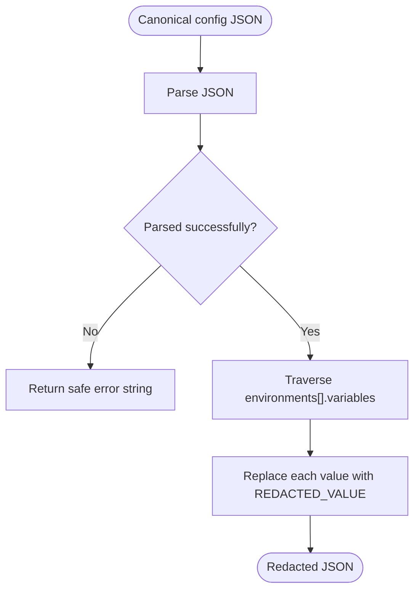
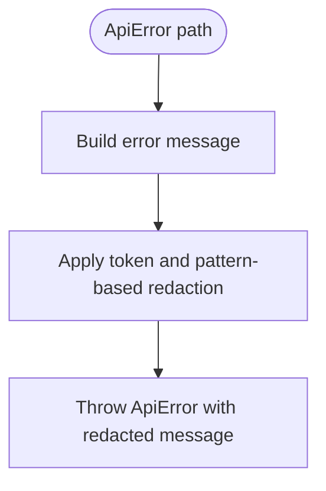
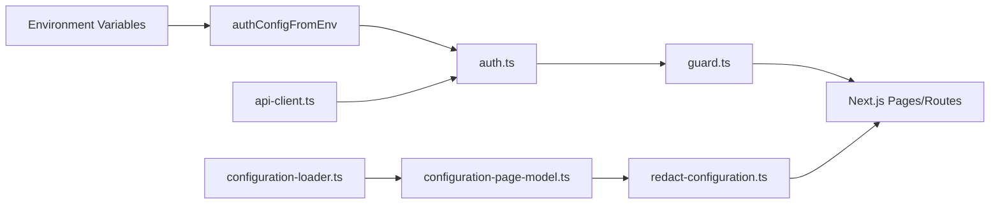

# Secret Management

<cite>
**Referenced Files in This Document**
- [auth.ts](file://apps/control-plane/src/auth/auth.ts)
- [guard.ts](file://apps/control-plane/src/auth/guard.ts)
- [page-session.ts](file://apps/control-plane/src/auth/page-session.ts)
- [logout route.ts](file://apps/control-plane/app/auth/logout/route.ts)
- [redact-configuration.ts](file://apps/control-plane/src/ui/redact-configuration.ts)
- [configuration-loader.ts](file://apps/control-plane/src/config/configuration-loader.ts)
- [configuration-page-model.ts](file://apps/control-plane/src/config/configuration-page-model.ts)
- [api-client.ts](file://apps/cli/src/api-client.ts)
- [control-plane-service.ts](file://apps/control-plane/src/application/control-plane-service.ts)
</cite>

## Table of Contents
1. [Introduction](#introduction)
2. [Project Structure](#project-structure)
3. [Core Components](#core-components)
4. [Architecture Overview](#architecture-overview)
5. [Detailed Component Analysis](#detailed-component-analysis)
6. [Dependency Analysis](#dependency-analysis)
7. [Performance Considerations](#performance-considerations)
8. [Troubleshooting Guide](#troubleshooting-guide)
9. [Conclusion](#conclusion)
10. [Appendices](#appendices)

## Introduction
This document explains how Agent OS Passerine manages secrets and credentials across the application lifecycle. It focuses on:
- Redaction mechanisms that prevent sensitive configuration values from appearing in logs or UI responses
- Secure storage, encryption, and access patterns for session data and OAuth state
- The secure cookie implementation using AES-256-GCM
- Guidelines for adding new secrets, testing secret handling, and ensuring proper redaction in all output channels

## Project Structure
Secrets and credentials are handled in several layers:
- Authentication and session management (encrypted cookies)
- Configuration loading and safe display (redaction)
- API client error redaction
- Centralized text redaction for logs and structured outputs

**Diagram sources**
- [auth.ts:14-21](file://apps/control-plane/src/auth/auth.ts#L14-L21)
- [guard.ts:17-61](file://apps/control-plane/src/auth/guard.ts#L17-L61)
- [page-session.ts:7-22](file://apps/control-plane/src/auth/page-session.ts#L7-L22)
- [logout route.ts:10-19](file://apps/control-plane/app/auth/logout/route.ts#L10-L19)
- [redact-configuration.ts:16-34](file://apps/control-plane/src/ui/redact-configuration.ts#L16-L34)
- [configuration-loader.ts:34-82](file://apps/control-plane/src/config/configuration-loader.ts#L34-L82)
- [configuration-page-model.ts:6-8](file://apps/control-plane/src/config/configuration-page-model.ts#L6-L8)
- [control-plane-service.ts:148-189](file://apps/control-plane/src/application/control-plane-service.ts#L148-L189)
- [api-client.ts:60-71](file://apps/cli/src/api-client.ts#L60-L71)

**Section sources**
- [auth.ts:14-21](file://apps/control-plane/src/auth/auth.ts#L14-L21)
- [guard.ts:17-61](file://apps/control-plane/src/auth/guard.ts#L17-L61)
- [page-session.ts:7-22](file://apps/control-plane/src/auth/page-session.ts#L7-L22)
- [logout route.ts:10-19](file://apps/control-plane/app/auth/logout/route.ts#L10-L19)
- [redact-configuration.ts:16-34](file://apps/control-plane/src/ui/redact-configuration.ts#L16-L34)
- [configuration-loader.ts:34-82](file://apps/control-plane/src/config/configuration-loader.ts#L34-L82)
- [configuration-page-model.ts:6-8](file://apps/control-plane/src/config/configuration-page-model.ts#L6-L8)
- [control-plane-service.ts:148-189](file://apps/control-plane/src/application/control-plane-service.ts#L148-L189)
- [api-client.ts:60-71](file://apps/cli/src/api-client.ts#L60-L71)

## Core Components
- AuthConfig and environment-driven secrets: Session secret, CLI token, GitHub OAuth credentials, and public URL are loaded from environment with strict validation.
- Encrypted sessions and OAuth state: Both use AES-256-GCM with random nonces and authentication tags; tokens are base64url-encoded and stored in host-only secure cookies.
- Secure cookie helpers: HttpOnly, Secure, SameSite=Lax, Path=/, and explicit Max-Age.
- Redaction at boundaries:
  - UI configuration display masks environment variable values.
  - CLI errors redact tokens and common secret patterns.
  - Centralized text redactor sanitizes URLs and known secret patterns in logs and structured outputs.

**Section sources**
- [auth.ts:14-21](file://apps/control-plane/src/auth/auth.ts#L14-L21)
- [auth.ts:163-179](file://apps/control-plane/src/auth/auth.ts#L163-L179)
- [auth.ts:208-218](file://apps/control-plane/src/auth/auth.ts#L208-L218)
- [redact-configuration.ts:16-34](file://apps/control-plane/src/ui/redact-configuration.ts#L16-L34)
- [api-client.ts:60-71](file://apps/cli/src/api-client.ts#L60-L71)
- [control-plane-service.ts:148-189](file://apps/control-plane/src/application/control-plane-service.ts#L148-L189)

## Architecture Overview
The system enforces least exposure by encrypting sensitive payloads and redacting secrets at every boundary where data leaves the process.

**Diagram sources**
- [guard.ts:33-61](file://apps/control-plane/src/auth/guard.ts#L33-L61)
- [auth.ts:323-351](file://apps/control-plane/src/auth/auth.ts#L323-L351)
- [configuration-loader.ts:34-82](file://apps/control-plane/src/config/configuration-loader.ts#L34-L82)
- [redact-configuration.ts:16-34](file://apps/control-plane/src/ui/redact-configuration.ts#L16-L34)

## Detailed Component Analysis

### Encrypted Sessions and OAuth State (AES-256-GCM)
- Encryption key derivation: SHA-256 of the session secret produces a fixed-length key used for symmetric encryption.
- Seal/open: Each payload is encrypted with a fresh 12-byte nonce; ciphertext and a 16-byte authentication tag are base64url-encoded and joined into a compact token.
- Cookie transport: Host-only secure cookies with HttpOnly, Secure, SameSite=Lax, and explicit Max-Age ensure browser enforcement and tamper resistance.
- Validation: open() validates lengths and encodings before decryption; invalid inputs return undefined to fail closed.

**Diagram sources**
- [auth.ts:163-179](file://apps/control-plane/src/auth/auth.ts#L163-L179)
- [auth.ts:208-218](file://apps/control-plane/src/auth/auth.ts#L208-L218)

**Section sources**
- [auth.ts:163-179](file://apps/control-plane/src/auth/auth.ts#L163-L179)
- [auth.ts:181-206](file://apps/control-plane/src/auth/auth.ts#L181-L206)
- [auth.ts:208-218](file://apps/control-plane/src/auth/auth.ts#L208-L218)

### Session Lifecycle
- Issue: After successful OAuth verification, a session claim containing login, issuedAt, and expiresAt is sealed and set as a secure cookie.
- Read: Page routes read the session from cookies and enforce allowedLogin and expiration.
- Logout: Clear the session cookie via a secure Set-Cookie header.

**Diagram sources**
- [auth.ts:279-315](file://apps/control-plane/src/auth/auth.ts#L279-L315)
- [auth.ts:323-351](file://apps/control-plane/src/auth/auth.ts#L323-L351)
- [guard.ts:33-61](file://apps/control-plane/src/auth/guard.ts#L33-L61)
- [page-session.ts:7-22](file://apps/control-plane/src/auth/page-session.ts#L7-L22)
- [logout route.ts:10-19](file://apps/control-plane/app/auth/logout/route.ts#L10-L19)

**Section sources**
- [auth.ts:279-315](file://apps/control-plane/src/auth/auth.ts#L279-L315)
- [auth.ts:323-351](file://apps/control-plane/src/auth/auth.ts#L323-L351)
- [page-session.ts:7-22](file://apps/control-plane/src/auth/page-session.ts#L7-L22)
- [logout route.ts:10-19](file://apps/control-plane/app/auth/logout/route.ts#L10-L19)

### Configuration Redaction for UI and API
- Environment variables are free-form strings and can contain secrets. Before rendering applied configuration in the UI or returning canonical config to CLI callers, values under environments[].variables are replaced with a placeholder.
- If the input cannot be parsed safely, the function returns a safe error string instead of leaking raw content.

**Diagram sources**
- [redact-configuration.ts:16-34](file://apps/control-plane/src/ui/redact-configuration.ts#L16-L34)

**Section sources**
- [redact-configuration.ts:16-34](file://apps/control-plane/src/ui/redact-configuration.ts#L16-L34)
- [configuration-loader.ts:34-82](file://apps/control-plane/src/config/configuration-loader.ts#L34-L82)
- [configuration-page-model.ts:6-8](file://apps/control-plane/src/config/configuration-page-model.ts#L6-L8)

### CLI Error Redaction and Token Handling
- The CLI validates and rejects unsafe URLs and requires a bearer token.
- On request failures, messages are sanitized to remove the token and other secret-like substrings.
- Response bodies are bounded to prevent memory exhaustion.

**Diagram sources**
- [api-client.ts:60-71](file://apps/cli/src/api-client.ts#L60-L71)
- [api-client.ts:212-241](file://apps/cli/src/api-client.ts#L212-L241)

**Section sources**
- [api-client.ts:60-71](file://apps/cli/src/api-client.ts#L60-L71)
- [api-client.ts:136-151](file://apps/cli/src/api-client.ts#L136-L151)
- [api-client.ts:212-241](file://apps/cli/src/api-client.ts#L212-L241)

### Centralized Text Redaction for Logs and Structured Outputs
- A centralized helper replaces embedded credentials in URLs and matches known secret patterns, ensuring consistent masking across logs and telemetry.

**Section sources**
- [control-plane-service.ts:148-189](file://apps/control-plane/src/application/control-plane-service.ts#L148-L189)

## Dependency Analysis
- Authentication depends on Node crypto primitives and environment configuration.
- Page routes depend on guard middleware to enforce origin checks and session validity.
- Configuration display depends on loader metadata and redaction utilities.
- CLI depends on robust error redaction and strict URL/token validation.

**Diagram sources**
- [auth.ts:80-157](file://apps/control-plane/src/auth/auth.ts#L80-L157)
- [guard.ts:33-61](file://apps/control-plane/src/auth/guard.ts#L33-L61)
- [configuration-loader.ts:34-82](file://apps/control-plane/src/config/configuration-loader.ts#L34-L82)
- [configuration-page-model.ts:6-8](file://apps/control-plane/src/config/configuration-page-model.ts#L6-L8)
- [redact-configuration.ts:16-34](file://apps/control-plane/src/ui/redact-configuration.ts#L16-L34)
- [api-client.ts:136-151](file://apps/cli/src/api-client.ts#L136-L151)

**Section sources**
- [auth.ts:80-157](file://apps/control-plane/src/auth/auth.ts#L80-L157)
- [guard.ts:33-61](file://apps/control-plane/src/auth/guard.ts#L33-L61)
- [configuration-loader.ts:34-82](file://apps/control-plane/src/config/configuration-loader.ts#L34-L82)
- [configuration-page-model.ts:6-8](file://apps/control-plane/src/config/configuration-page-model.ts#L6-L8)
- [redact-configuration.ts:16-34](file://apps/control-plane/src/ui/redact-configuration.ts#L16-L34)
- [api-client.ts:136-151](file://apps/cli/src/api-client.ts#L136-L151)

## Performance Considerations
- Symmetric encryption uses AES-256-GCM with short-lived nonces; overhead is minimal for small session/OAuth payloads.
- Redaction operates on JSON structures and strings; keep payloads small to avoid unnecessary parsing costs.
- CLI bounds response sizes to protect against large payloads and reduce memory pressure.

[No sources needed since this section provides general guidance]

## Troubleshooting Guide
Common issues and resolutions:
- Missing or weak session secret: Ensure AGENTOS_SESSION_SECRET is set and meets minimum length requirements outside local development.
- Invalid or expired OAuth state: Verify state cookie presence and TTL; mismatches or expiry will abort the flow.
- Cross-origin mutation blocked: Ensure Origin matches the configured public URL for non-safe methods.
- Unreadable or too-large responses: Check server response size limits and network conditions.
- Secrets in logs or UI: Confirm redaction functions are invoked before any output; validate that environment variables are not logged directly.

**Section sources**
- [auth.ts:121-133](file://apps/control-plane/src/auth/auth.ts#L121-L133)
- [auth.ts:279-315](file://apps/control-plane/src/auth/auth.ts#L279-L315)
- [guard.ts:17-31](file://apps/control-plane/src/auth/guard.ts#L17-L31)
- [api-client.ts:97-128](file://apps/cli/src/api-client.ts#L97-L128)
- [redact-configuration.ts:16-34](file://apps/control-plane/src/ui/redact-configuration.ts#L16-L34)

## Conclusion
Agent OS Passerine secures secrets through layered controls:
- Strong encryption for sessions and OAuth state using AES-256-GCM
- Strict cookie policies to limit exposure
- Redaction at UI and CLI boundaries to prevent accidental leakage
- Centralized text redaction for consistent log safety
Adhering to these patterns ensures credentials remain protected throughout the application lifecycle.

[No sources needed since this section summarizes without analyzing specific files]

## Appendices

### Adding New Secrets: Checklist
- Store only in environment variables or secure vaults; never hardcode.
- Load via environment-specific configuration with validation (required fields, format, length).
- Avoid logging or including secrets in error messages; rely on centralized redaction.
- For UI-facing data, run through redactConfigurationForDisplay or equivalent before serialization.
- For CLI interactions, ensure error paths apply token and pattern-based redaction.

[No sources needed since this section provides general guidance]

### Testing Secret Handling
- Validate encryption/decryption round-trips for sessions and OAuth state.
- Assert that expired or tampered cookies are rejected.
- Confirm environment variable values are masked in rendered configuration.
- Verify CLI error messages do not contain tokens or secret-like substrings.
- Check that central text redaction removes embedded credentials from URLs and known patterns.

**Section sources**
- [auth.ts:181-206](file://apps/control-plane/src/auth/auth.ts#L181-L206)
- [auth.ts:279-315](file://apps/control-plane/src/auth/auth.ts#L279-L315)
- [redact-configuration.ts:16-34](file://apps/control-plane/src/ui/redact-configuration.ts#L16-L34)
- [api-client.ts:60-71](file://apps/cli/src/api-client.ts#L60-L71)
- [control-plane-service.ts:148-189](file://apps/control-plane/src/application/control-plane-service.ts#L148-L189)