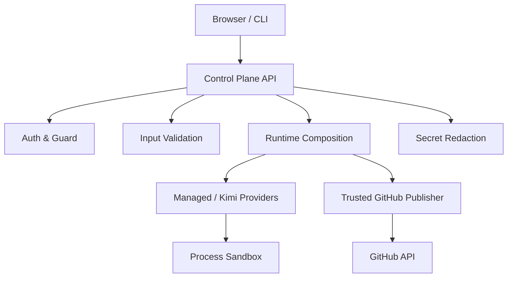
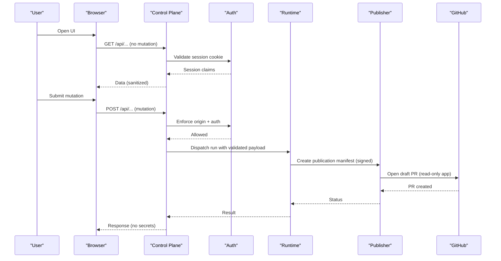
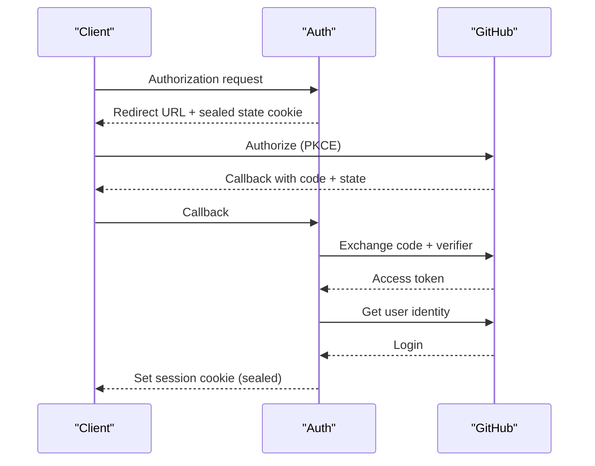
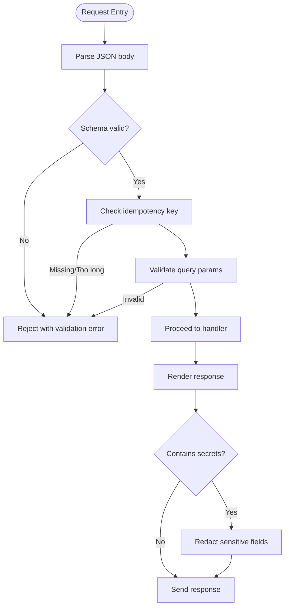
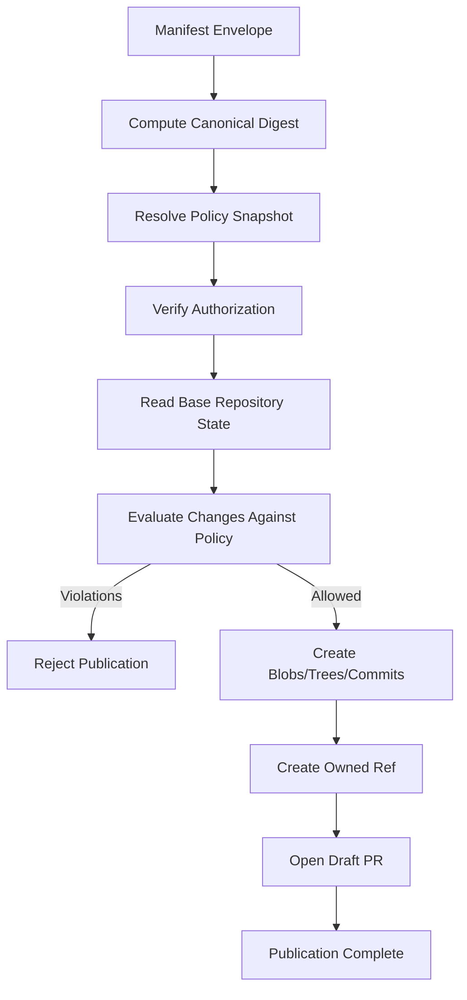
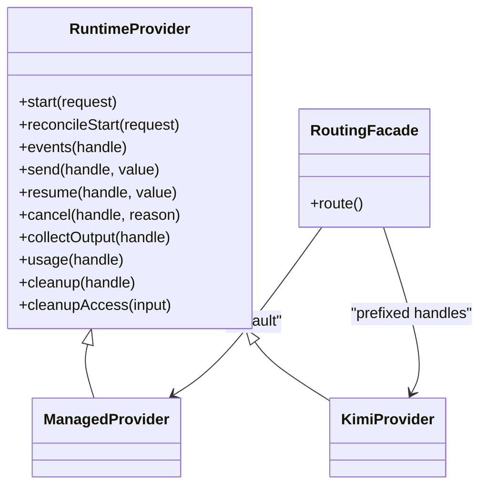
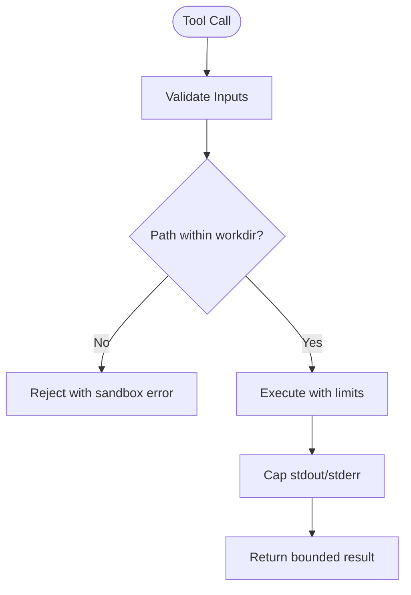
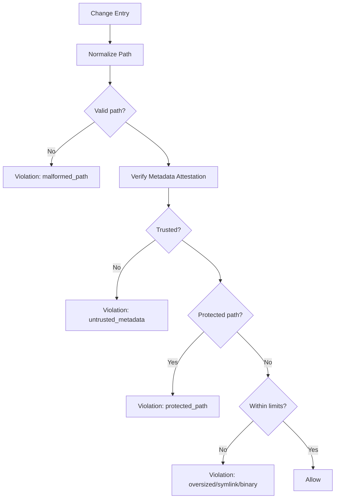
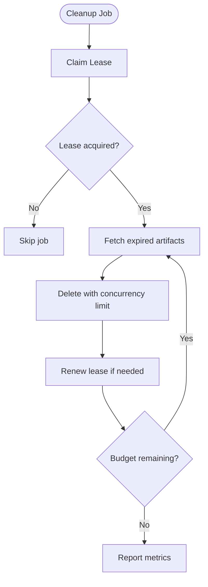
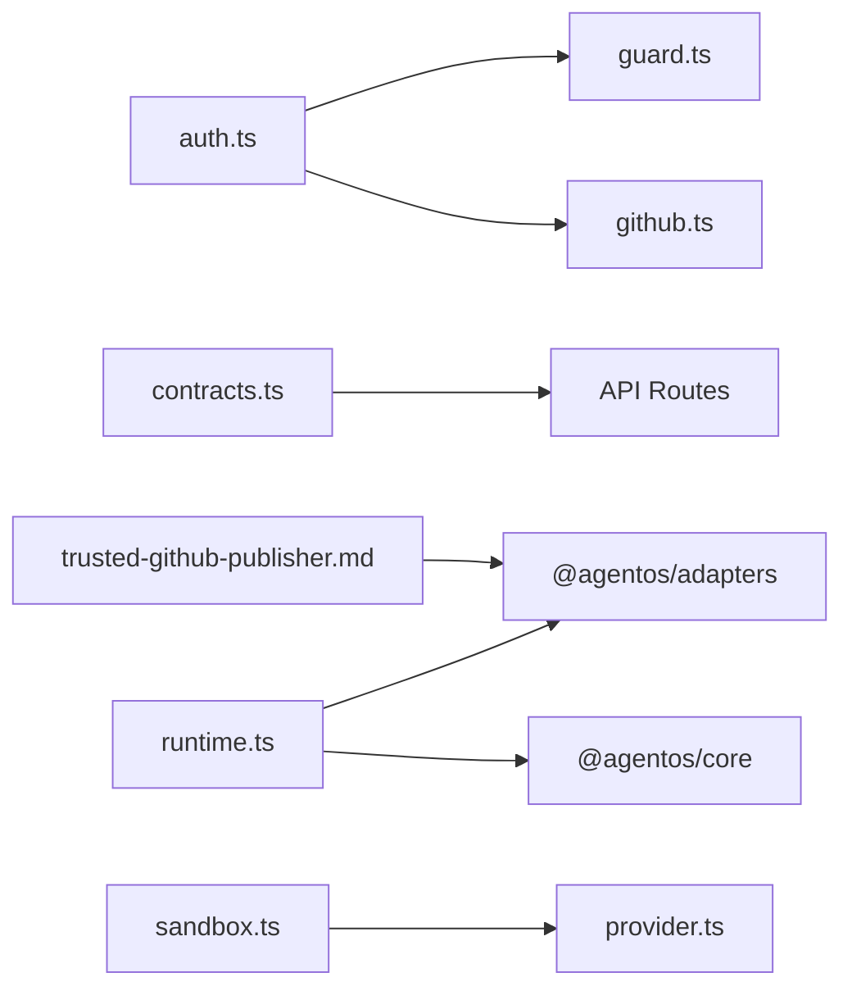

# Security Boundaries

<cite>
**Referenced Files in This Document**
- [threat-model.md](file://docs/architecture/threat-model.md)
- [trusted-github-publisher.md](file://docs/architecture/trusted-github-publisher.md)
- [auth.ts](file://apps/control-plane/src/auth/auth.ts)
- [guard.ts](file://apps/control-plane/src/auth/guard.ts)
- [github.ts](file://apps/control-plane/src/auth/github.ts)
- [runtime.ts](file://apps/control-plane/src/application/runtime.ts)
- [contracts.ts](file://apps/control-plane/src/http/contracts.ts)
- [redact-configuration.ts](file://apps/control-plane/src/ui/redact-configuration.ts)
- [patch-policy.ts](file://packages/core/src/patch-policy.ts)
- [sandbox.ts](file://packages/adapters/src/kimi/sandbox.ts)
- [provider.ts](file://packages/adapters/src/kimi/provider.ts)
- [artifact-cleanup.ts](file://apps/control-plane/src/application/artifact-cleanup.ts)
</cite>

## Table of Contents
1. [Introduction](#introduction)
2. [Project Structure](#project-structure)
3. [Core Components](#core-components)
4. [Architecture Overview](#architecture-overview)
5. [Detailed Component Analysis](#detailed-component-analysis)
6. [Dependency Analysis](#dependency-analysis)
7. [Performance Considerations](#performance-considerations)
8. [Troubleshooting Guide](#troubleshooting-guide)
9. [Conclusion](#conclusion)
10. [Appendices](#appendices)

## Introduction
This document explains how Agent OS Passerine maintains security boundaries between AI agent sessions and sensitive repository access, how the trusted publisher model enables automated operations safely, and how input validation, output sanitization, and protections against common web vulnerabilities are implemented. It also provides threat modeling considerations, testing approaches, and guidelines for extending the system without weakening security.

## Project Structure
Security is enforced across multiple layers:
- Control plane HTTP endpoints validate inputs, enforce authentication, and protect mutations with origin checks.
- Authentication uses secure cookies, PKCE-based OAuth, and strict session handling.
- The runtime composes providers with handle scoping, provenance binding, and resource limits.
- The trusted GitHub publisher isolates write access to a single authority that signs manifests and opens draft PRs.
- Adapters sandbox tool execution and constrain filesystem and process interactions.
- UI surfaces redact secrets from configuration display.

**Diagram sources**
- [auth.ts:14-21](file://apps/control-plane/src/auth/auth.ts#L14-L21)
- [guard.ts:17-60](file://apps/control-plane/src/auth/guard.ts#L17-L60)
- [contracts.ts:14-128](file://apps/control-plane/src/http/contracts.ts#L14-L128)
- [runtime.ts:319-385](file://apps/control-plane/src/application/runtime.ts#L319-L385)
- [sandbox.ts:11-32](file://packages/adapters/src/kimi/sandbox.ts#L11-L32)
- [trusted-github-publisher.md:1-37](file://docs/architecture/trusted-github-publisher.md#L1-L37)

**Section sources**
- [threat-model.md:25-86](file://docs/architecture/threat-model.md#L25-L86)

## Core Components
- Authentication and session management: encrypted cookies, PKCE, allowed login enforcement, CSRF-like origin checks for mutations.
- Input validation: schema-driven request parsing, idempotency keys, bounded query parameters, path ID constraints.
- Output sanitization: secret redaction for configuration display; bounded responses from MCP artifacts.
- Trusted publisher: only component permitted to create refs or PRs; signed manifests; policy-bound changes; immutable Git objects; draft PRs only.
- Runtime isolation: separate reader/publisher identities, provenance SHA binding, handle vaulting, timeouts, and size caps.
- Process sandbox: per-session workdir, path canonicalization, symlink escape detection, command timeouts, capped stdout/stderr.

**Section sources**
- [auth.ts:208-230](file://apps/control-plane/src/auth/auth.ts#L208-L230)
- [guard.ts:17-60](file://apps/control-plane/src/auth/guard.ts#L17-L60)
- [contracts.ts:362-408](file://apps/control-plane/src/http/contracts.ts#L362-L408)
- [redact-configuration.ts:16-34](file://apps/control-plane/src/ui/redact-configuration.ts#L16-L34)
- [trusted-github-publisher.md:1-37](file://docs/architecture/trusted-github-publisher.md#L1-L37)
- [runtime.ts:118-149](file://apps/control-plane/src/application/runtime.ts#L118-L149)
- [sandbox.ts:34-41](file://packages/adapters/src/kimi/sandbox.ts#L34-L41)

## Architecture Overview
The control plane enforces trust boundaries at every layer:
- Unauthenticated network boundary: all requests validated before identity and scope are established.
- Browser-to-control-plane: secure cookies, CSRF protection via origin checks, schema validation, output encoding, rate limiting where applicable.
- CLI-to-control-plane: least-privilege tokens, safe redaction, explicit endpoint configuration, bounded lifetimes.
- Delivery-to-core: payloads translated into validated core inputs; core policies remain authoritative.
- Core-to-agents/models/tools: allowlisted capabilities, typed schemas, resource limits, timeouts, scoped approvals, audit records.
- Core-to-adapters/providers: isolated SDK usage, response validation, outbound destination constraints, timeouts/retry budgets, webhook signature verification.
- Runtime-to-persistence: tenant-scoped queries/storage, encryption, migration review, backups, retention rules, concurrency controls.
- Runtime-to-repository/filesystem: constrained paths, traversal rejection, unsafe symlink rejection, file size caps, atomic writes, no auto-execution.

**Diagram sources**
- [auth.ts:239-315](file://apps/control-plane/src/auth/auth.ts#L239-L315)
- [guard.ts:17-60](file://apps/control-plane/src/auth/guard.ts#L17-L60)
- [contracts.ts:14-128](file://apps/control-plane/src/http/contracts.ts#L14-L128)
- [runtime.ts:387-571](file://apps/control-plane/src/application/runtime.ts#L387-L571)
- [trusted-github-publisher.md:17-32](file://docs/architecture/trusted-github-publisher.md#L17-L32)

## Detailed Component Analysis

### Authentication and Session Security
- Secure cookies: HttpOnly, Secure, SameSite=Lax, host-scoped names.
- PKCE OAuth flow: state, verifier, S256 challenge, short-lived state TTL, exchange token, identity lookup, allowed login check.
- Session sealing: AES-256-GCM with random nonce and auth tag; tamper detection; expiration checks.
- Origin enforcement for mutations: reject cross-origin requests unless same-origin.
- Webhook protection: rejects unauthenticated webhook signatures.

**Diagram sources**
- [auth.ts:239-315](file://apps/control-plane/src/auth/auth.ts#L239-L315)
- [github.ts:4-53](file://apps/control-plane/src/auth/github.ts#L4-L53)

**Section sources**
- [auth.ts:14-21](file://apps/control-plane/src/auth/auth.ts#L14-L21)
- [auth.ts:208-230](file://apps/control-plane/src/auth/auth.ts#L208-L230)
- [auth.ts:239-315](file://apps/control-plane/src/auth/auth.ts#L239-L315)
- [guard.ts:17-60](file://apps/control-plane/src/auth/guard.ts#L17-L60)

### Input Validation and Output Sanitization
- Request schemas: Zod-based strict validation for runs, goals, configurations, inbox replies, projections.
- Idempotency: required header with length limit; prevents duplication of destructive actions.
- Query parameter restrictions: allowlist or disallow patterns to prevent injection vectors.
- Path identifiers: bounded regex to prevent traversal or malformed IDs.
- Configuration redaction: environment variables masked when rendering to browser.

**Diagram sources**
- [contracts.ts:14-128](file://apps/control-plane/src/http/contracts.ts#L14-L128)
- [contracts.ts:362-408](file://apps/control-plane/src/http/contracts.ts#L362-L408)
- [redact-configuration.ts:16-34](file://apps/control-plane/src/ui/redact-configuration.ts#L16-L34)

**Section sources**
- [contracts.ts:14-128](file://apps/control-plane/src/http/contracts.ts#L14-L128)
- [contracts.ts:362-408](file://apps/control-plane/src/http/contracts.ts#L362-L408)
- [redact-configuration.ts:16-34](file://apps/control-plane/src/ui/redact-configuration.ts#L16-L34)

### Trusted Publisher Model
- Single authority: only the trusted publisher may create repository refs or pull requests; agents never receive installation credentials.
- GitHub App permissions: minimal set (contents read/write, pull requests read/write); no administration or deployment permissions.
- Token lifecycle: minted per operation, narrowed to one immutable repository ID, verified before use; not present in DTOs or logs.
- Publication flow: parse envelope, compute canonical digest, bind reviewed policy snapshot, verify authorization before each write, resolve base tree, reject protected/malformed paths, create immutable blobs/trees/commits, open draft PR bound to exact commit SHA.
- Recovery/cleanup: durable records, advisory locks, compare-and-swap checkpoints, monotonic cancellation, orphan ref handling, no automatic deletion of unknown refs.

**Diagram sources**
- [trusted-github-publisher.md:1-37](file://docs/architecture/trusted-github-publisher.md#L1-L37)

**Section sources**
- [trusted-github-publisher.md:1-37](file://docs/architecture/trusted-github-publisher.md#L1-L37)

### Runtime Isolation and Provenance Binding
- Separate reader/publisher identities: reader must be distinct from publisher; validation fails if reused.
- Repository allowlists: both reader and publisher repositories parsed and paired; mismatches rejected.
- Source snapshot binding: provenance SHA validated against config snapshot; ensures integrity of source material.
- Handle vaulting: runtime handles stored/sealed per repository; supports cancellation and cleanup tracking.
- Provider routing: managed vs kimi providers routed by prefixed handles; assertions ensure kimi features only when configured.

**Diagram sources**
- [runtime.ts:301-385](file://apps/control-plane/src/application/runtime.ts#L301-L385)

**Section sources**
- [runtime.ts:118-149](file://apps/control-plane/src/application/runtime.ts#L118-L149)
- [runtime.ts:387-571](file://apps/control-plane/src/application/runtime.ts#L387-L571)

### Process Sandbox and Tool Safety
- Per-session scratch directory under controlled root; absolute paths rejected; relative paths canonicalized and checked against real path to prevent symlink escapes.
- Bash execution: runs with workdir as cwd, timeout cap, stdout/stderr capped; truncation marker indicates cutoff.
- File operations: read limited to configured maximum bytes; edit requires exactly-one-occurrence match; write validates content shape.
- Error handling: sandbox errors thrown for confinement violations; callers surface bounded messages.

**Diagram sources**
- [sandbox.ts:11-32](file://packages/adapters/src/kimi/sandbox.ts#L11-L32)
- [provider.ts:714-755](file://packages/adapters/src/kimi/provider.ts#L714-L755)

**Section sources**
- [sandbox.ts:34-41](file://packages/adapters/src/kimi/sandbox.ts#L34-L41)
- [provider.ts:714-755](file://packages/adapters/src/kimi/provider.ts#L714-L755)

### Publication Policy Enforcement
- Path normalization: multi-pass decoding, null byte and backslash rejection, absolute path rejection, traversal segment rejection.
- Metadata attestation: binary, symlink, and size metadata must be trusted and verifiable; otherwise rejected.
- Protected paths: default and configured globs block dangerous modifications; .git segments blocked unconditionally.
- Size and count limits: oversized files and excessive change counts rejected.

**Diagram sources**
- [patch-policy.ts:56-197](file://packages/core/src/patch-policy.ts#L56-L197)

**Section sources**
- [patch-policy.ts:56-197](file://packages/core/src/patch-policy.ts#L56-L197)

### Artifact Retention and Cleanup
- Lease-based coordination: acquisition and renewal with safety margins to avoid concurrent deletions.
- Time-bounded batches: page limits, concurrency caps, and deadlines ensure predictable resource usage.
- Metrics: inspected, deleted, failed counts provide operational visibility.

**Diagram sources**
- [artifact-cleanup.ts:35-118](file://apps/control-plane/src/application/artifact-cleanup.ts#L35-L118)

**Section sources**
- [artifact-cleanup.ts:35-118](file://apps/control-plane/src/application/artifact-cleanup.ts#L35-L118)

## Dependency Analysis
Key security dependencies and their roles:
- Auth module depends on Node crypto primitives for secure cookies and session sealing; GitHub integration for OAuth exchange.
- Guard middleware depends on auth for session reading and origin enforcement.
- Runtime composition depends on adapters for provider creation, artifact stores, and repository head resolution; enforces reader/publisher separation and provenance binding.
- Contracts define strict schemas used across API routes to prevent injection and malformed inputs.
- Publisher documentation defines boundaries and flows; implementation relies on adapter packages for Git operations and policy evaluation.
- Sandbox depends on filesystem and child process APIs with strict confinement checks.

**Diagram sources**
- [auth.ts:14-21](file://apps/control-plane/src/auth/auth.ts#L14-L21)
- [guard.ts:17-60](file://apps/control-plane/src/auth/guard.ts#L17-L60)
- [github.ts:4-53](file://apps/control-plane/src/auth/github.ts#L4-L53)
- [contracts.ts:14-128](file://apps/control-plane/src/http/contracts.ts#L14-L128)
- [runtime.ts:319-385](file://apps/control-plane/src/application/runtime.ts#L319-L385)
- [sandbox.ts:11-32](file://packages/adapters/src/kimi/sandbox.ts#L11-L32)
- [provider.ts:714-755](file://packages/adapters/src/kimi/provider.ts#L714-L755)

**Section sources**
- [threat-model.md:25-86](file://docs/architecture/threat-model.md#L25-L86)

## Performance Considerations
- Schema validation is fast and centralized; prefer Zod schemas over ad-hoc checks to reduce overhead and improve consistency.
- Sandbox timeouts and output caps prevent runaway processes and memory pressure; tune defaults based on workload profiles.
- Artifact cleanup uses bounded concurrency and time budgets to avoid impacting live operations; monitor lease renewals and batch sizes.
- Reader/publisher separation avoids contention and reduces blast radius; keep allowlists minimal and precise.

[No sources needed since this section provides general guidance]

## Troubleshooting Guide
Common issues and mitigations:
- Authentication failures:
  - Missing or invalid session cookie: ensure secure cookie settings and correct public URL; verify session expiration.
  - Cross-origin mutation rejection: confirm origin matches expected public URL; adjust CORS/proxy configuration if necessary.
  - Webhook signature required: implement signature verification for webhook endpoints.
- Input validation errors:
  - Invalid schema: inspect Zod error details; ensure idempotency key presence and length; restrict query parameters.
  - Path identifier invalid: validate IDs against allowed pattern; avoid special characters.
- Runtime errors:
  - Reader configuration mismatch: ensure separate reader App ID and private key; validate repository allowlists.
  - Provenance SHA mismatch: verify repository SHA binding in run input matches config snapshot.
- Publisher errors:
  - Policy violations: check protected paths, symlinks, binaries, and size limits; review policy configuration.
  - Unauthorized operations: ensure rotating-key authorization verified before each write; confirm base ref integrity.
- Sandbox errors:
  - Path escape attempts: ensure workdir containment; check for symlink escapes; validate relative paths.
  - Command timeouts: increase timeout cautiously; monitor resource usage; cap outputs to prevent overflow.

**Section sources**
- [auth.ts:239-315](file://apps/control-plane/src/auth/auth.ts#L239-L315)
- [guard.ts:17-60](file://apps/control-plane/src/auth/guard.ts#L17-L60)
- [contracts.ts:362-408](file://apps/control-plane/src/http/contracts.ts#L362-L408)
- [runtime.ts:118-149](file://apps/control-plane/src/application/runtime.ts#L118-L149)
- [patch-policy.ts:56-197](file://packages/core/src/patch-policy.ts#L56-L197)
- [sandbox.ts:34-41](file://packages/adapters/src/kimi/sandbox.ts#L34-L41)

## Conclusion
Agent OS Passerine enforces layered security boundaries: authenticated and authorized access, strict input validation, sanitized outputs, isolated runtime execution, and a trusted publisher model that centralizes and constrains repository mutations. Threat modeling guides design decisions, while tests and operational safeguards provide evidence of compliance. Extending the system should preserve these boundaries by validating inputs, enforcing least privilege, and avoiding direct exposure of secrets or privileged operations.

[No sources needed since this section summarizes without analyzing specific files]

## Appendices

### Threat Modeling Considerations
- Assets: credentials, tenant data, authorization policy, repository contents, availability/integrity.
- Trust boundaries: browser/operator, CLI, delivery surfaces, core-to-agents, adapters/providers, persistence, repository/filesystem, supply chain.
- Abuse cases: cross-tenant actions, prompt injection, SSRF, replay/duplication, path traversal, secret exposure, resource exhaustion, confused-deputy approvals.

**Section sources**
- [threat-model.md:15-102](file://docs/architecture/threat-model.md#L15-L102)

### Security Testing Approaches
- Unit tests for authentication flows: session expiration, tampering detection, redirect sanitization, cookie attributes.
- Integration tests for input validation: schema enforcement, idempotency key requirements, query parameter restrictions.
- Policy tests for publication: protected paths, symlinks, binaries, size limits, metadata attestation verification.
- Sandbox tests: path containment, symlink escape detection, command timeouts, output caps.
- Operational tests: artifact cleanup leases, concurrency limits, budget enforcement.

**Section sources**
- [runtime-security.test.ts:30-110](file://apps/control-plane/src/application/runtime-security.test.ts#L30-L110)
- [patch-policy.ts:56-197](file://packages/core/src/patch-policy.ts#L56-L197)
- [sandbox.ts:34-41](file://packages/adapters/src/kimi/sandbox.ts#L34-L41)
- [artifact-cleanup.ts:35-118](file://apps/control-plane/src/application/artifact-cleanup.ts#L35-L118)

### Guidelines for Extending Security Boundaries
- Always validate and sanitize inputs at the API boundary; never trust client-provided values.
- Enforce least privilege for all external integrations; scope tokens and permissions narrowly.
- Keep secrets out of browser bundles and logs; redact sensitive fields before rendering.
- Use separate identities for read and write operations; validate repository pairings.
- Constrain filesystem and process access; canonicalize paths and reject escapes.
- Implement robust recovery and cleanup with durable records and atomic checkpoints.
- Add tests for new attack surfaces; treat security as a first-class requirement.

[No sources needed since this section provides general guidance]