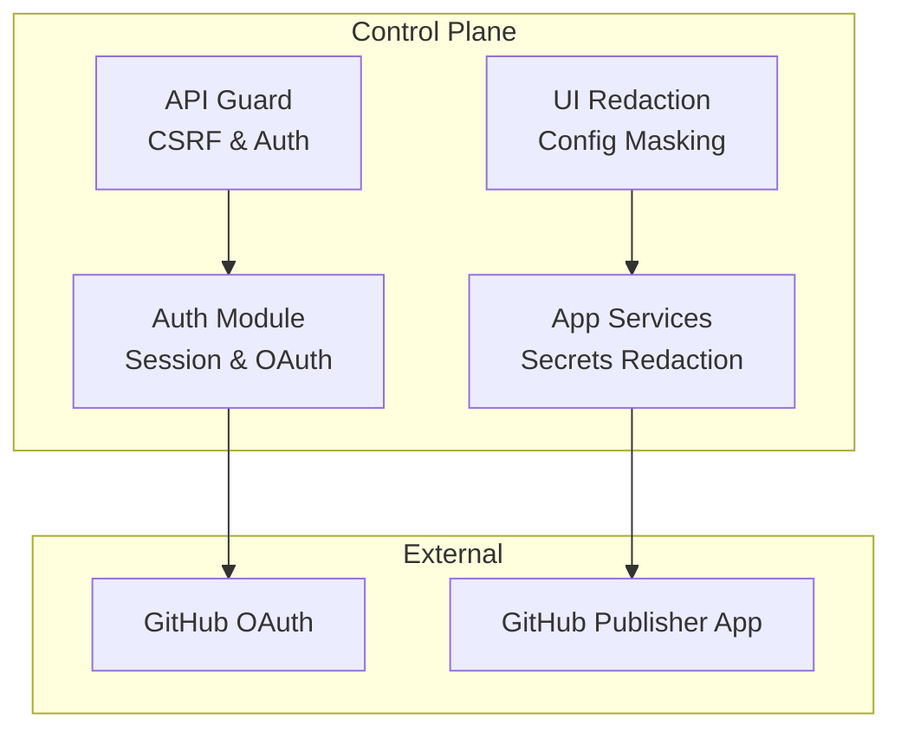
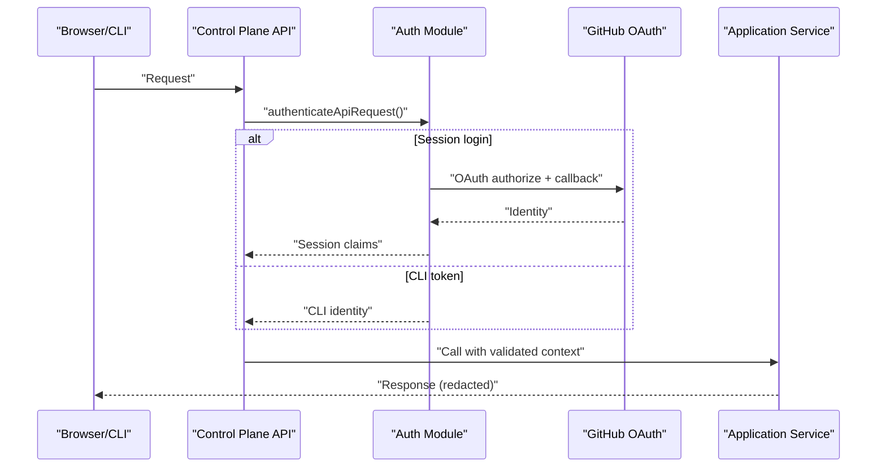
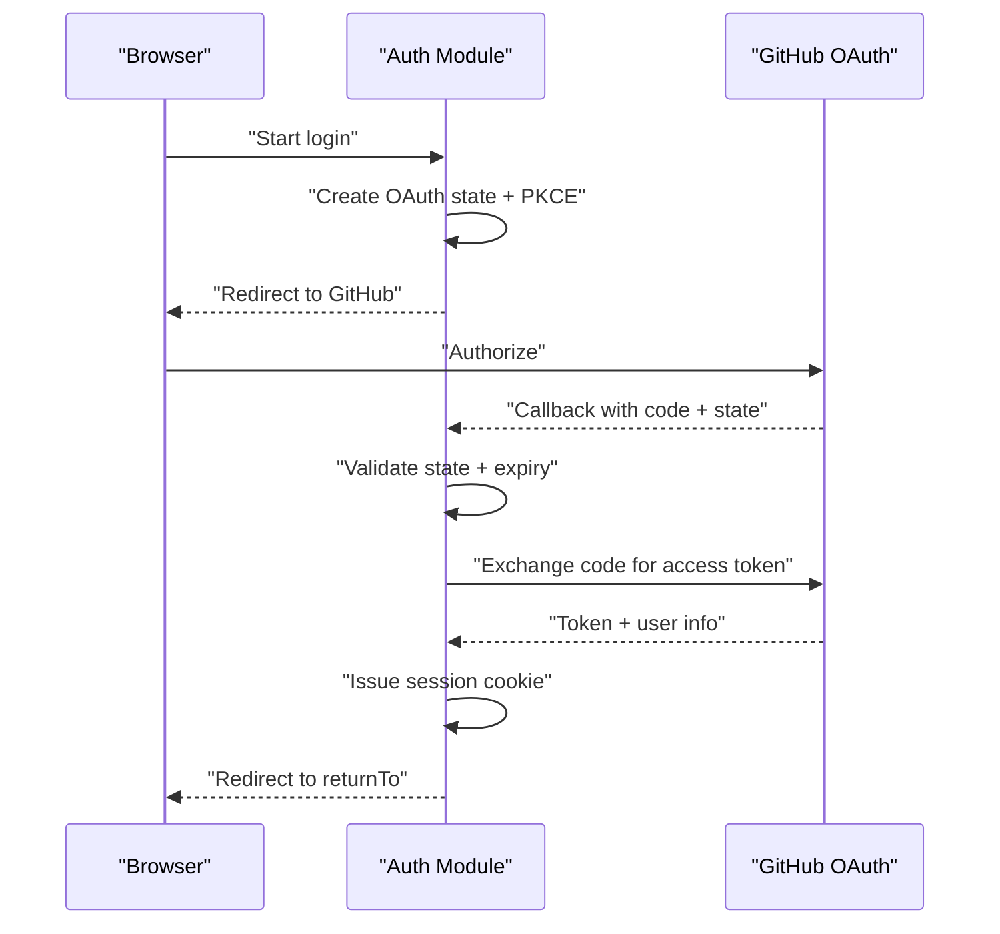
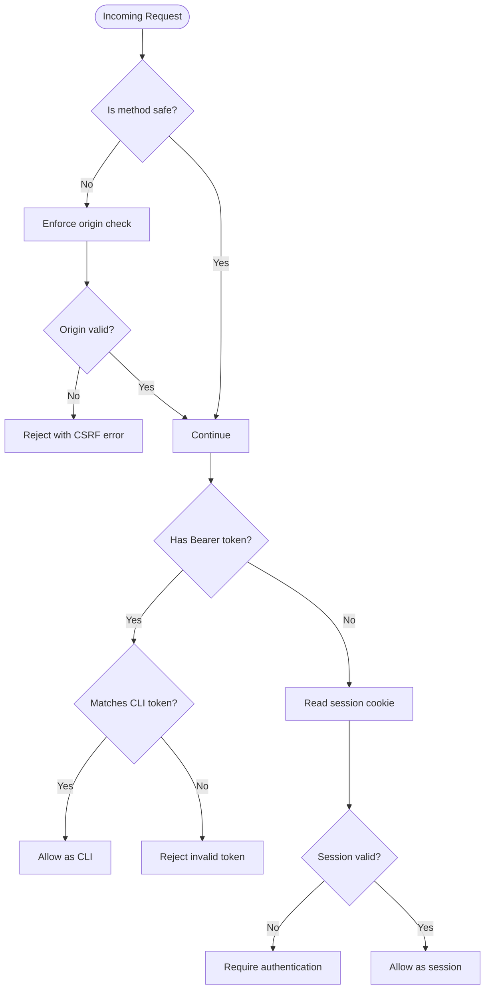
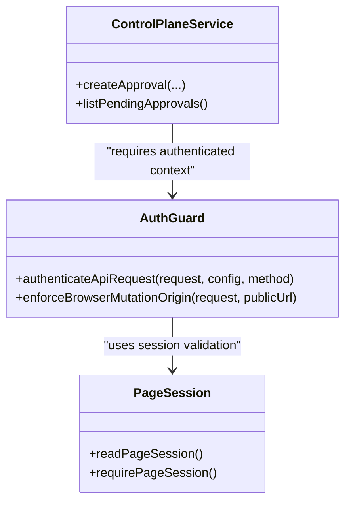
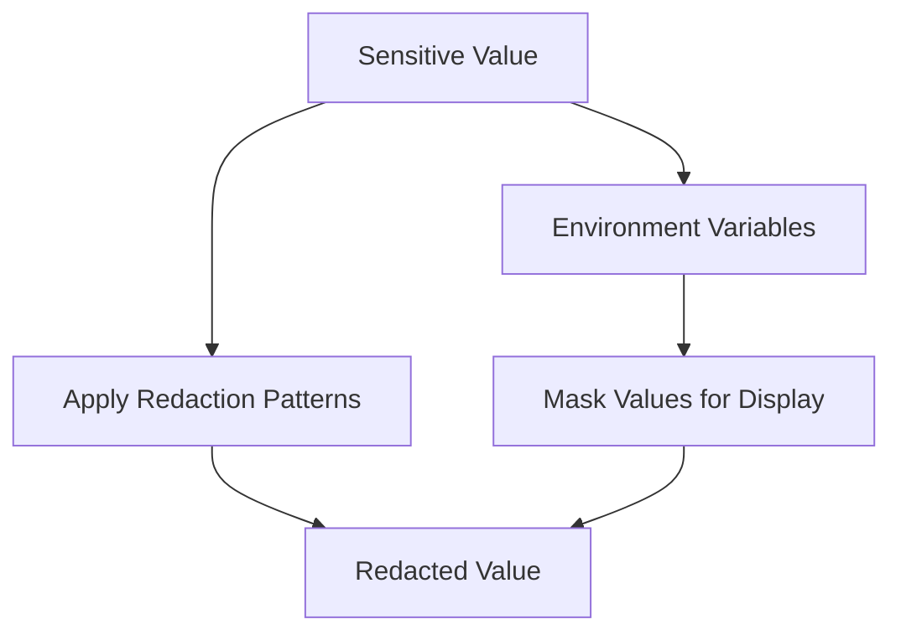
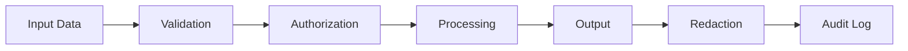
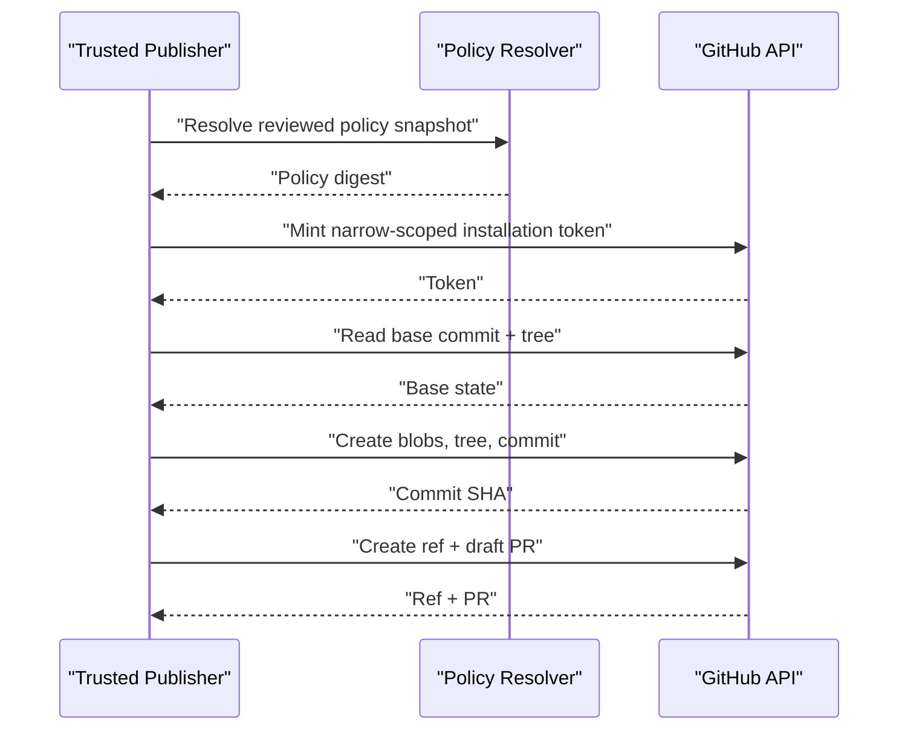
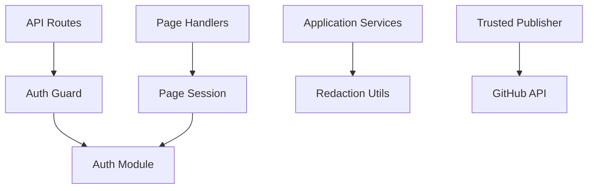

# Security Model

<cite>
**Referenced Files in This Document**
- [auth.ts](file://apps/control-plane/src/auth/auth.ts)
- [github.ts](file://apps/control-plane/src/auth/github.ts)
- [guard.ts](file://apps/control-plane/src/auth/guard.ts)
- [page-session.ts](file://apps/control-plane/src/auth/page-session.ts)
- [authenticated.ts](file://apps/control-plane/src/http/authenticated.ts)
- [redact-configuration.ts](file://apps/control-plane/src/ui/redact-configuration.ts)
- [control-plane-service.ts](file://apps/control-plane/src/application/control-plane-service.ts)
- [runtime-security.test.ts](file://apps/control-plane/src/application/runtime-security.test.ts)
- [threat-model.md](file://docs/architecture/threat-model.md)
- [trusted-github-publisher.md](file://docs/architecture/trusted-github-publisher.md)
</cite>

## Table of Contents
1. [Introduction](#introduction)
2. [Project Structure](#project-structure)
3. [Core Components](#core-components)
4. [Architecture Overview](#architecture-overview)
5. [Detailed Component Analysis](#detailed-component-analysis)
6. [Dependency Analysis](#dependency-analysis)
7. [Performance Considerations](#performance-considerations)
8. [Troubleshooting Guide](#troubleshooting-guide)
9. [Conclusion](#conclusion)

## Introduction
This document explains the security model for Agent OS Passerine, focusing on authentication, authorization, secret management, redaction, audit logging, AI session boundaries, and the trusted publisher model. It synthesizes implementation details from the control plane with architectural requirements from the threat model and trusted publisher design to provide a complete picture of how security is enforced across browser, CLI, runtime, and external integrations.

## Project Structure
Security-related logic is primarily implemented under the control plane:
- Authentication and session handling live in the auth module.
- API request guards enforce authentication and CSRF protections.
- UI configuration rendering includes dedicated redaction for sensitive values.
- Application services centralize redaction patterns used across logs and responses.
- Architectural documents define trust boundaries, secrets handling, and the trusted GitHub publisher boundary.

**Diagram sources**
- [auth.ts:14-21](file://apps/control-plane/src/auth/auth.ts#L14-L21)
- [guard.ts:17-61](file://apps/control-plane/src/auth/guard.ts#L17-L61)
- [redact-configuration.ts:16-34](file://apps/control-plane/src/ui/redact-configuration.ts#L16-L34)
- [control-plane-service.ts:132-154](file://apps/control-plane/src/application/control-plane-service.ts#L132-L154)
- [trusted-github-publisher.md:5-16](file://docs/architecture/trusted-github-publisher.md#L5-L16)

**Section sources**
- [auth.ts:14-21](file://apps/control-plane/src/auth/auth.ts#L14-L21)
- [guard.ts:17-61](file://apps/control-plane/src/auth/guard.ts#L17-L61)
- [redact-configuration.ts:16-34](file://apps/control-plane/src/ui/redact-configuration.ts#L16-L34)
- [control-plane-service.ts:132-154](file://apps/control-plane/src/application/control-plane-service.ts#L132-L154)
- [trusted-github-publisher.md:5-16](file://docs/architecture/trusted-github-publisher.md#L5-L16)

## Core Components
- Authentication and sessions:
  - Secure cookie-based sessions using AES-GCM encryption and short-lived state cookies for OAuth flows.
  - Local development bypass allows localhost-only deployments to use default session secrets while enforcing HTTPS in production.
  - GitHub OAuth uses PKCE and strict state validation with time-bounded state cookies.
- API authentication and CSRF:
  - Supports both session-based browser requests and CLI bearer token authentication.
  - Enforces origin checks for mutations to prevent cross-origin attacks.
- Secret management and redaction:
  - Centralized text redaction patterns protect secrets in logs and responses.
  - Configuration variables are masked when rendered to the browser or returned via APIs.
- Trusted publisher:
  - A narrowly scoped GitHub App performs repository writes through a controlled flow that never exposes credentials to agents or runtime sessions.

**Section sources**
- [auth.ts:10-21](file://apps/control-plane/src/auth/auth.ts#L10-L21)
- [auth.ts:64-157](file://apps/control-plane/src/auth/auth.ts#L64-L157)
- [auth.ts:239-315](file://apps/control-plane/src/auth/auth.ts#L239-L315)
- [guard.ts:17-61](file://apps/control-plane/src/auth/guard.ts#L17-L61)
- [redact-configuration.ts:16-34](file://apps/control-plane/src/ui/redact-configuration.ts#L16-L34)
- [control-plane-service.ts:132-154](file://apps/control-plane/src/application/control-plane-service.ts#L132-L154)
- [trusted-github-publisher.md:5-16](file://docs/architecture/trusted-github-publisher.md#L5-L16)

## Architecture Overview
The security architecture enforces clear boundaries between user input, service logic, and external systems:
- Browser and CLI inputs are authenticated and validated before reaching domain logic.
- Sensitive data is redacted at output boundaries (logs, UI, API responses).
- External integrations (GitHub OAuth, GitHub Publisher App) are isolated and scoped minimally.
- Runtime and adapters must not receive privileged credentials; they operate under constrained roles.

**Diagram sources**
- [guard.ts:33-61](file://apps/control-plane/src/auth/guard.ts#L33-L61)
- [auth.ts:239-315](file://apps/control-plane/src/auth/auth.ts#L239-L315)
- [github.ts:4-53](file://apps/control-plane/src/auth/github.ts#L4-L53)
- [control-plane-service.ts:132-154](file://apps/control-plane/src/application/control-plane-service.ts#L132-L154)

## Detailed Component Analysis

### Authentication Flow (GitHub OAuth and Local Development)
- Localhost bypass:
  - In non-production environments where the public URL resolves to localhost, default session secrets and minimal GitHub client settings are allowed.
  - Production requires explicit configuration and HTTPS.
- OAuth state and PKCE:
  - Authorization requests include a random state and PKCE verifier stored in an encrypted cookie with a short TTL.
  - Callback validates state equality, expiration, and exchanges code for identity.
- Session issuance:
  - On successful identity verification, a signed session cookie is issued with login, issue time, and expiry.
  - Sessions are validated per request and bound to the configured allowed login.

**Diagram sources**
- [auth.ts:239-315](file://apps/control-plane/src/auth/auth.ts#L239-L315)
- [github.ts:4-53](file://apps/control-plane/src/auth/github.ts#L4-L53)

**Section sources**
- [auth.ts:64-157](file://apps/control-plane/src/auth/auth.ts#L64-L157)
- [auth.ts:239-315](file://apps/control-plane/src/auth/auth.ts#L239-L315)
- [github.ts:4-53](file://apps/control-plane/src/auth/github.ts#L4-L53)

### API Authentication and CSRF Protection
- Request authentication:
  - Webhook methods require signature verification; otherwise, they are rejected.
  - Bearer tokens are accepted only if they match the configured CLI token; otherwise, session cookies are used.
  - Non-safe HTTP methods trigger origin enforcement to prevent CSRF.
- Page session helpers:
  - Server-side page handlers read and validate sessions from cookies and redirect unauthenticated users to login.

**Diagram sources**
- [guard.ts:17-61](file://apps/control-plane/src/auth/guard.ts#L17-L61)
- [authenticated.ts:4-17](file://apps/control-plane/src/http/authenticated.ts#L4-L17)
- [page-session.ts:7-22](file://apps/control-plane/src/auth/page-session.ts#L7-L22)

**Section sources**
- [guard.ts:17-61](file://apps/control-plane/src/auth/guard.ts#L17-L61)
- [authenticated.ts:4-17](file://apps/control-plane/src/http/authenticated.ts#L4-L17)
- [page-session.ts:7-22](file://apps/control-plane/src/auth/page-session.ts#L7-L22)

### Authorization System and Permission Enforcement
- Role-based access control:
  - The current implementation enforces operator-level access by validating the login against a configured allowed login.
  - Future stages should introduce fine-grained roles and policies; the threat model mandates server-side authorization on every action.
- Permission enforcement:
  - All actions must be authorized server-side; UI state and CLI flags cannot grant authority.
  - Human approvals are a security boundary only when operators can see exact actions, targets, and consequences.

**Diagram sources**
- [guard.ts:17-61](file://apps/control-plane/src/auth/guard.ts#L17-L61)
- [page-session.ts:7-22](file://apps/control-plane/src/auth/page-session.ts#L7-L22)
- [control-plane-service.ts:1071-1100](file://apps/control-plane/src/application/control-plane-service.ts#L1071-L1100)

**Section sources**
- [auth.ts:14-21](file://apps/control-plane/src/auth/auth.ts#L14-L21)
- [guard.ts:17-61](file://apps/control-plane/src/auth/guard.ts#L17-L61)
- [threat-model.md:27-46](file://docs/architecture/threat-model.md#L27-L46)

### Secret Management, Credential Isolation, and Redaction
- Secret storage and loading:
  - Secrets such as session secrets, GitHub client credentials, and publication keys are loaded from environment variables or deployment secret managers.
  - Local development may use defaults when localhost bypass is enabled; production requires explicit configuration.
- Credential isolation:
  - Agents and runtime sessions do not receive GitHub installation credentials; only the trusted publisher adapter mints narrow-scoped tokens per operation.
  - Reader and publisher identities must be separate; tests enforce this separation.
- Redaction mechanisms:
  - Centralized redaction patterns mask common secret formats in logs and responses.
  - Configuration variables are masked when rendered to the browser or returned via APIs.

**Diagram sources**
- [control-plane-service.ts:132-154](file://apps/control-plane/src/application/control-plane-service.ts#L132-L154)
- [redact-configuration.ts:16-34](file://apps/control-plane/src/ui/redact-configuration.ts#L16-L34)
- [runtime-security.test.ts:30-109](file://apps/control-plane/src/application/runtime-security.test.ts#L30-L109)

**Section sources**
- [auth.ts:120-157](file://apps/control-plane/src/auth/auth.ts#L120-L157)
- [trusted-github-publisher.md:5-16](file://docs/architecture/trusted-github-publisher.md#L5-L16)
- [runtime-security.test.ts:30-109](file://apps/control-plane/src/application/runtime-security.test.ts#L30-L109)
- [control-plane-service.ts:132-154](file://apps/control-plane/src/application/control-plane-service.ts#L132-L154)
- [redact-configuration.ts:16-34](file://apps/control-plane/src/ui/redact-configuration.ts#L16-L34)

### Audit Logging and Security Boundaries
- Audit logging:
  - Logs and responses must redact sensitive values using centralized patterns to avoid accidental exposure.
  - Approval scopes and related outputs are projected with redacted previews rather than raw secrets.
- Security boundaries:
  - No input is trusted solely because it reached an internal component; all inputs must be validated and authorized.
  - Human approval is a security boundary only when operators can see the exact action, target, and consequences.
  - Adapters must isolate provider SDKs, validate responses, constrain outbound destinations, and verify webhook signatures.

**Diagram sources**
- [threat-model.md:27-62](file://docs/architecture/threat-model.md#L27-L62)
- [control-plane-service.ts:132-154](file://apps/control-plane/src/application/control-plane-service.ts#L132-L154)

**Section sources**
- [threat-model.md:27-62](file://docs/architecture/threat-model.md#L27-L62)
- [control-plane-service.ts:132-154](file://apps/control-plane/src/application/control-plane-service.ts#L132-L154)

### Trusted Publisher Model
- GitHub App boundary:
  - The publisher is the only component allowed to create repository refs or pull requests.
  - Permissions are limited to metadata, contents, and pull requests; no broader organization or deployment permissions.
- Publication flow:
  - Strict parsing and digest computation ensure integrity of manifests and policies.
  - Rotating-key authorizations are verified immediately before each write.
  - Repository state is re-read before creating refs and PRs to prevent race conditions.
  - Draft PRs are opened with immutable references; merging and deployment are outside the publisher’s scope.
- Recovery and cleanup:
  - Publication records bind runs to policy and manifest digests.
  - Retries reconcile immutable Git objects and owned refs; cancellations are monotonic and checked at critical points.
  - Orphan refs and blobs remain unreachable unless explicitly reconciled.

**Diagram sources**
- [trusted-github-publisher.md:5-37](file://docs/architecture/trusted-github-publisher.md#L5-L37)

**Section sources**
- [trusted-github-publisher.md:5-37](file://docs/architecture/trusted-github-publisher.md#L5-L37)

## Dependency Analysis
Authentication and authorization components have clear dependencies:
- API routes depend on the guard to authenticate requests and enforce CSRF.
- Page sessions depend on the auth module to read and validate cookies.
- Application services depend on centralized redaction to sanitize outputs.
- The trusted publisher depends on narrow-scoped GitHub App credentials and policy resolution.

**Diagram sources**
- [guard.ts:17-61](file://apps/control-plane/src/auth/guard.ts#L17-L61)
- [page-session.ts:7-22](file://apps/control-plane/src/auth/page-session.ts#L7-L22)
- [control-plane-service.ts:132-154](file://apps/control-plane/src/application/control-plane-service.ts#L132-L154)
- [trusted-github-publisher.md:5-16](file://docs/architecture/trusted-github-publisher.md#L5-L16)

**Section sources**
- [guard.ts:17-61](file://apps/control-plane/src/auth/guard.ts#L17-L61)
- [page-session.ts:7-22](file://apps/control-plane/src/auth/page-session.ts#L7-L22)
- [control-plane-service.ts:132-154](file://apps/control-plane/src/application/control-plane-service.ts#L132-L154)
- [trusted-github-publisher.md:5-16](file://docs/architecture/trusted-github-publisher.md#L5-L16)

## Performance Considerations
- Session cookies are small and encrypted, minimizing overhead while ensuring integrity.
- Redaction patterns are applied selectively to sensitive fields to avoid unnecessary processing.
- GitHub OAuth callbacks are short-lived; state expiration prevents long-lived attack surfaces.
- Trusted publisher operations are bounded by narrow scopes and immediate re-validation to reduce risk and improve reliability.

[No sources needed since this section provides general guidance]

## Troubleshooting Guide
Common issues and mitigations:
- Authentication failures:
  - Missing or invalid session cookies result in authentication required errors.
  - Invalid CLI tokens are rejected; ensure correct token configuration.
- CSRF rejections:
  - Cross-origin mutation requests are blocked; verify origin headers and SameSite settings.
- OAuth callback errors:
  - State mismatch or expired state cookies cause callback failures; ensure proper redirect handling and TTL.
- Secret exposure risks:
  - Ensure redaction is applied to all logs and responses; fail closed if configuration cannot be parsed safely.
- Publisher misconfiguration:
  - Separate reader and publisher App IDs are required; ensure private keys and selected repositories are correctly configured.

**Section sources**
- [guard.ts:17-61](file://apps/control-plane/src/auth/guard.ts#L17-L61)
- [auth.ts:279-315](file://apps/control-plane/src/auth/auth.ts#L279-L315)
- [redact-configuration.ts:16-34](file://apps/control-plane/src/ui/redact-configuration.ts#L16-L34)
- [runtime-security.test.ts:30-109](file://apps/control-plane/src/application/runtime-security.test.ts#L30-L109)

## Conclusion
Agent OS Passerine implements a layered security model with strong authentication, strict authorization, robust secret management, and comprehensive redaction. The trusted publisher model isolates repository access from agent runtime sessions, ensuring minimal privileges and high integrity. The threat model guides ongoing security improvements, emphasizing validation, authorization, and careful handling of sensitive data across all boundaries.

[No sources needed since this section summarizes without analyzing specific files]