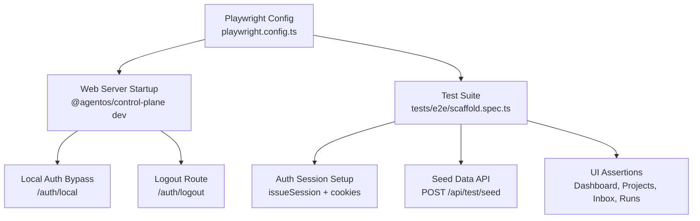
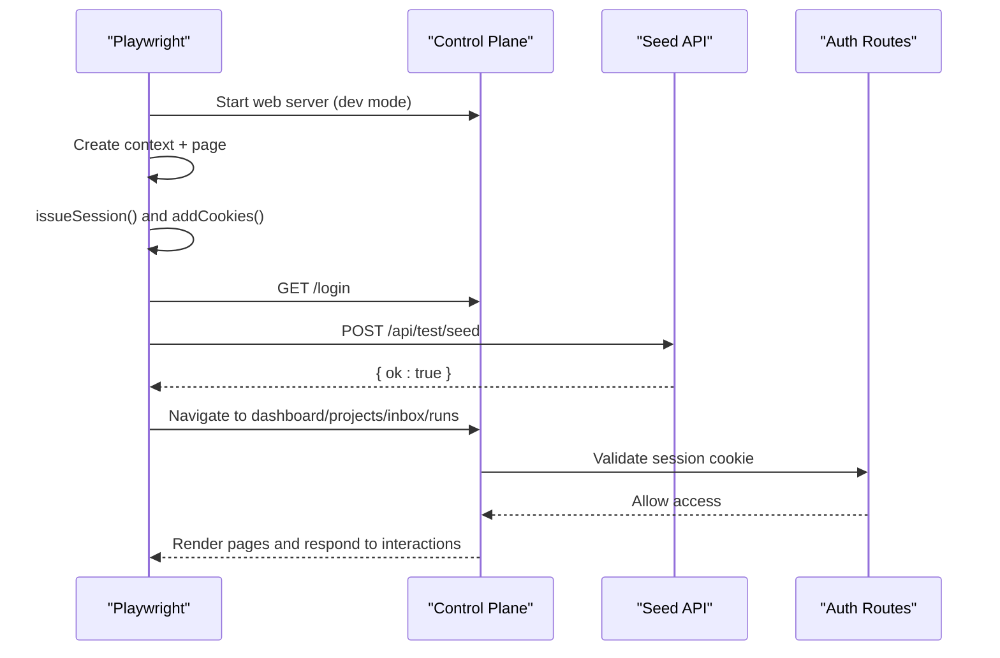
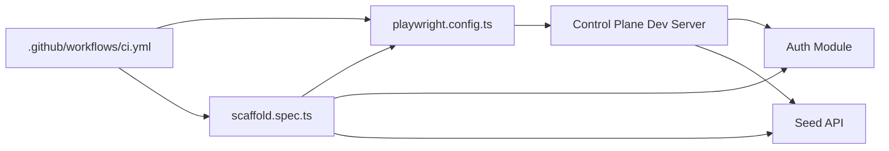

# End-to-End Testing

<cite>
**Referenced Files in This Document**
- [playwright.config.ts](file://playwright.config.ts)
- [scaffold.spec.ts](file://tests/e2e/scaffold.spec.ts)
- [auth.ts](file://apps/control-plane/src/auth/auth.ts)
- [route.ts](file://apps/control-plane/app/api/test/seed/route.ts)
- [route.ts](file://apps/control-plane/app/auth/local/route.ts)
- [route.ts](file://apps/control-plane/app/auth/logout/route.ts)
- [page.tsx](file://apps/control-plane/app/login/page.tsx)
- [ci.yml](file://.github/workflows/ci.yml)
- [package.json](file://package.json)
</cite>

## Table of Contents
1. [Introduction](#introduction)
2. [Project Structure](#project-structure)
3. [Core Components](#core-components)
4. [Architecture Overview](#architecture-overview)
5. [Detailed Component Analysis](#detailed-component-analysis)
6. [Dependency Analysis](#dependency-analysis)
7. [Performance Considerations](#performance-considerations)
8. [Troubleshooting Guide](#troubleshooting-guide)
9. [Conclusion](#conclusion)

## Introduction
This document explains how end-to-end (E2E) testing is implemented with Playwright in Agent OS Passerine. It covers the E2E environment setup, browser automation strategies, session management, test data seeding, and complete user workflows from login through feature completion. It also documents responsive design and accessibility checks, mobile viewport scenarios, CI integration, and debugging techniques.

## Project Structure
The E2E suite lives under tests/e2e and is orchestrated by a root-level Playwright configuration that starts the control plane server, seeds deterministic test data, and runs assertions against the live UI and API.

**Diagram sources**
- [playwright.config.ts:5-16](file://playwright.config.ts#L5-L16)
- [scaffold.spec.ts:9-36](file://tests/e2e/scaffold.spec.ts#L9-L36)
- [route.ts:7-73](file://apps/control-plane/app/api/test/seed/route.ts#L7-L73)
- [route.ts:16-35](file://apps/control-plane/app/auth/local/route.ts#L16-L35)
- [route.ts:10-18](file://apps/control-plane/app/auth/logout/route.ts#L10-L18)

**Section sources**
- [playwright.config.ts:1-18](file://playwright.config.ts#L1-L18)
- [package.json:10-23](file://package.json#L10-L23)

## Core Components
- Playwright configuration defines the base URL, test directory, retries, reporter, and an embedded web server command to start the control plane for E2E runs.
- The scaffold test sets up authenticated sessions via server-side session issuance and cookie injection, then seeds deterministic data before running UI flows.
- The seed route creates a project, run, approval, and inbox message used by the E2E scenarios.
- Local authentication bypass enables seamless login during E2E without external OAuth flows.

Key responsibilities:
- Environment bootstrapping and server lifecycle
- Authentication and session handling
- Deterministic data seeding
- User workflow simulation and assertions

**Section sources**
- [playwright.config.ts:5-16](file://playwright.config.ts#L5-L16)
- [scaffold.spec.ts:9-36](file://tests/e2e/scaffold.spec.ts#L9-L36)
- [route.ts:7-73](file://apps/control-plane/app/api/test/seed/route.ts#L7-L73)
- [route.ts:16-35](file://apps/control-plane/app/auth/local/route.ts#L16-L35)

## Architecture Overview
The E2E flow orchestrates a controlled environment where Playwright launches a browser, injects a valid session cookie, triggers data seeding, and exercises core application features through realistic user interactions.

**Diagram sources**
- [playwright.config.ts:11-16](file://playwright.config.ts#L11-L16)
- [scaffold.spec.ts:9-36](file://tests/e2e/scaffold.spec.ts#L9-L36)
- [route.ts:7-73](file://apps/control-plane/app/api/test/seed/route.ts#L7-L73)
- [auth.ts:323-333](file://apps/control-plane/src/auth/auth.ts#L323-L333)

## Detailed Component Analysis

### Playwright Configuration
- Base URL points to the local development server started by Playwright’s webServer hook.
- Test directory is set to tests/e2e.
- Retries are enabled in CI; reporter switches to GitHub-friendly output in CI.
- Web server command sets environment variables to enable E2E-specific behavior: memory repository, public URL, GitHub client credentials, allowed login, and session secret.

Operational notes:
- For local runs, the server is started fresh per test run.
- In CI, the same command is executed to ensure parity between local and CI environments.

**Section sources**
- [playwright.config.ts:5-16](file://playwright.config.ts#L5-L16)

### Authentication and Session Management
- The scaffold test uses the server-side session issuer to create a signed session token for a specific operator identity and injects it into the browser context as a secure cookie.
- The local auth bypass route issues a session cookie and redirects to the requested destination when accessed from localhost in non-production environments.
- Logout clears the session cookie and redirects to the login page.

Security and reliability:
- Sessions are sealed using a symmetric cipher and validated on each request.
- The local bypass is gated by environment checks to prevent accidental exposure in production.

**Section sources**
- [scaffold.spec.ts:9-36](file://tests/e2e/scaffold.spec.ts#L9-L36)
- [auth.ts:323-333](file://apps/control-plane/src/auth/auth.ts#L323-L333)
- [route.ts:16-35](file://apps/control-plane/app/auth/local/route.ts#L16-L35)
- [route.ts:10-18](file://apps/control-plane/app/auth/logout/route.ts#L10-L18)

### Test Data Seeding
- The seed endpoint is disabled in production and only active when explicitly enabled via an environment variable.
- When active, it authenticates via API token and writes deterministic entities: a project, a run, an approval, and an inbox message.
- Expiry times for approvals are relative to current time to avoid calendar-based flakiness.

Usage in E2E:
- The test invokes the seed endpoint after navigating to the login page to ensure consistent state across tests.

**Section sources**
- [route.ts:7-73](file://apps/control-plane/app/api/test/seed/route.ts#L7-L73)
- [scaffold.spec.ts:31-36](file://tests/e2e/scaffold.spec.ts#L31-L36)

### User Workflow Simulation
The scaffold demonstrates end-to-end user journeys:
- Dashboard verification: asserts headings, navigation, and sign-out controls.
- Projects directory: verifies table presence and links.
- Run monitoring and approval: navigates to a waiting run, opens the inbox, approves a scoped request, replies to a prompt, and confirms persistence after reload.
- Responsive design: sets a narrow mobile viewport and validates layout and scroll behavior.
- Localhost “Get In” login: clears cookies, clicks the bypass link, and asserts successful authentication and navigation.

Accessibility and UX:
- Uses semantic roles and labels to assert UI elements.
- Validates no horizontal overflow at narrow widths.

**Section sources**
- [scaffold.spec.ts:38-148](file://tests/e2e/scaffold.spec.ts#L38-L148)

### Login Page Behavior
- The login page renders a “Get In” link for local development alongside GitHub authentication options.
- Return-to parameters are preserved safely in both local and GitHub auth URLs.

**Section sources**
- [page.tsx:8-19](file://apps/control-plane/app/login/page.tsx#L8-L19)

### Continuous Integration
- CI installs dependencies, performs quality checks, builds, and runs unit tests.
- Playwright browsers are installed with system dependencies.
- E2E tests are executed using the configured script.

**Section sources**
- [ci.yml:11-30](file://.github/workflows/ci.yml#L11-L30)
- [package.json:18-23](file://package.json#L18-L23)

## Dependency Analysis
The E2E execution depends on several components working together:

**Diagram sources**
- [playwright.config.ts:5-16](file://playwright.config.ts#L5-L16)
- [scaffold.spec.ts:9-36](file://tests/e2e/scaffold.spec.ts#L9-L36)
- [route.ts:7-73](file://apps/control-plane/app/api/test/seed/route.ts#L7-L73)
- [auth.ts:323-333](file://apps/control-plane/src/auth/auth.ts#L323-L333)
- [ci.yml:11-30](file://.github/workflows/ci.yml#L11-L30)

**Section sources**
- [playwright.config.ts:5-16](file://playwright.config.ts#L5-L16)
- [scaffold.spec.ts:9-36](file://tests/e2e/scaffold.spec.ts#L9-L36)
- [route.ts:7-73](file://apps/control-plane/app/api/test/seed/route.ts#L7-L73)
- [auth.ts:323-333](file://apps/control-plane/src/auth/auth.ts#L323-L333)
- [ci.yml:11-30](file://.github/workflows/ci.yml#L11-L30)

## Performance Considerations
- Use deterministic seeding to minimize flaky network or database variability.
- Keep tests focused on single user journeys to reduce coupling and improve parallelization safety.
- Prefer role-based selectors and accessible labels to make tests resilient to UI changes.
- Avoid unnecessary waits; rely on Playwright’s auto-waiting and explicit assertions.
- In CI, leverage retries judiciously to absorb transient failures while keeping feedback fast.

[No sources needed since this section provides general guidance]

## Troubleshooting Guide
Common issues and resolutions:
- Server startup failures: verify environment variables match those expected by the web server command in the Playwright config.
- Authentication errors: ensure the session secret and allowed login values align with the server configuration and that cookies are injected correctly.
- Seed endpoint not available: confirm the environment flag enabling the seed route is set and that you are not in production.
- Flaky UI assertions: use stable selectors based on roles and labels; validate visibility and content rather than exact text where possible.
- Mobile viewport tests failing: check that the viewport size is set before navigation and that content does not overflow horizontally.

Debugging tips:
- Run tests locally with list reporter for immediate feedback.
- Inspect network requests and responses in the browser devtools during interactive debugging.
- Add targeted assertions around critical transitions (navigation, modal appearance, form submission).
- Isolate failing tests by running them individually to reduce interference.

**Section sources**
- [playwright.config.ts:5-16](file://playwright.config.ts#L5-L16)
- [scaffold.spec.ts:9-36](file://tests/e2e/scaffold.spec.ts#L9-L36)
- [route.ts:7-73](file://apps/control-plane/app/api/test/seed/route.ts#L7-L73)

## Conclusion
Agent OS Passerine’s E2E testing strategy combines a controlled Playwright environment, deterministic data seeding, and robust authentication handling to simulate real user workflows. The approach ensures reliable validation of authentication, UI interactions, responsive design, and accessibility across key features such as projects, runs, and inbox approvals. With CI integration and sensible defaults for retries and reporting, the suite supports both local development and automated quality gates.

[No sources needed since this section summarizes without analyzing specific files]