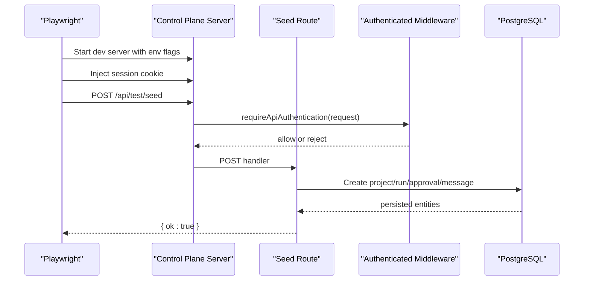
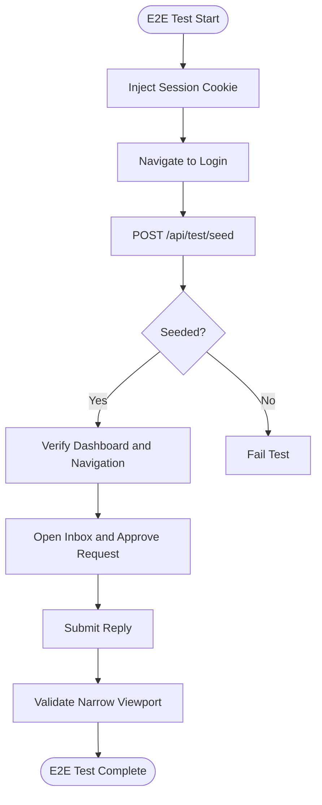
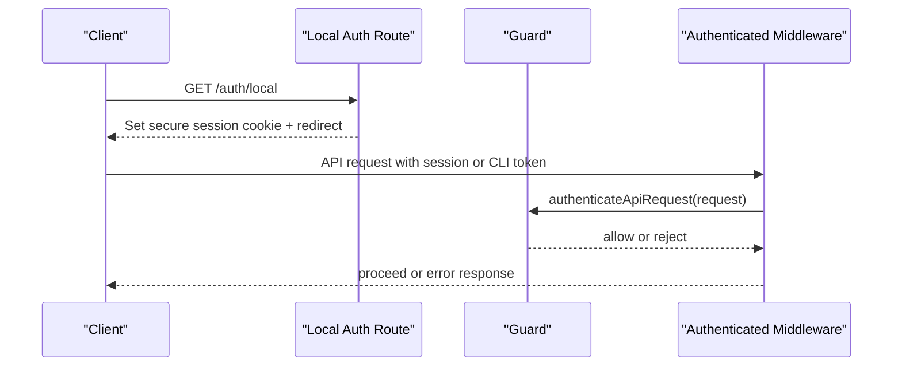
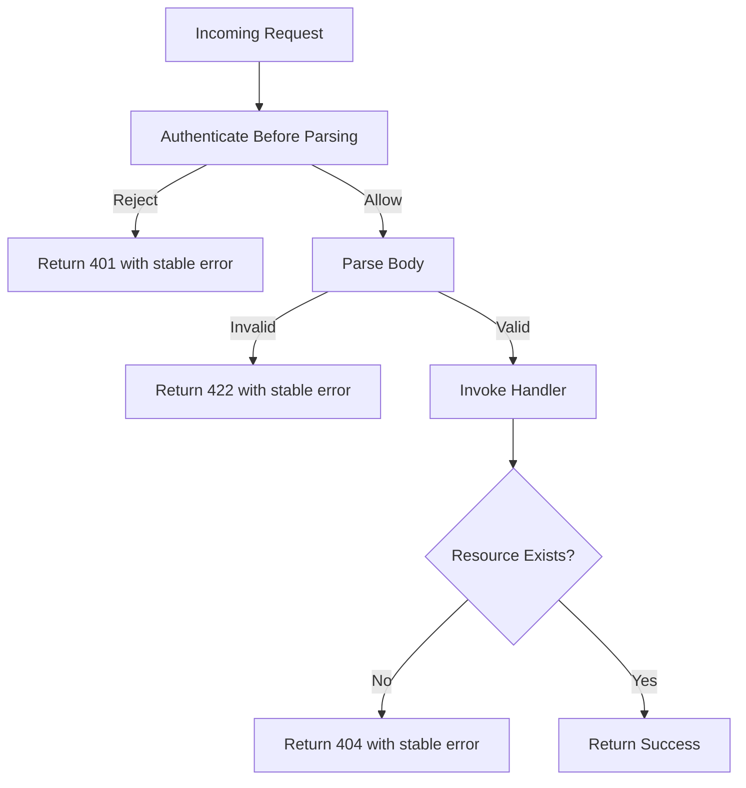
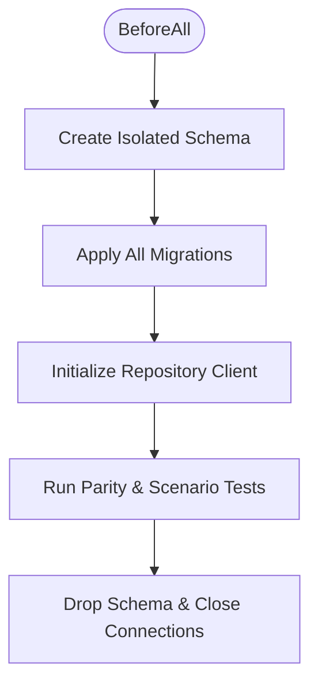
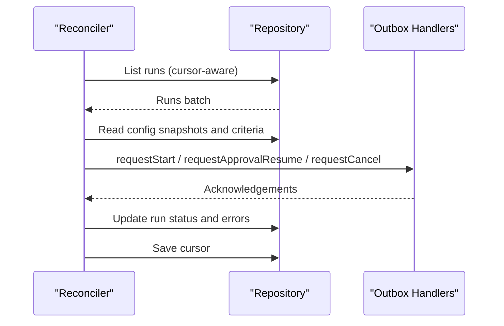
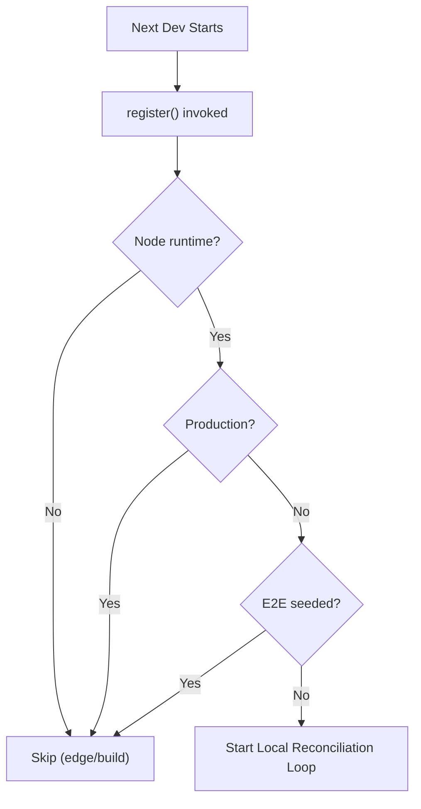
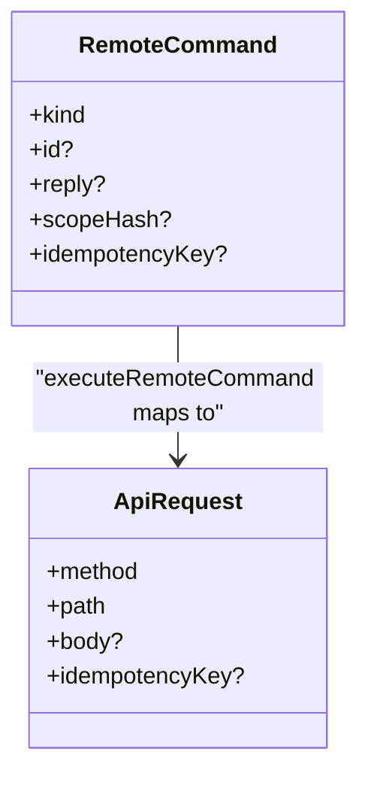
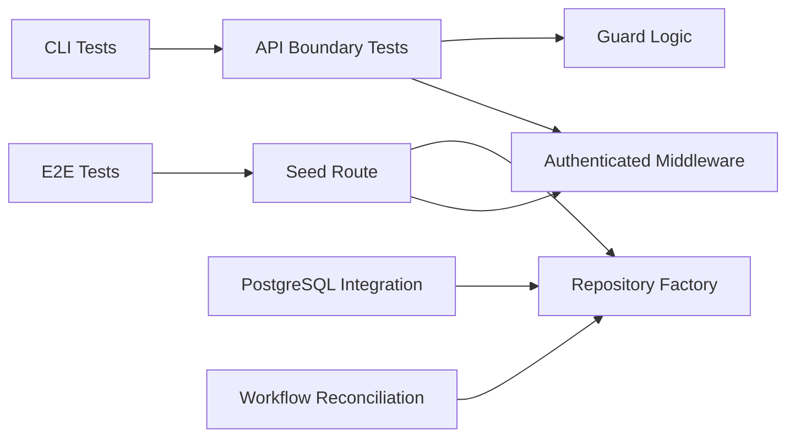

# Integration Testing

<cite>
**Referenced Files in This Document**
- [playwright.config.ts](file://playwright.config.ts)
- [scaffold.spec.ts](file://tests/e2e/scaffold.spec.ts)
- [seed route](file://apps/control-plane/app/api/test/seed/route.ts)
- [authenticated middleware](file://apps/control-plane/src/http/authenticated.ts)
- [API boundary tests](file://apps/control-plane/src/http/api.test.ts)
- [guard tests](file://apps/control-plane/src/auth/guard.test.ts)
- [auth tests](file://apps/control-plane/src/auth/auth.test.ts)
- [local auth route tests](file://apps/control-plane/src/auth/local-auth-route.test.ts)
- [PostgreSQL integration test](file://packages/adapters/src/persistence/postgres.integration.test.ts)
- [repository parity contract](file://packages/adapters/src/persistence/repository-parity-contract.ts)
- [workflow reconciliation tests](file://apps/control-plane/src/application/workflow-reconciliation.test.ts)
- [instrumentation (local reconciliation)](file://apps/control-plane/instrumentation.ts)
- [CLI command mapping](file://apps/cli/src/commands.ts)
- [CLI command tests](file://apps/cli/src/commands.test.ts)
- [MCP transport validation](file://packages/adapters/src/artifacts/mcp.ts)
</cite>

## Table of Contents
1. [Introduction](#introduction)
2. [Project Structure](#project-structure)
3. [Core Components](#core-components)
4. [Architecture Overview](#architecture-overview)
5. [Detailed Component Analysis](#detailed-component-analysis)
6. [Dependency Analysis](#dependency-analysis)
7. [Performance Considerations](#performance-considerations)
8. [Troubleshooting Guide](#troubleshooting-guide)
9. [Conclusion](#conclusion)

## Introduction
This document explains how Agent OS Passerine performs integration testing across its control plane, CLI, persistence layer, and external integrations. It covers end-to-end browser flows, API boundary tests, database integration with real PostgreSQL, workflow orchestration and reconciliation, authentication flows, data persistence contracts, asynchronous operations, and background jobs. You will learn how to set up a test database, manage fixtures, ensure transactional isolation, and validate complex business workflows such as approvals, inbox replies, and workflow deadlines.

## Project Structure
Integration tests are organized into:
- End-to-end UI tests using Playwright that start the control plane server and interact with it via a browser.
- Unit and integration tests using Vitest for API boundaries, authentication guards, and application logic.
- Database integration tests that run against a real PostgreSQL instance to validate persistence contracts and concurrency guarantees.
- Workflow reconciliation tests that exercise durable outbox processing and state transitions.

```mermaid
graph TB
subgraph "E2E"
PW["Playwright Config"]
E2E["scaffold.spec.ts"]
end
subgraph "Control Plane"
Seed["/api/test/seed route"]
Auth["Authenticated Middleware"]
API["API Boundary Tests"]
Guard["Auth Guard Tests"]
LocalAuth["Local Auth Route Tests"]
Instr["Instrumentation (Local Reconciliation)"]
end
subgraph "Persistence"
PGInt["PostgreSQL Integration Test"]
RepoContract["Repository Parity Contract"]
end
subgraph "Workflows"
WRT["Workflow Reconciliation Tests"]
end
subgraph "CLI"
CLI["Command Mapping"]
CLITests["CLI Command Tests"]
end
PW --> E2E
E2E --> Seed
Seed --> Auth
Seed --> RepoContract
API --> Auth
API --> Guard
LocalAuth --> Guard
WRT --> RepoContract
PGInt --> RepoContract
CLI --> API
CLITests --> CLI
Instr --> WRT
```

**Diagram sources**
- [playwright.config.ts:1-18](file://playwright.config.ts#L1-L18)
- [scaffold.spec.ts:1-149](file://tests/e2e/scaffold.spec.ts#L1-L149)
- [seed route:1-75](file://apps/control-plane/app/api/test/seed/route.ts#L1-L75)
- [authenticated middleware:1-17](file://apps/control-plane/src/http/authenticated.ts#L1-L17)
- [API boundary tests:1-130](file://apps/control-plane/src/http/api.test.ts#L1-L130)
- [guard tests:1-48](file://apps/control-plane/src/auth/guard.test.ts#L1-L48)
- [local auth route tests:1-117](file://apps/control-plane/src/auth/local-auth-route.test.ts#L1-L117)
- [PostgreSQL integration test:1-800](file://packages/adapters/src/persistence/postgres.integration.test.ts#L1-L800)
- [repository parity contract:58-80](file://packages/adapters/src/persistence/repository-parity-contract.ts#L58-L80)
- [workflow reconciliation tests:1-728](file://apps/control-plane/src/application/workflow-reconciliation.test.ts#L1-L728)
- [instrumentation (local reconciliation):1-39](file://apps/control-plane/instrumentation.ts#L1-L39)
- [CLI command mapping:37-92](file://apps/cli/src/commands.ts#L37-L92)
- [CLI command tests:29-84](file://apps/cli/src/commands.test.ts#L29-L84)

**Section sources**
- [playwright.config.ts:1-18](file://playwright.config.ts#L1-L18)
- [scaffold.spec.ts:1-149](file://tests/e2e/scaffold.spec.ts#L1-L149)

## Core Components
- E2E harness: Playwright starts the control plane dev server with environment variables that enable seeding and configure GitHub OAuth for local testing. The test injects a session cookie and calls the seed endpoint to prepare fixtures.
- Seed endpoint: Creates a project, a waiting run, an approval, and an inbox message when called under controlled conditions. It enforces production safety by returning not found outside development or when seeding is disabled.
- Authentication: Multiple layers protect APIs and routes. The authenticated middleware validates requests using guard logic; local auth bypass issues secure cookies in development; guard tests verify CLI bearer tokens and cross-origin mutation protection.
- API boundary: Tests assert streaming body size limits, UTF-8 byte counting, stable error envelopes without stack traces, predictable 404 mapping, and authentication before parsing invalid bodies.
- Persistence integration: A dedicated suite provisions a per-run schema, applies all migrations, constructs a repository client, and runs a shared parity contract plus additional concurrency and idempotency scenarios.
- Workflow reconciliation: Tests drive durable outbox processing, goal repair, deadline handling, cancellation cascades, cursor recovery, and fairness across large datasets.
- CLI integration: Tests map CLI commands to HTTP endpoints and assert idempotency keys and paths used by the remote client.

**Section sources**
- [playwright.config.ts:1-18](file://playwright.config.ts#L1-L18)
- [seed route:1-75](file://apps/control-plane/app/api/test/seed/route.ts#L1-L75)
- [authenticated middleware:1-17](file://apps/control-plane/src/http/authenticated.ts#L1-L17)
- [guard tests:1-48](file://apps/control-plane/src/auth/guard.test.ts#L1-L48)
- [API boundary tests:1-130](file://apps/control-plane/src/http/api.test.ts#L1-L130)
- [PostgreSQL integration test:1-800](file://packages/adapters/src/persistence/postgres.integration.test.ts#L1-L800)
- [workflow reconciliation tests:1-728](file://apps/control-plane/src/application/workflow-reconciliation.test.ts#L1-L728)
- [CLI command mapping:37-92](file://apps/cli/src/commands.ts#L37-L92)
- [CLI command tests:29-84](file://apps/cli/src/commands.test.ts#L29-L84)

## Architecture Overview
The integration test strategy spans multiple layers:
- Browser-driven E2E tests interact with the running Next.js control plane, authenticate via injected cookies, and call the seed endpoint to create deterministic fixtures.
- The control plane’s API layer authenticates requests, validates payloads, and delegates to repositories and services.
- Repositories persist domain state to PostgreSQL, enforcing idempotency, concurrency, and event integrity.
- Background reconciliation processes read from durable outboxes and cursors to advance workflows, enforce deadlines, and coordinate cleanup.



**Diagram sources**
- [playwright.config.ts:1-18](file://playwright.config.ts#L1-L18)
- [scaffold.spec.ts:1-149](file://tests/e2e/scaffold.spec.ts#L1-L149)
- [seed route:1-75](file://apps/control-plane/app/api/test/seed/route.ts#L1-L75)
- [authenticated middleware:1-17](file://apps/control-plane/src/http/authenticated.ts#L1-L17)

## Detailed Component Analysis

### E2E Test Harness and Fixture Management
- The Playwright configuration launches the control plane dev server with environment variables enabling seeding and configuring GitHub OAuth for local use. It sets base URL, retries, and reporter behavior.
- The scaffold test creates a session cookie using the auth helper and navigates to the login page. It then triggers seeding via a browser-evaluated fetch to the seed endpoint to populate a project, a waiting run, an approval, and an inbox message.
- Assertions validate dashboard rendering, navigation, project listing, inbox interactions, approval consumption, reply submission, and responsive layout on narrow viewports.



**Diagram sources**
- [playwright.config.ts:1-18](file://playwright.config.ts#L1-L18)
- [scaffold.spec.ts:1-149](file://tests/e2e/scaffold.spec.ts#L1-L149)
- [seed route:1-75](file://apps/control-plane/app/api/test/seed/route.ts#L1-L75)

**Section sources**
- [playwright.config.ts:1-18](file://playwright.config.ts#L1-L18)
- [scaffold.spec.ts:1-149](file://tests/e2e/scaffold.spec.ts#L1-L149)
- [seed route:1-75](file://apps/control-plane/app/api/test/seed/route.ts#L1-L75)

### Authentication Flows and Security Guards
- Local auth bypass issues secure, host-only cookies in development and supports returnTo redirection. Tests cover GET and POST forms, redirect targets, and production/host restrictions.
- Guard tests verify CLI bearer token acceptance, rejection of cross-origin mutations, and that session/CLI auth never masquerade as webhook authentication.
- Auth tests validate OAuth state/PKCE usage, callback verification, session expiration, tamper detection, redirect sanitization, localhost detection, and strict production configuration requirements.



**Diagram sources**
- [local auth route tests:1-117](file://apps/control-plane/src/auth/local-auth-route.test.ts#L1-L117)
- [guard tests:1-48](file://apps/control-plane/src/auth/guard.test.ts#L1-L48)
- [authenticated middleware:1-17](file://apps/control-plane/src/http/authenticated.ts#L1-L17)
- [auth tests:1-221](file://apps/control-plane/src/auth/auth.test.ts#L1-L221)

**Section sources**
- [local auth route tests:1-117](file://apps/control-plane/src/auth/local-auth-route.test.ts#L1-L117)
- [guard tests:1-48](file://apps/control-plane/src/auth/guard.test.ts#L1-L48)
- [auth tests:1-221](file://apps/control-plane/src/auth/auth.test.ts#L1-L221)
- [authenticated middleware:1-17](file://apps/control-plane/src/http/authenticated.ts#L1-L17)

### API Endpoint Testing Strategies
- Streaming body limits: Tests send oversized streams and assert early cancellation and 413 responses, including correct UTF-8 byte counting across multibyte chunks.
- Validation envelope: Invalid payloads produce stable error objects without stack traces.
- Error mapping: Missing resources map to 404 with consistent error shapes.
- Authentication ordering: Authentication is enforced before parsing invalid bodies, ensuring safe failure modes.



**Diagram sources**
- [API boundary tests:1-130](file://apps/control-plane/src/http/api.test.ts#L1-L130)
- [authenticated middleware:1-17](file://apps/control-plane/src/http/authenticated.ts#L1-L17)

**Section sources**
- [API boundary tests:1-130](file://apps/control-plane/src/http/api.test.ts#L1-L130)

### Database Operations and Transaction Rollback Strategies
- Per-test schema isolation: The PostgreSQL integration suite creates a unique schema per run, applies all migrations, and drops the schema after tests complete. This ensures full isolation without relying on transaction rollbacks.
- Migration application: All SQL migrations are applied in order, with placeholders replaced to target the isolated schema.
- Repository parity contract: A shared contract validates foreign key enforcement, idempotency, event replay, usage recording, webhook claims, JSON null semantics, timestamp precision, and legacy compatibility.
- Concurrency and durability: Additional tests assert atomic effect checkpointing, admission control, publication stores, concurrent event replays, idempotent run creation, state-versioned transitions, serialized cancel/approve/reply, and webhook claim exclusivity.



**Diagram sources**
- [PostgreSQL integration test:1-800](file://packages/adapters/src/persistence/postgres.integration.test.ts#L1-L800)
- [repository parity contract:58-80](file://packages/adapters/src/persistence/repository-parity-contract.ts#L58-L80)

**Section sources**
- [PostgreSQL integration test:1-800](file://packages/adapters/src/persistence/postgres.integration.test.ts#L1-L800)
- [repository parity contract:58-80](file://packages/adapters/src/persistence/repository-parity-contract.ts#L58-L80)

### Workflow Orchestration and State Transitions
- Outbox reconciliation: Tests simulate scanning runs, repairing missing goal snapshots and criteria, dispatching starts, resuming approvals, cancelling over-deadline runs, and cleaning up orphaned children.
- Deadline enforcement: Active runs past their configured timeout are marked failed and trigger cancel and cleanup intents.
- Cursor recovery: When reconciliation is interrupted, it resumes from the last scanned run using a persistent cursor, ensuring fairness and progress.
- Goal child ownership: Deterministic goal children are not dispatched as standalone feature runs, preserving parent-child relationships.



**Diagram sources**
- [workflow reconciliation tests:1-728](file://apps/control-plane/src/application/workflow-reconciliation.test.ts#L1-L728)

**Section sources**
- [workflow reconciliation tests:1-728](file://apps/control-plane/src/application/workflow-reconciliation.test.ts#L1-L728)

### Asynchronous Operations, Background Jobs, and Real-time Features
- Local reconciliation loop: In development, instrumentation starts a local reconciliation loop unless explicitly disabled (for example, during E2E seeding). This ensures stalled runs are observed and fail at deadlines locally, mirroring production cron behavior.
- MCP transport validation: External artifact capabilities enforce content-type, accept headers, origin allowlists, and bearer token presence, providing robust integration points for real-time features.



**Diagram sources**
- [instrumentation (local reconciliation):1-39](file://apps/control-plane/instrumentation.ts#L1-L39)

**Section sources**
- [instrumentation (local reconciliation):1-39](file://apps/control-plane/instrumentation.ts#L1-L39)
- [MCP transport validation:122-170](file://packages/adapters/src/artifacts/mcp.ts#L122-L170)

### CLI Integration Testing
- Command mapping: The CLI maps high-level commands to specific API endpoints, attaching idempotency keys where appropriate. Tests assert exact method, path, and payload structure for each command kind.
- End-to-end flow: While E2E uses the browser, CLI tests validate the translation layer that drives remote operations like starting runs, listing runs, canceling, replying to inbox messages, and approving or rejecting approvals.



**Diagram sources**
- [CLI command mapping:37-92](file://apps/cli/src/commands.ts#L37-L92)
- [CLI command tests:29-84](file://apps/cli/src/commands.test.ts#L29-L84)

**Section sources**
- [CLI command mapping:37-92](file://apps/cli/src/commands.ts#L37-L92)
- [CLI command tests:29-84](file://apps/cli/src/commands.test.ts#L29-L84)

## Dependency Analysis
- E2E depends on the control plane server process started by Playwright configuration. It relies on the seed endpoint to create fixtures and on authentication helpers to issue sessions.
- The seed endpoint depends on authenticated middleware and the repository factory to persist fixtures safely.
- API boundary tests depend on the authenticated middleware and guard logic to assert preconditions like authentication before parsing.
- Persistence integration tests depend on a real PostgreSQL instance and apply migrations to build a clean schema for each run.
- Workflow reconciliation tests depend on repository abstractions and outbox handlers to simulate durable processing.
- CLI tests depend on command mapping to ensure correct HTTP requests are constructed.



**Diagram sources**
- [playwright.config.ts:1-18](file://playwright.config.ts#L1-L18)
- [seed route:1-75](file://apps/control-plane/app/api/test/seed/route.ts#L1-L75)
- [authenticated middleware:1-17](file://apps/control-plane/src/http/authenticated.ts#L1-L17)
- [API boundary tests:1-130](file://apps/control-plane/src/http/api.test.ts#L1-L130)
- [guard tests:1-48](file://apps/control-plane/src/auth/guard.test.ts#L1-L48)
- [PostgreSQL integration test:1-800](file://packages/adapters/src/persistence/postgres.integration.test.ts#L1-L800)
- [workflow reconciliation tests:1-728](file://apps/control-plane/src/application/workflow-reconciliation.test.ts#L1-L728)
- [CLI command tests:29-84](file://apps/cli/src/commands.test.ts#L29-L84)

**Section sources**
- [playwright.config.ts:1-18](file://playwright.config.ts#L1-L18)
- [seed route:1-75](file://apps/control-plane/app/api/test/seed/route.ts#L1-L75)
- [authenticated middleware:1-17](file://apps/control-plane/src/http/authenticated.ts#L1-L17)
- [API boundary tests:1-130](file://apps/control-plane/src/http/api.test.ts#L1-L130)
- [guard tests:1-48](file://apps/control-plane/src/auth/guard.test.ts#L1-L48)
- [PostgreSQL integration test:1-800](file://packages/adapters/src/persistence/postgres.integration.test.ts#L1-L800)
- [workflow reconciliation tests:1-728](file://apps/control-plane/src/application/workflow-reconciliation.test.ts#L1-L728)
- [CLI command tests:29-84](file://apps/cli/src/commands.test.ts#L29-L84)

## Performance Considerations
- Use isolated schemas for database integration tests to avoid contention and ensure fast teardown.
- Limit migration application to necessary statements and reuse connections efficiently within suites.
- Avoid shipping large payloads over real-time streams; prefer selective columns to reduce bandwidth.
- Ensure reconciliation loops do not multiply due to repeated registrations; guard against duplicate startup in development.

[No sources needed since this section provides general guidance]

## Troubleshooting Guide
- Seeding disabled in production: The seed endpoint returns not found outside development or when seeding is disabled. If E2E fails to find fixtures, verify environment flags and that the server was started with seeding enabled.
- Authentication failures: Confirm that session cookies match the expected domain and flags, and that CLI bearer tokens are present for API calls. Cross-origin mutations are rejected; ensure origins align with allowed values.
- Database connection issues: Ensure TEST_DATABASE_URL is set for integration tests and that migrations can be applied. Schema names must match expected patterns to prevent accidental deletion of unexpected schemas.
- Workflow stalls: In development, the local reconciliation loop may be disabled when E2E seeding is enabled to avoid interfering with test fixtures. Adjust environment flags if you need to observe deadline behavior during E2E.

**Section sources**
- [seed route:1-75](file://apps/control-plane/app/api/test/seed/route.ts#L1-L75)
- [guard tests:1-48](file://apps/control-plane/src/auth/guard.test.ts#L1-L48)
- [PostgreSQL integration test:1-800](file://packages/adapters/src/persistence/postgres.integration.test.ts#L1-L800)
- [instrumentation (local reconciliation):1-39](file://apps/control-plane/instrumentation.ts#L1-L39)

## Conclusion
Agent OS Passerine’s integration testing strategy combines browser-driven E2E flows, robust API boundary tests, real-database persistence validation, and comprehensive workflow reconciliation checks. By isolating databases per run, applying migrations deterministically, and asserting idempotency and concurrency guarantees, the suite ensures reliability across component interactions, authentication, data persistence, and asynchronous operations. The CLI mapping tests close the loop by validating user-facing command translations to backend endpoints. Together, these practices provide confidence in complex business workflows, event processing, and state transitions under realistic conditions.

[No sources needed since this section summarizes without analyzing specific files]