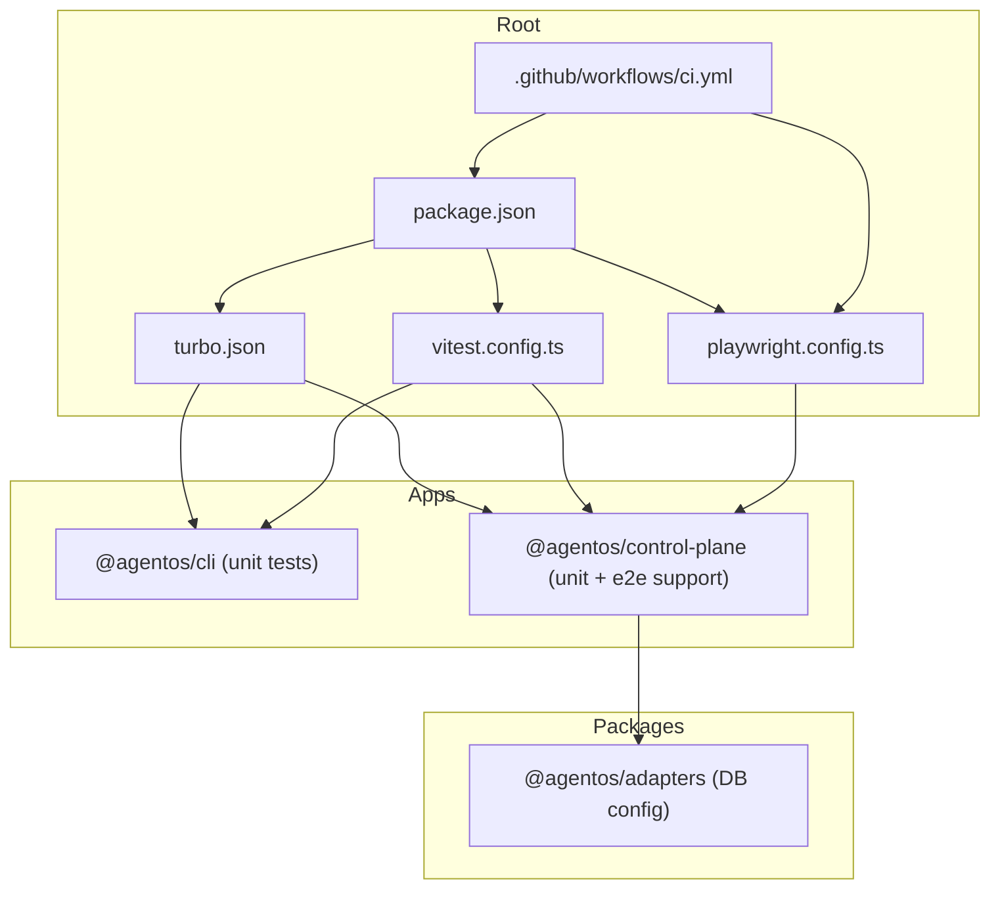
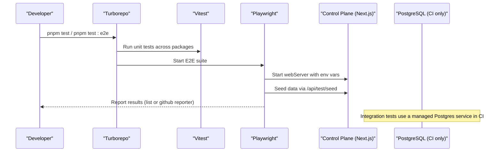
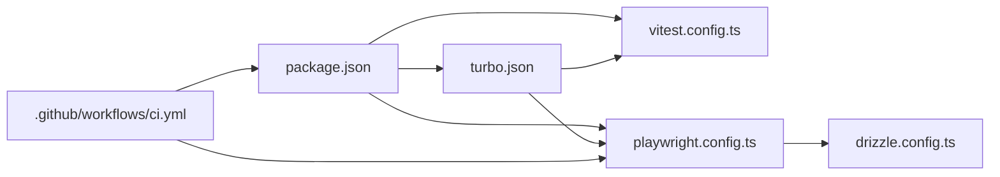

# Test Infrastructure

<cite>
**Referenced Files in This Document**
- [vitest.config.ts](file://vitest.config.ts)
- [playwright.config.ts](file://playwright.config.ts)
- [package.json](file://package.json)
- [turbo.json](file://turbo.json)
- [ci.yml](file://.github/workflows/ci.yml)
- [scaffold.spec.ts](file://tests/e2e/scaffold.spec.ts)
- [main.test.ts](file://apps/cli/src/main.test.ts)
- [runtime.test.ts](file://apps/control-plane/src/application/runtime.test.ts)
- [repository-factory.ts](file://apps/control-plane/src/persistence/repository-factory.ts)
- [repository-factory.test.ts](file://apps/control-plane/src/persistence/repository-factory.test.ts)
- [database-config.ts](file://packages/adapters/src/persistence/database-config.ts)
- [database-config.test.ts](file://packages/adapters/src/persistence/database-config.test.ts)
- [drizzle.config.ts](file://drizzle.config.ts)
- [setup-routes.test.ts](file://apps/control-plane/src/http/setup-routes.test.ts)
</cite>

## Table of Contents
1. Introduction
2. Project Structure
3. Core Components
4. Architecture Overview
5. Detailed Component Analysis
6. Dependency Analysis
7. Performance Considerations
8. Troubleshooting Guide
9. Conclusion

## Introduction
This document explains the test infrastructure for Agent OS Passerine. It covers unit testing with Vitest, end-to-end testing with Playwright, environment setup, dependency management, database configuration for tests, mocking strategies, fixtures, file organization and naming conventions, CI/CD integration, reporting, coverage options, performance optimization techniques, and debugging strategies.

## Project Structure
The repository uses a monorepo layout with per-package scripts orchestrated by Turborepo. Unit tests live alongside source files using the .test.ts suffix under each package’s src directory. End-to-end tests are centralized under tests/e2e and driven by Playwright.

**Diagram sources**
- [package.json:10-23](file://package.json#L10-L23)
- [turbo.json:1-19](file://turbo.json#L1-L19)
- [vitest.config.ts:1-7](file://vitest.config.ts#L1-L7)
- [playwright.config.ts:1-18](file://playwright.config.ts#L1-L18)
- [ci.yml:11-31](file://.github/workflows/ci.yml#L11-L31)

**Section sources**
- [package.json:10-23](file://package.json#L10-L23)
- [turbo.json:1-19](file://turbo.json#L1-L19)
- [vitest.config.ts:1-7](file://vitest.config.ts#L1-L7)
- [playwright.config.ts:1-18](file://playwright.config.ts#L1-L18)
- [ci.yml:11-31](file://.github/workflows/ci.yml#L11-L31)

## Core Components
- Unit testing framework: Vitest configured at the root to discover all **/src/**/*.test.ts files.
- E2E testing framework: Playwright configured to run against a local Next.js dev server started via webServer.
- Monorepo orchestration: Turboreho runs build, lint, typecheck, and test tasks across packages.
- Database layer: PostgreSQL via Drizzle; tests can use an in-memory repository or a real Postgres service depending on environment.
- CI pipeline: GitHub Actions job matrix runs quality checks, unit tests, and E2E tests; a separate job provisions Postgres for integration tests.

Key responsibilities:
- Root scripts define how to run tests across the workspace.
- Per-package scripts invoke their respective test runners.
- Playwright starts the control plane app with required environment variables and seeds data via an internal API.
- Repository factory selects between in-memory and Neon-backed persistence based on environment flags.

**Section sources**
- [package.json:10-23](file://package.json#L10-L23)
- [turbo.json:11-13](file://turbo.json#L11-L13)
- [vitest.config.ts:1-7](file://vitest.config.ts#L1-L7)
- [playwright.config.ts:1-18](file://playwright.config.ts#L1-L18)
- [repository-factory.ts:9-28](file://apps/control-plane/src/persistence/repository-factory.ts#L9-L28)
- [ci.yml:11-62](file://.github/workflows/ci.yml#L11-L62)

## Architecture Overview
The test architecture spans three layers:
- Unit tests: Run with Vitest inside each package, mocking external dependencies where needed.
- Integration tests: Use a real Postgres instance in CI to validate persistence behavior.
- E2E tests: Spin up the Next.js control plane locally, authenticate via cookies, seed data, and assert UI flows.

**Diagram sources**
- [package.json:10-23](file://package.json#L10-L23)
- [turbo.json:11-13](file://turbo.json#L11-L13)
- [playwright.config.ts:11-16](file://playwright.config.ts#L11-L16)
- [ci.yml:32-62](file://.github/workflows/ci.yml#L32-L62)

## Detailed Component Analysis

### Vitest Configuration and Unit Tests
- Discovery pattern: All files matching **/src/**/*.test.ts are included.
- Package-level scripts: Each package defines a test script that runs Vitest with passWithNoTests to avoid failures when no tests exist.
- Globals: The core package includes vitest/globals types for convenient access to describe/it/expect without imports.

Mocking patterns observed:
- Network calls are mocked using vi.fn to simulate fetch responses and verify request shapes.
- Environment variables are stubbed with vi.stubEnv to isolate behavior dependent on configuration.
- External providers are replaced with lightweight stubs implementing expected interfaces.

Test organization and naming:
- Tests co-locate with source files using the .test.ts suffix.
- Descriptive describe blocks group related behaviors; it blocks assert specific outcomes.

Example references:
- CLI tests demonstrate capturing stdout/stderr, mocking fetch, and validating JSON error codes and redaction behavior.
- Control-plane runtime tests show provider composition, handle routing, and environment-driven repository head resolution.

**Section sources**
- [vitest.config.ts:1-7](file://vitest.config.ts#L1-L7)
- [package.json:10-23](file://package.json#L10-L23)
- [main.test.ts:1-436](file://apps/cli/src/main.test.ts#L1-L436)
- [runtime.test.ts:1-235](file://apps/control-plane/src/application/runtime.test.ts#L1-L235)

### Playwright E2E Setup
- Base URL: Configured to point at localhost port used by the control plane dev server.
- Web server: Starts the Next.js dev server with explicit environment variables for authentication, repository mode, and session secrets.
- Reporter: Uses list reporter locally and github reporter in CI.
- Retries: Enabled in CI to mitigate flakiness.
- Test lifecycle: beforeEach sets a session cookie and seeds the application via an internal endpoint before each test.

E2E test examples:
- Verifies dashboard rendering, navigation, inbox interactions, approval workflows, responsive layout, and sign-in bypass flow.

**Section sources**
- [playwright.config.ts:1-18](file://playwright.config.ts#L1-L18)
- [scaffold.spec.ts:1-149](file://tests/e2e/scaffold.spec.ts#L1-L149)

### Test Databases and Persistence
- Drizzle configuration: Targets PostgreSQL schema and outputs migrations under drizzle/.
- Database URL validation: A helper enforces valid PostgreSQL URLs and fails closed if missing or malformed.
- Repository selection:
  - In-memory repository is allowed only in non-production environments and must be explicitly set via AGENTOS_REPOSITORY=memory during tests.
  - Production requires a real database URL; otherwise, initialization throws.
- CI integration: A dedicated job spins up a Postgres service and sets TEST_DATABASE_URL for integration tests.

Guidelines:
- For unit tests, prefer in-memory repositories to avoid external dependencies.
- For integration tests, configure DATABASE_URL pointing to the CI-managed Postgres service.

**Section sources**
- [drizzle.config.ts:1-13](file://drizzle.config.ts#L1-L13)
- [database-config.ts:1-26](file://packages/adapters/src/persistence/database-config.ts#L1-L26)
- [database-config.test.ts:1-34](file://packages/adapters/src/persistence/database-config.test.ts#L1-L34)
- [repository-factory.ts:9-28](file://apps/control-plane/src/persistence/repository-factory.ts#L9-L28)
- [repository-factory.test.ts:1-17](file://apps/control-plane/src/persistence/repository-factory.test.ts#L1-L17)
- [ci.yml:32-62](file://.github/workflows/ci.yml#L32-L62)

### Mocking External Services and Fixtures
- Fetch mocking: vi.fn returns controlled Response objects to simulate API behavior and edge cases.
- Environment stubbing: vi.stubEnv isolates feature toggles and configuration-dependent paths.
- Provider stubs: Lightweight implementations of runtime providers record calls and return deterministic handles.
- Session fixture: E2E tests create a session token and inject it as a cookie to authenticate requests without interactive login.

Best practices:
- Keep mocks minimal and focused on the behavior under test.
- Assert both inputs and outputs of mocked services to ensure contracts hold.
- Reset environment state after tests to prevent cross-test pollution.

**Section sources**
- [main.test.ts:77-172](file://apps/cli/src/main.test.ts#L77-L172)
- [runtime.test.ts:50-99](file://apps/control-plane/src/application/runtime.test.ts#L50-L99)
- [scaffold.spec.ts:9-36](file://tests/e2e/scaffold.spec.ts#L9-L36)

### Test Data Management
- Seeding: E2E tests call /api/test/seed to populate initial data before assertions.
- Local temp directories: Unit tests create temporary directories for file-based operations and clean them up afterward.
- Deterministic configs: Inline YAML strings define minimal configurations for runtime and repository head resolution tests.

Recommendations:
- Centralize seed data generation behind a single route or utility to keep tests fast and predictable.
- Prefer ephemeral filesystems for file I/O tests and ensure cleanup in afterEach hooks.

**Section sources**
- [scaffold.spec.ts:32-35](file://tests/e2e/scaffold.spec.ts#L32-L35)
- [runtime.test.ts:194-214](file://apps/control-plane/src/application/runtime.test.ts#L194-L214)

### Organizing Test Files and Naming Conventions
- Co-location: Place tests next to the code they exercise using the .test.ts suffix.
- Grouping: Use describe blocks to organize related scenarios; use it blocks for individual assertions.
- Consistency: Follow existing patterns for mocking, environment setup, and teardown to maintain readability and reliability.

**Section sources**
- [vitest.config.ts:3-6](file://vitest.config.ts#L3-L6)
- [main.test.ts:34-45](file://apps/cli/src/main.test.ts#L34-L45)
- [runtime.test.ts:109-156](file://apps/control-plane/src/application/runtime.test.ts#L109-L156)

### CI/CD Integration, Reporting, and Coverage
- Quality job: Installs dependencies, runs format checks, linting, type checking, unit tests, installs Playwright browsers, and executes E2E tests.
- Integration job: Provisions Postgres, sets TEST_DATABASE_URL, and runs adapter integration tests.
- Reporting: Playwright uses the github reporter in CI for PR annotations; locally uses list reporter for immediate feedback.
- Coverage: Vitest supports coverage reporters via optional dependencies; enable as needed for your workflow.

**Section sources**
- [ci.yml:11-31](file://.github/workflows/ci.yml#L11-L31)
- [ci.yml:32-62](file://.github/workflows/ci.yml#L32-L62)
- [playwright.config.ts:8-10](file://playwright.config.ts#L8-L10)

## Dependency Analysis
The test stack depends on:
- Turborepo for task orchestration across packages.
- Vitest for unit tests with globals enabled in core.
- Playwright for E2E tests with a Next.js web server.
- Drizzle for schema/migration tooling and PostgreSQL connectivity.
- Optional coverage packages available through Vitest peer dependencies.

**Diagram sources**
- [package.json:10-23](file://package.json#L10-L23)
- [turbo.json:1-19](file://turbo.json#L1-L19)
- [vitest.config.ts:1-7](file://vitest.config.ts#L1-L7)
- [playwright.config.ts:1-18](file://playwright.config.ts#L1-L18)
- [drizzle.config.ts:1-13](file://drizzle.config.ts#L1-L13)
- [ci.yml:11-31](file://.github/workflows/ci.yml#L11-L31)

**Section sources**
- [package.json:25-40](file://package.json#L25-L40)
- [turbo.json:1-19](file://turbo.json#L1-L19)
- [vitest.config.ts:1-7](file://vitest.config.ts#L1-L7)
- [playwright.config.ts:1-18](file://playwright.config.ts#L1-L18)
- [drizzle.config.ts:1-13](file://drizzle.config.ts#L1-L13)
- [ci.yml:11-62](file://.github/workflows/ci.yml#L11-L62)

## Performance Considerations
- Parallelization: Turborepo caches and parallelizes tasks across packages; leverage this by keeping tests independent and idempotent.
- Isolation: Use in-memory repositories for unit tests to avoid network overhead; reserve real databases for integration suites.
- Minimal mocks: Reduce mock complexity to speed up test execution and improve determinism.
- E2E efficiency: Seed data once per test context and reuse authenticated sessions where appropriate.
- Browser caching: Avoid unnecessary reloads; navigate directly to relevant routes within tests.

[No sources needed since this section provides general guidance]

## Troubleshooting Guide
Common issues and resolutions:
- Missing DATABASE_URL: Validation throws a clear error indicating a valid PostgreSQL URL is required. Ensure environment variables are set for integration tests.
- Unsupported repository mode: Only memory and neon modes are supported; ensure AGENTOS_REPOSITORY is set correctly in tests.
- E2E server startup: Verify Playwright’s webServer command matches local environment and ports; confirm credentials and secrets match expectations.
- Flaky tests: Enable retries in CI and reduce reliance on timing-sensitive assertions; prefer role-based queries and stable selectors.

Debugging tips:
- Inspect captured stdout/stderr in unit tests to validate error messages and exit codes.
- Use Playwright’s built-in tracing and screenshots for failing E2E tests.
- Validate environment variables with readiness checks exposed by the control plane.

**Section sources**
- [database-config.ts:5-26](file://packages/adapters/src/persistence/database-config.ts#L5-L26)
- [repository-factory.ts:9-28](file://apps/control-plane/src/persistence/repository-factory.ts#L9-L28)
- [playwright.config.ts:11-16](file://playwright.config.ts#L11-L16)
- [setup-routes.test.ts:17-41](file://apps/control-plane/src/http/setup-routes.test.ts#L17-L41)

## Conclusion
Agent OS Passerine’s test infrastructure combines Vitest for fast, isolated unit tests and Playwright for robust end-to-end verification. Turboreho orchestrates tasks across the monorepo, while CI provisions Postgres for integration testing. By following the established patterns for mocking, environment setup, and test organization, teams can maintain reliable, performant, and maintainable test suites.

[No sources needed since this section summarizes without analyzing specific files]