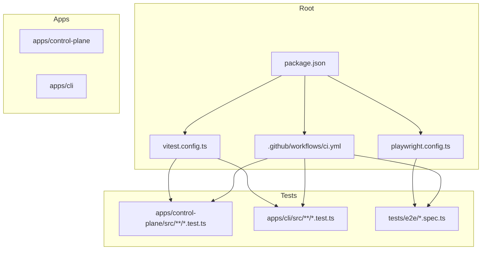
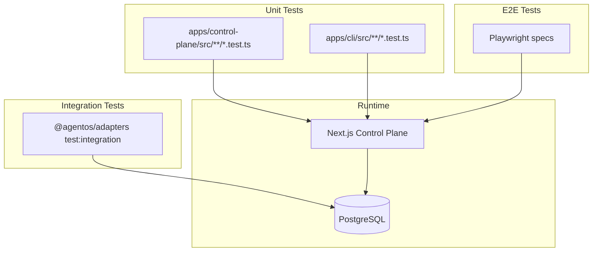
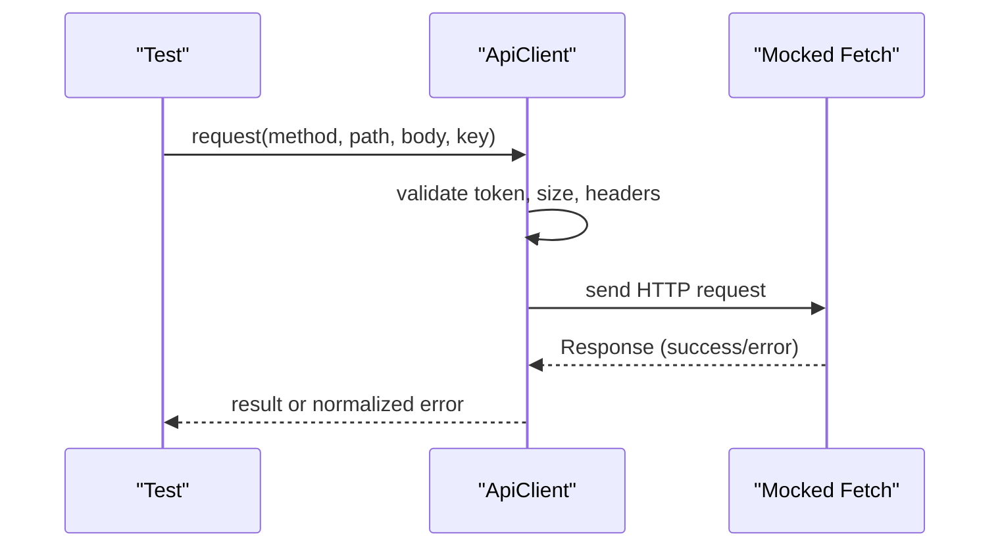
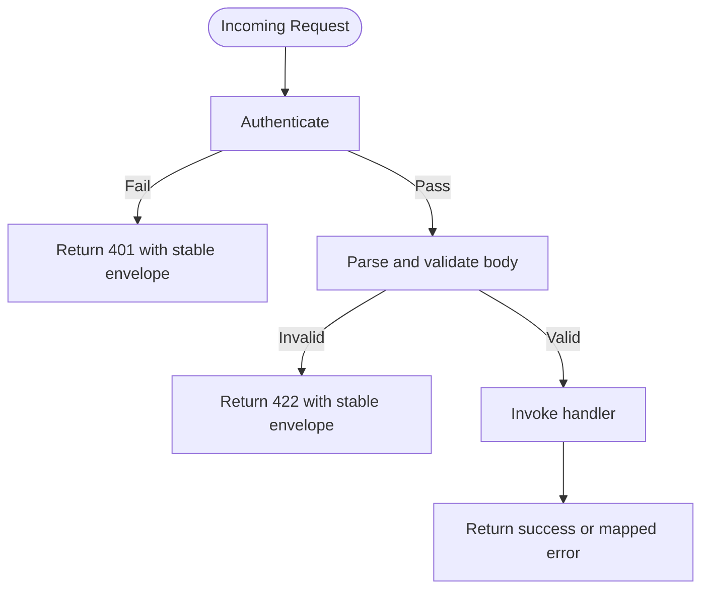
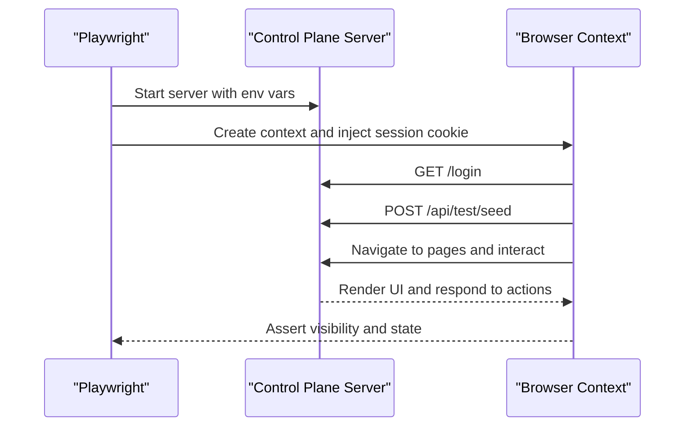
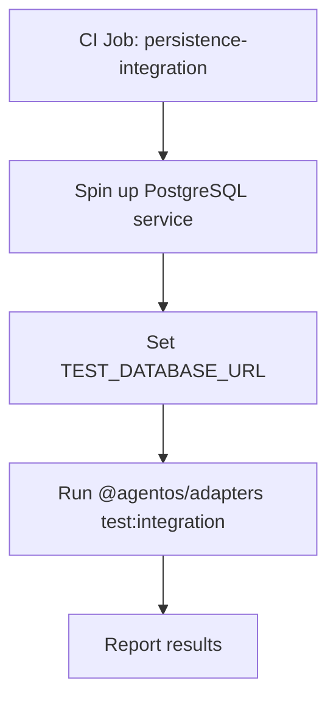
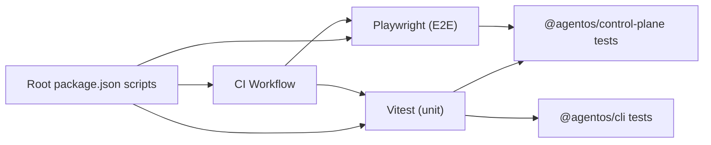

# Testing Strategy

<cite>
**Referenced Files in This Document**
- [playwright.config.ts](file://playwright.config.ts)
- [vitest.config.ts](file://vitest.config.ts)
- [.github/workflows/ci.yml](file://.github/workflows/ci.yml)
- [package.json](file://package.json)
- [apps/control-plane/package.json](file://apps/control-plane/package.json)
- [apps/cli/package.json](file://apps/cli/package.json)
- [tests/e2e/scaffold.spec.ts](file://tests/e2e/scaffold.spec.ts)
- [apps/control-plane/src/auth/auth.test.ts](file://apps/control-plane/src/auth/auth.test.ts)
- [apps/cli/src/api-client.test.ts](file://apps/cli/src/api-client.test.ts)
- [apps/control-plane/src/application/runtime.test.ts](file://apps/control-plane/src/application/runtime.test.ts)
- [apps/control-plane/src/ui/inbox-view.test.ts](file://apps/control-plane/src/ui/inbox-view.test.ts)
- [apps/control-plane/src/http/api.test.ts](file://apps/control-plane/src/http/api.test.ts)
</cite>

## Table of Contents
1. [Introduction](#introduction)
2. [Project Structure](#project-structure)
3. [Core Components](#core-components)
4. [Architecture Overview](#architecture-overview)
5. [Detailed Component Analysis](#detailed-component-analysis)
6. [Dependency Analysis](#dependency-analysis)
7. [Performance Considerations](#performance-considerations)
8. [Troubleshooting Guide](#troubleshooting-guide)
9. [Conclusion](#conclusion)

## Introduction
This document describes the testing strategy for Agent OS Passerine, covering unit tests, integration tests, and end-to-end (E2E) tests. It explains how tests are organized, how infrastructure is set up, what mocking strategies are used, how test data is managed, and how continuous integration runs these tests. It also outlines E2E testing with Playwright, API testing patterns, guidelines for writing effective tests, and recommendations for performance and load testing.

## Project Structure
The repository uses a monorepo layout with separate apps and packages. Tests are colocated next to source files using a .test.ts suffix and discovered by Vitest. E2E tests live under a dedicated directory and use Playwright. CI orchestrates quality checks, unit/integration tests, and E2E tests.

**Diagram sources**
- [package.json:10-23](file://package.json#L10-L23)
- [vitest.config.ts:1-8](file://vitest.config.ts#L1-L8)
- [playwright.config.ts:1-18](file://playwright.config.ts#L1-L18)
- [.github/workflows/ci.yml:11-31](file://.github/workflows/ci.yml#L11-L31)

**Section sources**
- [package.json:10-23](file://package.json#L10-L23)
- [vitest.config.ts:1-8](file://vitest.config.ts#L1-L8)
- [playwright.config.ts:1-18](file://playwright.config.ts#L1-L18)
- [.github/workflows/ci.yml:11-31](file://.github/workflows/ci.yml#L11-L31)

## Core Components
- Unit testing framework: Vitest, configured to discover all .test.ts files under src directories.
- E2E testing framework: Playwright, configured to run against a local Next.js control plane server with seeded data and authenticated sessions.
- Integration testing: A dedicated job runs adapter-level integration tests against a real PostgreSQL service container.
- Test scripts: Root and app-level scripts orchestrate running tests via pnpm workspaces.

Key responsibilities:
- vitest.config.ts: Defines test discovery pattern for unit tests.
- playwright.config.ts: Starts the control plane web server, sets base URL, retries, reporters, and environment variables for E2E.
- CI workflow: Runs lint/typecheck/unit tests, installs browser dependencies, and executes E2E; also runs integration tests against Postgres.

**Section sources**
- [vitest.config.ts:1-8](file://vitest.config.ts#L1-L8)
- [playwright.config.ts:1-18](file://playwright.config.ts#L1-L18)
- [.github/workflows/ci.yml:11-62](file://.github/workflows/ci.yml#L11-L62)
- [package.json:10-23](file://package.json#L10-L23)
- [apps/control-plane/package.json:5-11](file://apps/control-plane/package.json#L5-L11)
- [apps/cli/package.json:9-13](file://apps/cli/package.json#L9-L13)

## Architecture Overview
The testing architecture spans three layers:

- Unit tests: Fast, isolated, and focused on pure logic and small modules. They mock external services and network calls where needed.
- Integration tests: Validate interactions with real infrastructure (e.g., Postgres) in CI using service containers.
- E2E tests: Exercise the full application stack through the UI and APIs, including authentication, navigation, and user workflows.

**Diagram sources**
- [vitest.config.ts:1-8](file://vitest.config.ts#L1-L8)
- [playwright.config.ts:11-17](file://playwright.config.ts#L11-L17)
- [.github/workflows/ci.yml:32-62](file://.github/workflows/ci.yml#L32-L62)

## Detailed Component Analysis

### Unit Testing Patterns
- Organization: Tests are colocated with source files as .test.ts and discovered automatically by Vitest.
- Mocking:
  - Network and fetch: Tests replace global fetch or pass custom fetch implementations to isolate behavior and assert headers, timeouts, and error handling.
  - Environment: Tests stub environment variables to validate configuration loading and security rules.
  - Providers: Custom runtime providers are constructed to record method calls and return deterministic handles for assertions.
- Data management:
  - In-memory fixtures and deterministic inputs are used to drive scenarios without external state.
  - For repository-related logic, temporary directories are created and cleaned up per test.

Examples of covered behaviors:
- Authentication flows, session lifecycle, redirect sanitization, and cookie attributes.
- API client validation, request size limits, idempotency headers, timeout handling, response streaming limits, credential redaction, and stable error codes.
- Runtime composition, handle routing between managed and alternative runtimes, and environment-based repository head resolution.
- UI view models that transform projections into inbox items, conversation history, chips, and relative timestamps.

**Diagram sources**
- [apps/cli/src/api-client.test.ts:91-156](file://apps/cli/src/api-client.test.ts#L91-L156)
- [apps/cli/src/api-client.test.ts:212-284](file://apps/cli/src/api-client.test.ts#L212-L284)

**Section sources**
- [apps/control-plane/src/auth/auth.test.ts:24-220](file://apps/control-plane/src/auth/auth.test.ts#L24-L220)
- [apps/cli/src/api-client.test.ts:26-309](file://apps/cli/src/api-client.test.ts#L26-L309)
- [apps/control-plane/src/application/runtime.test.ts:109-234](file://apps/control-plane/src/application/runtime.test.ts#L109-L234)
- [apps/control-plane/src/ui/inbox-view.test.ts:42-229](file://apps/control-plane/src/ui/inbox-view.test.ts#L42-L229)

### API Boundary and Validation Tests
- The API boundary layer validates request bodies, enforces streaming size limits, returns stable error envelopes, and ensures authentication occurs before parsing.
- Tests cover oversized streams, multibyte UTF-8 counting, validation errors, not found mappings, and auth-first behavior.

**Diagram sources**
- [apps/control-plane/src/http/api.test.ts:7-129](file://apps/control-plane/src/http/api.test.ts#L7-L129)

**Section sources**
- [apps/control-plane/src/http/api.test.ts:7-129](file://apps/control-plane/src/http/api.test.ts#L7-L129)

### E2E Testing with Playwright
- Server bootstrap: Playwright starts the Next.js control plane with specific environment variables to enable seeding, memory-backed repository storage, and local GitHub OAuth bypass for testing.
- Authentication: Before each test, a session cookie is injected programmatically to simulate an operator login without going through the full OAuth flow.
- Seeding: Each test navigates to the login page and triggers a seed endpoint to ensure consistent initial state.
- Assertions: Tests verify dashboard rendering, navigation, inbox interactions, approval workflows, responsive layouts, and sign-in via localhost bypass.

**Diagram sources**
- [playwright.config.ts:1-17](file://playwright.config.ts#L1-L17)
- [tests/e2e/scaffold.spec.ts:9-36](file://tests/e2e/scaffold.spec.ts#L9-L36)
- [tests/e2e/scaffold.spec.ts:38-148](file://tests/e2e/scaffold.spec.ts#L38-L148)

**Section sources**
- [playwright.config.ts:1-17](file://playwright.config.ts#L1-L17)
- [tests/e2e/scaffold.spec.ts:9-148](file://tests/e2e/scaffold.spec.ts#L9-L148)

### Integration Testing Strategy
- A dedicated CI job provisions a PostgreSQL service container and runs adapter integration tests against it.
- The job sets a database URL environment variable so adapters can connect to the real database during tests.
- This approach validates persistence contracts and migration compatibility with a real engine.

**Diagram sources**
- [.github/workflows/ci.yml:32-62](file://.github/workflows/ci.yml#L32-L62)

**Section sources**
- [.github/workflows/ci.yml:32-62](file://.github/workflows/ci.yml#L32-L62)

## Dependency Analysis
- Test execution depends on workspace scripts defined at the root and per-app package manifests.
- Vitest discovers tests across apps based on a shared config.
- Playwright depends on a running control plane instance started within its own configuration.
- CI ties everything together, installing dependencies, running quality gates, unit tests, and E2E suites.

**Diagram sources**
- [package.json:10-23](file://package.json#L10-L23)
- [apps/control-plane/package.json:5-11](file://apps/control-plane/package.json#L5-L11)
- [apps/cli/package.json:9-13](file://apps/cli/package.json#L9-L13)
- [.github/workflows/ci.yml:11-31](file://.github/workflows/ci.yml#L11-L31)

**Section sources**
- [package.json:10-23](file://package.json#L10-L23)
- [apps/control-plane/package.json:5-11](file://apps/control-plane/package.json#L5-L11)
- [apps/cli/package.json:9-13](file://apps/cli/package.json#L9-L13)
- [.github/workflows/ci.yml:11-31](file://.github/workflows/ci.yml#L11-L31)

## Performance Considerations
- Unit tests should remain fast and deterministic. Prefer in-memory mocks over slow I/O.
- E2E tests run against a single local server; keep them concise and focused on critical user journeys to reduce flakiness and duration.
- Streaming and size-limit validations are tested explicitly to guard against regressions in memory usage and throughput.
- For future load testing:
  - Use a dedicated load-testing tool to simulate concurrent users hitting the API endpoints and UI routes.
  - Isolate load tests from functional E2E suites to avoid interference.
  - Measure latency percentiles, error rates, and resource utilization under load.
  - Use synthetic datasets sized like production to evaluate caching and streaming behavior.

[No sources needed since this section provides general guidance]

## Troubleshooting Guide
- E2E server startup: Ensure the Playwright webServer command has correct ports and environment variables; failures often stem from missing or incorrect AGENTOS_* settings.
- Authentication in E2E: If tests fail to log in, verify that the session cookie injection matches the expected domain and flags, and that the server’s public URL aligns with the injected values.
- Database connectivity in integration tests: Confirm the Postgres service is healthy and reachable on the expected port and credentials.
- Flaky UI assertions: Prefer semantic selectors (roles, labels) and add explicit waits when necessary. Keep viewport sizes explicit for responsive tests.
- Error messages and secrets: Tests assert that sensitive tokens are redacted in error outputs; if logs leak secrets, review error formatting paths.

**Section sources**
- [playwright.config.ts:11-17](file://playwright.config.ts#L11-L17)
- [tests/e2e/scaffold.spec.ts:9-36](file://tests/e2e/scaffold.spec.ts#L9-L36)
- [.github/workflows/ci.yml:32-62](file://.github/workflows/ci.yml#L32-L62)
- [apps/cli/src/api-client.test.ts:64-89](file://apps/cli/src/api-client.test.ts#L64-L89)
- [apps/cli/src/api-client.test.ts:212-284](file://apps/cli/src/api-client.test.ts#L212-L284)

## Conclusion
Agent OS Passerine employs a layered testing strategy:
- Unit tests validate core logic, security, and API contracts with robust mocking and deterministic data.
- Integration tests exercise persistence against a real database in CI.
- E2E tests automate critical user workflows through the UI and APIs using Playwright, with controlled seeding and authentication.
Continuous integration enforces quality gates and runs all test tiers, ensuring reliability across development and deployment. Future enhancements should include explicit load/performance testing and expanded coverage for edge cases around streaming, concurrency, and large payloads.

[No sources needed since this section summarizes without analyzing specific files]