# Unit Testing

<cite>
**Referenced Files in This Document**
- [vitest.config.ts](file://vitest.config.ts)
- [package.json](file://package.json)
- [main.test.ts](file://apps/cli/src/main.test.ts)
- [api-client.test.ts](file://apps/cli/src/api-client.test.ts)
- [commands.test.ts](file://apps/cli/src/commands.test.ts)
- [runtime.test.ts](file://apps/control-plane/src/application/runtime.test.ts)
- [artifact-cleanup.test.ts](file://apps/control-plane/src/application/artifact-cleanup.test.ts)
- [auth.test.ts](file://apps/control-plane/src/auth/auth.test.ts)
- [api.test.ts](file://apps/control-plane/src/http/api.test.ts)
- [components.test.ts](file://apps/control-plane/src/ui/components.test.ts)
- [scaffold.spec.ts](file://tests/e2e/scaffold.spec.ts)
</cite>

## Table of Contents
1. [Introduction](#introduction)
2. [Project Structure](#project-structure)
3. [Core Components](#core-components)
4. [Architecture Overview](#architecture-overview)
5. [Detailed Component Analysis](#detailed-component-analysis)
6. [Dependency Analysis](#dependency-analysis)
7. [Performance Considerations](#performance-considerations)
8. [Troubleshooting Guide](#troubleshooting-guide)
9. [Conclusion](#conclusion)

## Introduction
This document explains how unit testing is organized and executed in Agent OS Passerine. It covers Vitest configuration, test file organization, mocking strategies, and patterns for testing CLI commands, API endpoints, UI components, and business logic. It also documents approaches for async operations, error handling, edge cases, isolation, cleanup, and performance considerations.

## Project Structure
The repository uses a single Vitest configuration at the workspace root that discovers tests under src directories with .test.ts suffixes. The top-level scripts orchestrate testing via Turborepo, while end-to-end tests use Playwright.

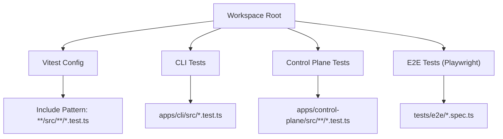

**Diagram sources**
- [vitest.config.ts:3-6](file://vitest.config.ts#L3-L6)

**Section sources**
- [vitest.config.ts:1-7](file://vitest.config.ts#L1-L7)
- [package.json:10-23](file://package.json#L10-L23)

## Core Components
- Test runner: Vitest configured to include all .test.ts files under src directories.
- Orchestration: npm scripts delegate to Turborepo for running tests across packages/apps.
- E2E layer: Playwright tests live under tests/e2e and are run separately.

Key implications:
- Keep test files co-located next to source modules using the .test.ts naming convention.
- Use global test utilities from Vitest (describe, it, expect, vi) without additional setup.
- E2E tests are isolated from unit tests and use their own runner.

**Section sources**
- [vitest.config.ts:3-6](file://vitest.config.ts#L3-L6)
- [package.json:10-23](file://package.json#L10-L23)

## Architecture Overview
The testing architecture spans three layers:
- Unit tests for CLI, control plane application logic, HTTP boundaries, and UI components.
- Integration-style tests for runtime behavior and background jobs.
- End-to-end browser tests for authenticated flows and UI interactions.

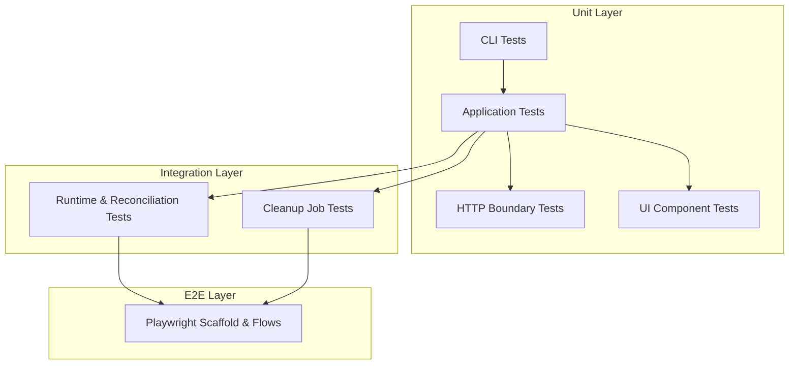

[No sources needed since this diagram shows conceptual workflow, not actual code structure]

## Detailed Component Analysis

### CLI Command Testing
Patterns observed:
- Capture stdout/stderr and inject environment, fetch, and stdin to isolate command execution.
- Validate exit codes and structured JSON errors for both human-readable and machine-readable outputs.
- Mock network calls by providing a custom fetch implementation to assert request URLs, headers, and bodies.
- Verify security properties such as token redaction and safe error codes.

Example coverage areas:
- Help/version output without network access.
- Configuration validation and plan/apply workflows against a mocked server.
- Feature start using provenance returned from apply.
- Error scenarios including invalid tokens, transport errors, and untrusted remote error codes.

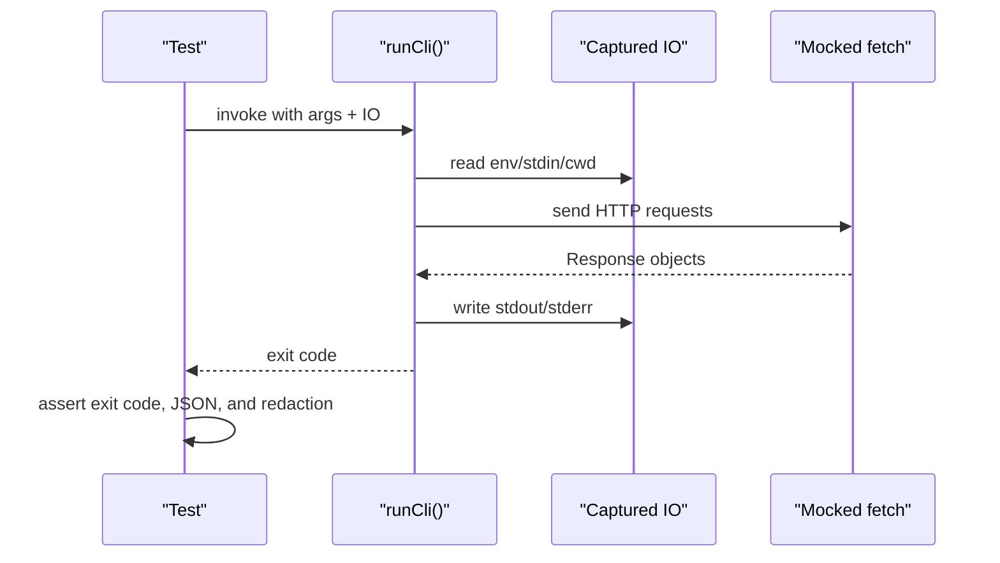

**Diagram sources**
- [main.test.ts:34-106](file://apps/cli/src/main.test.ts#L34-L106)
- [main.test.ts:108-172](file://apps/cli/src/main.test.ts#L108-L172)
- [main.test.ts:174-270](file://apps/cli/src/main.test.ts#L174-L270)
- [main.test.ts:272-330](file://apps/cli/src/main.test.ts#L272-L330)

**Section sources**
- [main.test.ts:34-106](file://apps/cli/src/main.test.ts#L34-L106)
- [main.test.ts:108-172](file://apps/cli/src/main.test.ts#L108-L172)
- [main.test.ts:174-270](file://apps/cli/src/main.test.ts#L174-L270)
- [main.test.ts:272-330](file://apps/cli/src/main.test.ts#L272-L330)

### API Client Testing
Patterns observed:
- Enforce HTTPS outside localhost and require authentication tokens.
- Validate bearer token format before making any network call.
- Assert idempotency keys and authorization headers on outgoing requests.
- Enforce strict request body size limits per endpoint and canonical configuration size constraints.
- Ensure response streaming is bounded and credentials are redacted in errors.
- Normalize untrusted remote error codes while preserving stable internal codes.

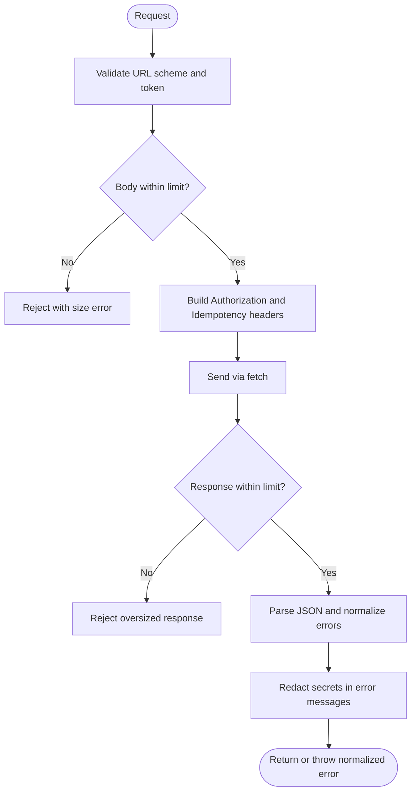

**Diagram sources**
- [api-client.test.ts:26-62](file://apps/cli/src/api-client.test.ts#L26-L62)
- [api-client.test.ts:91-156](file://apps/cli/src/api-client.test.ts#L91-L156)
- [api-client.test.ts:158-194](file://apps/cli/src/api-client.test.ts#L158-L194)
- [api-client.test.ts:212-308](file://apps/cli/src/api-client.test.ts#L212-L308)

**Section sources**
- [api-client.test.ts:26-62](file://apps/cli/src/api-client.test.ts#L26-L62)
- [api-client.test.ts:91-156](file://apps/cli/src/api-client.test.ts#L91-L156)
- [api-client.test.ts:158-194](file://apps/cli/src/api-client.test.ts#L158-L194)
- [api-client.test.ts:212-308](file://apps/cli/src/api-client.test.ts#L212-L308)

### Remote Command Mapping
Patterns observed:
- Map internal command kinds to exact HTTP methods, paths, bodies, and idempotency keys.
- Use parameterized tests to verify multiple command types in one suite.
- Inject a mock request function to capture and assert the constructed API contract.

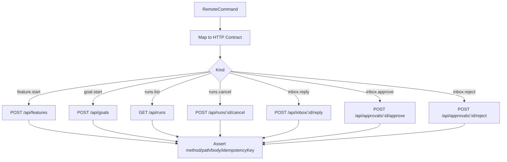

**Diagram sources**
- [commands.test.ts:29-128](file://apps/cli/src/commands.test.ts#L29-L128)

**Section sources**
- [commands.test.ts:29-128](file://apps/cli/src/commands.test.ts#L29-L128)

### Application Runtime and Cleanup Jobs
Patterns observed:
- Stub external providers with minimal interfaces to record calls and return deterministic handles.
- Compose runtime wrappers and assert routing behavior based on handle prefixes.
- Use temporary directories and real Git repositories to validate local repository head resolution.
- For background jobs, use in-memory repositories and controlled clocks to simulate concurrency, lease renewal, and time budgets.
- Validate abort signals and safety margins when long-running operations stall.

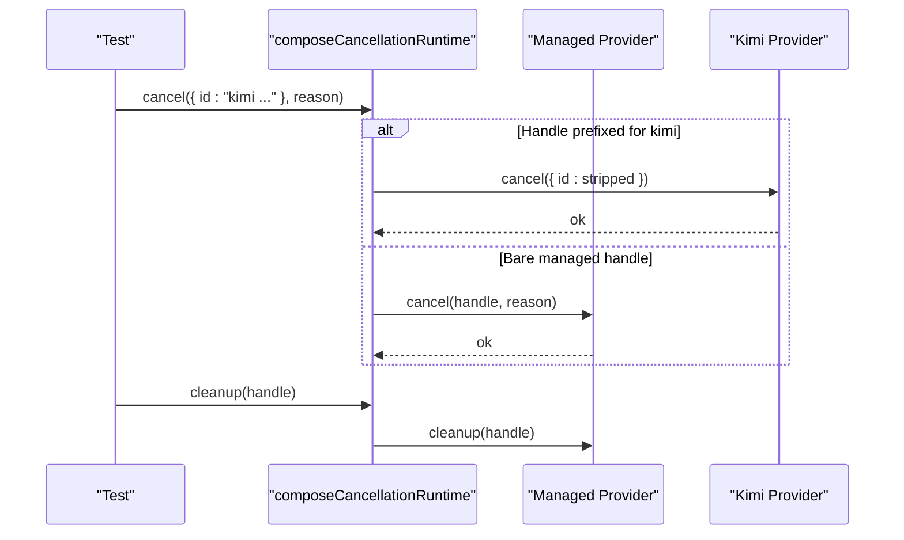

**Diagram sources**
- [runtime.test.ts:109-156](file://apps/control-plane/src/application/runtime.test.ts#L109-L156)

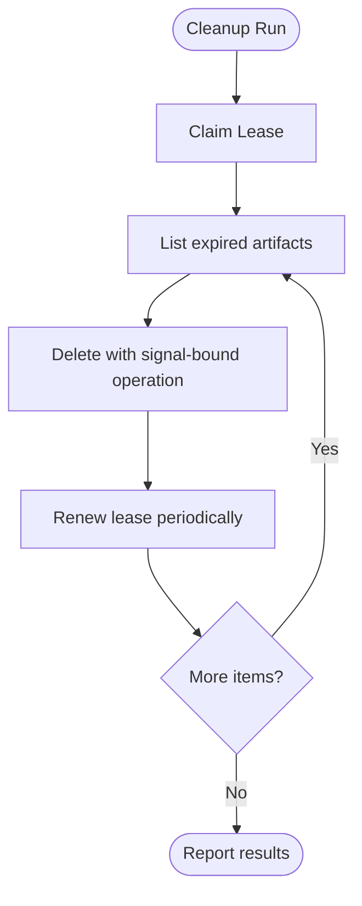

**Diagram sources**
- [artifact-cleanup.test.ts:25-87](file://apps/control-plane/src/application/artifact-cleanup.test.ts#L25-L87)
- [artifact-cleanup.test.ts:89-144](file://apps/control-plane/src/application/artifact-cleanup.test.ts#L89-L144)

**Section sources**
- [runtime.test.ts:109-156](file://apps/control-plane/src/application/runtime.test.ts#L109-L156)
- [runtime.test.ts:189-234](file://apps/control-plane/src/application/runtime.test.ts#L189-L234)
- [artifact-cleanup.test.ts:25-87](file://apps/control-plane/src/application/artifact-cleanup.test.ts#L25-L87)
- [artifact-cleanup.test.ts:89-144](file://apps/control-plane/src/application/artifact-cleanup.test.ts#L89-L144)

### Authentication and Session Security
Patterns observed:
- Parameterized tests for redirect sanitization and cookie serialization.
- Strict validation of production configuration requirements (HTTPS, required secrets).
- Localhost bypass rules validated across various origins and environments.
- Session expiration and tamper detection verified through explicit time manipulation.

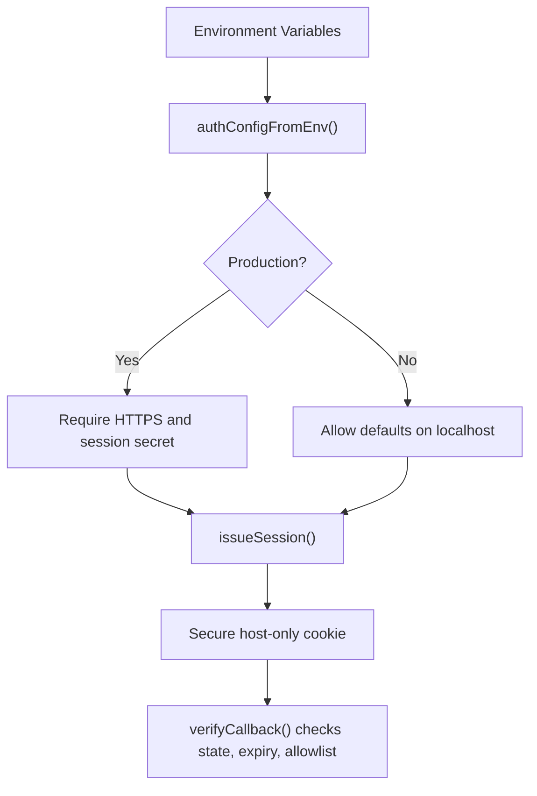

**Diagram sources**
- [auth.test.ts:24-120](file://apps/control-plane/src/auth/auth.test.ts#L24-L120)
- [auth.test.ts:122-220](file://apps/control-plane/src/auth/auth.test.ts#L122-L220)

**Section sources**
- [auth.test.ts:24-120](file://apps/control-plane/src/auth/auth.test.ts#L24-L120)
- [auth.test.ts:122-220](file://apps/control-plane/src/auth/auth.test.ts#L122-L220)

### HTTP Boundary and Streaming
Patterns observed:
- Validate streaming body size enforcement with both missing and incorrect Content-Length.
- Count UTF-8 bytes across multi-byte chunks to ensure accurate limits.
- Return stable validation envelopes without stack traces.
- Map domain-specific errors to consistent status codes and error shapes.
- Authenticate before parsing invalid bodies to avoid unnecessary work.

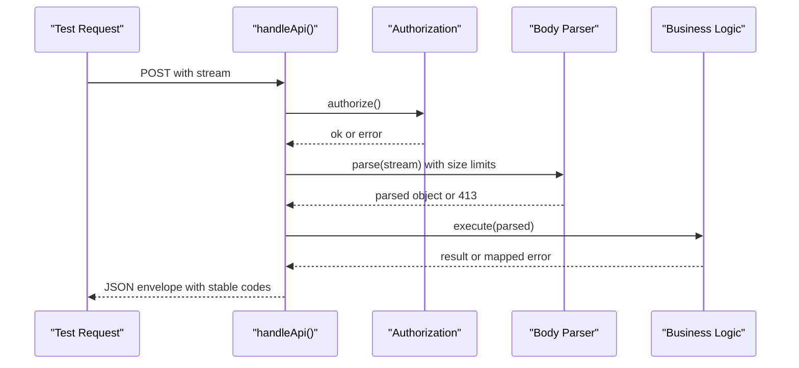

**Diagram sources**
- [api.test.ts:7-42](file://apps/control-plane/src/http/api.test.ts#L7-L42)
- [api.test.ts:44-84](file://apps/control-plane/src/http/api.test.ts#L44-L84)
- [api.test.ts:86-128](file://apps/control-plane/src/http/api.test.ts#L86-L128)

**Section sources**
- [api.test.ts:7-42](file://apps/control-plane/src/http/api.test.ts#L7-L42)
- [api.test.ts:44-84](file://apps/control-plane/src/http/api.test.ts#L44-L84)
- [api.test.ts:86-128](file://apps/control-plane/src/http/api.test.ts#L86-L128)

### UI Component Testing
Patterns observed:
- Render React components to static markup to assert accessibility attributes and text content.
- Focus on semantic roles and labels rather than visual styling.
- Keep tests fast and framework-light by avoiding full DOM setups.

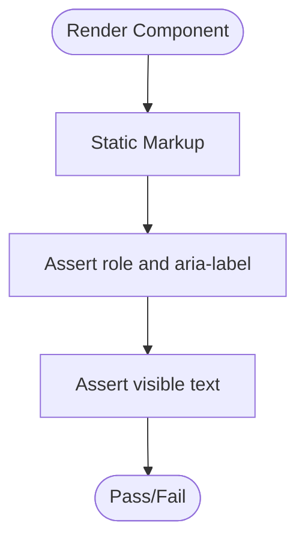

**Diagram sources**
- [components.test.ts:7-26](file://apps/control-plane/src/ui/components.test.ts#L7-L26)

**Section sources**
- [components.test.ts:7-26](file://apps/control-plane/src/ui/components.test.ts#L7-L26)

### End-to-End Testing
Patterns observed:
- Seed authenticated sessions via cookies before navigating to protected routes.
- Use a dedicated seed endpoint to prepare test data.
- Assert accessible UI elements and user flows like approvals and replies.
- Validate responsive layouts on narrow viewports.

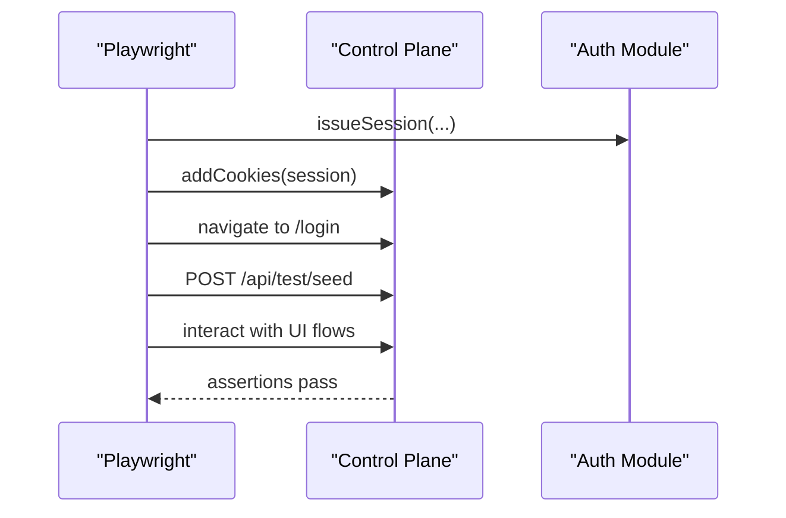

**Diagram sources**
- [scaffold.spec.ts:9-36](file://tests/e2e/scaffold.spec.ts#L9-L36)
- [scaffold.spec.ts:38-148](file://tests/e2e/scaffold.spec.ts#L38-L148)

**Section sources**
- [scaffold.spec.ts:9-36](file://tests/e2e/scaffold.spec.ts#L9-L36)
- [scaffold.spec.ts:38-148](file://tests/e2e/scaffold.spec.ts#L38-L148)

## Dependency Analysis
- Unit tests depend on Vitest globals and Node APIs where applicable.
- CLI tests depend on the CLI module’s public entry points and inject IO abstractions.
- Control plane tests depend on core types and adapters; they stub or replace external services via mocks and in-memory implementations.
- E2E tests depend on the running application and its auth/session mechanisms.

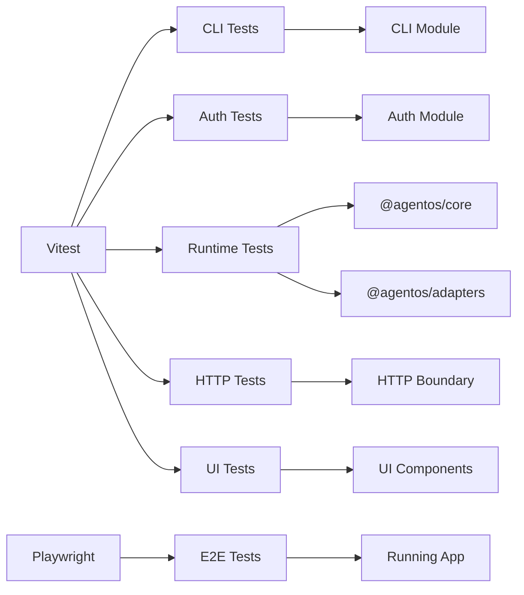

**Diagram sources**
- [vitest.config.ts:3-6](file://vitest.config.ts#L3-L6)
- [package.json:25-39](file://package.json#L25-L39)

**Section sources**
- [vitest.config.ts:3-6](file://vitest.config.ts#L3-L6)
- [package.json:25-39](file://package.json#L25-L39)

## Performance Considerations
- Prefer in-memory stores and stubbed providers to avoid slow I/O in unit tests.
- Use temporary directories judiciously and clean them up promptly to prevent disk pressure.
- Limit network calls by mocking fetch and asserting request details instead of hitting real endpoints.
- For streaming tests, ensure streams close promptly and sizes are bounded to avoid memory spikes.
- Use small, focused test cases with deterministic inputs to keep suites fast and reliable.

[No sources needed since this section provides general guidance]

## Troubleshooting Guide
Common issues and resolutions:
- Stale or flaky tests due to shared environment:
  - Reset environment variables after each test using appropriate teardown hooks.
  - Avoid relying on global mutable state; prefer injecting dependencies into functions under test.
- Network-related failures:
  - Provide a custom fetch implementation and assert URLs, headers, and bodies.
  - Ensure timeouts and abort signals are handled in tests for robustness.
- Token leakage in errors:
  - Verify that error messages redact sensitive values and do not expose tokens.
  - Assert normalized error codes for untrusted responses.
- Streaming and large payloads:
  - Confirm that oversized requests/responses are rejected early.
  - Validate UTF-8 byte counting across chunked streams.

**Section sources**
- [main.test.ts:272-330](file://apps/cli/src/main.test.ts#L272-L330)
- [api-client.test.ts:64-89](file://apps/cli/src/api-client.test.ts#L64-L89)
- [api-client.test.ts:212-308](file://apps/cli/src/api-client.test.ts#L212-L308)
- [api.test.ts:7-42](file://apps/control-plane/src/http/api.test.ts#L7-L42)

## Conclusion
Agent OS Passerine employs a clear, layered testing strategy:
- Vitest-based unit tests co-located with source modules, focusing on isolation, determinism, and security.
- Robust mocking of network, filesystem, and external providers to enable fast, reliable tests.
- Explicit validation of error handling, streaming limits, and credential redaction.
- E2E tests that exercise authenticated flows and UI accessibility.

Adopting these patterns ensures maintainable, fast, and trustworthy tests across CLI, backend services, and UI components.