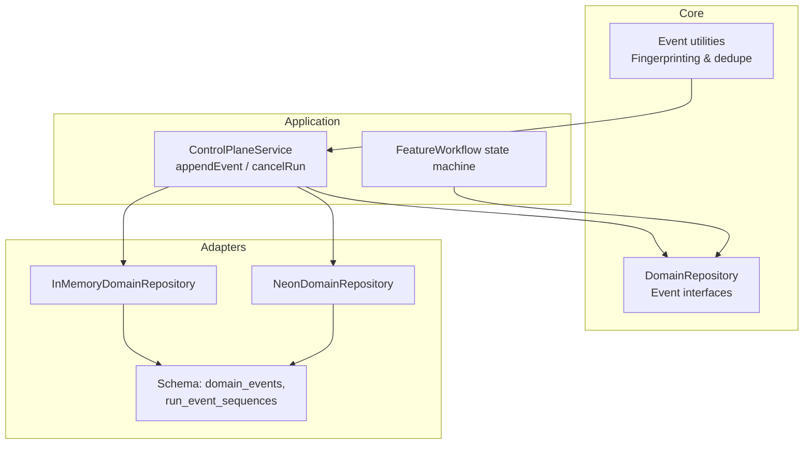
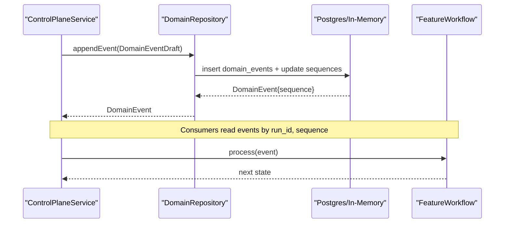
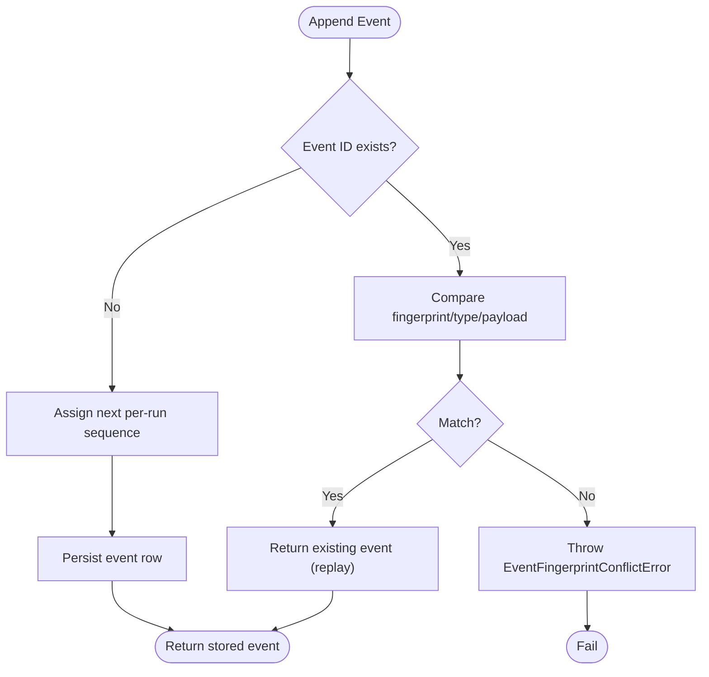
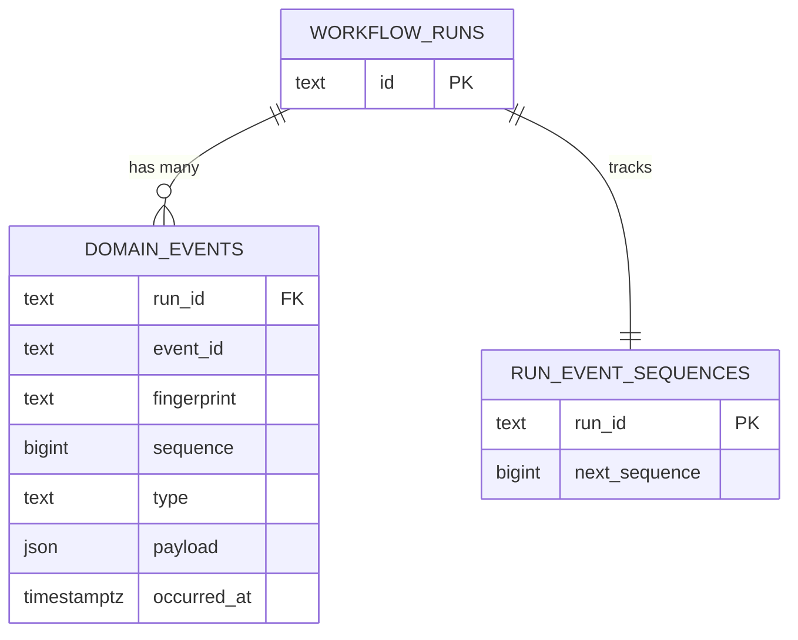
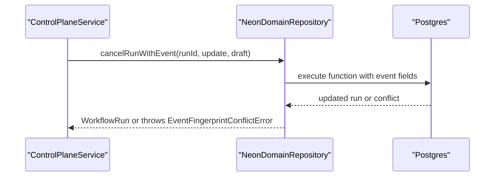
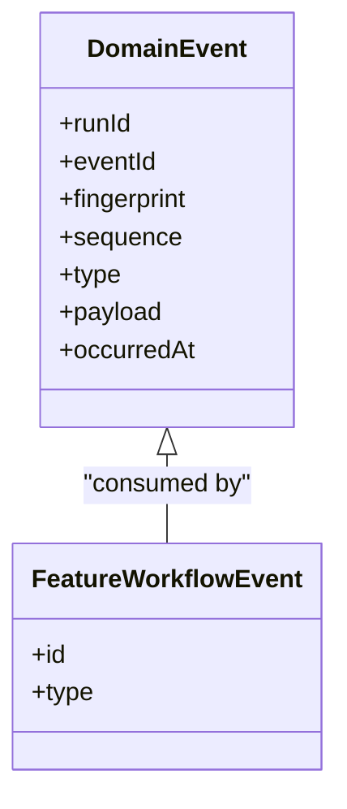
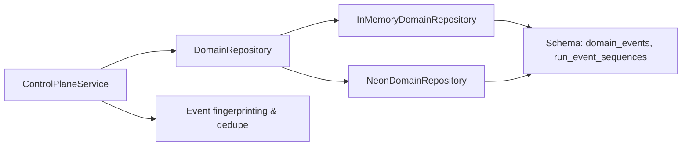

# Event System

<cite>
**Referenced Files in This Document**
- [events.ts](file://packages/core/src/events.ts)
- [persistence.ts](file://packages/core/src/persistence.ts)
- [schema.ts](file://packages/adapters/src/persistence/schema.ts)
- [in-memory.ts](file://packages/adapters/src/persistence/in-memory.ts)
- [neon-repository.ts](file://packages/adapters/src/persistence/neon-repository.ts)
- [control-plane-service.ts](file://apps/control-plane/src/application/control-plane-service.ts)
- [feature-workflow.ts](file://packages/core/src/feature-workflow.ts)
- [0005_nervous_violations.sql](file://drizzle/0005_nervous_violations.sql)
- [atomic-mutations.test.ts](file://packages/adapters/src/persistence/atomic-mutations.test.ts)
</cite>

## Table of Contents
1. Introduction
2. Project Structure
3. Core Components
4. Architecture Overview
5. Detailed Component Analysis
6. Dependency Analysis
7. Performance Considerations
8. Troubleshooting Guide
9. Conclusion

## Introduction
This document explains the event sourcing system used throughout the workflow engine. It covers domain event structure, event types and processing patterns, duplicate detection via event IDs and fingerprints, persistence and replay, custom event creation and handlers, ordering guarantees, consistency models, conflict resolution, and performance considerations for high-volume workloads.

## Project Structure
The event system spans core abstractions, adapters (in-memory and Neon/Postgres), and application services that produce events. The schema defines the durable store for events and sequence tracking.

**Diagram sources**
- [persistence.ts:315-326](file://packages/core/src/persistence.ts#L315-L326)
- [events.ts:1-86](file://packages/core/src/events.ts#L1-L86)
- [schema.ts:419-461](file://packages/adapters/src/persistence/schema.ts#L419-L461)
- [in-memory.ts:879-938](file://packages/adapters/src/persistence/in-memory.ts#L879-L938)
- [neon-repository.ts:1116-1149](file://packages/adapters/src/persistence/neon-repository.ts#L1116-L1149)
- [control-plane-service.ts:1766-1811](file://apps/control-plane/src/application/control-plane-service.ts#L1766-L1811)
- [feature-workflow.ts:44-80](file://packages/core/src/feature-workflow.ts#L44-L80)

**Section sources**
- [persistence.ts:315-326](file://packages/core/src/persistence.ts#L315-L326)
- [schema.ts:419-461](file://packages/adapters/src/persistence/schema.ts#L419-L461)
- [in-memory.ts:879-938](file://packages/adapters/src/persistence/in-memory.ts#L879-L938)
- [neon-repository.ts:1116-1149](file://packages/adapters/src/persistence/neon-repository.ts#L1116-L1149)
- [control-plane-service.ts:1766-1811](file://apps/control-plane/src/application/control-plane-service.ts#L1766-L1811)
- [feature-workflow.ts:44-80](file://packages/core/src/feature-workflow.ts#L44-L80)

## Core Components
- Domain event model: Each event is tied to a workflow run, carries a unique event ID, a deterministic fingerprint, an ordered per-run sequence, a type string, optional payload, and an occurrence timestamp.
- Repository interface: Defines append, get, list, and atomic mutations that combine state changes with event emission.
- In-memory adapter: Implements staging, idempotency checks, sequence assignment, and replay semantics using maps.
- Neon adapter: Uses database functions and constraints to enforce uniqueness, order, and atomicity; maps conflicts to typed errors.
- Control plane service: Builds event drafts with deterministic IDs and fingerprints, and surfaces idempotency conflicts as HTTP-level errors.
- Feature workflow: Demonstrates domain event types and state transitions driven by events.

**Section sources**
- [persistence.ts:315-326](file://packages/core/src/persistence.ts#L315-L326)
- [persistence.ts:456-574](file://packages/core/src/persistence.ts#L456-L574)
- [in-memory.ts:879-938](file://packages/adapters/src/persistence/in-memory.ts#L879-L938)
- [neon-repository.ts:1116-1149](file://packages/adapters/src/persistence/neon-repository.ts#L1116-L1149)
- [control-plane-service.ts:1766-1811](file://apps/control-plane/src/application/control-plane-service.ts#L1766-L1811)
- [feature-workflow.ts:44-80](file://packages/core/src/feature-workflow.ts#L44-L80)

## Architecture Overview
Events are created by application code, persisted atomically with state changes, and later replayed in strict per-run order. Duplicate detection prevents reprocessing or conflicting writes.

**Diagram sources**
- [control-plane-service.ts:1766-1811](file://apps/control-plane/src/application/control-plane-service.ts#L1766-L1811)
- [in-memory.ts:931-938](file://packages/adapters/src/persistence/in-memory.ts#L931-L938)
- [neon-repository.ts:1116-1149](file://packages/adapters/src/persistence/neon-repository.ts#L1116-L1149)
- [feature-workflow.ts:44-80](file://packages/core/src/feature-workflow.ts#L44-L80)

## Detailed Component Analysis

### Domain Event Model and Types
- Event fields include run identifier, unique event ID, deterministic fingerprint, per-run sequence, type, payload, and occurred timestamp.
- Draft vs stored: Drafts omit sequence; repositories assign it atomically.
- Example domain event types are defined in feature workflows (e.g., specification_completed, plan_completed, tests_passed, policy_failed, draft_published, crashed, resume, cancel, exhaust_budget).

**Section sources**
- [persistence.ts:315-326](file://packages/core/src/persistence.ts#L315-L326)
- [feature-workflow.ts:44-80](file://packages/core/src/feature-workflow.ts#L44-L80)

### Duplicate Detection: Event IDs and Fingerprints
- Deterministic fingerprinting: Canonicalizes payloads (including dates and numbers) and hashes them to detect identical events.
- Idempotent append: If an event ID already exists, the repository verifies fingerprint/type/payload equality; mismatches raise a fingerprint conflict error.
- In-process dedupe window: Optional in-memory dedupe state tracks recently processed event IDs and their fingerprints to avoid reprocessing within a bounded window.

**Diagram sources**
- [events.ts:18-43](file://packages/core/src/events.ts#L18-L43)
- [events.ts:45-85](file://packages/core/src/events.ts#L45-L85)
- [in-memory.ts:879-902](file://packages/adapters/src/persistence/in-memory.ts#L879-L902)
- [neon-repository.ts:1116-1149](file://packages/adapters/src/persistence/neon-repository.ts#L1116-L1149)

**Section sources**
- [events.ts:1-86](file://packages/core/src/events.ts#L1-L86)
- [in-memory.ts:879-902](file://packages/adapters/src/persistence/in-memory.ts#L879-L902)
- [neon-repository.ts:1116-1149](file://packages/adapters/src/persistence/neon-repository.ts#L1116-L1149)

### Persistence Layer: Storage and Retrieval
- Schema:
  - domain_events: composite primary key on (run_id, event_id), unique constraint on (run_id, sequence), indexes for ordered retrieval, and check constraints ensuring safe integer ranges.
  - run_event_sequences: tracks next_sequence per run to allocate monotonically increasing sequences.
- In-memory implementation:
  - Stages events, detects replays, assigns sequence from per-run counter, and commits atomically within the process.
- Neon implementation:
  - Uses database functions and SQL to perform atomic mutation plus event insertion, mapping Postgres errors to domain conflict errors.

**Diagram sources**
- [schema.ts:419-461](file://packages/adapters/src/persistence/schema.ts#L419-L461)
- [0005_nervous_violations.sql:1-13](file://drizzle/0005_nervous_violations.sql#L1-L13)

**Section sources**
- [schema.ts:419-461](file://packages/adapters/src/persistence/schema.ts#L419-L461)
- [0005_nervous_violations.sql:1-13](file://drizzle/0005_nervous_violations.sql#L1-L13)
- [in-memory.ts:931-938](file://packages/adapters/src/persistence/in-memory.ts#L931-L938)
- [neon-repository.ts:1116-1149](file://packages/adapters/src/persistence/neon-repository.ts#L1116-L1149)

### Event Ordering Guarantees and Consistency Models
- Per-run total order: Enforced by unique (run_id, sequence) and index on (run_id, sequence).
- Atomicity: Mutations that change run state also emit a single event atomically (e.g., cancelRunWithEvent), ensuring state and event log stay consistent.
- Replay safety: Replaying known events returns existing rows without side effects; mismatched payloads are rejected.

**Diagram sources**
- [neon-repository.ts:1116-1149](file://packages/adapters/src/persistence/neon-repository.ts#L1116-L1149)
- [control-plane-service.ts:1766-1811](file://apps/control-plane/src/application/control-plane-service.ts#L1766-L1811)

**Section sources**
- [schema.ts:419-461](file://packages/adapters/src/persistence/schema.ts#L419-L461)
- [neon-repository.ts:1116-1149](file://packages/adapters/src/persistence/neon-repository.ts#L1116-L1149)
- [in-memory.ts:948-981](file://packages/adapters/src/persistence/in-memory.ts#L948-L981)

### Creating Custom Domain Events and Handlers
- Create an event draft with a deterministic ID and fingerprint derived from type and payload.
- Append via repository; consumers read events by run_id and sequence to drive state machines.
- Example: Feature workflow reacts to specific event types to transition states.

**Diagram sources**
- [persistence.ts:315-326](file://packages/core/src/persistence.ts#L315-L326)
- [feature-workflow.ts:44-80](file://packages/core/src/feature-workflow.ts#L44-L80)

**Section sources**
- [control-plane-service.ts:1766-1811](file://apps/control-plane/src/application/control-plane-service.ts#L1766-L1811)
- [feature-workflow.ts:44-80](file://packages/core/src/feature-workflow.ts#L44-L80)

### Conflict Resolution Strategies
- Fingerprint conflict: If an event ID is reused with different type or payload, a fingerprint conflict error is raised.
- Unique sequence: Database constraints prevent duplicate sequences per run.
- Service-level mapping: Conflicts are surfaced as HTTP 409 idempotency_conflict when appropriate.

**Section sources**
- [events.ts:45-85](file://packages/core/src/events.ts#L45-L85)
- [schema.ts:419-461](file://packages/adapters/src/persistence/schema.ts#L419-L461)
- [control-plane-service.ts:1799-1811](file://apps/control-plane/src/application/control-plane-service.ts#L1799-L1811)

## Dependency Analysis
- Application depends on repository abstraction for event operations.
- Adapters depend on schema definitions and database functions/constraints for correctness.
- Core utilities provide canonicalization and fingerprinting used across layers.

**Diagram sources**
- [control-plane-service.ts:1766-1811](file://apps/control-plane/src/application/control-plane-service.ts#L1766-L1811)
- [in-memory.ts:879-938](file://packages/adapters/src/persistence/in-memory.ts#L879-L938)
- [neon-repository.ts:1116-1149](file://packages/adapters/src/persistence/neon-repository.ts#L1116-L1149)
- [schema.ts:419-461](file://packages/adapters/src/persistence/schema.ts#L419-L461)
- [events.ts:1-86](file://packages/core/src/events.ts#L1-L86)

**Section sources**
- [control-plane-service.ts:1766-1811](file://apps/control-plane/src/application/control-plane-service.ts#L1766-L1811)
- [in-memory.ts:879-938](file://packages/adapters/src/persistence/in-memory.ts#L879-L938)
- [neon-repository.ts:1116-1149](file://packages/adapters/src/persistence/neon-repository.ts#L1116-L1149)
- [schema.ts:419-461](file://packages/adapters/src/persistence/schema.ts#L419-L461)
- [events.ts:1-86](file://packages/core/src/events.ts#L1-L86)

## Performance Considerations
- Ordered indexing: Index on (run_id, sequence) enables efficient pagination and replay.
- Sequence allocation: Dedicated per-run sequence table avoids contention and ensures monotonicity.
- Bounded dedupe window: In-process dedupe keeps memory usage bounded while preventing accidental reprocessing.
- JSONB storage: Payloads stored as JSONB allow flexible schemas with minimal overhead.
- Atomic operations: Database functions reduce round-trips and ensure strong consistency between state and events.

[No sources needed since this section provides general guidance]

## Troubleshooting Guide
- EventFingerprintConflictError: Indicates an attempt to reuse an event ID with a different type or payload. Resolve by ensuring idempotency keys map to stable payloads.
- IdempotencyConflictError: Occurs when attempting to create runs or other entities with conflicting idempotency fingerprints.
- Replay mismatches: When replaying events, ensure the current state matches expected preconditions; otherwise, correct the state or adjust event handling logic.
- High-volume scenarios: Monitor sequence allocation and index usage; consider batching reads and limiting page sizes.

**Section sources**
- [in-memory.ts:879-902](file://packages/adapters/src/persistence/in-memory.ts#L879-L902)
- [neon-repository.ts:1116-1149](file://packages/adapters/src/persistence/neon-repository.ts#L1116-L1149)
- [atomic-mutations.test.ts:190-214](file://packages/adapters/src/persistence/atomic-mutations.test.ts#L190-L214)
- [atomic-mutations.test.ts:302-324](file://packages/adapters/src/persistence/atomic-mutations.test.ts#L302-L324)

## Conclusion
The event sourcing system provides strong ordering, idempotency, and durability for workflow state changes. Deterministic fingerprints and unique constraints ensure consistency, while repository abstractions enable interchangeable implementations. Consumers can reliably replay events to reconstruct state or drive new projections, with clear conflict signals and performance-oriented design choices.