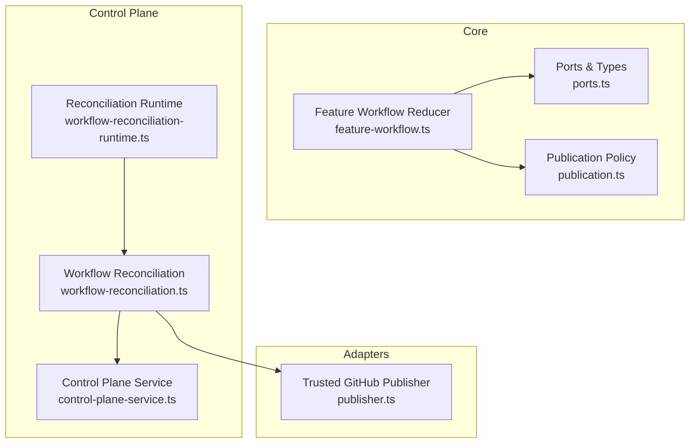
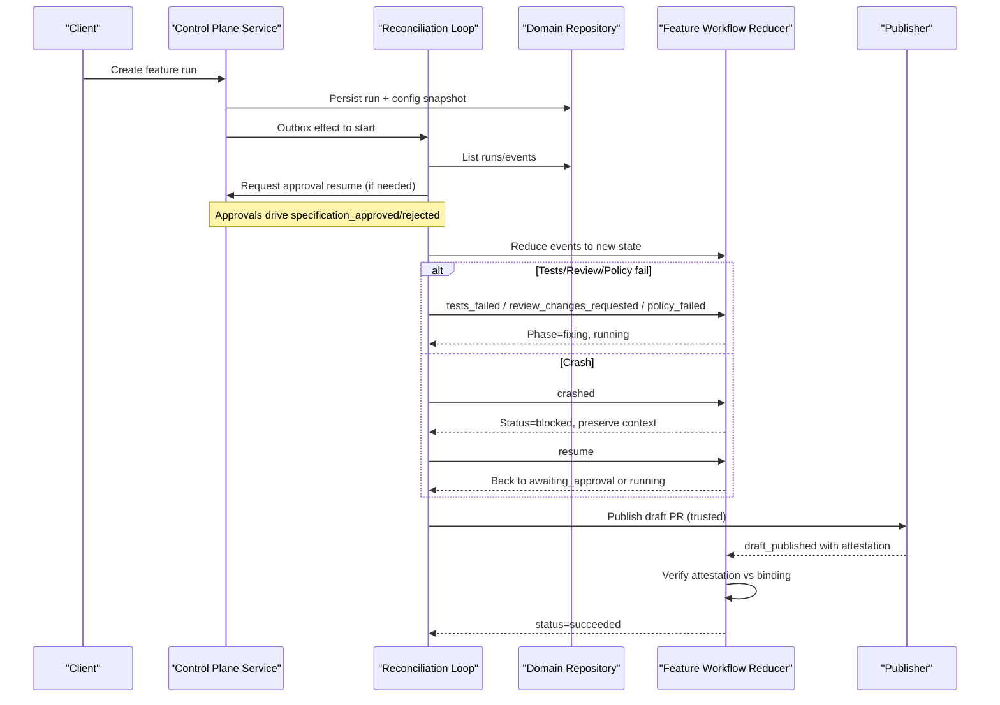
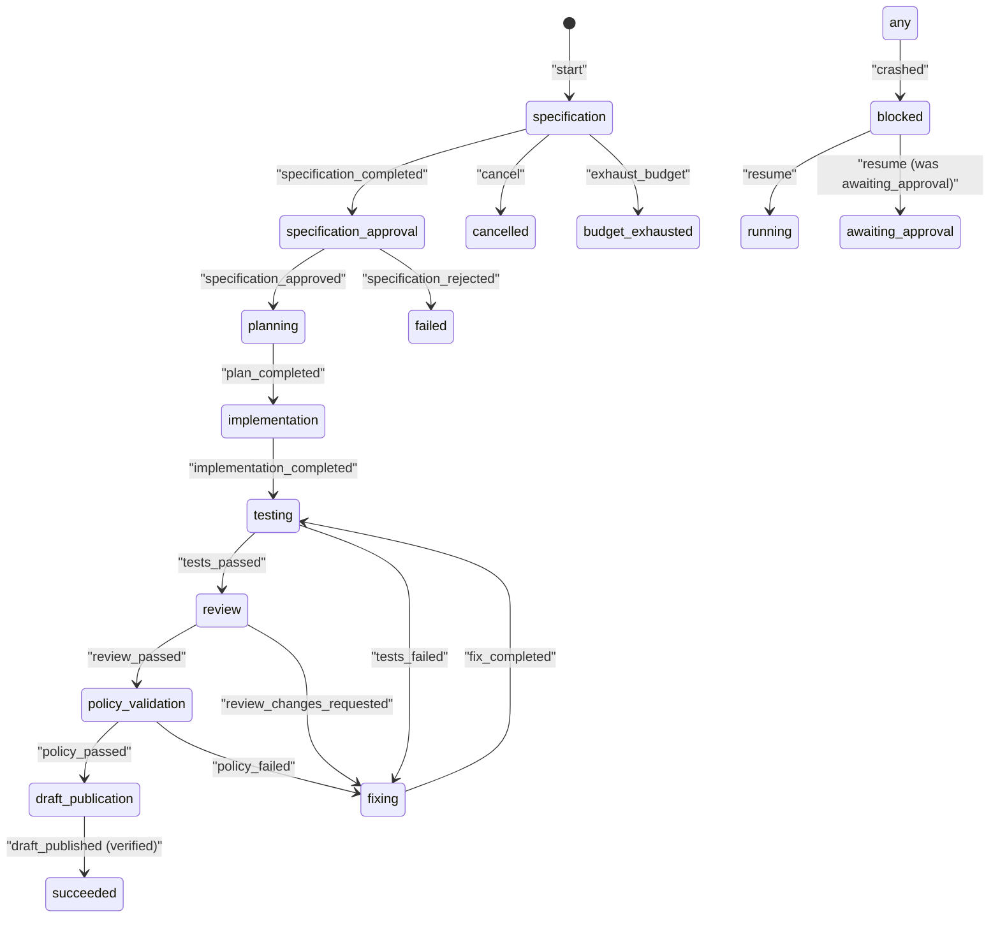
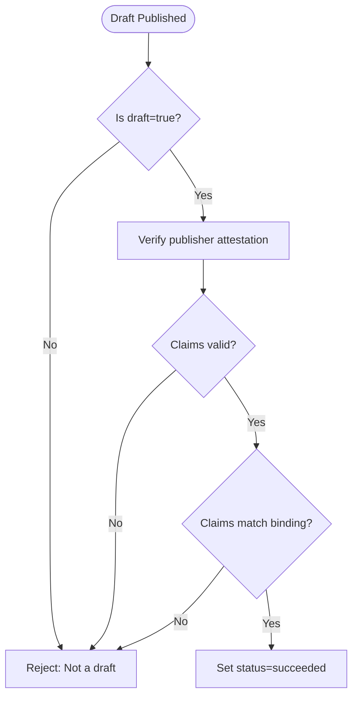
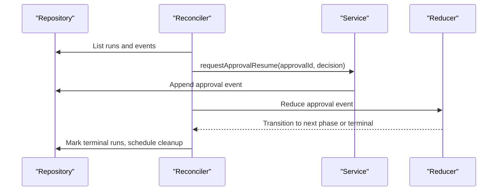
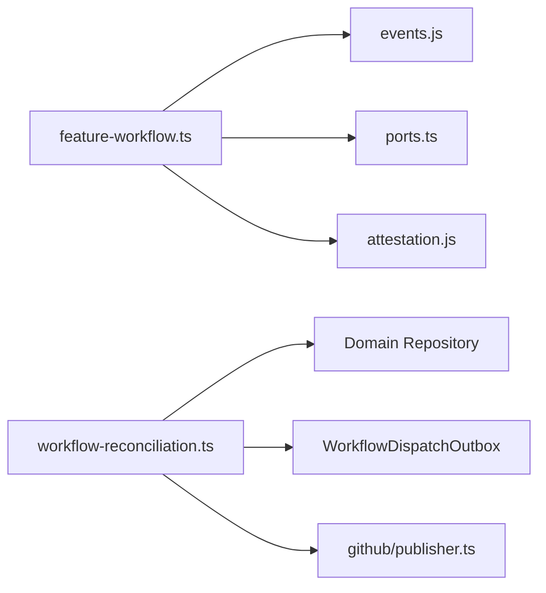

# Feature Workflow

<cite>
**Referenced Files in This Document**
- [feature-workflow.ts](file://packages/core/src/feature-workflow.ts)
- [feature-workflow.test.ts](file://packages/core/src/feature-workflow.test.ts)
- [ports.ts](file://packages/core/src/ports.ts)
- [publication.ts](file://packages/core/src/publication.ts)
- [workflow-reconciliation.ts](file://apps/control-plane/src/application/workflow-reconciliation.ts)
- [workflow-reconciliation-runtime.ts](file://apps/control-plane/src/application/workflow-reconciliation-runtime.ts)
- [control-plane-service.ts](file://apps/control-plane/src/application/control-plane-service.ts)
- [publisher.ts](file://packages/adapters/src/github/publisher.ts)
- [durable-feature-workflow.md](file://docs/architecture/durable-feature-workflow.md)
</cite>

## Table of Contents
1. [Introduction](#introduction)
2. [Project Structure](#project-structure)
3. [Core Components](#core-components)
4. [Architecture Overview](#architecture-overview)
5. [Detailed Component Analysis](#detailed-component-analysis)
6. [Dependency Analysis](#dependency-analysis)
7. [Performance Considerations](#performance-considerations)
8. [Troubleshooting Guide](#troubleshooting-guide)
9. [Conclusion](#conclusion)
10. [Appendices](#appendices)

## Introduction
This document explains the Feature Workflow state machine that turns a durable feature run into a tested draft pull request. It covers all workflow phases, event-driven transitions, status management, retry and recovery mechanisms, publication binding and attestation verification, and practical extension points for custom implementations. The design is idempotent, crash-resilient, and integrates with control-plane reconciliation to ensure durability across failures.

## Project Structure
The Feature Workflow lives in the core package as a pure reducer over immutable state. It is driven by domain events produced by roles (specification, planning, implementation, testing, review, policy validation) and completed by a trusted publisher producing a signed draft publication. The control plane coordinates runs, approvals, timeouts, and cleanup via an outbox pattern and reconciliation loop.

**Diagram sources**
- [feature-workflow.ts:8-26](file://packages/core/src/feature-workflow.ts#L8-L26)
- [ports.ts:164-195](file://packages/core/src/ports.ts#L164-L195)
- [publication.ts:1-33](file://packages/core/src/publication.ts#L1-L33)
- [workflow-reconciliation.ts:156-507](file://apps/control-plane/src/application/workflow-reconciliation.ts#L156-L507)
- [workflow-reconciliation-runtime.ts:6-28](file://apps/control-plane/src/application/workflow-reconciliation-runtime.ts#L6-L28)
- [publisher.ts:307-341](file://packages/adapters/src/github/publisher.ts#L307-L341)

**Section sources**
- [feature-workflow.ts:8-26](file://packages/core/src/feature-workflow.ts#L8-L26)
- [workflow-reconciliation.ts:156-507](file://apps/control-plane/src/application/workflow-reconciliation.ts#L156-L507)

## Core Components
- FeatureWorkflowState: Holds current phase, status, retry counters, processed event IDs/fingerprints, optional publication, failure reason, blocked-from status, and publication binding.
- FeatureWorkflowEvent: Discriminated union of domain events driving transitions (e.g., specification_completed, tests_failed, draft_published).
- reduceFeatureWorkflow: Pure function implementing deterministic transitions, idempotency, retries, blocking/resume, cancellation, budget exhaustion, and final success on verified draft publication.
- replayFeatureWorkflow: Deterministic reconstruction from persisted events.
- Publication binding and attestation verification: Ensures only trusted publishers can complete the workflow and that claims match the workflow’s binding.

Key behaviors:
- Idempotency: Duplicate event IDs are ignored; fingerprints detect payload collisions.
- Retries: Failure paths route through fixing with bounded retries before failing.
- Blocking: Crashes transition to blocked with metadata to resume later.
- Terminal states: succeeded, failed, cancelled, budget_exhausted cannot transition further.

**Section sources**
- [feature-workflow.ts:28-92](file://packages/core/src/feature-workflow.ts#L28-L92)
- [feature-workflow.ts:120-158](file://packages/core/src/feature-workflow.ts#L120-L158)
- [feature-workflow.ts:160-225](file://packages/core/src/feature-workflow.ts#L160-L225)
- [feature-workflow.ts:227-305](file://packages/core/src/feature-workflow.ts#L227-L305)
- [feature-workflow.ts:308-319](file://packages/core/src/feature-workflow.ts#L308-L319)

## Architecture Overview
The workflow is event-sourced and reduced deterministically. Control-plane reconciliation ensures runs start, approvals are resumed, timeouts are enforced, and terminal runs are cleaned up. Publishers produce signed draft publications that must be verified against workflow binding.

**Diagram sources**
- [workflow-reconciliation.ts:156-507](file://apps/control-plane/src/application/workflow-reconciliation.ts#L156-L507)
- [control-plane-service.ts:1766-1811](file://apps/control-plane/src/application/control-plane-service.ts#L1766-L1811)
- [feature-workflow.ts:227-305](file://packages/core/src/feature-workflow.ts#L227-L305)
- [publisher.ts:307-341](file://packages/adapters/src/github/publisher.ts#L307-L341)

## Detailed Component Analysis

### State Machine Phases and Transitions
Phases:
- specification
- specification_approval
- planning
- implementation
- testing
- review
- fixing
- policy_validation
- draft_publication

Statuses:
- running
- awaiting_approval
- blocked
- succeeded
- failed
- cancelled
- budget_exhausted

Transition rules:
- specification_completed moves to specification_approval (awaiting_approval).
- specification_approved moves to planning (running); specification_rejected fails with reason.
- plan_completed moves to implementation; implementation_completed moves to testing.
- tests_passed moves to review; tests_failed routes to fixing with retry increment.
- review_passed moves to policy_validation; review_changes_requested routes to fixing.
- fix_completed returns to testing.
- policy_passed moves to draft_publication; policy_failed routes to fixing.
- draft_published requires draft=true and verified publisher attestation matching binding; then succeeds.
- cancel sets cancelled; exhaust_budget sets budget_exhausted.
- crashed sets blocked with preserved context; resume restores previous status.

**Diagram sources**
- [feature-workflow.ts:8-26](file://packages/core/src/feature-workflow.ts#L8-L26)
- [feature-workflow.ts:160-225](file://packages/core/src/feature-workflow.ts#L160-L225)
- [feature-workflow.ts:227-305](file://packages/core/src/feature-workflow.ts#L227-L305)

**Section sources**
- [feature-workflow.ts:160-305](file://packages/core/src/feature-workflow.ts#L160-L305)

### Event Handling Examples
- Specification flow:
  - specification_completed -> specification_approval (awaiting_approval)
  - specification_approved -> planning (running)
  - specification_rejected -> failed (with reason)
- Testing and review loops:
  - tests_failed -> fixing (retryCount++)
  - fix_completed -> testing
  - review_changes_requested -> fixing (retryCount++)
  - review_passed -> policy_validation
- Policy validation:
  - policy_failed -> fixing (retryCount++)
  - policy_passed -> draft_publication
- Draft publication:
  - draft_published with draft=true and verified attestation -> succeeded
- Lifecycle controls:
  - cancel -> cancelled
  - exhaust_budget -> budget_exhausted
  - crashed -> blocked (preserve blockedFromStatus)
  - resume -> restore previous status

Idempotency and replay:
- Duplicate event IDs are ignored.
- Fingerprint collision detection prevents replay with different payloads.
- Crash/resume preserves first-crash metadata and clears it after resume.

**Section sources**
- [feature-workflow.ts:160-225](file://packages/core/src/feature-workflow.ts#L160-L225)
- [feature-workflow.ts:227-305](file://packages/core/src/feature-workflow.ts#L227-L305)
- [feature-workflow.test.ts:48-88](file://packages/core/src/feature-workflow.test.ts#L48-L88)
- [feature-workflow.test.ts:109-176](file://packages/core/src/feature-workflow.test.ts#L109-L176)
- [feature-workflow.test.ts:178-216](file://packages/core/src/feature-workflow.test.ts#L178-L216)

### Retry Mechanisms and Failure Recovery
- Bounded retries: Each failure increments retryCount; exceeding maxRetries results in failed with retry_limit.
- Crash handling: crashed transitions to blocked, preserving the prior status intent (running or awaiting_approval). Subsequent crashes while blocked are no-ops.
- Resume: Only allowed from blocked; restores phase and status without resetting retryCount.
- Review/test/policy failures route to fixing to allow targeted remediation before re-testing.

**Section sources**
- [feature-workflow.ts:132-146](file://packages/core/src/feature-workflow.ts#L132-L146)
- [feature-workflow.ts:184-225](file://packages/core/src/feature-workflow.ts#L184-L225)
- [feature-workflow.test.ts:109-176](file://packages/core/src/feature-workflow.test.ts#L109-L176)

### Publication Binding and Attestation Verification
- Publication binding: Options include scopeHash, actionHash, baseSha, patchHash to bind the workflow to a specific repository change.
- Draft publication: Must be draft=true; includes a signed attestation from a trusted publisher.
- Verification: The workflow verifies the attestation using a provided verifier and checks that claims match the stored publicationBinding exactly. If mismatched or untrusted, the workflow rejects the publication.

**Diagram sources**
- [feature-workflow.ts:277-305](file://packages/core/src/feature-workflow.ts#L277-L305)
- [ports.ts:164-195](file://packages/core/src/ports.ts#L164-L195)

**Section sources**
- [feature-workflow.ts:277-305](file://packages/core/src/feature-workflow.ts#L277-L305)
- [ports.ts:164-195](file://packages/core/src/ports.ts#L164-L195)
- [feature-workflow.test.ts:256-298](file://packages/core/src/feature-workflow.test.ts#L256-L298)

### Control-Plane Integration and Reconciliation
- Outbox pattern: Control plane persists durable intents (start, resume, cancel, cleanup) and reconciles them reliably.
- Approval resumption: Approval.approved/rejected events trigger resume requests for waiting workflows.
- Timeouts: Active runs past their deadline are marked failed, approvals expired, and cancellations/cleanup dispatched.
- Orphan reconciliation: Feature runs may request orphan reconciliation to recover from partial state.

**Diagram sources**
- [workflow-reconciliation.ts:156-507](file://apps/control-plane/src/application/workflow-reconciliation.ts#L156-L507)
- [control-plane-service.ts:1766-1811](file://apps/control-plane/src/application/control-plane-service.ts#L1766-L1811)

**Section sources**
- [workflow-reconciliation.ts:156-507](file://apps/control-plane/src/application/workflow-reconciliation.ts#L156-L507)
- [workflow-reconciliation-runtime.ts:6-28](file://apps/control-plane/src/application/workflow-reconciliation-runtime.ts#L6-L28)
- [control-plane-service.ts:1766-1811](file://apps/control-plane/src/application/control-plane-service.ts#L1766-L1811)

### Practical Examples and Extension Points
- Custom workflow implementations:
  - Provide your own publisherAttestationVerifier to validate attestations from your trusted publisher.
  - Supply publicationBinding to constrain which repository changes can be published.
  - Use replayFeatureWorkflow to reconstruct state from persisted events for debugging or migration.
- Extension points:
  - Roles emit standardized events; add new roles by emitting appropriate events (e.g., policy_passed/policy_failed).
  - Integrate with control-plane reconciliation to handle approvals, timeouts, and cleanup.
  - Implement custom publishers that produce DraftPublication with signed attestations validated by your verifier.

Examples grounded in tests:
- Happy path through specification to draft publication with verified attestation.
- Rejection flows for specification rejection and invalid/untrusted attestations.
- Crash/resume behavior preserving metadata and enabling clean continuation.

**Section sources**
- [feature-workflow.test.ts:48-88](file://packages/core/src/feature-workflow.test.ts#L48-L88)
- [feature-workflow.test.ts:178-216](file://packages/core/src/feature-workflow.test.ts#L178-L216)
- [feature-workflow.test.ts:256-298](file://packages/core/src/feature-workflow.test.ts#L256-L298)

## Dependency Analysis
- Core reducer depends on:
  - Event deduplication and fingerprinting utilities.
  - Ports for DraftPublication and RepositoryPublisherAttestationClaims.
  - Optional AttestationVerifier for publisher attestation validation.
- Control plane depends on:
  - Domain repository for runs, events, approvals, and configuration snapshots.
  - Outbox interface to dispatch start/resume/cancel/cleanup effects.
  - Trusted publisher adapter to create draft publications with authorization.

**Diagram sources**
- [feature-workflow.ts:1-6](file://packages/core/src/feature-workflow.ts#L1-L6)
- [ports.ts:164-195](file://packages/core/src/ports.ts#L164-L195)
- [workflow-reconciliation.ts:156-507](file://apps/control-plane/src/application/workflow-reconciliation.ts#L156-L507)
- [publisher.ts:307-341](file://packages/adapters/src/github/publisher.ts#L307-L341)

**Section sources**
- [feature-workflow.ts:1-6](file://packages/core/src/feature-workflow.ts#L1-L6)
- [workflow-reconciliation.ts:156-507](file://apps/control-plane/src/application/workflow-reconciliation.ts#L156-L507)

## Performance Considerations
- Idempotent reduction avoids duplicate work and ensures safe retries.
- Bounded processed event windows limit memory growth while retaining recent history for deduplication.
- Crash/resume minimizes recovery overhead by preserving phase and retry count.
- Control-plane reconciliation uses cursors to avoid rescanning entire histories repeatedly.

[No sources needed since this section provides general guidance]

## Troubleshooting Guide
Common issues and resolutions:
- Illegal transitions:
  - Occur when events arrive out of phase or during blocked/terminal states. Ensure events align with expected phase and status.
- Duplicate event IDs:
  - Ignored safely; if payload differs, a fingerprint collision error indicates misuse of idempotency keys.
- Attestation verification failures:
  - Ensure the publisher attestation is issued by a trusted authority and matches the workflow’s publicationBinding fields exactly.
- Blocked workflows:
  - After crashes, send resume events to restore operation; verify blockedFromStatus to determine whether to return to running or awaiting_approval.
- Budget exhaustion:
  - exhaust_budget transitions to budget_exhausted; adjust budgets or optimize usage to continue.

**Section sources**
- [feature-workflow.ts:148-158](file://packages/core/src/feature-workflow.ts#L148-L158)
- [feature-workflow.ts:160-225](file://packages/core/src/feature-workflow.ts#L160-L225)
- [feature-workflow.ts:277-305](file://packages/core/src/feature-workflow.ts#L277-L305)
- [feature-workflow.test.ts:218-254](file://packages/core/src/feature-workflow.test.ts#L218-L254)

## Conclusion
The Feature Workflow provides a robust, event-driven state machine that guides a feature from specification through policy validation to a verified draft publication. Its design emphasizes idempotency, crash resilience, bounded retries, and strict publication security via attestation verification. Integrated with control-plane reconciliation, it ensures durable execution across failures and supports extensibility through well-defined ports and events.

[No sources needed since this section summarizes without analyzing specific files]

## Appendices

### A. Phase-to-Event Mapping Summary
- specification -> specification_completed
- specification_approval -> specification_approved | specification_rejected
- planning -> plan_completed
- implementation -> implementation_completed
- testing -> tests_passed | tests_failed
- review -> review_passed | review_changes_requested
- fixing -> fix_completed
- policy_validation -> policy_passed | policy_failed
- draft_publication -> draft_published (draft=true, verified)
- Any active phase -> cancel | exhaust_budget
- Any active phase -> crashed (transitions to blocked)
- blocked -> resume

**Section sources**
- [feature-workflow.ts:8-26](file://packages/core/src/feature-workflow.ts#L8-L26)
- [feature-workflow.ts:160-225](file://packages/core/src/feature-workflow.ts#L160-L225)
- [feature-workflow.ts:227-305](file://packages/core/src/feature-workflow.ts#L227-L305)

### B. Durable Execution Notes
- Trigger.dev coordinates execution; Postgres remains authoritative for runs, approvals, steps, usage, side-effect claims, and leases.
- Workflows use bounded artifacts, separate environments per role, and trusted verification with signed reports.
- Local experiment projects swap source ingestion and publication edges while keeping the rest byte-identical.

**Section sources**
- [durable-feature-workflow.md:1-58](file://docs/architecture/durable-feature-workflow.md#L1-L58)
- [durable-feature-workflow.md:60-108](file://docs/architecture/durable-feature-workflow.md#L60-L108)