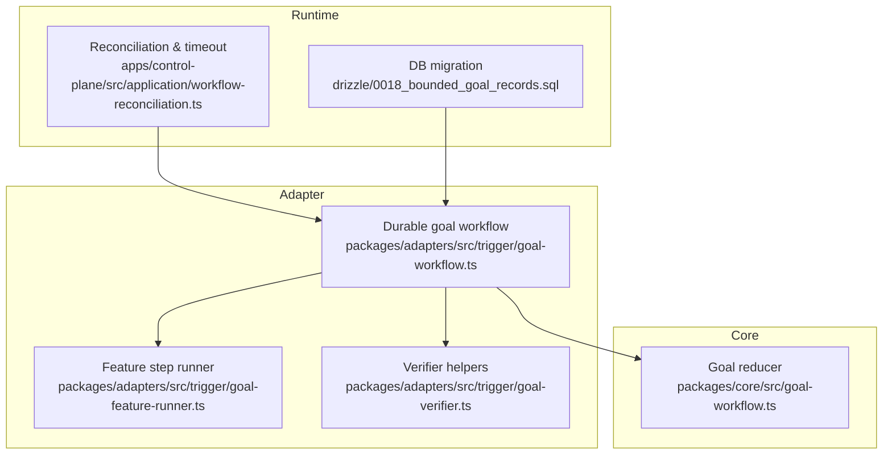
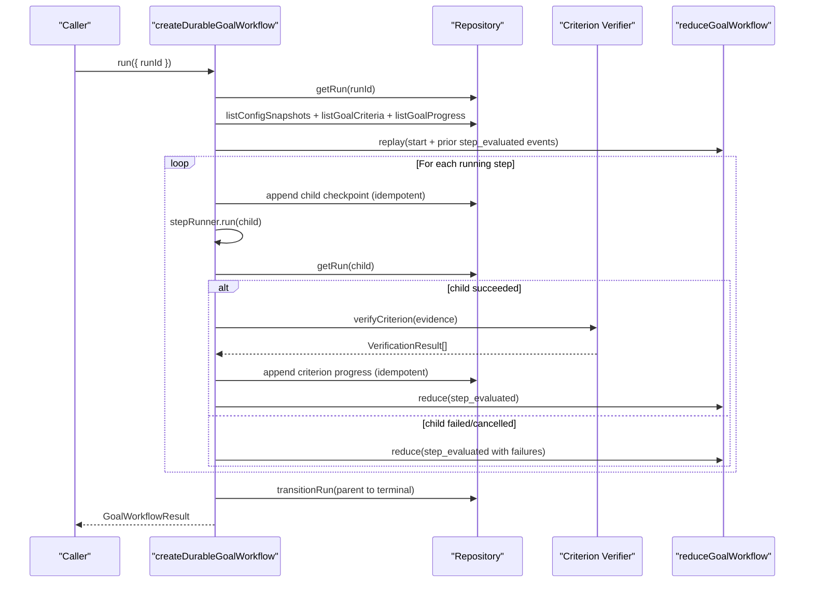
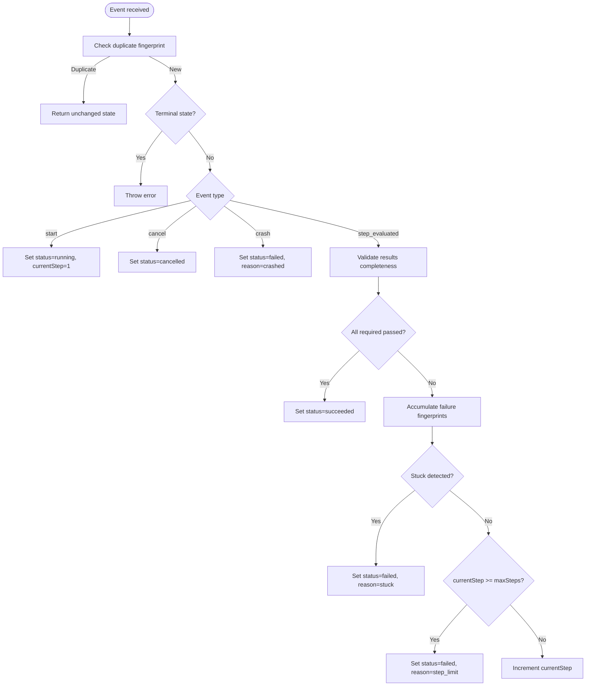
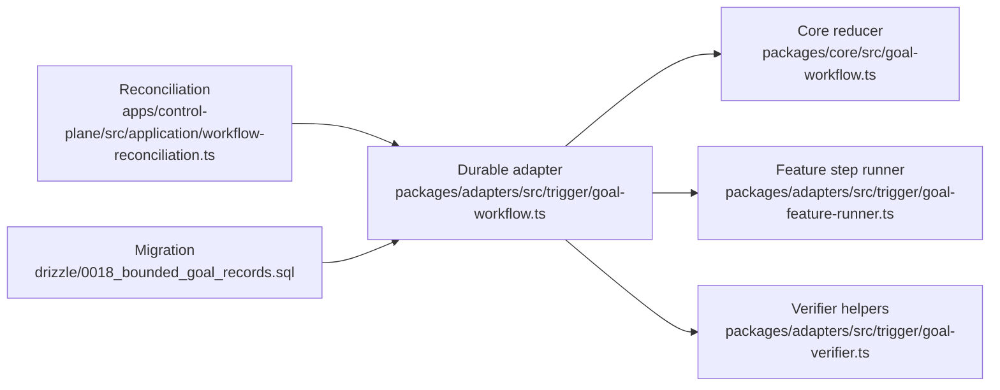

# Goal Workflow

<cite>
**Referenced Files in This Document**
- [goal-workflow.ts](file://packages/core/src/goal-workflow.ts)
- [durable-goal-workflow.md](file://docs/architecture/durable-goal-workflow.md)
- [goal-workflow.ts](file://packages/adapters/src/trigger/goal-workflow.ts)
- [0018_bounded_goal_records.sql](file://drizzle/0018_bounded_goal_records.sql)
- [workflow-reconciliation.ts](file://apps/control-plane/src/application/workflow-reconciliation.ts)
- [goal-feature-runner.ts](file://packages/adapters/src/trigger/goal-feature-runner.ts)
- [goal-verifier.ts](file://packages/adapters/src/trigger/goal-verifier.ts)
</cite>

## Table of Contents
1. Introduction
2. Project Structure
3. Core Components
4. Architecture Overview
5. Detailed Component Analysis
6. Dependency Analysis
7. Performance Considerations
8. Troubleshooting Guide
9. Conclusion

## Introduction
The Goal Workflow engine implements bounded goal achievement by orchestrating up to a fixed number of attempts (steps) through the existing feature workflow. Operators define strict command-based Definition-of-Done criteria, and the system evaluates them only against signed, independently observed evidence. The engine enforces a fail-closed state machine with deterministic event fingerprints, durable progress records, and automatic recovery from transient failures. It never merges or deploys; each attempt can create only a draft pull request via the trusted publication boundary.

## Project Structure
Goal execution spans three layers:
- Core reducer: pure state machine for goal steps, success/failure detection, and stuck detection.
- Durable adapter: validates inputs, persists progress, coordinates child runs, verifies criterion evidence, and finalizes parent runs.
- Reconciliation and runtime: ensures timeouts, prevents orphaned children, and integrates goals into the broader workflow pipeline.

**Diagram sources**
- [goal-workflow.ts:1-242](file://packages/core/src/goal-workflow.ts#L1-L242)
- [goal-workflow.ts:1-827](file://packages/adapters/src/trigger/goal-workflow.ts#L1-L827)
- [workflow-reconciliation.ts:48-72](file://apps/control-plane/src/application/workflow-reconciliation.ts#L48-L72)
- [0018_bounded_goal_records.sql:1-13](file://drizzle/0018_bounded_goal_records.sql#L1-L13)

**Section sources**
- [goal-workflow.ts:1-242](file://packages/core/src/goal-workflow.ts#L1-L242)
- [goal-workflow.ts:1-827](file://packages/adapters/src/trigger/goal-workflow.ts#L1-L827)
- [workflow-reconciliation.ts:48-72](file://apps/control-plane/src/application/workflow-reconciliation.ts#L48-L72)
- [0018_bounded_goal_records.sql:1-13](file://drizzle/0018_bounded_goal_records.sql#L1-L13)

## Core Components
- Goal definition structure: Command criteria with unique IDs, descriptions, required flags, and allowed commands bound to an allowlist. Criteria are validated and frozen at creation.
- Step execution model: Each step produces one result per criterion. Results are verified against signed evidence before being accepted by the reducer.
- Progress tracking: Deterministic IDs for child checkpoints and per-criterion results enable idempotent writes and replay-safe reconstruction.
- Bounded loop pattern: maxSteps is constrained to 1–3; exceeding this limit fails the goal as step_limit. Stuck detection short-circuits repeated identical failures.
- Retry logic and failure handling: Transient child failures are retried by the step runner; persistent failures accumulate fingerprints and trigger stuck detection. Parent cancellation cancels active children.
- Result validation: Final output summarizes statuses, codes, and child summaries while excluding sensitive artifacts.

**Section sources**
- [goal-workflow.ts:15-30](file://packages/core/src/goal-workflow.ts#L15-L30)
- [goal-workflow.ts:43-70](file://packages/core/src/goal-workflow.ts#L43-L70)
- [goal-workflow.ts:163-235](file://packages/core/src/goal-workflow.ts#L163-L235)
- [goal-workflow.ts:32-71](file://packages/adapters/src/trigger/goal-workflow.ts#L32-L71)
- [goal-workflow.ts:105-137](file://packages/adapters/src/trigger/goal-workflow.ts#L105-L137)
- [goal-workflow.ts:243-260](file://packages/adapters/src/trigger/goal-workflow.ts#L243-L260)
- [goal-workflow.ts:414-484](file://packages/adapters/src/trigger/goal-workflow.ts#L414-L484)

## Architecture Overview
The durable goal workflow composes a pure reducer with durable persistence and verification:
- Input validation enforces schema, provenance binding, and configuration snapshot integrity.
- Progress replay reconstructs state from persisted goal criteria and progress records.
- Child runs are deterministically identified per step and coordinated with checkpoint records.
- Evidence verification uses signed attestations to produce VerificationResult entries consumed by the reducer.
- Finalization transitions the parent run to a terminal state with a bounded result payload.

**Diagram sources**
- [goal-workflow.ts:634-827](file://packages/adapters/src/trigger/goal-workflow.ts#L634-L827)
- [goal-workflow.ts:163-235](file://packages/core/src/goal-workflow.ts#L163-L235)

## Detailed Component Analysis

### Goal State Machine (Core Reducer)
The reducer models a bounded, fail-closed state machine:
- Events: start, step_evaluated, cancel, crash.
- Success when all required criteria pass.
- Failure reasons: stuck (repeated identical failures), step_limit (max steps reached), crashed.
- Duplicate events with identical fingerprints are ignored; conflicting replays throw.
- Event processing retains a bounded history of processed event IDs to prevent unbounded growth.

**Diagram sources**
- [goal-workflow.ts:163-235](file://packages/core/src/goal-workflow.ts#L163-L235)

**Section sources**
- [goal-workflow.ts:12-41](file://packages/core/src/goal-workflow.ts#L12-L41)
- [goal-workflow.ts:88-130](file://packages/core/src/goal-workflow.ts#L88-L130)
- [goal-workflow.ts:132-161](file://packages/core/src/goal-workflow.ts#L132-L161)
- [goal-workflow.ts:163-235](file://packages/core/src/goal-workflow.ts#L163-L235)

### Durable Goal Workflow (Adapter)
Responsibilities:
- Parse and validate run input, snapshots, and criteria with strict schemas and provenance checks.
- Replay progress to reconstruct reducer state and identify completed steps and children.
- Create deterministic child run IDs per step and persist child checkpoints idempotently.
- Execute child feature runs, collect evidence, verify criteria, and persist criterion results.
- Transition parent to terminal state with a bounded result payload.

Key behaviors:
- Prior failures are summarized and passed to subsequent steps to guide retries.
- Cancellation propagates to active children.
- Output excludes secrets and large artifacts; only safe summaries are returned.

**Section sources**
- [goal-workflow.ts:32-71](file://packages/adapters/src/trigger/goal-workflow.ts#L32-L71)
- [goal-workflow.ts:168-260](file://packages/adapters/src/trigger/goal-workflow.ts#L168-L260)
- [goal-workflow.ts:305-389](file://packages/adapters/src/trigger/goal-workflow.ts#L305-L389)
- [goal-workflow.ts:414-484](file://packages/adapters/src/trigger/goal-workflow.ts#L414-L484)
- [goal-workflow.ts:581-632](file://packages/adapters/src/trigger/goal-workflow.ts#L581-L632)
- [goal-workflow.ts:634-827](file://packages/adapters/src/trigger/goal-workflow.ts#L634-L827)

### Feature Step Runner
- Runs the child feature workflow with a deterministic child ID bound to the parent step.
- Handles transient errors by releasing claims and surfacing retryable errors to the goal workflow.
- Ensures the child reaches a terminal state before returning results.

**Section sources**
- [goal-feature-runner.ts:401-426](file://packages/adapters/src/trigger/goal-feature-runner.ts#L401-L426)

### Criterion Verifier
- Produces deterministic failure fingerprints for non-passing verifications.
- Issues domain-separated attestations that bind verifier identity, criterion, and evidence.
- Integrates with the registry used by the durable workflow to verify criterion evidence.

**Section sources**
- [goal-verifier.ts:96-143](file://packages/adapters/src/trigger/goal-verifier.ts#L96-L143)

### Integration with Broader Workflow System
- Reconciliation recognizes goal-owned feature children and prevents standalone dispatch.
- Timeouts for goals are derived from configuration and capped by a maximum workflow timeout.
- Migration 0018 hardens legacy goal runs and constrains step ordinals to 1–3.

**Section sources**
- [workflow-reconciliation.ts:48-72](file://apps/control-plane/src/application/workflow-reconciliation.ts#L48-L72)
- [workflow-reconciliation.ts:115-154](file://apps/control-plane/src/application/workflow-reconciliation.ts#L115-L154)
- [0018_bounded_goal_records.sql:1-13](file://drizzle/0018_bounded_goal_records.sql#L1-L13)

## Dependency Analysis

**Diagram sources**
- [goal-workflow.ts:1-242](file://packages/core/src/goal-workflow.ts#L1-L242)
- [goal-workflow.ts:1-827](file://packages/adapters/src/trigger/goal-workflow.ts#L1-L827)
- [goal-feature-runner.ts:401-426](file://packages/adapters/src/trigger/goal-feature-runner.ts#L401-L426)
- [goal-verifier.ts:96-143](file://packages/adapters/src/trigger/goal-verifier.ts#L96-L143)
- [workflow-reconciliation.ts:48-72](file://apps/control-plane/src/application/workflow-reconciliation.ts#L48-L72)
- [0018_bounded_goal_records.sql:1-13](file://drizzle/0018_bounded_goal_records.sql#L1-L13)

**Section sources**
- [goal-workflow.ts:1-242](file://packages/core/src/goal-workflow.ts#L1-L242)
- [goal-workflow.ts:1-827](file://packages/adapters/src/trigger/goal-workflow.ts#L1-L827)
- [workflow-reconciliation.ts:48-72](file://apps/control-plane/src/application/workflow-reconciliation.ts#L48-L72)
- [0018_bounded_goal_records.sql:1-13](file://drizzle/0018_bounded_goal_records.sql#L1-L13)

## Performance Considerations
- Bounded steps: maxSteps is enforced at both configuration and database levels to prevent runaway executions.
- Event deduplication: SHA-256 fingerprints avoid redundant processing; processed event history is capped.
- Idempotent persistence: Deterministic IDs for checkpoints and criterion results ensure safe retries without duplication.
- Minimal output: Final payloads exclude sensitive data and large artifacts to reduce storage and network overhead.
- Timeout enforcement: Goals inherit a configured timeout capped by a global maximum to protect resources.

[No sources needed since this section provides general guidance]

## Troubleshooting Guide
Common issues and resolutions:
- Duplicate event replay with different content: Indicates inconsistent event emission; ensure stable event serialization and IDs.
- Unknown or duplicate criterion results: Verify that each step reports exactly one result per criterion with unique IDs.
- Stuck detection triggered: Review repeated failure fingerprints; adjust implementation or environment to break the loop.
- Step limit reached: Increase confidence in fixes or relax criteria if appropriate; otherwise, investigate root cause across attempts.
- Child run mismatch or missing evidence: Ensure evidence is produced by the correct child run and bound to the goal step.
- Parent cancellation during execution: Active children are cancelled; re-run the goal after addressing the cancellation cause.

**Section sources**
- [goal-workflow.ts:88-130](file://packages/core/src/goal-workflow.ts#L88-L130)
- [goal-workflow.ts:132-161](file://packages/core/src/goal-workflow.ts#L132-L161)
- [goal-workflow.ts:209-235](file://packages/core/src/goal-workflow.ts#L209-L235)
- [goal-workflow.ts:581-632](file://packages/adapters/src/trigger/goal-workflow.ts#L581-L632)
- [goal-workflow.ts:739-779](file://packages/adapters/src/trigger/goal-workflow.ts#L739-L779)

## Conclusion
The Goal Workflow engine provides a robust, bounded mechanism for achieving complex goals through iterative, verifiable attempts. By combining a pure reducer, durable progress, signed evidence verification, and tight integration with the broader workflow system, it ensures safety, reproducibility, and resilience. Operators gain predictable control over effort and outcomes while the system protects against infinite loops, stale states, and unauthorized changes.

[No sources needed since this section summarizes without analyzing specific files]