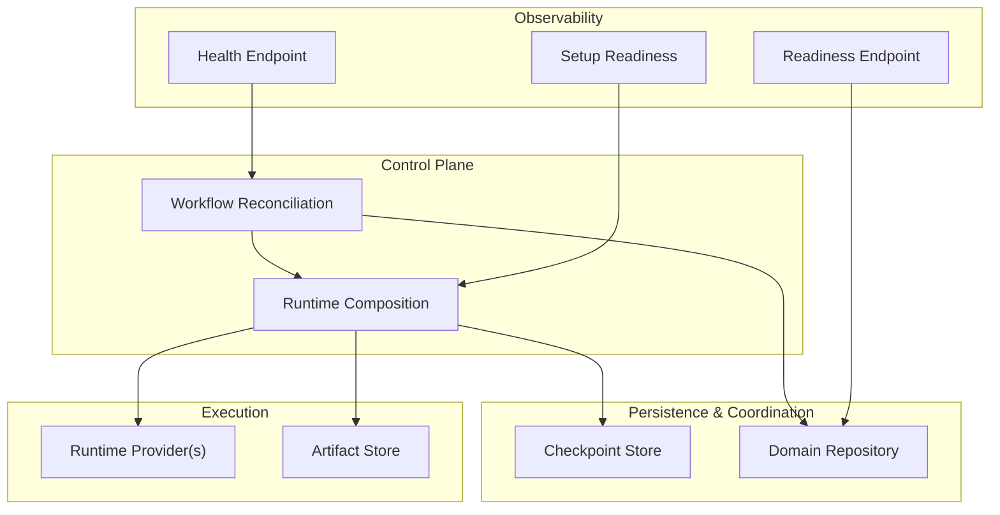
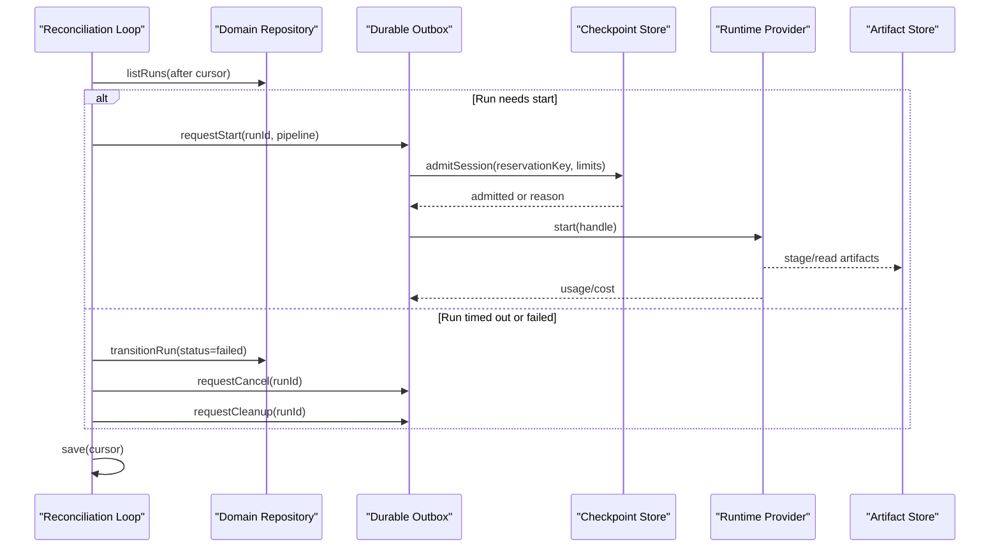
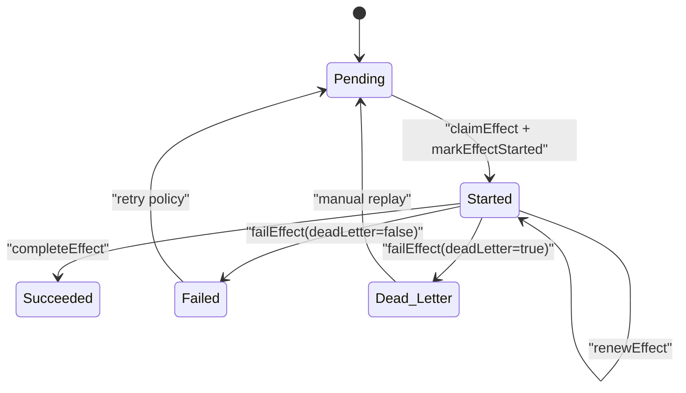
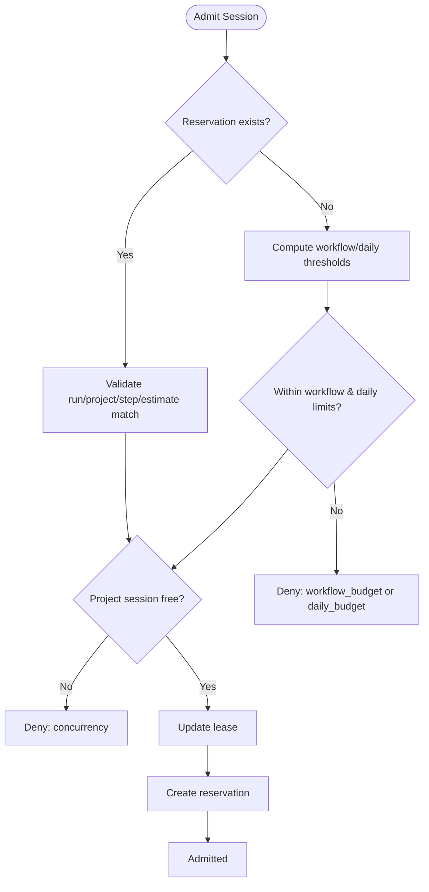
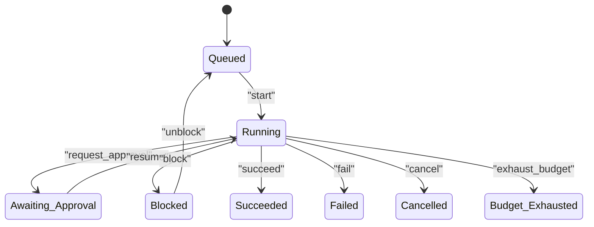
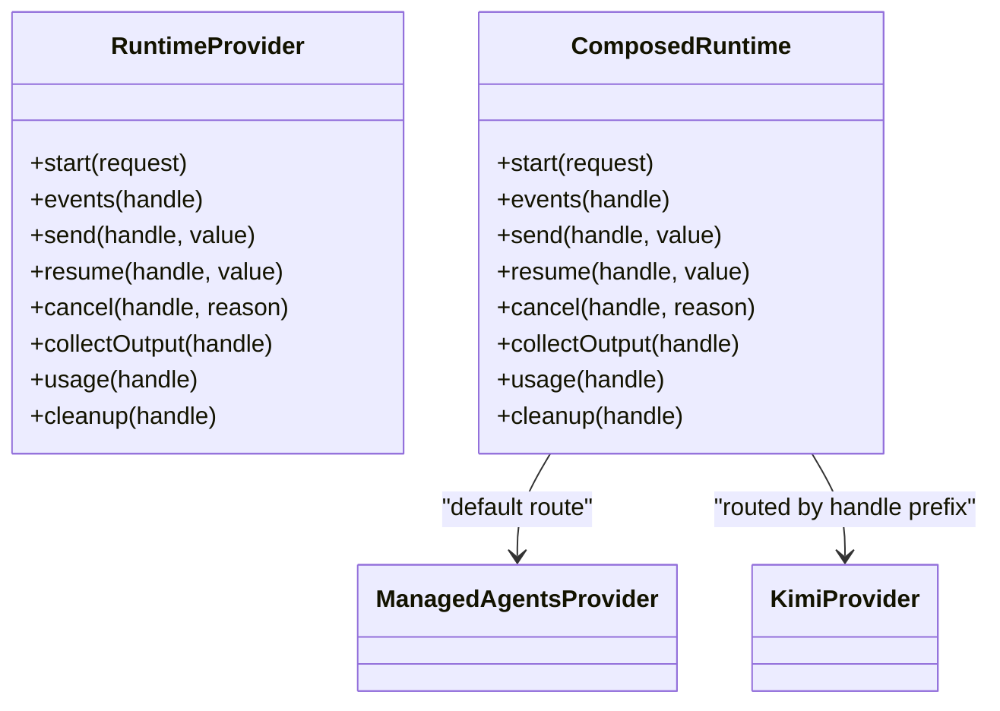
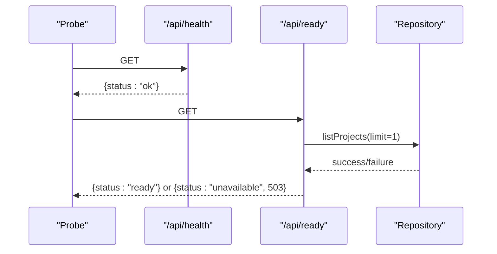
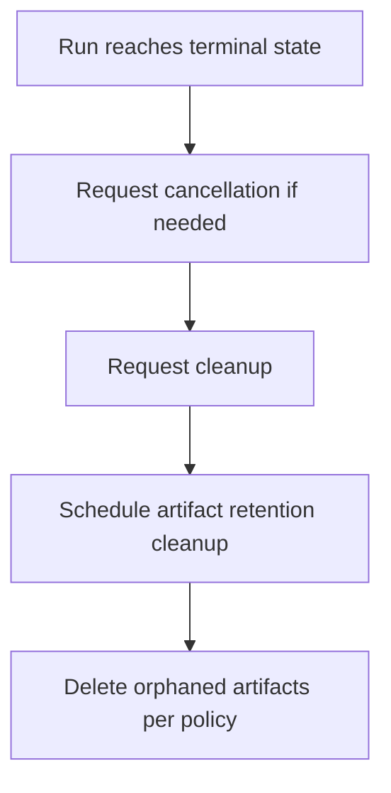
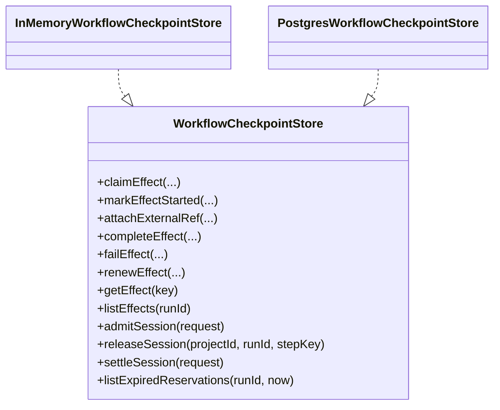
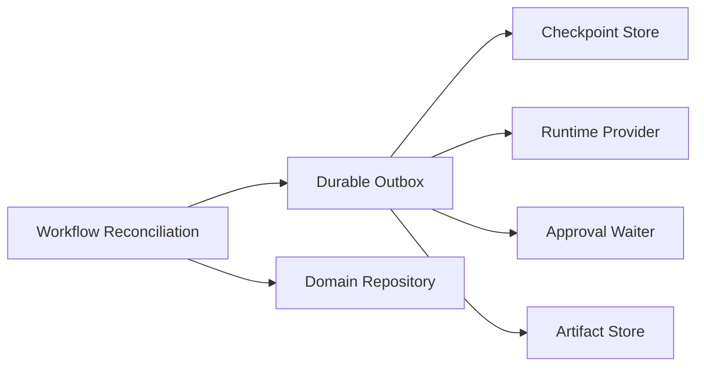

# Lifecycle Management

<cite>
**Referenced Files in This Document**
- [checkpoint-store.ts](file://packages/adapters/src/trigger/checkpoint-store.ts)
- [types.ts](file://packages/adapters/src/trigger/types.ts)
- [runtime.ts](file://apps/control-plane/src/application/runtime.ts)
- [workflow-reconciliation.ts](file://apps/control-plane/src/application/workflow-reconciliation.ts)
- [budget.ts](file://packages/core/src/budget.ts)
- [feature-workflow.ts](file://packages/core/src/feature-workflow.ts)
- [provider.ts](file://packages/adapters/src/managed-agents/provider.ts)
- [errors.ts](file://packages/adapters/src/managed-agents/errors.ts)
- [health/route.ts](file://apps/control-plane/app/api/health/route.ts)
- [ready/route.ts](file://apps/control-plane/app/api/ready/route.ts)
- [setup-readiness.ts](file://apps/control-plane/src/application/setup-readiness.ts)
- [artifact-cleanup-runtime.ts](file://apps/control-plane/src/application/artifact-cleanup-runtime.ts)
</cite>

## Table of Contents
1. Introduction
2. Project Structure
3. Core Components
4. Architecture Overview
5. Detailed Component Analysis
6. Dependency Analysis
7. Performance Considerations
8. Troubleshooting Guide
9. Conclusion

## Introduction
This document explains the lifecycle management system for long-running workflow processes. It covers checkpointing and recovery, resource allocation and cleanup, monitoring (health checks, readiness, setup diagnostics), concurrency controls, scaling considerations, and distributed deployment patterns. The goal is to help operators and developers understand how workflows are started, executed, monitored, recovered from failures, and terminated with proper resource cleanup.

## Project Structure
The lifecycle system spans several layers:
- Control plane orchestration and reconciliation
- Durable checkpoint store for effects and session admission
- Budget and concurrency control
- Runtime providers for agent sessions
- Health and readiness endpoints
- Artifact retention cleanup

**Diagram sources**
- [workflow-reconciliation.ts:156-507](file://apps/control-plane/src/application/workflow-reconciliation.ts#L156-L507)
- [runtime.ts:319-571](file://apps/control-plane/src/application/runtime.ts#L319-L571)
- [checkpoint-store.ts:182-355](file://packages/adapters/src/trigger/checkpoint-store.ts#L182-L355)
- [health/route.ts:1-6](file://apps/control-plane/app/api/health/route.ts#L1-L6)
- [ready/route.ts:1-13](file://apps/control-plane/app/api/ready/route.ts#L1-L13)
- [setup-readiness.ts:82-125](file://apps/control-plane/src/application/setup-readiness.ts#L82-L125)

**Section sources**
- [workflow-reconciliation.ts:156-507](file://apps/control-plane/src/application/workflow-reconciliation.ts#L156-L507)
- [runtime.ts:319-571](file://apps/control-plane/src/application/runtime.ts#L319-L571)
- [checkpoint-store.ts:182-355](file://packages/adapters/src/trigger/checkpoint-store.ts#L182-L355)
- [health/route.ts:1-6](file://apps/control-plane/app/api/health/route.ts#L1-L6)
- [ready/route.ts:1-13](file://apps/control-plane/app/api/ready/route.ts#L1-L13)
- [setup-readiness.ts:82-125](file://apps/control-plane/src/application/setup-readiness.ts#L82-L125)

## Core Components
- Workflow reconciliation loop: scans runs, enforces timeouts, starts or cancels workflows, handles approvals, and triggers cleanup.
- Checkpoint store: durable effect state machine with fencing leases and session admission/concurrency control.
- Budget and concurrency: per-workflow and daily budgets, concurrency limits, and reservation accounting.
- Runtime provider composition: routes between managed agents and optional kimi runtime; supports cancellation and cleanup.
- Monitoring: health and readiness endpoints plus setup readiness diagnostics.
- Cleanup: artifact retention cleanup job.

**Section sources**
- [workflow-reconciliation.ts:156-507](file://apps/control-plane/src/application/workflow-reconciliation.ts#L156-L507)
- [checkpoint-store.ts:182-355](file://packages/adapters/src/trigger/checkpoint-store.ts#L182-L355)
- [budget.ts:278-331](file://packages/core/src/budget.ts#L278-L331)
- [runtime.ts:319-571](file://apps/control-plane/src/application/runtime.ts#L319-L571)
- [health/route.ts:1-6](file://apps/control-plane/app/api/health/route.ts#L1-L6)
- [ready/route.ts:1-13](file://apps/control-plane/app/api/ready/route.ts#L1-L13)
- [artifact-cleanup-runtime.ts:62-77](file://apps/control-plane/src/application/artifact-cleanup-runtime.ts#L62-L77)

## Architecture Overview
The system coordinates long-running workflows through a durable reconciliation loop that persists progress and uses checkpoints to recover from interruptions. Workflows are admitted into execution based on budget and concurrency policies. Runtime providers execute agent sessions, while artifacts are stored externally. Observability endpoints expose health and readiness, and setup diagnostics validate configuration.

**Diagram sources**
- [workflow-reconciliation.ts:156-507](file://apps/control-plane/src/application/workflow-reconciliation.ts#L156-L507)
- [runtime.ts:546-571](file://apps/control-plane/src/application/runtime.ts#L546-L571)
- [checkpoint-store.ts:182-355](file://packages/adapters/src/trigger/checkpoint-store.ts#L182-L355)

## Detailed Component Analysis

### Checkpointing and Recovery
- Effects are modeled as idempotent units with a strict state machine: pending → started → succeeded/failed/dead_letter.
- Fencing leases prevent concurrent re-execution by the same owner and allow safe renewal.
- External references can be attached when an effect spawns a long-running external process.
- Session admission enforces per-project concurrency and budget thresholds before starting work.

**Diagram sources**
- [checkpoint-store.ts:38-168](file://packages/adapters/src/trigger/checkpoint-store.ts#L38-L168)
- [types.ts:234-263](file://packages/adapters/src/trigger/types.ts#L234-L263)

**Section sources**
- [checkpoint-store.ts:38-168](file://packages/adapters/src/trigger/checkpoint-store.ts#L38-L168)
- [types.ts:234-263](file://packages/adapters/src/trigger/types.ts#L234-L263)

### Resource Allocation and Concurrency Controls
- Admission decisions consider workflow and daily budgets, deployment-level caps, and concurrency limits.
- Reservations are created atomically and settled upon completion; expired reservations are cleaned up.
- Per-project session locks ensure only one active step per project at a time, preventing overlapping paid sessions.

**Diagram sources**
- [checkpoint-store.ts:182-355](file://packages/adapters/src/trigger/checkpoint-store.ts#L182-L355)
- [budget.ts:278-331](file://packages/core/src/budget.ts#L278-L331)

**Section sources**
- [checkpoint-store.ts:182-355](file://packages/adapters/src/trigger/checkpoint-store.ts#L182-L355)
- [budget.ts:278-331](file://packages/core/src/budget.ts#L278-L331)

### Workflow Lifecycle Transitions
- Feature and goal workflows follow explicit transitions, including blocking for approvals, retries on crashes, and budget exhaustion handling.
- Goal workflows coordinate child runs deterministically and cancel them on parent failure or timeout.

**Diagram sources**
- [feature-workflow.ts:172-212](file://packages/core/src/feature-workflow.ts#L172-L212)
- [lifecycle.ts:35-84](file://packages/core/src/lifecycle.ts#L35-L84)

**Section sources**
- [feature-workflow.ts:172-212](file://packages/core/src/feature-workflow.ts#L172-L212)
- [lifecycle.ts:35-84](file://packages/core/src/lifecycle.ts#L35-L84)

### Runtime Composition and Cancellation
- The control plane composes runtime providers (managed agents and optional kimi) and ensures handle routing and cancellation semantics.
- Handle sealing/unsealing ties runtime handles to runs securely.
- Source snapshot ingestion validates repository bindings and digests for provenance.

**Diagram sources**
- [runtime.ts:301-385](file://apps/control-plane/src/application/runtime.ts#L301-L385)
- [provider.ts:1183-1439](file://packages/adapters/src/managed-agents/provider.ts#L1183-L1439)

**Section sources**
- [runtime.ts:301-385](file://apps/control-plane/src/application/runtime.ts#L301-L385)
- [provider.ts:1183-1439](file://packages/adapters/src/managed-agents/provider.ts#L1183-L1439)

### Monitoring: Health Checks, Metrics, and Alerting
- Health endpoint returns a simple status for liveness probes.
- Readiness endpoint performs a minimal database query to confirm operational readiness.
- Setup readiness endpoint validates environment configuration for database, dispatch, model access, and other subsystems without exposing secrets.

**Diagram sources**
- [health/route.ts:1-6](file://apps/control-plane/app/api/health/route.ts#L1-L6)
- [ready/route.ts:1-13](file://apps/control-plane/app/api/ready/route.ts#L1-L13)
- [setup-readiness.ts:82-125](file://apps/control-plane/src/application/setup-readiness.ts#L82-L125)

**Section sources**
- [health/route.ts:1-6](file://apps/control-plane/app/api/health/route.ts#L1-L6)
- [ready/route.ts:1-13](file://apps/control-plane/app/api/ready/route.ts#L1-L13)
- [setup-readiness.ts:82-125](file://apps/control-plane/src/application/setup-readiness.ts#L82-L125)

### Resource Cleanup Procedures
- On workflow failure or cancellation, the reconciliation loop requests cancellation and cleanup via the durable outbox.
- Artifact retention cleanup runs periodically using admin credentials to remove stale artifacts according to a retention policy.

**Diagram sources**
- [workflow-reconciliation.ts:266-303](file://apps/control-plane/src/application/workflow-reconciliation.ts#L266-L303)
- [artifact-cleanup-runtime.ts:62-77](file://apps/control-plane/src/application/artifact-cleanup-runtime.ts#L62-L77)

**Section sources**
- [workflow-reconciliation.ts:266-303](file://apps/control-plane/src/application/workflow-reconciliation.ts#L266-L303)
- [artifact-cleanup-runtime.ts:62-77](file://apps/control-plane/src/application/artifact-cleanup-runtime.ts#L62-L77)

### Custom Lifecycle Hooks and Extensibility
- The checkpoint store interface defines hooks for claiming, marking started/completed, attaching external references, failing, renewing, and listing effects.
- Implementers can provide alternative stores (e.g., Postgres-backed) to persist these states durably across restarts.
- The runtime provider abstraction allows swapping or extending execution backends while preserving lifecycle semantics.

**Diagram sources**
- [types.ts:304-362](file://packages/adapters/src/trigger/types.ts#L304-L362)
- [checkpoint-store.ts:21-384](file://packages/adapters/src/trigger/checkpoint-store.ts#L21-L384)

**Section sources**
- [types.ts:304-362](file://packages/adapters/src/trigger/types.ts#L304-L362)
- [checkpoint-store.ts:21-384](file://packages/adapters/src/trigger/checkpoint-store.ts#L21-L384)

## Dependency Analysis
- The reconciliation loop depends on the domain repository and durable outbox to drive workflow state changes.
- The outbox composes checkpoint stores, runtime providers, approval waiters, and artifact stores.
- Budget logic is enforced both in-memory (ledger) and persisted via checkpoint store admissions.
- Runtime providers encapsulate external dependencies (managed agents, kimi) behind a stable interface.

**Diagram sources**
- [runtime.ts:546-571](file://apps/control-plane/src/application/runtime.ts#L546-L571)
- [workflow-reconciliation.ts:156-507](file://apps/control-plane/src/application/workflow-reconciliation.ts#L156-L507)

**Section sources**
- [runtime.ts:546-571](file://apps/control-plane/src/application/runtime.ts#L546-L571)
- [workflow-reconciliation.ts:156-507](file://apps/control-plane/src/application/workflow-reconciliation.ts#L156-L507)

## Performance Considerations
- Cursor-based scanning prevents rescanning old runs repeatedly and ensures fairness even with large histories.
- Batch sizes and page limits balance throughput against memory and latency constraints.
- Budget reservations reduce overcommitment risk by reserving capacity before execution.
- Concurrency limits protect shared resources and prevent runaway parallelism.

[No sources needed since this section provides general guidance]

## Troubleshooting Guide
- If workflows stall or fail unexpectedly, inspect effect states and leases in the checkpoint store to identify fencing conflicts or expired leases.
- Use readiness and health endpoints to verify service liveness and database connectivity.
- Review setup readiness to detect misconfigured environment variables for database, dispatch, model access, and storage.
- For runtime provider errors, consult provider-specific error types and codes to distinguish transient vs. fatal issues.

**Section sources**
- [checkpoint-store.ts:14-19](file://packages/adapters/src/trigger/checkpoint-store.ts#L14-L19)
- [health/route.ts:1-6](file://apps/control-plane/app/api/health/route.ts#L1-L6)
- [ready/route.ts:1-13](file://apps/control-plane/app/api/ready/route.ts#L1-L13)
- [setup-readiness.ts:82-125](file://apps/control-plane/src/application/setup-readiness.ts#L82-L125)
- [errors.ts:1-51](file://packages/adapters/src/managed-agents/errors.ts#L1-L51)

## Conclusion
The lifecycle management system combines durable checkpointing, strict budget and concurrency controls, robust runtime composition, and clear observability to support reliable, scalable, and recoverable long-running workflows. Operators can extend behavior through the checkpoint store and runtime provider interfaces while relying on built-in mechanisms for recovery, fairness, and cleanup.

[No sources needed since this section summarizes without analyzing specific files]