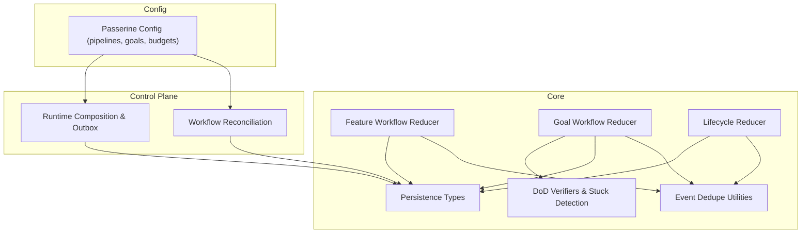
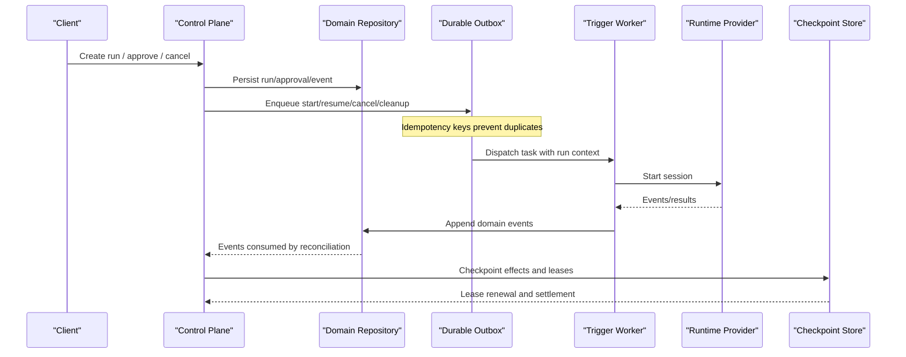
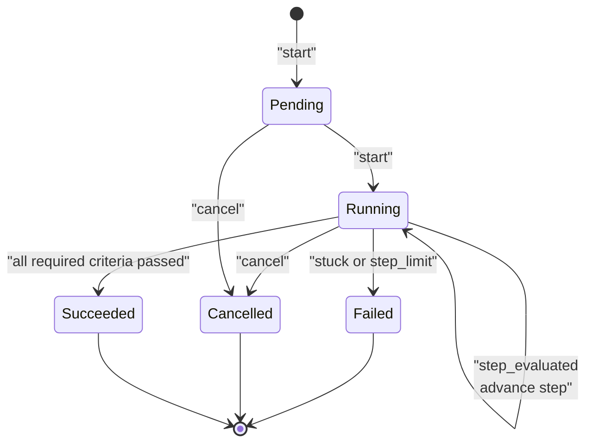
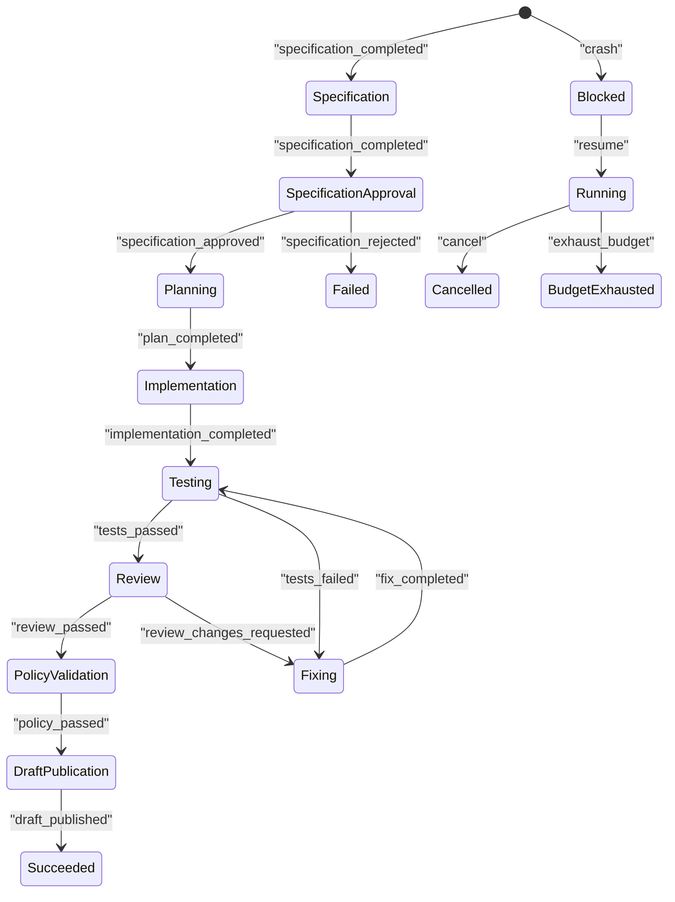
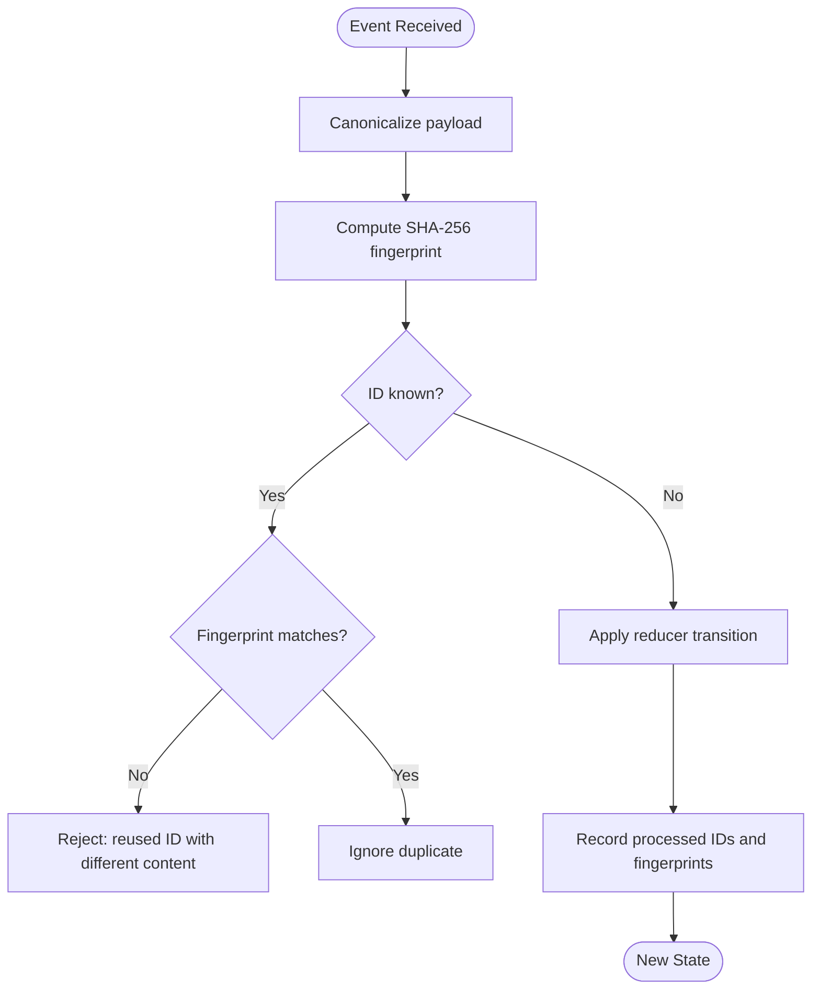
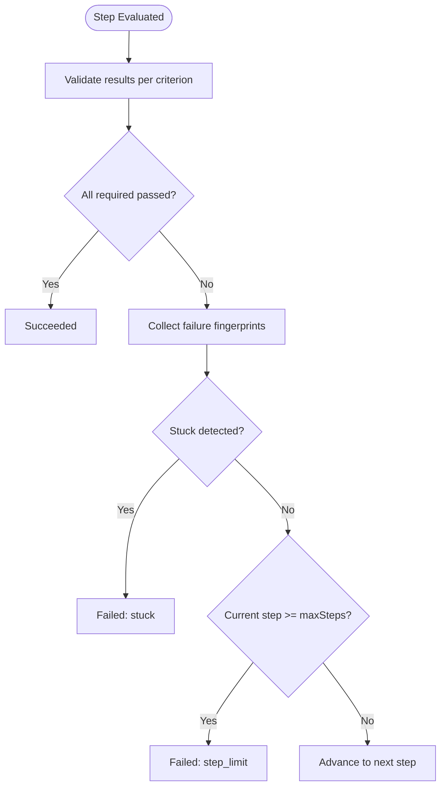
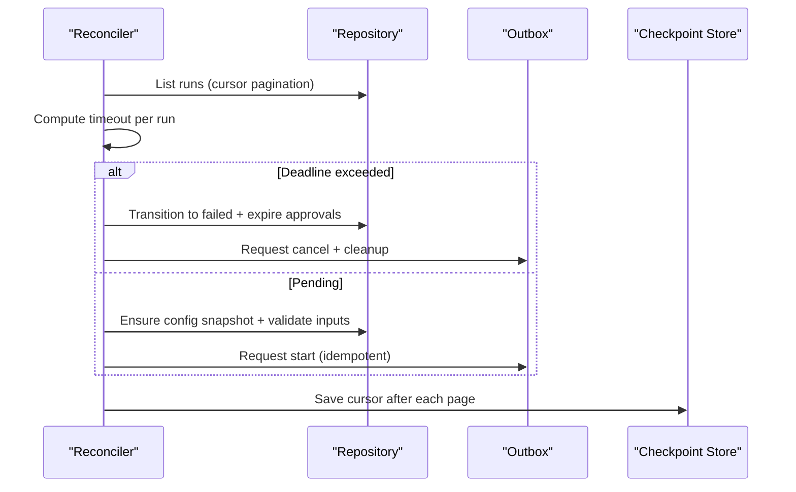
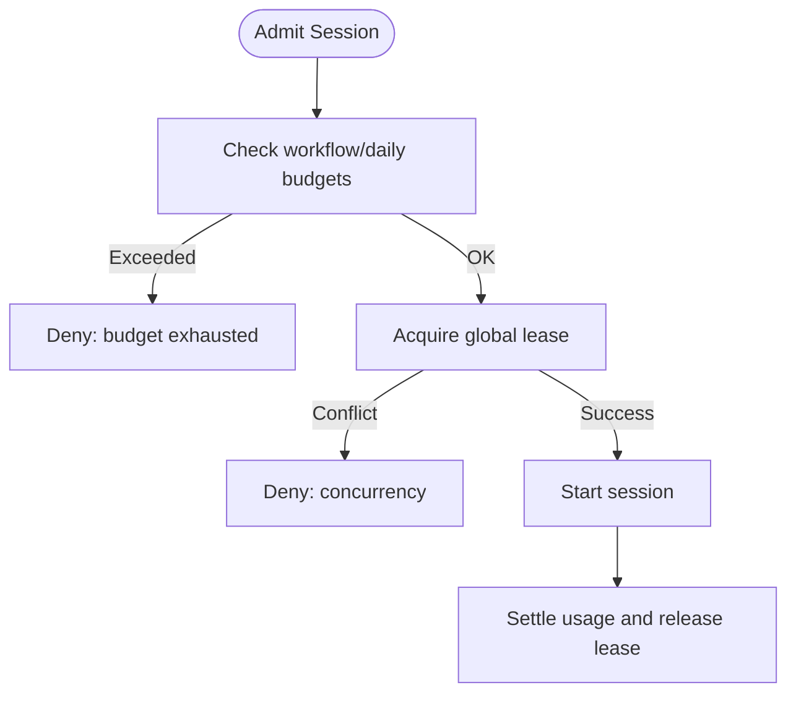
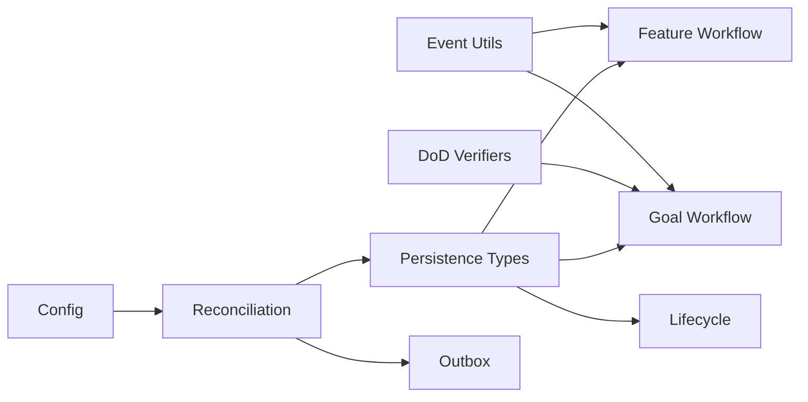

# Workflow Engine

<cite>
**Referenced Files in This Document**
- [goal-workflow.ts](file://packages/core/src/goal-workflow.ts)
- [feature-workflow.ts](file://packages/core/src/feature-workflow.ts)
- [events.ts](file://packages/core/src/events.ts)
- [lifecycle.ts](file://packages/core/src/lifecycle.ts)
- [persistence.ts](file://packages/core/src/persistence.ts)
- [dod.ts](file://packages/core/src/dod.ts)
- [workflow-reconciliation.ts](file://apps/control-plane/src/application/workflow-reconciliation.ts)
- [runtime.ts](file://apps/control-plane/src/application/runtime.ts)
- [passerine.yaml](file://agentos/passerine.yaml)
- [durable-goal-workflow.md](file://docs/architecture/durable-goal-workflow.md)
- [durable-feature-workflow.md](file://docs/architecture/durable-feature-workflow.md)
- [0014_orphan_session_fence.sql](file://drizzle/0014_orphan_session_fence.sql)
</cite>

## Table of Contents
1. [Introduction](#introduction)
2. [Project Structure](#project-structure)
3. [Core Components](#core-components)
4. [Architecture Overview](#architecture-overview)
5. [Detailed Component Analysis](#detailed-component-analysis)
6. [Dependency Analysis](#dependency-analysis)
7. [Performance Considerations](#performance-considerations)
8. [Troubleshooting Guide](#troubleshooting-guide)
9. [Conclusion](#conclusion)
10. [Appendices](#appendices)

## Introduction
This document explains the Agent OS Passerine workflow engine with a focus on:
- The goal workflow state machine, including states, transitions, and event processing
- Bounded steps, retry logic, and failure handling for durable goals
- Event sourcing patterns used to drive state changes
- Custom workflow implementations and extension points
- Lifecycle management of long-running processes, checkpointing, and recovery
- Concurrency controls, resource management, and monitoring capabilities

The system implements two primary workflows:
- Feature workflow: orchestrates specification, planning, implementation, review, verification, and draft publication
- Goal workflow: wraps bounded attempts through the feature workflow against signed Definition-of-Done criteria

## Project Structure
At a high level:
- Core reducers define pure state machines for lifecycle, feature workflow, and goal workflow
- Event utilities provide deterministic deduplication via canonicalization and SHA-256 fingerprints
- Persistence types define domain entities, events, artifacts, usage, and goal-related records
- Control plane composes runtime providers, outbox dispatch, reconciliation, and recovery
- Configuration defines pipelines, agents, environments, budgets, and goal limits

**Diagram sources**
- [feature-workflow.ts:1-320](file://packages/core/src/feature-workflow.ts#L1-L320)
- [goal-workflow.ts:1-243](file://packages/core/src/goal-workflow.ts#L1-L243)
- [lifecycle.ts:1-218](file://packages/core/src/lifecycle.ts#L1-L218)
- [events.ts:1-86](file://packages/core/src/events.ts#L1-L86)
- [persistence.ts:1-640](file://packages/core/src/persistence.ts#L1-L640)
- [dod.ts:1-243](file://packages/core/src/dod.ts#L1-L243)
- [workflow-reconciliation.ts:1-507](file://apps/control-plane/src/application/workflow-reconciliation.ts#L1-L507)
- [runtime.ts:1-633](file://apps/control-plane/src/application/runtime.ts#L1-L633)
- [passerine.yaml:205-248](file://agentos/passerine.yaml#L205-L248)

**Section sources**
- [feature-workflow.ts:1-320](file://packages/core/src/feature-workflow.ts#L1-L320)
- [goal-workflow.ts:1-243](file://packages/core/src/goal-workflow.ts#L1-L243)
- [lifecycle.ts:1-218](file://packages/core/src/lifecycle.ts#L1-L218)
- [events.ts:1-86](file://packages/core/src/events.ts#L1-L86)
- [persistence.ts:1-640](file://packages/core/src/persistence.ts#L1-L640)
- [dod.ts:1-243](file://packages/core/src/dod.ts#L1-L243)
- [workflow-reconciliation.ts:1-507](file://apps/control-plane/src/application/workflow-reconciliation.ts#L1-L507)
- [runtime.ts:1-633](file://apps/control-plane/src/application/runtime.ts#L1-L633)
- [passerine.yaml:205-248](file://agentos/passerine.yaml#L205-L248)

## Core Components
- Feature workflow reducer: phase/state machine with approval gating, retries, policy validation, and draft publication
- Goal workflow reducer: bounded step loop over Definition-of-Done criteria with stuck detection and step limit enforcement
- Lifecycle reducer: generic run/step lifecycle with approvals, blocking, and budget exhaustion
- Event utilities: canonicalization, fingerprinting, and dedup window to ensure idempotent replay
- Persistence types: domain models for runs, steps, sessions, approvals, artifacts, usage, and goal criteria/progress
- DoD subsystem: verifiers, evidence submission, attestation verification, and stuck detection
- Control plane: reconciliation loop, outbox-based dispatch, cancellation/cleanup, and runtime composition

Key responsibilities:
- State transitions are pure functions driven by domain events
- Events are deduplicated deterministically to support safe retries and replay
- Long-running processes are reconciled from persisted state and checkpoints
- Goals wrap feature runs with strict bounds and verified outcomes

**Section sources**
- [feature-workflow.ts:1-320](file://packages/core/src/feature-workflow.ts#L1-L320)
- [goal-workflow.ts:1-243](file://packages/core/src/goal-workflow.ts#L1-L243)
- [lifecycle.ts:1-218](file://packages/core/src/lifecycle.ts#L1-L218)
- [events.ts:1-86](file://packages/core/src/events.ts#L1-L86)
- [persistence.ts:1-640](file://packages/core/src/persistence.ts#L1-L640)
- [dod.ts:1-243](file://packages/core/src/dod.ts#L1-L243)

## Architecture Overview
The engine combines durable event-sourced state machines with an outbox-driven execution model:
- Domain state is advanced by applying events through reducers
- The control plane persists intents (start, resume, cancel, cleanup) and reconciles them
- Runtime providers execute agent sessions; results produce domain events that advance state
- Goals orchestrate bounded attempts of the feature pipeline against signed DoD evidence

**Diagram sources**
- [workflow-reconciliation.ts:156-507](file://apps/control-plane/src/application/workflow-reconciliation.ts#L156-L507)
- [runtime.ts:387-571](file://apps/control-plane/src/application/runtime.ts#L387-L571)
- [persistence.ts:456-640](file://packages/core/src/persistence.ts#L456-L640)

**Section sources**
- [workflow-reconciliation.ts:156-507](file://apps/control-plane/src/application/workflow-reconciliation.ts#L156-L507)
- [runtime.ts:387-571](file://apps/control-plane/src/application/runtime.ts#L387-L571)
- [persistence.ts:456-640](file://packages/core/src/persistence.ts#L456-L640)

## Detailed Component Analysis

### Goal Workflow State Machine
States: pending, running, succeeded, failed, cancelled
Transitions:
- start: pending → running at step 1
- step_evaluated: running → running (advance step), succeeded (all required criteria pass), or failed (stuck or step_limit)
- cancel: any non-terminal → cancelled
- crash: running → failed with reason 'crashed'

Event processing:
- Deterministic event fingerprinting prevents duplicate or mutated replays
- Each step must report exactly one result per criterion
- Stuck detection uses repeated failure fingerprints across attempts
- Step limit enforced by maxSteps (1–3)

**Diagram sources**
- [goal-workflow.ts:12-41](file://packages/core/src/goal-workflow.ts#L12-L41)
- [goal-workflow.ts:163-235](file://packages/core/src/goal-workflow.ts#L163-L235)

**Section sources**
- [goal-workflow.ts:12-41](file://packages/core/src/goal-workflow.ts#L12-L41)
- [goal-workflow.ts:88-130](file://packages/core/src/goal-workflow.ts#L88-L130)
- [goal-workflow.ts:163-235](file://packages/core/src/goal-workflow.ts#L163-L235)
- [durable-goal-workflow.md:10-26](file://docs/architecture/durable-goal-workflow.md#L10-L26)

### Feature Workflow State Machine
Phases: specification, specification_approval, planning, implementation, testing, review, fixing, policy_validation, draft_publication
Statuses: running, awaiting_approval, blocked, succeeded, failed, cancelled, budget_exhausted
Key behaviors:
- Approval gating between specification and planning
- Retry loops for tests_failed, review_changes_requested, policy_failed up to maxRetries
- Blocked status on crashes with resume capability
- Draft publication requires trusted publisher attestation bound to workflow scope

**Diagram sources**
- [feature-workflow.ts:8-26](file://packages/core/src/feature-workflow.ts#L8-L26)
- [feature-workflow.ts:160-306](file://packages/core/src/feature-workflow.ts#L160-L306)

**Section sources**
- [feature-workflow.ts:8-26](file://packages/core/src/feature-workflow.ts#L8-L26)
- [feature-workflow.ts:160-306](file://packages/core/src/feature-workflow.ts#L160-L306)

### Event Sourcing Pattern
- All reducers consume immutable events and return new state
- Event IDs must be unique; payloads are canonicalized before hashing
- Dedup window retains processed IDs and fingerprints to reject duplicates and detect content mutations
- Domain events are appended to persistence with sequence numbers for ordering

**Diagram sources**
- [events.ts:18-86](file://packages/core/src/events.ts#L18-L86)
- [goal-workflow.ts:88-130](file://packages/core/src/goal-workflow.ts#L88-L130)
- [feature-workflow.ts:120-130](file://packages/core/src/feature-workflow.ts#L120-L130)

**Section sources**
- [events.ts:1-86](file://packages/core/src/events.ts#L1-L86)
- [goal-workflow.ts:88-130](file://packages/core/src/goal-workflow.ts#L88-L130)
- [feature-workflow.ts:120-130](file://packages/core/src/feature-workflow.ts#L120-L130)

### Goal Workflow Implementation: Bounded Steps, Retry Logic, Failure Handling
- Bounded attempts: maxSteps constrained to 1–3; fourth attempt is unrepresentable
- Retry semantics: each step represents an attempt; failures accumulate fingerprints
- Failure handling:
  - Stuck detection triggers after repeated identical failure fingerprints
  - Step limit failure when final step remains unsatisfied
  - Crash transitions mark terminal failure
- Signed evidence: verifier produces attestations bound to criterion and evidence; mismatch fails closed

**Diagram sources**
- [goal-workflow.ts:198-235](file://packages/core/src/goal-workflow.ts#L198-L235)
- [dod.ts:224-239](file://packages/core/src/dod.ts#L224-L239)

**Section sources**
- [goal-workflow.ts:198-235](file://packages/core/src/goal-workflow.ts#L198-L235)
- [dod.ts:224-239](file://packages/core/src/dod.ts#L224-L239)
- [durable-goal-workflow.md:10-26](file://docs/architecture/durable-goal-workflow.md#L10-L26)

### Lifecycle Management, Checkpointing, and Recovery
- Lifecycle reducer manages queued/running/waiting/blocked/succeeded/failed/cancelled/budget_exhausted states
- Checkpoint store tracks effects, leases, and settlements for durable side effects
- Reconciliation:
  - Scans runs by cursor, enforces timeouts, expires approvals, cancels children, requests cleanup
  - Repairs missing config snapshots and validates goal inputs before dispatch
  - Skips goal-owned feature children to avoid standalone starts
- Recovery:
  - Runtime handles sealed and reconcilable; cancellations and cleanups are independently retried
  - Expired reservations retain fences until reconciliation completes cleanup

**Diagram sources**
- [workflow-reconciliation.ts:156-507](file://apps/control-plane/src/application/workflow-reconciliation.ts#L156-L507)
- [lifecycle.ts:1-218](file://packages/core/src/lifecycle.ts#L1-L218)

**Section sources**
- [workflow-reconciliation.ts:156-507](file://apps/control-plane/src/application/workflow-reconciliation.ts#L156-L507)
- [lifecycle.ts:1-218](file://packages/core/src/lifecycle.ts#L1-L218)
- [durable-feature-workflow.md:60-108](file://docs/architecture/durable-feature-workflow.md#L60-L108)

### Concurrency Controls and Resource Management
- Global concurrency: single live agent-session lease enforced by database advisory lock
- Budgets: workflow and daily microdollar limits with admission thresholds
- Leases: scoped and global leases protect resources; expired leases require reconciliation to release
- Quotas: artifact capability quotas track calls and cumulative bytes

**Diagram sources**
- [0014_orphan_session_fence.sql:50-68](file://drizzle/0014_orphan_session_fence.sql#L50-L68)
- [passerine.yaml:240-248](file://agentos/passerine.yaml#L240-L248)

**Section sources**
- [0014_orphan_session_fence.sql:50-68](file://drizzle/0014_orphan_session_fence.sql#L50-L68)
- [passerine.yaml:240-248](file://agentos/passerine.yaml#L240-L248)

### Monitoring Capabilities
- Usage records capture tokens, cache reads, runtime, and microdollars per bucket
- Daily usage aggregation supports deployment/project-level monitoring
- Reconciliation metrics include scanned runs, delivered intents, and failures

**Section sources**
- [persistence.ts:406-428](file://packages/core/src/persistence.ts#L406-L428)
- [workflow-reconciliation.ts:156-507](file://apps/control-plane/src/application/workflow-reconciliation.ts#L156-L507)

## Dependency Analysis
- Feature workflow depends on event dedupe utilities and optional publisher attestation verification
- Goal workflow depends on DoD verifiers and stuck detection
- Control plane depends on persistence, runtime providers, and checkpoint stores
- Configuration drives pipelines, agents, budgets, and goal limits

**Diagram sources**
- [events.ts:1-86](file://packages/core/src/events.ts#L1-L86)
- [feature-workflow.ts:1-320](file://packages/core/src/feature-workflow.ts#L1-L320)
- [goal-workflow.ts:1-243](file://packages/core/src/goal-workflow.ts#L1-L243)
- [dod.ts:1-243](file://packages/core/src/dod.ts#L1-L243)
- [persistence.ts:1-640](file://packages/core/src/persistence.ts#L1-L640)
- [workflow-reconciliation.ts:1-507](file://apps/control-plane/src/application/workflow-reconciliation.ts#L1-L507)

**Section sources**
- [events.ts:1-86](file://packages/core/src/events.ts#L1-L86)
- [feature-workflow.ts:1-320](file://packages/core/src/feature-workflow.ts#L1-L320)
- [goal-workflow.ts:1-243](file://packages/core/src/goal-workflow.ts#L1-L243)
- [dod.ts:1-243](file://packages/core/src/dod.ts#L1-L243)
- [persistence.ts:1-640](file://packages/core/src/persistence.ts#L1-L640)
- [workflow-reconciliation.ts:1-507](file://apps/control-plane/src/application/workflow-reconciliation.ts#L1-L507)

## Performance Considerations
- Event dedup window size balances memory vs replay safety
- Cursor-based reconciliation avoids rescanning completed runs
- Bounded goal steps reduce long-running loops and resource consumption
- Budget checks and global leases prevent runaway concurrency and spend

[No sources needed since this section provides general guidance]

## Troubleshooting Guide
Common issues and resolutions:
- Duplicate or mutated events: check event IDs and canonicalization; ensure consistent payloads
- Stuck goals: inspect failure fingerprints and verifier outputs; adjust criteria or fix root cause
- Deadline exceeded: reconcile will fail runs and cancel children; verify approvals and child statuses
- Budget exhaustion: review usage records and limits; adjust budgets or optimize token usage
- Concurrency conflicts: ensure leases are released; reconciliation will settle and free resources

**Section sources**
- [events.ts:18-86](file://packages/core/src/events.ts#L18-L86)
- [goal-workflow.ts:209-235](file://packages/core/src/goal-workflow.ts#L209-L235)
- [workflow-reconciliation.ts:214-303](file://apps/control-plane/src/application/workflow-reconciliation.ts#L214-L303)
- [persistence.ts:406-428](file://packages/core/src/persistence.ts#L406-L428)
- [0014_orphan_session_fence.sql:50-68](file://drizzle/0014_orphan_session_fence.sql#L50-L68)

## Conclusion
The Passerine workflow engine provides robust, event-sourced state machines for feature and goal workflows, with strong durability guarantees, bounded execution, and comprehensive reconciliation. It integrates tightly with persistence, runtime providers, and configuration to deliver reliable automation with clear extension points for custom workflows and verifiers.

[No sources needed since this section summarizes without analyzing specific files]

## Appendices

### Example: Custom Workflow Implementation
To implement a custom workflow:
- Define a reducer function that consumes domain events and returns new state
- Use event utilities for deduplication and fingerprinting
- Persist domain events and use reconciliation to drive progress
- Integrate with runtime providers for external side effects

**Section sources**
- [feature-workflow.ts:160-306](file://packages/core/src/feature-workflow.ts#L160-L306)
- [goal-workflow.ts:163-235](file://packages/core/src/goal-workflow.ts#L163-L235)
- [lifecycle.ts:86-107](file://packages/core/src/lifecycle.ts#L86-L107)
- [events.ts:18-86](file://packages/core/src/events.ts#L18-L86)

### Extension Points
- DoD verifiers: register custom verifiers for criterion types
- Runtime providers: compose managed and specialized providers
- Source ingestion: trusted GitHub or local repository ingestors
- Publication authorities: draft publication with attestation binding

**Section sources**
- [dod.ts:75-98](file://packages/core/src/dod.ts#L75-L98)
- [runtime.ts:301-385](file://apps/control-plane/src/application/runtime.ts#L301-L385)
- [runtime.ts:432-537](file://apps/control-plane/src/application/runtime.ts#L432-L537)
- [feature-workflow.ts:277-303](file://packages/core/src/feature-workflow.ts#L277-L303)